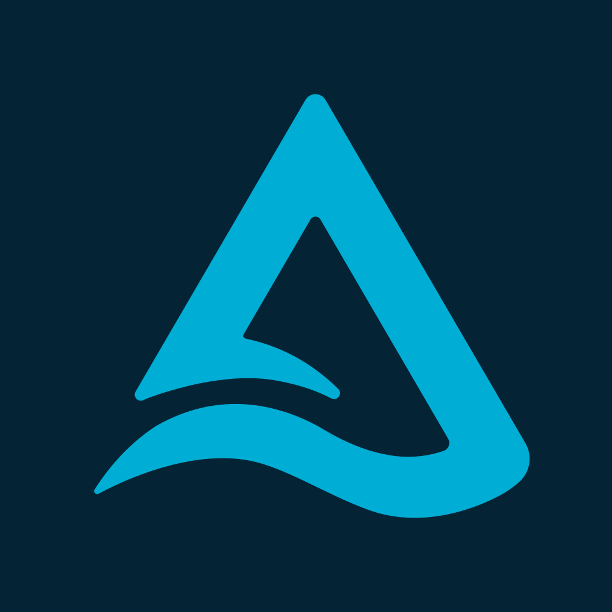

<p align="center">
  <a href="https://delta.io">
    
  </a>
</p>
<h1 align="center">Delta Lake Website</h1>

<p align="center">This repo contains the official source code for the <a href="https://delta.io">Delta Lake website</a>.</p>

<p align="center">
  <a href="https://app.netlify.com/sites/delta-io-beta/deploys">
    
  </a>
</p>

## :rocket: Getting up and running locally

### Quick start

This project requires a YouTube API key which is used on various pages across the site. To generate an API key, refer to the docs on [Google Cloud](https://developers.google.com/youtube/v3/getting-started#before-you-start). Once you have generated an API key, create a file at `.env` with the following contents:

```sh
YOUTUBE_API_KEY=<api_key>
```

Then, to get up and running on your machine. First start by [installing pnpm](https://pnpm.io/installation).

Afterwards, install dependencies:

```sh
pnpm install
```

Finally, you can run a local Astro dev server by running the following command:

```sh
pnpm dev
```

#### Previewing a production build

`pnpm dev` serves unhashed, on-the-fly assets. To preview the actual production
output (hashed `/_astro/*` assets, exactly what deploys), build and serve `dist/`:

```sh
pnpm serve:build   # runs `astro build` then serves dist/ (or: pnpm build && pnpm serve)
```

Note: `pnpm preview` (`astro preview`) does **not** work in this repo — the
Netlify adapter doesn't support it. Use `pnpm serve` instead. A plain static
server also does not apply `public/_headers` (CSP, etc.); to validate those, use
a Netlify deploy preview.

### Code formatting

If you use Visual Studio Code, install the [Prettier](https://marketplace.visualstudio.com/items?itemName=esbenp.prettier-vscode) and [ESLint](https://marketplace.visualstudio.com/items?itemName=dbaeumer.vscode-eslint) extensions to automatically format your code as you make changes.

Alternatively, you may run `pnpm lint` or `pnpm format` to run ESLint and Prettier, respectively. All changes are automatically linted (and will atempt to auto-fix) on the git pre-commit hook.

This repo runs automated checks on PRs, including the lint and formatting checks above. All PRs require linters to pass in order to deploy to production.

### Upgrading dependencies

It's a best practice to make sure that our dependencies are always up to date. You can run `scripts/upgrade-dependencies` to automatically install upgrades across all packages.

Do note that you will still need to verify that things work as expected.

### Helpful resources

- [Astro documentation](https://docs.astro.build/en/getting-started/) — guides, API reference, and more.
- [Tailwind v3 documentation](https://v3.tailwindcss.com/docs/) — for understanding the various classnames for styling.
- [YouTube Data API](https://developers.google.com/youtube/v3/docs) - for working with the YouTube API. 
- [Netlify documentation](https://docs.netlify.com/)

### Deployment process

The deployment process is automated. When the `main` branch is updated, the site is automatically deployed to production. On every PR, a branch preview will automatically be generated. This allows reviewers to preview your work in progress.

## Content collections

### Blogs

Blogs can be found in `src/content/blogs`.

Each blog is contained in its own directory with an `index.md` and other files (such as images) co-located together. Each directory uses the following naming structure: `YYYY-MM-DD-blog-title`

Each blog post requires the following frontmatter:

```md
---
title: New features in the Python deltalake 0.12.0 release
description: This post explains the new features in the Python deltalake 0.12.0 release
thumbnail: "./thumbnail.png"
author: ion-koutsouris
publishedAt: 2023-10-22
---
```

Overview of each field:

- **title:** Blog post title
- **description:** Blog post description
- **thumbnail:** Relative path to blog post thumbnail (usually `./thumbnail.png`)
- **author:** One or more `profile` IDs (see below). **IMPORTANT:** Profile IDs must exactly match the directory name in `src/content/profiles/`. For multiple authors, use a YAML array format:
  ```
  author:
  - carly-akerly
  - robert-pack
  ```
  Or for a single author:
  ```
  author: ion-koutsouris
  ```
  **If adding a new author:** Create a new profile folder in `src/content/profiles/[author-name]/` with an `index.md` file containing the required frontmatter (see Profiles section below).
- **publishedAt:** `YYYY-MM-DD` format date of when the post was published. **REQUIRED FIELD** - This date must exactly match the date in the directory name (e.g., if directory is `2025-09-25-Delta-Lake-4.0`, then `publishedAt` must be `2025-09-25`)

Other optional fields:

- **updatedAt:** If set, it will indicate that the blog post was last updated at this date.

The remaining content of the markdown file is the blog post body.

#### Rich blog constructs

Blog posts are plain Markdown (`.md`), but can use a few rich constructs authored
with [`remark-directive`](https://github.com/remarkjs/remark-directive) syntax
(handled in `lib/remarkPlugins.ts` and styled in `src/layouts/theme.css`). No MDX
or component imports are required.

**Callouts** — highlight boxes with an icon and title. Types: `tip`, `note`,
`info`, `warning`, `caution`, `danger`. The default title can be overridden with
a `[label]`:

```markdown
:::warning
Using local storage requires Docker and matching host paths.
:::

:::tip[Pro tip]
You can run all of this locally today.
:::
```

**Journeys** — a numbered step-by-step timeline. Wrap `::::step[Title]` items in a
`:::::journey` (note the extra colons on the outer fence so it nests the steps):

```markdown
:::::journey
::::step[Create the table]
Body markdown for the first step…
::::
::::step[Write data]
Body markdown for the second step…
::::
:::::
```

**Code blocks** — rendered by
[Expressive Code](https://expressive-code.com/). Add a title/filename and
highlight lines directly on the fence:

````markdown
```properties title="server.properties" {2-3}
server.env=dev
server.authorization=disable
server.managed-table.enabled=true
```
````

A copy button is added automatically — no extra markup needed.

**Interactive LikeC4 diagrams** — pan/zoom architecture diagrams:

```markdown
::likec4{view=overview}
```

This renders a `<likec4-view>` element. The custom element is defined by a
pre-built web-component bundle that the post author must commit to
`public/likec4/likec4-webcomponent.mjs` (generate it with the LikeC4 CLI). The
runtime is loaded lazily and only on pages that actually contain a diagram (see
`src/components/LikeC4Loader.astro`).

### Profiles

Profiles can be found in `src/content/profiles`.

Profiles represent individual contributors to the site. These are used throughout the site for different types of content types, including blogs and user stories. Profiles can be as simple as just their name, to full-featured pages with a description, quote, list of links, content, etc.

Like blog posts, they are also a directory with a `index.md` file and can have other files (such as images) co-located together. However, there is no requirement for the naming structure of the directory.

Each profile requires the following frontmatter:

```md
---
name: Ada Lovelace
---
```

Overview of each field:

- **name:** The person's full name (note: this should match the directory name)

Other optional fields:

- **photo:** Relative path to a photo of the person (photos should be in the folder)
- **role:** Optional job title/role to display alongside the person's name.
- **quote:** A quote to display on their profile page.
- **quoteSource:** A citation for their quote
- **linkedin:** The person's LinkedIn profile URL.
- **videos:** List of YouTube video IDs that can be featured on their profile.
- **otherReferences:** List of links that can be displayed on their profile.

### User stories

User stories can be found in `src/content/user-stories`.

User stories represent case studies. They are similar to blog posts, but are featured in the **Learn > Case Studies** page.

Like blog posts, they are also a directory with a `index.md` file and can have other files (such as images) co-located together. However, there is no requirement for the naming structure of the directory.

User stories require the following frontmatter

```md
---
title: Introducing Product Analytics on Delta Sharing, With Kubit
description: How Kubit and Delta Sharing improve product analytics
thumbnail: "./thumbnail.png"
author: stefan-enev
publishedAt: 2025-01-02
---
```

Overview of each field:

- **title:** User story title
- **description:** User story description
- **thumbnail:** Relative path to the thumbnail (usually `./thumbnail.png`)
- **author:** One or more `profile` IDs (see below)
- **publishedAt:** `YYYY-MM-DD` format date of when the user story was published

### Integrations

Profiles can be found in `src/content/integrations`.

Integrations are displayed on the **Integrations** page. Unlike other content types, they are JSON files.

Images for integrations live in the `src/content/integrations/images` directory.

## :handshake: Contributing

All changes are proposed as a [pull request](https://github.com/delta-io/website/pulls). Simply create a pull request and request a review and we'll get on it.

### Blog posts

We encourage blog post contributions from the community, but have strict topic and quality standards.

The blog post topic should not overlap with any existing content. We prefer updating existing content instead of creating overlapping content. We wouldn't want a post like "Delta Lake Z Ordering large datasets" blog post because we already have a [Delta Lake Z Order](https://delta.io/blog/2023-06-03-delta-lake-z-order/) post.

Please create an issue with your proposed title before writing the blog post!

Blog posts should generally be around 2,000 words, target a relevant, high-value keyword, and be easy to read.

You can add a blog by adding a directory with some files to `src/content/blog`. Here's an example:

```
packages/
  delta-site/
    src/
      blog/
        2023-10-22-delta-rs-python/
          index.mdx
          thumbnail.png
```

Guidelines:

- The directory name should contain the following format: `YYYY-MM-DD-blog-title`
- All of the images that correspond to the blog post should be saved in the respective folder.
- The top of the `index.mdx` file should contain the following metadata:

  ```md
  ---
  title: New features in the Python deltalake 0.12.0 release
  description: This post explains the new features in the Python deltalake 0.12.0 release
  thumbnail: "./thumbnail.png"
  author: ion-koutsouris
  publishedAt: 2023-10-22
  ---
  ```

  Keep in mind that the `author` metadata refers to a profile under `src/content/profiles`.
