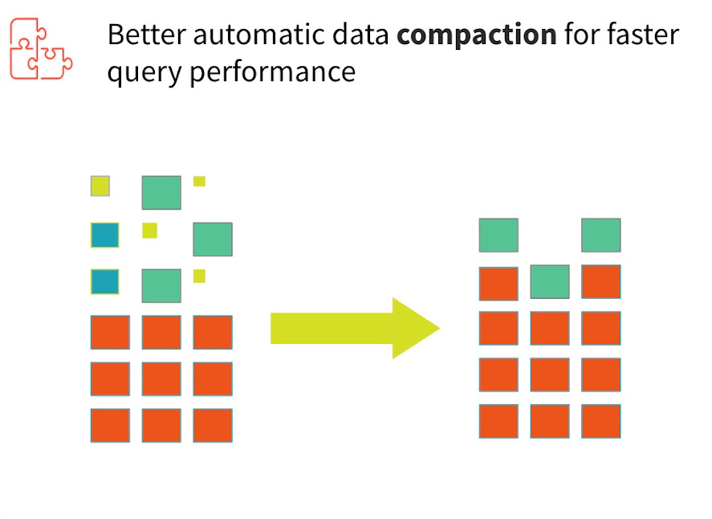
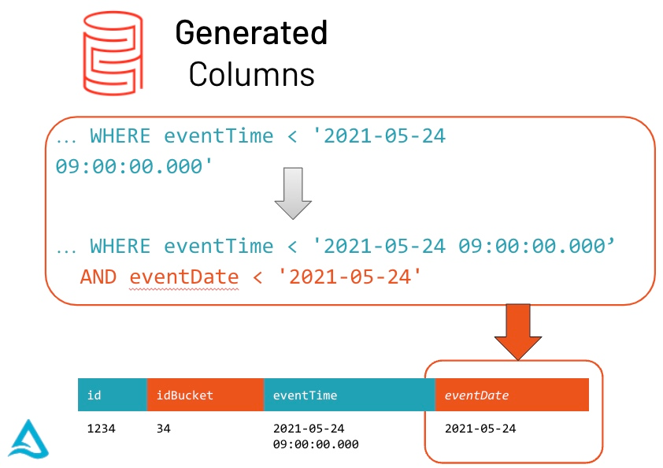
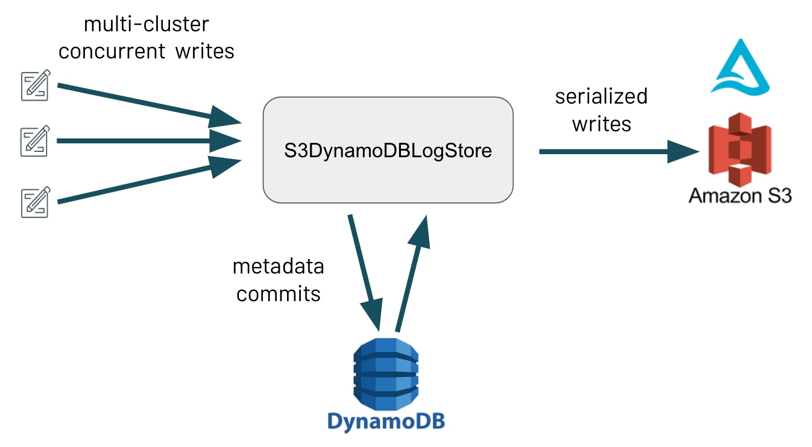

The continued innovations within [Delta Lake](https://github.com/delta-io/delta) has been a direct result of the collective effort by the entire open-source community. Recent highlights from this release include, but not limited to, the S3 multi-cluster writes contributed by [Mariusz Kryński](https://github.com/mrk-its) from [SambaTV](https://www.samba.tv/), [Fabian Paul](https://www.linkedin.com/in/fabian-paul/) from [Ververica](https://www.ververica.com/) helping the design of the [Flink/Delta Lake Connector](https://github.com/delta-io/delta/tree/master/connectors/flink), and the contributions to the RESTORE capabilities by [Maksym Dovhal](https://github.com/Maks-D). Building on the notable improvements in [Delta Lake 1.1.0](https://github.com/delta-io/delta/releases/tag/v1.1.0) driven by our amazing community, we are pleased to announce the release of Delta Lake 1.2 ([1.2.0](https://github.com/delta-io/delta/releases/tag/v1.2.0), [1.2.1](https://github.com/delta-io/delta/releases/tag/v1.2.1)) on [Apache Spark™ 3.2](https://spark.apache.org/releases/spark-release-3-2-0.html).

Delta Lake 1.2 ([1.2.0](https://github.com/delta-io/delta/releases/tag/v1.2.0), [1.2.1](https://github.com/delta-io/delta/releases/tag/v1.2.1)) introduces features focused on optimizing performance and operational efficiencies including small file compaction, advanced data skipping, version control for Delta tables, support for schema evolution operations, expanded support for arbitrary characters in column names, and more. In addition, new integrations with 3rd party tools including [Apache Flink](https://flink.apache.org/), [Presto](https://prestodb.io/), and [Trino](https://trino.io/) provide more extensibility and flexibility to fully unlock all of your data in Delta Lake.

This post will go over the major changes and some notable features in this release. For the full list of changes refer to the Delta Lake 1.2 ([1.2.0](https://github.com/delta-io/delta/releases/tag/v1.2.0), [1.2.1](https://github.com/delta-io/delta/releases/tag/v1.2.1)) release notes. Also, check out the [project’s Github repository](https://github.com/delta-io/delta/releases) for details. In subsequent blog posts, we’ll dive deeper into each of the key features and the value they provide.

We will spotlight the following features of Delta 1.2 release in this blog:

**Performance**:

- Support for compacting small files (optimize) into larger files in a Delta table
- Support for data skipping
- Support for S3 multi-cluster write support

**User Experience**:

- Support for restoring a Delta table to an earlier version
- Support for schema evolution operations such as RENAME COLUMN
- Support for arbitrary characters in column names in Delta tables

Included in this release was the [Delta benchmarks](https://github.com/delta-io/delta/tree/master/benchmarks) which is a basic framework for writing benchmarks to measure Delta's performance. It is currently designed to run TPC-DS benchmarks on Apache Spark™ running in an EMR cluster. Check out the basic OSS framework at: https://github.com/delta-io/delta/tree/master/benchmarks.

Read on to learn more!

> > > Want to get started with Delta Lake right away instead? Learn more about what is [Delta Lake](https://docs.delta.io/latest/delta-intro.html) and use this [guide](https://docs.delta.io/latest/quick-start.html) to build lakehouses with Delta Lake.

## Compacting small files (optimize) into larger files in a Delta table

The data in a lakehouse can often have a small file problem. Different file sizes can impact performance and waste valuable resources. So it’s important to have data laid out correctly for optimal query performance. To improve query speed, Delta Lake supports the ability to optimize the layout of data stored in storage. There are various ways to optimize the layout. Currently, only the [bin-packing optimization](https://docs.delta.io/1.2.0/optimizations-oss.html#compaction-bin-packing) is supported. Delta Lake can improve the speed of read queries from a table by coalescing small files into larger ones.



<b>
  <center>
    Fig.1. Better automatic data compaction for faster query performance.
  </center>
</b>
<b></b>
&nbsp;

Through the reduction of the number of data files being ingested, compacting of small files into larger files in a Delta table can improve read latency as a direct result of reducing metadata size and per-file overheads such as file-open overhead and file-close overhead.

```sql
OPTIMIZE delta_table_name; -- Optimizes Delta Lake table
OPTIMIZE delta.`/path/to/delta/table`; -- Optimizes the path-based Delta Lake table
```

If you have a large amount of data and only want to optimize a subset of it, you can specify an optional partition predicate using `WHERE`:

```sql
OPTIMIZE delta_table_name WHERE date >= '2017-01-01'
```

You may ask, are the Delta table reads impacted during the bin-packing optimization? The answer is no. Through the use of snapshot isolation, table reads are not interrupted when the bin-packing optimization removes unnecessary files from the transaction log. No data-related changes are actually made to the table, so all reads will always have the same results. See the [documentation](https://docs.delta.io/1.2.0/optimizations-oss.html#compaction-bin-packing) for more details.

## Support for automatic data skipping

Data skipping information is collected automatically when you write data into a Delta Lake table. These statistics (minimum and maximum values for each column) can be used during the reading of a Delta table to skip reading files not matching the filters in the query, allowing faster queries.

```sql
SELECT * FROM events
WHERE year=2020 AND uid=24000
```


<b>
  <center>Fig.2. Data Skipping</center>
</b>
&nbsp;

In the above example, our query is looking for events triggered by <code>uid “24000”</code> during the year <code>2020</code>. Because data skipping information was collected at the time of writing, it's easy for delta to skip the records that don't match the query condition, (which in this case is <code>file1.parquet</code> and <code>file2.parquet</code>) and look for the matching records in <code>file3.parquet</code>.

### Support for generated columns

Delta Lake will automatically calculate generated columns when the user doesn’t provide them when writing to the tables, or automatically check the constraints using the generation expressions when the user provides the values for the generated columns.

For a partition column with a generation expression, Delta Lake automatically generates a partition filter from any data filters on its generating column, when possible. Delta Lake automatically uses partitioning and statistics to read the minimum amount of data when there are applicable predicates in the query. With this new optimization, the DataFrame returned automatically reads the most recent snapshot of the table for any query; you never need to run <code>REFRESH TABLE</code>.



<b>
  <center>Fig.3. Generated Columns</center>
</b>
&nbsp;

## S3 multi-cluster write support

One of the key features that Delta Lake offers is its ability to handle concurrent reads and writes while providing ACID guarantees. This functionality is, itself, predicated on guarantees by the underlying storage system, one of which is mutual exclusion: ensuring that only one writer is able to create a file at a time.

Most storage systems provide this mutual exclusion out-of-the-box. However, a known limitation of S3 is that it does not provide mutual exclusion, meaning that Delta Lake S3 integration allows multi-cluster reads but has historically restricted writes to S3 to originate from a single Spark driver.



<center>
  <b>Fig.4. s3 multi cluster writes in Delta Lake</b>
</center>
&nbsp;

These changes in Delta Lake 1.2, as reads and writes to S3 are now supported in two different modes: Single-cluster and Multi-cluster. With multi-cluster mode, users can concurrently write to the same Delta table from multiple clusters. This mode uses [DynamoDB](https://aws.amazon.com/dynamodb/) internally to provide the mutual exclusion that S3 is lacking, as concurrent writers first try to commit metadata to a DynamoDB table before writing to S3. Note: Multi-cluster mode must be enabled explicitly. Check out our [contributor spotlight](https://youtu.be/QoxgHkZ38gM) for a shout out to this feature.

## Support for restoring a Delta table to an earlier version

Poor data quality can doom any data analytics or machine learning use case. Sometimes, mistakes occur such as accidental bad writes or deletes. Fortunately, Delta Lake supports the restoration of a Delta table to an earlier state, using the <code>RESTORE</code> command, to address this very issue.

A Delta table internally maintains historic versions of the table that enable it to be restored to an earlier state. A version corresponding to the earlier state or a timestamp of when the earlier state was created are supported using the aforementioned SQL command, Scala APIs or Python APIs.

```scala
RESTORE TABLE deltaTable TO VERSION AS OF <version>
RESTORE TABLE delta.`/path/to/delta/table` TO TIMESTAMP AS OF <timestamp>
```

```python
from delta.tables import *

deltaTable = DeltaTable.forPath(spark, <path-to-table>)  # path-based tables, or
deltaTable = DeltaTable.forName(spark, <table-name>)    # Hive metastore-based tables

deltaTable.restoreToVersion(0) # restore table to oldest version
deltaTable.restoreToTimestamp('2019-02-14') # restore to a specific timestamp
```

When restoring a previous version, the history operation returns a collection of operations metrics within the data lake. These metrics can provide visibility into operational insights across the data lake. See the [documentation](https://docs.delta.io/1.2.0/delta-utility.html#toc-entry-11) for a table that lists the map key definitions by operation.

By keeping track of historical versions of your data, you can simplify data engineering and be confident you’ll always be able to use a clean, centralized, versioned big data repository in your own cloud storage for your analytics and machine learning.

## Support for renaming columns

An important aspect of building reliable data pipelines for downstream analytics is schema evolution. Schemas evolve over time, so it’s important for those engaging with the data being managed to be able to ingest it regardless of when the scheme was defined or revisited. By supporting schema evolution operations, Delta Lake can prevent bad data from causing data corruption.

As of Delta Lake 1.2, support for renaming columns is now available. To rename columns without rewriting any of the columns’ existing data, you must enable [column mapping](https://docs.delta.io/1.2.0/delta-batch.html#rename-columns) for the table. Here is how you can enable column mapping on a Delta table.

```sql
ALTER TABLE <table_name> SET TBLPROPERTIES (
   'delta.minReaderVersion' = '2',
   'delta.minWriterVersion' = '5',
   'delta.columnMapping.mode' = 'name'
)
```

After enabling column mapping, you can then rename the column using the following command in SQL:

```sql
ALTER TABLE <table_name> RENAME COLUMN old_col_name TO new_col_name
```

To learn more about other scheme evolution operations supported, see the [documentation](https://docs.delta.io/1.2.0/delta-batch.html#rename-columns) for more details.

## Support for arbitrary characters in column names in Delta tables

Another schema change you can make in Delta Lake 1.2 is the support for arbitrary characters.

Prior to 1.2, the supported list of characters was limited by the support of the same in Parquet data format. When column mapping is enabled for a Delta table, you can include spaces as well as any of these characters in the table’s column names: <code>,;{}()\n\t=</code>.

#### To rename a column

```sql
ALTER TABLE <table_name> RENAME COLUMN old_col_name TO new_col_name
```

#### To rename a nested field

```sql
ALTER TABLE <table_name> RENAME COLUMN col_name.old_nested_field TO new_nested_field
```

For an example of how to include these characters in a schema, see the [documentation](https://docs.delta.io/1.2.0/delta-batch.html#update-table-schema) for more details.

We hope you are as excited about these new Delta Lake features as we are. Feel free to take Delta Lake 1.2 out for a spin. Have any workloads to migrate to Delta Lake? Check out this [guide](https://docs.delta.io/1.2.0/porting.html). Lastly, please provide any feedback or performance benchmarks with the [community](https://delta.io/resources/contributing-to-delta).

## Summary

Delta Lake is quickly becoming the de facto, open-source storage framework for companies building transformative data platforms on the Lakehouse architecture. With data volumes and complexity only increasing, it’s important to ingest data at massive scale faster and reliably. With Delta Lake 1.2, developers can take full advantage of the performance optimizations and the operational efficiencies designed to boost productivity.

## What’s next

We are already gearing up for many new features in the next release of Delta Lake. You can track all the upcoming releases and planned features in [GitHub milestones](https://github.com/delta-io/delta/milestones).

> **Interested in the open-source Delta Lake?**
> Visit [Delta Lake](https://github.com/delta-io/delta) to learn more, you can join the Delta Lake community via [Slack](https://go.delta.io/delta-users) and [Google Group](https://groups.google.com/forum/#!forum/delta-users).

## Credits

We want to thank the following contributors for updates, doc changes, and contributions in Delta Lake 1.2: Adam Binford, Alex Liu, Allison Portis, Anton Okolnychyi, Bart Samwel, Carmen Kwan, Chang Yong Lik, Christian Williams, Christos Stavrakakis, David Lewis, Denny Lee, Fabio Badalì, Fred Liu, Gengliang Wang, Hoang Pham, Hussein Nagree, Hyukjin Kwon, Jackie Zhang, Jan Paw, John ODwyer, Junlin Zeng, Jackie Zhang, Junyong Lee, Kam Cheung Ting, Kapil Sreedharan, Lars Kroll, Liwen Sun, Maksym Dovhal, Mariusz Krynski, Meng Tong, Peng Zhong, Prakhar Jain, Pranav, Ryan Johnson, Sabir Akhadov, Scott Sandre, Shixiong Zhu, Sri Tikkireddy, Tathagata Das, Tyson Condie, Vegard Stikbakke, Venkata Sai Akhil Gudesa, Venki Korukanti, Vini Jaiswal, Wenchen Fan, Will Jones, Xinyi Yu, Yann Byron, Yaohua Zhao, Yijia Cui.
