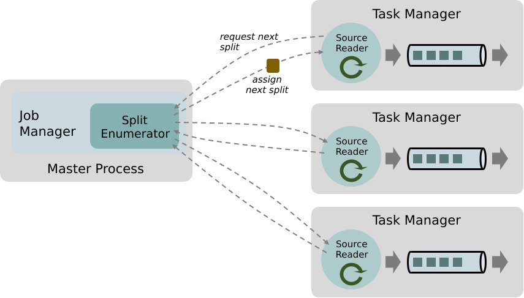
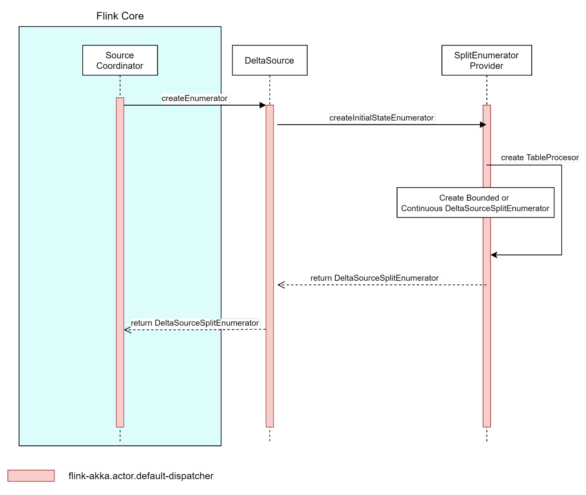
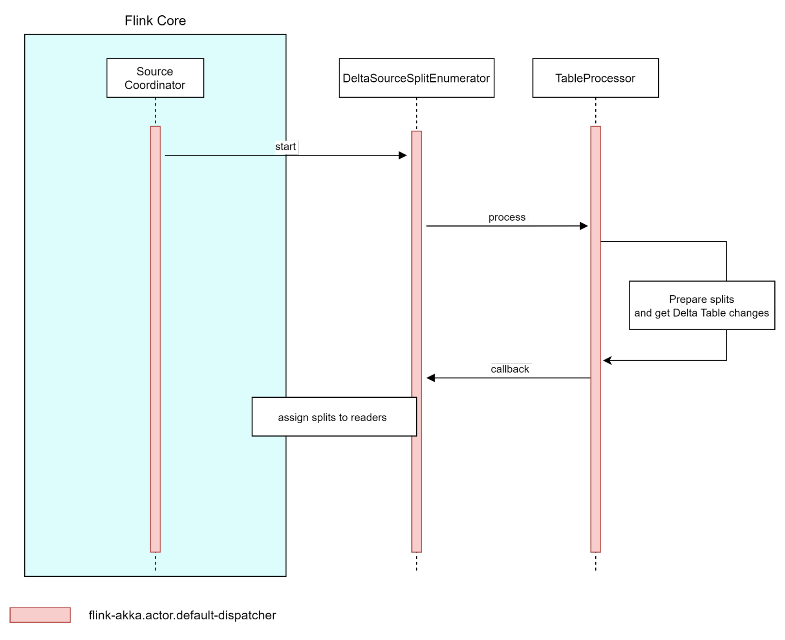
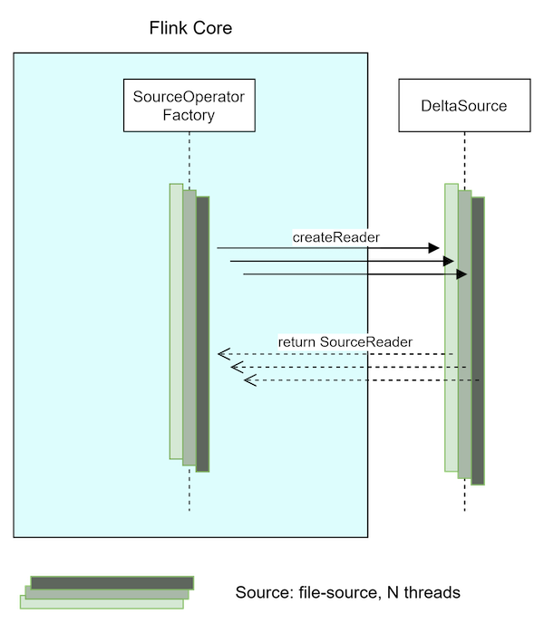
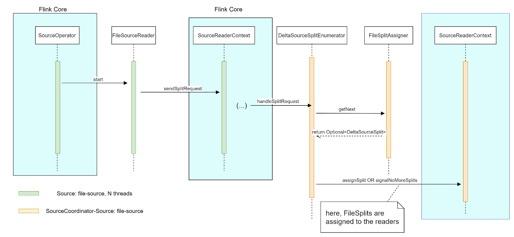

<Info title="Contributing authors" level="info">
  This is a blog post by [Krzysztof
  Chmielewski](https://www.linkedin.com/in/krzysztof-chmielewski-3a615153/)
  ([GitHub](https://github.com/kristoffSC)), [Scott
  Sandre](https://github.com/scottsand-db), and [Denny
  Lee](https://github.com/dennyglee)
</Info>

We are excited to announce the release of [Delta Connectors 0.5.0](https://github.com/delta-io/connectors/releases/tag/v0.5.0), which introduces the new [Flink/Delta Source Connector](https://github.com/delta-io/connectors/tree/branch-0.5/flink#delta-source) on [Apache Flink™ 1.13](https://flink.apache.org/news/2021/05/03/release-1.13.0.html) that can read directly from Delta tables using Flink’s DataStream API. Both the Flink/Delta Source and Sink connectors are now available as one JVM library that provides the ability to read and write data from Apache Flink applications to Delta tables using the [Delta Standalone JVM Library.](https://github.com/delta-io/delta/tree/master/connectors#delta-standalone) The Flink/Delta Source Connector supports reading data from Delta tables into Flink for both batch and streaming processing.

## Native Flink Delta Lake Source Connector

The [Flink/Delta Source Connector](https://github.com/delta-io/delta/blob/master/connectors/flink/README.md) is built on Flink's new [Unified Source Interface API](https://nightlies.apache.org/flink/flink-docs-master/docs/dev/datastream/sources/), which was introduced in version 1.12 for building source connectors. Our connector uses low-level elements of the original File Source in addition to logic specific for reading Delta tables, such as reading the Delta table log.

### Work modes

Flink/Delta Source Connector can work in one of two modes, **Bounded** (i.e. batch) or **Continuous** (i.e. streaming).

- <u>Bounded</u>

  This mode is mainly used for batch jobs and provides the ability to read the full data load of the latest version of the Delta table or load a specific snapshot version.

- <u>Continuous</u>

  This mode is used for streaming jobs, where in addition to reading the Delta table contents for a specific snapshot version, it continuously checks the Delta table for new updates and versions. It can also read changes only.

Flink periodically takes persistent snapshots of all the states and stores them in durable storage such as a distributed file system. In the event of a failure, Flink can restore the complete state of the application and resume processing from the last successful checkpoint.

### Schema discovery

Flink Delta Source connector scans the Delta table log to discover columns and column types. It supports both reading all columns or a specified collection of columns using the Delta Source [builder](https://delta-io.github.io/connectors/0.5.0/delta-flink/api/java/index.html) method. In both cases, the connector will discover the Delta data types for the table columns and will convert them to the corresponding Flink data types. The connector will automatically detect the partition columns using the Delta table log without any additional configuration needed.

Please see the [documentation](https://delta-io.github.io/connectors/latest/delta-flink/api/java/index.html) and [examples](https://github.com/delta-io/connectors/tree/branch-0.5/examples/flink-example) for details.

## Architecture

The Delta Source Connector has implemented the core components of Flink’s Unified Source Interface architecture. The connector provides Delta-specific implementations for interfaces such as Source and SplitEnumerator. In addition, it reuses low-level components from Flink’s File system support and Filink’s File Source, such as File Readers and Split assigners.

### Unified Source Interface

Every Flink [Data Source](https://nightlies.apache.org/flink/flink-docs-master/docs/dev/datastream/sources/#data-sources) has three core components that support reading data from batch and streaming sources in a unified way.

- Splits

  This is the smallest unit of work that a source connector consumes, distributes the work, and parallelizes reading data from the source. A Split can be an entire file, a file block, a Kafka partition, or others.

- SourceReader

  SourceReader requests Splits and processes them by reading the Split from the data source. An example would be SourceReader sending a request to read a file or a log partition. SourceReaders run in parallel on the Task Managers and therefore produce the parallel stream of events/records.

- SplitEnumerator

  The SpltEnumerator creates the Splits and assigns them to the SourceReaders when they request the Splits. It runs as a single instance on the Job Manager process and maintains the list of assigned and pending Splits for a given data source. It is responsible for balancing the Splits across various SourceReaders that are running in parallel.



Flink’s _[Source class](https://github.com/apache/flink/blob/master/flink-core/src/main/java/org/apache/flink/api/connector/source/Source.java)_ is an API entry point that combines all the above three components together. Please see Flink’s [documentation](https://nightlies.apache.org/flink/flink-docs-master/docs/dev/datastream/sources/) for more details.

### Source initialization

The Source interface, which is implemented by DeltaSource class, is an entry point for Flink’s runtime. The API is used by Flink's SourceCoordinator, which uses it to initialize the Source instance. The initialization involves creating a SplitEnumerator and, in the case of disaster recovery, recreating it from a previously checkpointed state. Following that, file readers are also created during the source initialization phase.

Delta Source instance uses SplitEnumeratorProvider to construct a concrete enumerator implementation based on used source options. The SplitEnumeratorProvider creates an instance of what we call a TableProcessor that acts like a bridge between Flink and Delta table log. TableProcesor implementation provides an entry point for Delta table snapshot and table changes that can be later converted to Splits and assigned to file readers by DeltaSourceSplitEnumerator



With the creation of the DeltaSourceSplitEnumerator, Flink can process the data via the TableProcessor, prepare the splits and get any _Delta table_ changes prior to assigning the splits to the readers.



### SourceReader Creation

Each SourceReader is created by a separate thread and the number of source readers created by Flink is dictated by the parallelism level of the source or the entire job.



### Source Start

Newly created SourceReaders (each on its own thread) send Split Requests through Flink Core to SplitEnumerator in order to manifest their readiness to process new data. SplitEnumerator responds to these requests by assigning new splits to the readers by calling _sourceReaderContext::assignSplit_ method. Then that split is assigned to the SourceReader by calling _SourceReader::addSplits(List&lt;Split>)_ method by Flink Core.



More detailed information can be found in [Delta Connector Design Document](https://docs.google.com/document/d/1v8QEEEaJoOIWKklYSmn3sC2egKSo3bRK_gZhqGUozxc/edit#heading=h.gjdgxs).

## Implementation - Reading data from Delta Lake tables into Flink

The [Flink/Delta Lake Connector](https://github.com/delta-io/delta/tree/master/connectors/flink/) is a JVM library to read and write data from Apache Flink applications to Delta Lake tables utilizing the [Delta Standalone JVM library](https://github.com/delta-io/delta/tree/master/connectors#delta-standalone) and includes both the Source and Sink connectors. This section focuses on the Source connector and provides examples to read data directly from Delta Lake into Flink for both batch (bounded) and streaming (continuous) modes. Please see [#110](https://github.com/delta-io/connectors/issues/110) for more information.

The Flink/Delta Source is designed to work with 1.13.0 &lt;= Flink &lt;= 1.14.5 and provides exactly-once delivery guarantees. This connector is dependent on the following packages:

- `delta-standalone`
- `flink-parquet`
- `flink-table-common`
- `hadoop-client`

Please refer to the linked build file examples for [maven](https://github.com/delta-io/delta/tree/master/connectors/flink#maven) and [sbt](https://github.com/delta-io/delta/tree/master/connectors/flink#sbt).

**Batch (or Bounded) Mode**

1.  <u>Reads all columns from a latest version of a Delta table</u>

```scala

import org.apache.flink.api.common.eventtime.WatermarkStrategy;
import org.apache.flink.core.fs.Path;
import org.apache.flink.streaming.api.datastream.DataStream;
import org.apache.flink.streaming.api.environment.StreamExecutionEnvironment;
import org.apache.flink.table.data.RowData;
import org.apache.hadoop.conf.Configuration;

public DataStream<RowData> createBoundedDeltaSourceAllColumns(
StreamExecutionEnvironment env,
String deltaTablePath) {

    DeltaSource<RowData> deltaSource = DeltaSource
        .forBoundedRowData(
            new Path(deltaTablePath),
            new Configuration())
        .build();

    return env.fromSource(deltaSource, WatermarkStrategy.noWatermarks(), "delta-source");

}
```

2. <u>
     Reads all columns from a specific historical version of a Delta table using
     Time Travel
   </u>

```java
import org.apache.flink.api.common.eventtime.WatermarkStrategy;
import org.apache.flink.core.fs.Path;
import org.apache.flink.streaming.api.datastream.DataStream;
import org.apache.flink.streaming.api.environment.StreamExecutionEnvironment;
import org.apache.flink.table.data.RowData;
import org.apache.hadoop.conf.Configuration;

​​public DataStream<RowData> createBoundedDeltaSourceWithTimeTravel(
        StreamExecutionEnvironment env,
        String deltaTablePath) {

    DeltaSource<RowData> deltaSource = DeltaSource
        .forBoundedRowData(
            new Path(deltaTablePath),
            new Configuration())
        // could also use `.versionAsOf(314159)`
        .timestampAsOf("2022-06-28 04:55:00")
        .build();

    return env.fromSource(deltaSource, WatermarkStrategy.noWatermarks(), "delta-source");
}
```

3.  <u>Reads user-defined columns from the latest version of a Delta table </u>

```java
import org.apache.flink.api.common.eventtime.WatermarkStrategy;
import org.apache.flink.core.fs.Path;
import org.apache.flink.streaming.api.datastream.DataStream;
import org.apache.flink.streaming.api.environment.StreamExecutionEnvironment;
import org.apache.flink.table.data.RowData;
import org.apache.hadoop.conf.Configuration;

public DataStream<RowData> createBoundedDeltaSourceUserColumns(
StreamExecutionEnvironment env,
String deltaTablePath,
String[] columnNames) {

    DeltaSource<RowData> deltaSource = DeltaSource
        .forBoundedRowData(
            new Path(deltaTablePath),
            new Configuration())
        .columnNames(columnNames)
        .build();

    return env.fromSource(deltaSource, WatermarkStrategy.noWatermarks(), "delta-source");

}
```

**Streaming (or Continuous) Mode**

1. <u>
     Reads all columns from Delta table from a historical version. Using Delta’s
     Time Travel, it loads all changes at and after the historical version and
     not the the full table state.
   </u>

```java
import org.apache.flink.api.common.eventtime.WatermarkStrategy;
import org.apache.flink.core.fs.Path;
import org.apache.flink.streaming.api.datastream.DataStream;
import org.apache.flink.streaming.api.environment.StreamExecutionEnvironment;
import org.apache.flink.table.data.RowData;
import org.apache.hadoop.conf.Configuration;

org.apache.flink.streaming.api.functions.sink.filesystem.DeltaBulkPartWriter
public DataStream<RowData> createContinuousDeltaSourceWithTimeTravel(
        StreamExecutionEnvironment env,
        String deltaTablePath) {

    DeltaSource<RowData> deltaSource = DeltaSource
        .forContinuousRowData(
            new Path(deltaTablePath),
            new Configuration())
        // could also use `.startingVersion(314159)`
        .startingTimestamp("2022-06-28 04:55:00")
        .build();

    return env.fromSource(deltaSource, WatermarkStrategy.noWatermarks(), "delta-source");
}
```

2.  <u>
      Reads all columns from the latest version of Delta table and continuously
      monitors for table updates
    </u>

```java
import org.apache.flink.api.common.eventtime.WatermarkStrategy;
import org.apache.flink.core.fs.Path;
import org.apache.flink.streaming.api.datastream.DataStream;
import org.apache.flink.streaming.api.environment.StreamExecutionEnvironment;
import org.apache.flink.table.data.RowData;
import org.apache.hadoop.conf.Configuration;

public DataStream<RowData> createContinuousDeltaSourceAllColumns(
StreamExecutionEnvironment env,
String deltaTablePath) {

    DeltaSource<RowData> deltaSource = DeltaSource
        .forContinuousRowData(
            new Path(deltaTablePath),
            new Configuration())
        .build();

    return env.fromSource(deltaSource, WatermarkStrategy.noWatermarks(), "delta-source");

}
```

3. <u>
     Reads only user-defined columns from the latest version of the Delta table
     and continuously monitors for table updates.
   </u>

```java
import org.apache.flink.api.common.eventtime.WatermarkStrategy;
import org.apache.flink.core.fs.Path;
import org.apache.flink.streaming.api.datastream.DataStream;
import org.apache.flink.streaming.api.environment.StreamExecutionEnvironment;
import org.apache.flink.table.data.RowData;
import org.apache.hadoop.conf.Configuration;

public DataStream<RowData> createContinuousDeltaSourceUserColumns(
        StreamExecutionEnvironment env,
        String deltaTablePath,
        String[] columnNames) {

    DeltaSource<RowData> deltaSource = DeltaSource
        .forContinuousRowData(
            new Path(deltaTablePath),
            new Configuration())
        .columnNames(columnNames)
        .build();

    return env.fromSource(deltaSource, WatermarkStrategy.noWatermarks(), "delta-source");
}
```

More information on how to build and test is [here](https://github.com/delta-io/delta/tree/master/connectors/flink).

## What’s Next?

As noted in [Writing to Delta Lake from Apache Flink](https://delta.io/blog/2022-04-27-writing-to-delta-lake-from-apache-flink/), we have worked together to create the initial Flink/Delta sink and now Flink/Delta source. But they currently only support the Flink DataStream API. Support for Flink Table API / SQL, along with Flink Catalog's implementation for storing Delta table's metadata in an external metastore, are planned as noted in [Extend Delta connector for Apache Flink's Table APIs](https://github.com/delta-io/connectors/issues/238) ([#238](https://github.com/delta-io/connectors/issues/238)).

## How can you help?

We’re always excited to work with current and new community members. If you’re interested in helping the Delta Lake project, please join our community today through many forums, including [GitHub](https://go.delta.io/github), [Slack](https://go.delta.io/slack), [Twitter](https://go.delta.io/twitter), [LinkedIn](https://go.delta.io/linkedin), [YouTube](https://go.delta.io/youtube), and [Google Groups](https://go.delta.io/groups).


