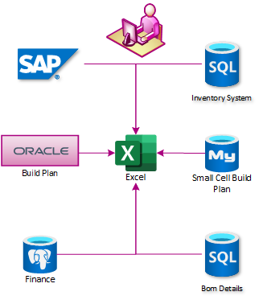
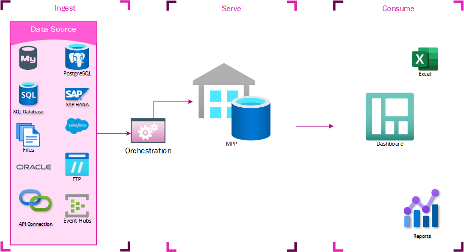
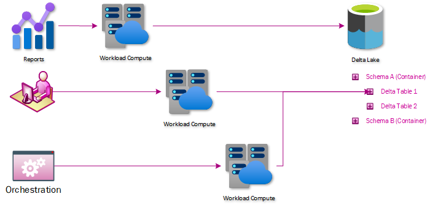
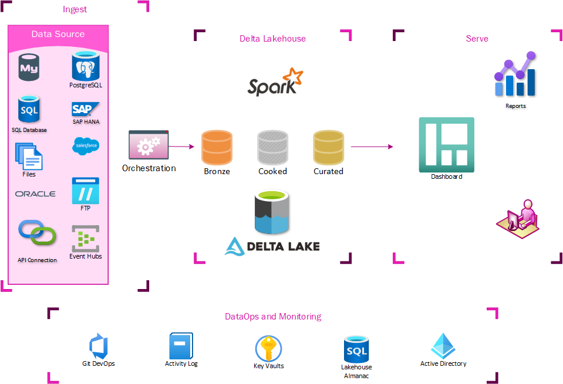
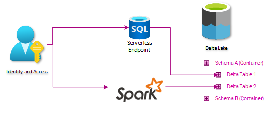

<Info title="Guest authors" level="info">
  This is a blog post by [Robert Thompson](https://www.linkedin.com/in/rdt000/)
  and [Geoff Freeman](https://www.linkedin.com/in/geoff-freeman-a092901/),
  Member Technical Staff, Solutions Architecture, T-Mobile Data Science and
  Analytics Team
</Info>

## The problem we faced

T-Mobile's mission to build the nation's best 5G network drastically increased the number of monthly network projects planned and directly impacted the enterprise Procurement and Supply Chain organizations. T-Mobile needed efficient back-office business processes to support such aggressive targets, so the need for data skyrocketed.

Data at T-Mobile, like many enterprises, is spread between disparate systems that are not integrated. Integrating the status of network plans, material procurement, supply chain operations, and field services was incredibly complex. In early 2018 the enterprise relied on weekly reporting in Excel and PowerPoint. These reports were built on dedicated SQL Servers, each of which obtained data from different systems. The reports were then pulled into the enterprise data warehouse, where they were combined, but this process regularly took 12 hours or more to complete.

A centralized location to build reports was desired, and our adventures with cloud computing began.

## V1 - Data Lake (TMUS)

The first iteration of this centralization effort, an MPP (massively parallel processing) database named TMUS, took a lot of shortcuts. It was not anticipated how many users would want access to this system or that it would eventually become an integration point - the goal was just to cut out the analyst with a spreadsheet and build all the reports in the same place. An MPP instance was created and populated using cloud-based data integration tools. Files were staged in Data Lake Storage (DLS), and there was an idea that a data lake would eventually replace TMUS, but initially it was just a glorified proof of concept. TMUS quickly showed its worth, however, as reports were generated much quicker. This system could now generate reports on average 9 hours before the rest of the business got their data. At this point, it was just generating operational reports. They were long-running operational reports to be sure, but that was the only role of the system.

### Reporting expansion

At some point, it was decided to give some business units direct access to TMUS to get these operational reports early. The access wasn’t tightly controlled, so they could start writing their own queries to refine or improve the reports in ways that were directly applicable to them. This was the first time that much of this data had been centralized, and business users derived a lot of value from being able to generate their own reports from it. These reports quickly came to be considered mission-critical for these business units. They also identified new data sources that would be complementary to the existing datasets. Getting these data sources into the enterprise data warehouse would take prohibitively long times, so they asked for these data sources to be loaded into TMUS, where they could write their own transformations.

### Problems identified with first iteration

TMUS experienced rapid organic growth and was considered wildly successful. With any successful project, you are certain to find flaws. Let me tell you, we did.

#### No plans for system integration

The only way to deal with all this data together was to load it to this centralized store. This led people to clamor for more access, leading to resource contention issues. There were also no straightforward systems integration controls. Users were given access without clear SLAs or regulations for use. Some teams wrote queries that ran for hours. Other teams set up their own ETL processes to extract massive amounts of data. It was the wild west.

#### Workload contention

Operational and Analytical workloads have very different profiles. As analytical workload and user-generated reports grew and consumed more resources, operational report refreshes would become unreliable. An analytical report that ran for hours would consume resources needed to update the operational reports that were on an hourly refresh cadence.

#### Guardrails needed

Unfortunately, the reports that these users wrote were not being tightly controlled. User-generated reports and queries started to impact the performance of each other and the core operational reports that the system was initially built to power. By the time these performance impacts became unbearable, the system was already powering everything from inventory allocations systems to executive dashboards.

The desire to innovate and run at the speed of business overtook the desire for governance and structure. As a result, TMUS was a victim of its own success.

### What went right with the first iteration

There are plenty of success stories to tell from the initial implementation. The streamlined reporting process allowed us to hit T-Mobile’s aggressive build pace, but that story is only one of many.

#### Harvest to core

Often, business users would come up with queries to solve the issue of how data from disparate systems related to each other. These queries could then be harvested and curated by TMUS, propagating that logic across the business. In many cases, TMUS was the only place in the enterprise where the data from these systems could be integrated.

#### Security

Early on, we segregated data into separate schemas based on the source system or workload vertical. This gave us the ability to apply a security model that was relatively easy to administer and audit.

#### Data accessibility

TMUS became a place for analysts to wrangle data that doesn’t intersect naturally, opening doors for identifying flaws in workstreams and creating business process efficiencies.

## V2 - Data Lakehouse

One of the high-profile use cases of TMUS was the twice-weekly allocation of material to complete network build projects. Allocation informed how billions of dollars in inventory would be fulfilled from T-Mobile’s warehouses. It was operationally critical but failed about 40% of the time due to workload contention. The decision was made to extract the logic powering the process from TMUS and put that logic into an Apache Spark™ notebook. The process went from failing 40% of the time to running flawlessly. This became the foundation of the second iteration of our architecture.

### Data Lakehouse Overview

A Data Lakehouse is simply data warehousing principles applied over data in a data lake. Data is exposed through Delta Lake tables, an open-source protocol for interacting with data in the lake in an ACID-compliant way. This comes with several benefits directly applicable to our problems:

#### Workload contention is solved through compute/storage separation

Delta tables do not experience blocking and can be shared between compute processes without contention. An additional benefit of separating the storage and the compute is that the compute used by the user is isolated to that user and can be charged back to that user’s organization.

#### Data isolation solved through a direct data lake or Spark access

No longer does data need to be loaded to a centralized system – if a user has access to data in the data lake, they can use the compute endpoints to connect to that data and analyze it. This simplifies or eliminates the need for ETLs whose only purpose is to move data without transforming it.

#### Clear SLAs and integration points provided through serverless architecture

Exposing data through the data lake makes for a clear integration point – If you want to send us data, just drop it in the data lake. If you want to pick up data, just use any client capable of reading data from the data lake. The Serverless SQL and Spark endpoints give a similar experience. This also gives clear SLAs. Serverless SQL is not always faster than querying a SQL server, but the same query will consistently take the same amount of time and won’t be affected by other users.

### Architecture

Our lakehouse architecture looks like this:

#### Ingest

At the ingest level, not much had to change. Extraction processes already staged data in the data lake, so it was easy for us to start building tables off these locations. The main addition to our ingest process was modifying how extracted data was logged. We created a new auditing database to control the data warehousing aspects of our lakehouse, so the orchestration pipelines all needed to log to that location.

#### Delta Lakehouse

This is the heart of the changes needed– a series of delta tables that expose the same data in the lakehouse as users could get through TMUS. This is done by ingesting data through a series of tables labeled Bronze, Silver, and Curated (Gold). The Bronze tables essentially act like Slowly Changing Dimension Type 2, where a new row is created if anything changes. The Silver tables store just the latest state of data, mirroring what is on the table in the source system. The Curated tables are where any advanced ETL and data shaping for warehousing takes place.

The Bronze and Silver tables are maintained by a generic series of notebooks and are entirely metadata driven. At this point, most data extraction is also generic and metadata-driven. This makes the onboarding of new datasets a trivial matter. The Curated datasets are maintained by custom notebooks orchestrated by the generic orchestration engine.

#### Presentation

All the benefits of Lakehouse Architecture would be useless if it didn’t expose data in a way that makes it easy to migrate the existing ecosystem of reports, dashboards, and extracts. Any consumers that previously connected to TMUS can now connect to a Serverless SQL endpoint and access the Lakehouse version of the data without any further translations. This means that existing SSRS, PowerBI, Excel, or custom ETLs work just by switching the connection string.

#### Transitioning to Lakehouse

The original design included staging data in the data lake as parquet files before loading them to our TMUS MPP. Already having the data in the data lake made it easy for us to write a standardized workbook to load data to our Bronze and Silver tables. Very quickly, the base system data that needed integrating was available in both our serverless and MPP endpoints. Much of the logic that drives reporting had been embedded in our MPP system, however, as views or stored procedures. All this embedded logic needs to go through a prioritization process and then migration, where one can translate the view and stored procedure logic into Spark notebooks. This means that, at least for the foreseeable future, some ETL logic will still be locked in our MPP warehouse. Some users will still need to connect to that MPP instance to get their Curated data. As more and more teams have realized the benefits of the Lakehouse architecture, however, they have started to transition their own reporting logic into the Spark notebooks.

### What is working

How do you build guardrails into a system meant to encourage exploring undefined solutions?

#### Security model

The security in the initial iteration revolved around SQL Server schemas. A schema functions as the intersection of the business domain and permission requirements, and then Active Directory groups were created and associated with each schema. This is easy for everyone to conceptualize and easy to administer and audit. This means that extending our security model meant just putting data into similarly named containers in our storage account. Granting the same Active Directory groups access to those containers lines up the permissions between Serverless SQL, Spark, SQL, and Data Lake.

#### Environments

Dev and test environments were created to allow us to not develop in our production environment. We also locked down our production environment to disallow production development, increasing reliability considerably.

#### DevOps and CI/CD

To reduce the burden on the operations team and to increase testing automation, CI/CD and DevOps practices were implemented. Automating release pipelines in each environment and section of the platform helped achieve a reliable deployment cadence. The release pipelines also offer the ability to run build and integration tests. This is available in every section of the platform. The integration tests now incorporate multiple sections of the platform, reducing outages.

##### SQL deployment framework

A homegrown framework that executes rerunnable SQL queries/DDL to deploy changes in our SQL databases. It uses AAD to authenticate, so it doesn’t break our security model. Past personal history with DACPAC influenced the decision to use a homegrown solution instead of an out-of-the-box implementation.

##### Orchestration Engine

We believe our implementation of CI/CD on the orchestration engine should be considered best practice. All pull requests are deployed to the dev environment so engineers can test and validate changes reliably to eliminate production SNAFUs. Additionally, all merges to our main branch are deployed to our test environment to validate the merge was successful and repeatable. Then it is pushed to production with the same code base that was deployed to test.

##### Spark

Spark has a feature called Repos, where git repositories are cloned to the workspaces. This feature easily integrates with DevOps pipelines and allows us to extend our CI/CD practices across all Spark workspaces.

##### Pull request for check-ins

This is a fairly standard peer review process. No self-reviews and a couple of checklists for the reviewer to follow. Any engineers who check-in or approve a check-in that breaks the build bring in donuts.

### Hurdles we have found and jumped

As with any new product, we have found features that need to be addressed.

#### Report evolution

The Serverless SQL endpoint is promoted as a predictable performance solution for reports. While not necessarily the fastest, it is consistent, as there is no contention or queuing when waiting on compute resources. This has required an educational outreach to our business partners on how to use this technology efficiently.

## Conclusion

From BI to ML to AI, data is the currency of the future. This architecture allows a relatively simple infrastructure that will expose data at the speed of business. It allows the reading and writing of data without blocking and scales out linearly. Business partners can easily adopt advanced analytics and derive new insights. These new insights promote innovation across disparate workstreams and solidify the decentralized approach to analytics taken by T-Mobile.
