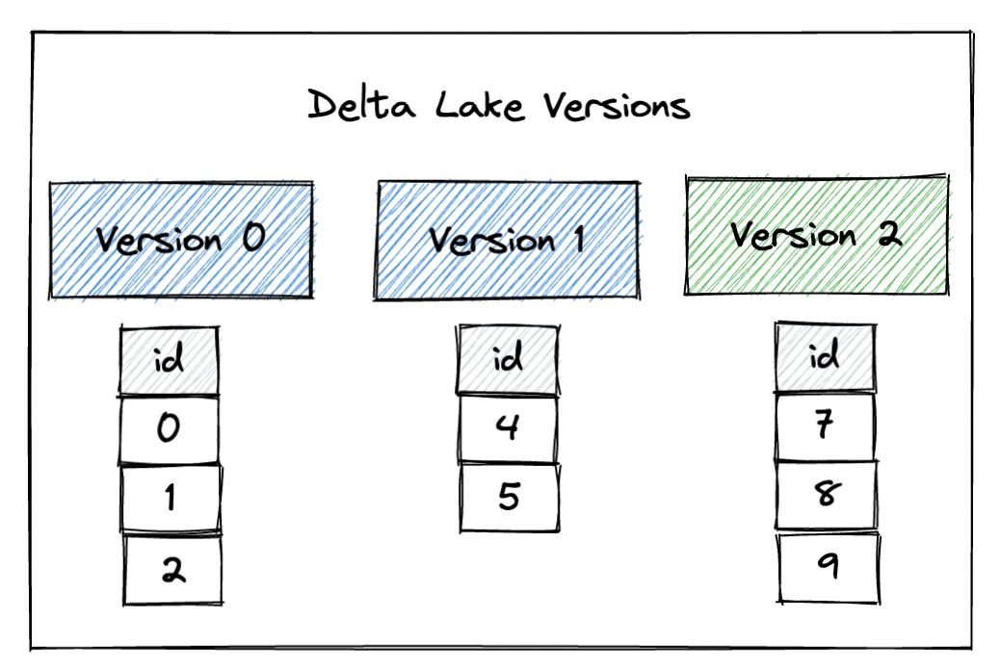
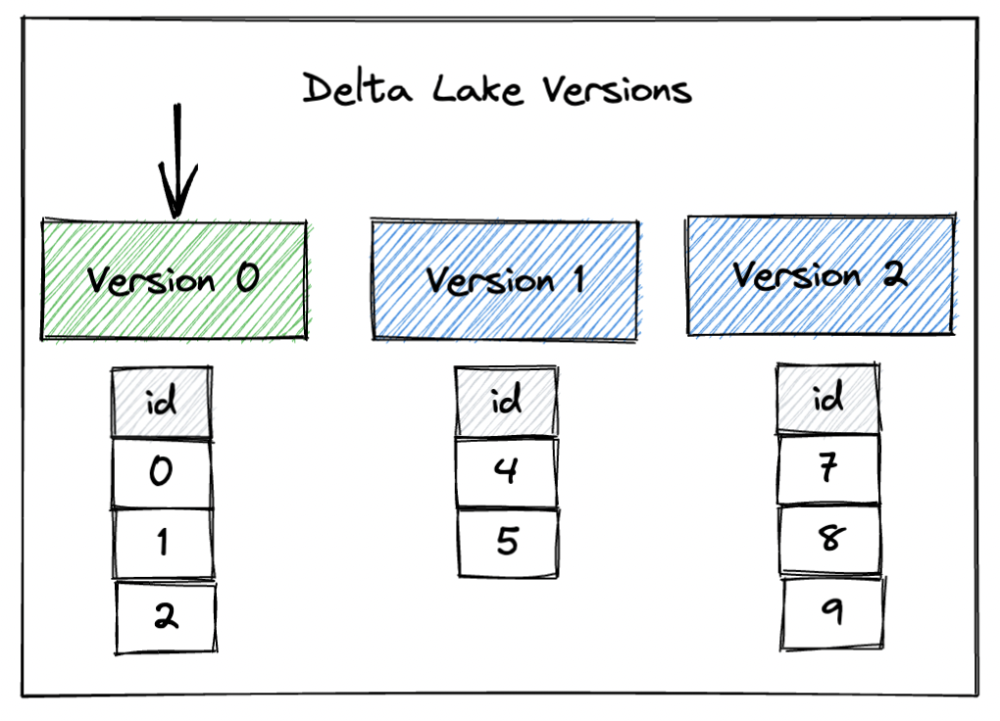
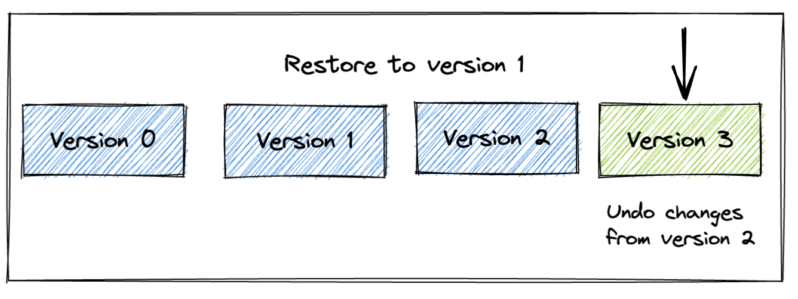
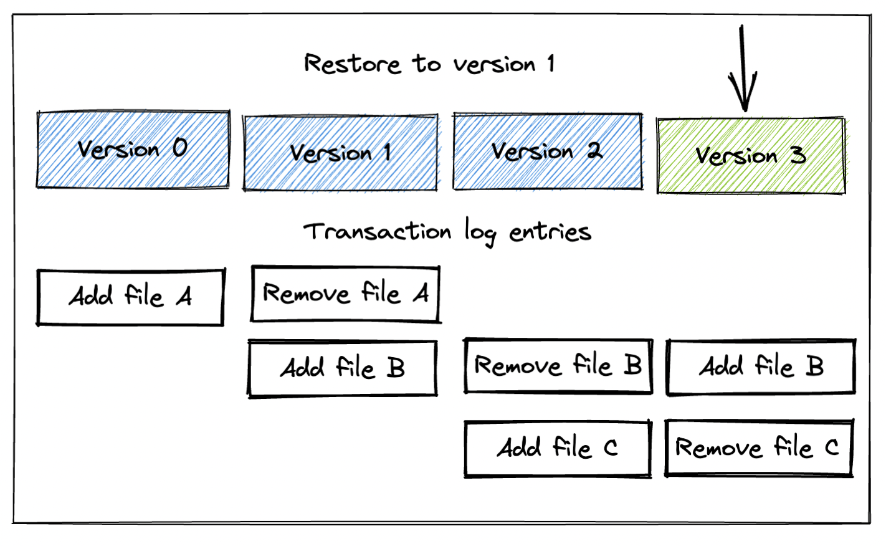

When you’re working with a plain vanilla data lake, rolling back errors can be extremely challenging, if not impossible – especially if files were deleted. The ability to undo mistakes is a huge benefit that Delta Lake offers end users. Unlike, say, a plain vanilla Parquet table, Delta Lake preserves a history of the changes you make over time, storing different versions of your data. Rolling back your Delta Lake table to a previous version with the restore command can be a great way to reverse bad data inserts or undo an operation that mutated the table in unexpected ways.

This post shows you how to roll back a Delta Lake table, and explains when you can’t roll back because a table has been vacuumed. We’ll also look at Delta Lake’s time travel capabilities along the way. Let’s start with the syntax, and then dive into a full example to demonstrate the functionality.

## TL;DR Delta Lake restore API

You can roll back a Delta Lake table to any previous version with the `restoreToVersion` command in PySpark:

```python
from delta.tables import *

deltaTable = DeltaTable.forPath(spark, "/tmp/delta-table")
deltaTable.restoreToVersion(1)
```

You can also roll back a Delta Lake table with SQL:

```sql
RESTORE TABLE your_table TO VERSION AS OF 1
```

In addition, you can restore Delta Lake tables to different points in time with [restoreToTimestamp](https://docs.delta.io/latest/api/python/index.html#delta.tables.DeltaTable.restoreToTimestamp).

## Delta Lake restore use cases

Having a versioned data lake is excellent for time travel, but it’s also invaluable for undoing mistakes. Delta Lake’s restore functionality provides great flexibility. You can use it to easily roll back unwanted operations, preserving a full change history.

Perhaps your data ingestion process broke, and you loaded the same data twice – you can undo this operation with a single command. You might also decide to roll back your Delta Lake table to a previous version because you executed a command with unintended consequences. Or perhaps a data vendor sent you some information mistakenly and they’d like you to delete it from your data lake – you can roll back to a prior version and then vacuum the table to remove the data permanently, as you'll see later in this post. In short, the Delta Lake restore functionality is yet another example of how Delta Lake makes your life easier as a developer.

## Example setup: Create a Delta Lake table with multiple versions

To demonstrate the restore functionality, let’s create a Delta Lake table with three different versions. We’ll start by creating a simple table with a few rows of data. This will be stored as version 0:

```
df = spark.range(0, 3)

df.show()

+---+
| id|
+---+
|  0|
|  1|
|  2|
+---+

df.write.format("delta").save("/tmp/delta-table")
```

Now we’ll overwrite that table with some other data. This will be stored as version 1:

```
df2 = spark.range(4, 6)

df2.show()

+---+
| id|
+---+
|  4|
|  5|
+---+

df2.write.mode("overwrite").format("delta").save("/tmp/delta-table")
```

Finally, we’ll create version 2 by again overwriting the previous data with some new data:

```
df3 = spark.range(7, 10)

df3.show()

+---+
| id|
+---+
|  7|
|  8|
|  9|
+---+

df3.write.mode("overwrite").format("delta").save("/tmp/delta-table")
```

This image shows the three different versions of the Delta Lake table:



You can see that the Delta Lake contains the latest version of the data when it’s read, by default:

```
spark.read.format("delta").load("/tmp/delta-table").show()

+---+
| id|
+---+
|  7|
|  8|
|  9|
+---+
```

## Time traveling in Delta Lake

Delta Lake makes it easy to access different versions of your data. For example, you can time travel back to version 0 of your Delta Lake table to see the original data that was stored when you created it. During time travel we are loading the table up to some version - in this case, we’re loading up to the initial version.



Here’s how to time travel back to version 0 of our example Delta Lake table:

```
spark.read.format("delta").option("versionAsOf", "0").load("/tmp/delta-table").show()

+---+
| id|
+---+
|  0|
|  1|
|  2|
+---+
```

And here’s how to time travel back to version 1:

```
spark.read.format("delta").option("versionAsOf", "1").load("/tmp/delta-table").show()

+---+
| id|
+---+
|  4|
|  5|
+---+
```

Time travel is a temporary read operation, though you can write the result of a time travel operation into a new Delta table if you wish. If you read the contents of your table again after issuing one of the previous commands, you will see the latest version of the data (in our case, version 2); an earlier version is only returned if you explicitly time travel.

The restore command permits a more permanent form of time travel: you can use this to revert the Delta Lake table back to a prior version.

## Delta Lake restore under the hood

Let’s restore our example Delta Lake table to version 1:

```python
from delta.tables import *

deltaTable = DeltaTable.forPath(spark, "/tmp/delta-table")
deltaTable.restoreToVersion(1)
```

Now when you read the table, you can see it contains the data as of version 1:

```
spark.read.format("delta").load("/tmp/delta-table").show()

+---+
| id|
+---+
|  4|
|  5|
+---+
```



Note, however, that this change does not erase version 2; instead, a metadata-only operation is performed in which the changes in version 2 are undone. This means you can still time travel to versions 0, 1, or 2 of the Delta Lake table, even after running the `restoreToVersion` command. Let’s time travel to version 2 of the Delta Lake table to demonstrate the data is preserved:

```
spark.read.format("delta").option("versionAsOf", "2").load("/tmp/delta-table").show()

+---+
| id|
+---+
|  7|
|  8|
|  9|
+---+
```

Using the restore command resets the table’s content to an earlier version, but doesn’t remove any data. It simply updates the transaction log to indicate that certain files should not be read. The following diagram provides a visual representation of the transaction log entries for each transaction.



“Add file” and “Remove file” in the transaction log don’t refer to physical filesystem operations on disk; they are logical metadata entries that Delta Lake uses to determine which files should be read.

To completely remove a later version of the data after restoring to a previous version, you need to run the Delta Lake `vacuum` command. We’ll look at that command and its effects next.

## Delta Lake restore after vacuum

[vacuum](https://docs.delta.io/latest/api/python/index.html#delta.tables.DeltaTable.vacuum) is a widely used command that removes files that are not needed by the latest version of the table. Running vacuum doesn’t make your Delta Lake operations any faster, but it removes files on disk, which reduces storage costs.

Now that we’ve restored our Delta Lake table to version 1, let’s run the `vacuum` command and see what happens:

```
deltaTable.vacuum(retentionHours=0)
```

As expected, reading the contents still returns the table’s data as of version 1:

```
spark.read.format("delta").load("/tmp/delta-table").show()

+---+
| id|
+---+
|  4|
|  5|
+---+
```


But now that we’ve vacuumed, we can no longer time travel to version 2. The `vacuum` command has removed the version 2 data, so we can’t access this version anymore. We can’t access version 0 anymore either, as shown in the diagram.

Suppose we try to run this code to restore to version 2:

```
spark.read.format("delta").option("versionAsOf", "2").load("tmp/delta-table").show()
```

Here’s the error we'll get:

```
22/09/30 14:51:20 ERROR Executor: Exception in task 0.0 in stage 180.0 (TID 12139)
java.io.FileNotFoundException:
File file:/Users/matthew.powers/Documents/code/my_apps/delta-examples/notebooks/pyspark/tmp/delta-table/part-00009-bdb964bc-8345-4d57-91e0-6190a6d1132e-c000.snappy.parquet does not exist

It is possible the underlying files have been updated. You can explicitly invalidate
the cache in Spark by running 'REFRESH TABLE tableName' command in SQL or by
recreating the Dataset/DataFrame involved.
```

## Conclusion

This post showed you how to view and restore earlier versions of your Delta Lake tables and taught you a little about how the code works under the hood. The ability to roll back changes and restore your data to a previous version is a huge advantage of Delta Lake compared to plain vanilla Parquet data lakes. Having access to versioned data makes your life easier and saves you from costly mistakes.

You can follow the Delta Lake project on [LinkedIn](https://www.linkedin.com/company/deltalake) or join [our Slack community](http://go.delta.io/slack). We have a large, friendly, and growing community and we encourage you to join. We’re welcoming to newcomers and are happy to help you with your questions.
