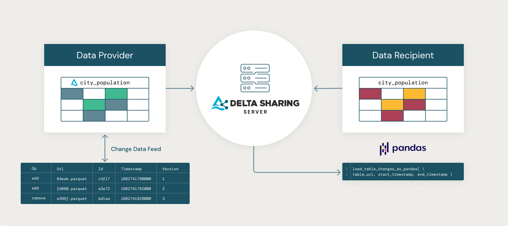
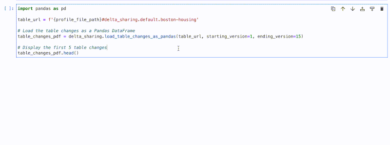
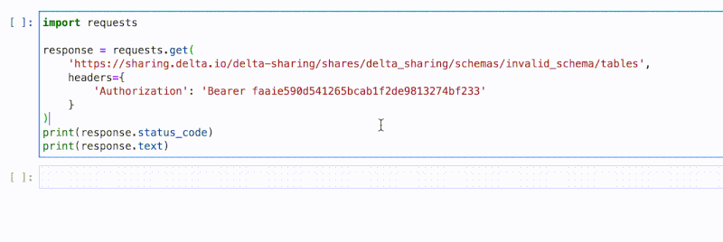

We are excited for the [release](https://github.com/delta-io/delta-sharing/releases/tag/v0.5.0) of Delta Sharing 0.5.0, which introduces several enhancements, including the following features:

- **Enable Sharing of a Delta Table’s Change Data Feed** - allows Delta Sharing clients to fetch incremental changes for shared Delta tables ([#135](https://github.com/delta-io/delta-sharing/pull/135), [#136](https://github.com/delta-io/delta-sharing/pull/136), [#137](https://github.com/delta-io/delta-sharing/pull/137), [#138](https://github.com/delta-io/delta-sharing/pull/138), [#140](https://github.com/delta-io/delta-sharing/pull/140), [#141](https://github.com/delta-io/delta-sharing/pull/141), [#142](https://github.com/delta-io/delta-sharing/pull/142), [#145](https://github.com/delta-io/delta-sharing/pull/145), [#146](https://github.com/delta-io/delta-sharing/pull/146), [#147](https://github.com/delta-io/delta-sharing/pull/147), [#148](https://github.com/delta-io/delta-sharing/pull/148), [#149](https://github.com/delta-io/delta-sharing/pull/149), [#150](https://github.com/delta-io/delta-sharing/pull/150), [#151](https://github.com/delta-io/delta-sharing/pull/151), [#152](https://github.com/delta-io/delta-sharing/pull/152), [#153](https://github.com/delta-io/delta-sharing/pull/153), [#155](https://github.com/delta-io/delta-sharing/pull/155), [#159](https://github.com/delta-io/delta-sharing/pull/159))
- **Support for Querying the Delta Table Version** - a new function, `query_table_version()`, has been added to the Python rest client that allows data recipients to query the shared Delta table’s version ([#111](https://github.com/delta-io/delta-sharing/pull/111))
- **Improved Error Messages for the Python connector** - the Python rest client has been updated to include a more detailed response body from the sharing server ([#124](https://github.com/delta-io/delta-sharing/pull/124))
- **Enhanced Error Messages for the REST API** - the Delta Sharing server has been extended to improve error codes and error messages for the `GET` Share, Schema, and Table APIs ([#120](https://github.com/delta-io/delta-sharing/pull/120))
- **Updated documentation** - improvements have been made to the protocol and REST API documentation ([#121](https://github.com/delta-io/delta-sharing/pull/121), [#128](https://github.com/delta-io/delta-sharing/pull/128), [#131](https://github.com/delta-io/delta-sharing/pull/131))

In this blog post, we will go through a few of the popular improvements in this release.

## Sharing a Delta Table’s Change Data Feed

New to this release, is support for sharing the [Change Data Feed](https://docs.delta.io/2.0.0/delta-change-data-feed.html) for Delta tables. This is an excellent way for data recipients to keep track of incremental changes as they occur by the data provider. Data recipients may now read only the changes that have been made to a table, rather than having to re-read the entire dataset to get the latest snapshot.



### Enabling Change Data Feed Example

#### Data Provider: Enabling Change Data Feed

Sharing a Delta table’s Change Data Feed using Delta Sharing is super simple! First, the data provider enables Change Data Feed on the source Delta table. A provider can enable Change Data Feed on existing Delta Lake tables by updating the table properties:

```python
# Enable CDF for an existing Delta table by updating the table properties
spark.sql(f"""
ALTER TABLE delta.`{cloud_storage_path}`
SET TBLPROPERTIES (delta.enableChangeDataFeed=true)
""")
```

For new tables, the data provider can also enable Change Data Feed at the time of creation using the `DeltaTableBuilder` API.

```python
from delta import DeltaTable

# Enable CDF for a new Delta table using the `DeltaTableBuilder` API
DeltaTable.createOrReplace(spark) \
  .addColumn("ID", "INT") \
  .addColumn("crim", "DOUBLE") \
  .addColumn("zn", "DOUBLE") \
  .addColumn("indus", "DOUBLE") \
  .addColumn("chas", "INT") \
  .addColumn("nox", "DOUBLE") \
  .addColumn("rm", "DOUBLE") \
  .addColumn("age", "DOUBLE") \
  .property("delta.enableChangeDataFeed", "true") \
  .location(cloud_storage_path) \
  .execute()
```

#### Data Provider: Updating the Server Configuration

Lastly, the data provider must update the `cdfEnabled` attribute for all tables that Change Data Feed should be enabled. By default, this value will be set to `false` if it's not explicitly defined in the sharing server configuration. Furthermore, changing the value of the `cdfEnabled` attribute enables or disables sharing the Change Data Feed for a particular table. This is a powerful feature that allows the data provider to choose which tables to share changes through configuration, while leaving the underlying table untouched. For example, below is a sample sharing server configuration to share the Change Data Feed for a Delta table called `boston-housing`:

```yaml
version: 1
shares:
  - name: "airbnbshare"
    schemas:
      - name: "listings"
        tables:
          - name: "nyc"
            location: "wasbs://airbnb@deltasharing.blob.core.windows.net/airbnb/nyc"
            cdfEnabled: true
```

#### Data Recipient: Querying Table Changes

With Change Data Feed enabled as a Delta table property on the source table and the `cdfEnabled` attribute set to `true` in the Delta Sharing server configuration, the data recipient can now query the Delta table changes from a sharing client. In release 0.5.0, the Python connector adds two new functions for reading a shared Delta table's Change Data Feed:

1. `load_table_changes_as_spark()` - for reading the changes as an Apache Spark DataFrame, and
2. `load_table_changes_as_pandas()` - to read the table changes as a Pandas DataFrame



### New API for Querying the Table Version

New in release 0.5.0 is an additional function, `query_table_version()`, that has been added to the Python rest client. This new function allows data recipients to query the version of the shared Delta table. This is a great way for data recipients to quickly check what version of the Delta table they are using.


### Improved Error Messages in the Python Rest Client

Also new in this release is an enhancement to the Python rest client’s error handling to include the response body of the sharing server in the `HTTPError` message.

Previously, the response body of the sharing server was not included, making it difficult to understand the processing error. By including the response body from the sharing server, data recipients can quickly determine problems that arise at the sharing server processing with a detailed message.


### Improved Error Messages in the Sharing Server

New in this release are improved error messages from the sharing server's `TableManager`, as well. In prior releases, if a Table, Share, or Schema was not located by the sharing server, a less descriptive message was returned, like: `schema 'invalid_schema' not found.`



In the 0.5.0 release, this error message has been enhanced to instruct the data recipient that they should reach out to the data provider.


## What’s next

We’re really excited about the future release of Delta Sharing. One of the significant features we are currently working on is enabling streaming from a shared Delta table. Stay tuned for upcoming releases and feature announcements located in [GitHub milestones](https://github.com/delta-io/delta-sharing/milestones)!

Want to get started with Delta Sharing but don’t know where to begin? Give the [quickstart examples](https://github.com/delta-io/delta-sharing/tree/main/examples) a try today!

## Credits

We’d like to extend special thanks for all of the contributions to this release including Abhijit Chakankar, Alex Ott, Lin Zhou, Shixiong Zhu, William Chau, Xiaotong Sun, harksin, Kohei Toshimitsu, and Vuong Nguyen.
