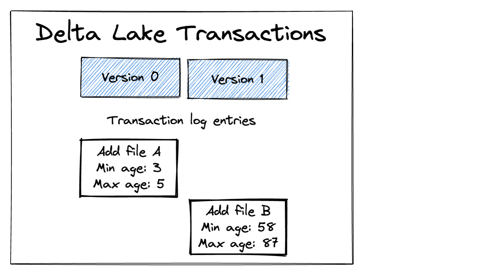
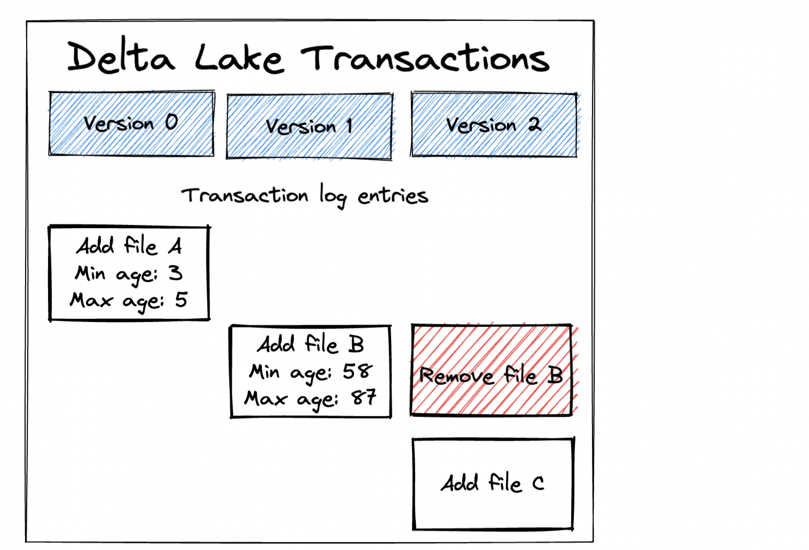
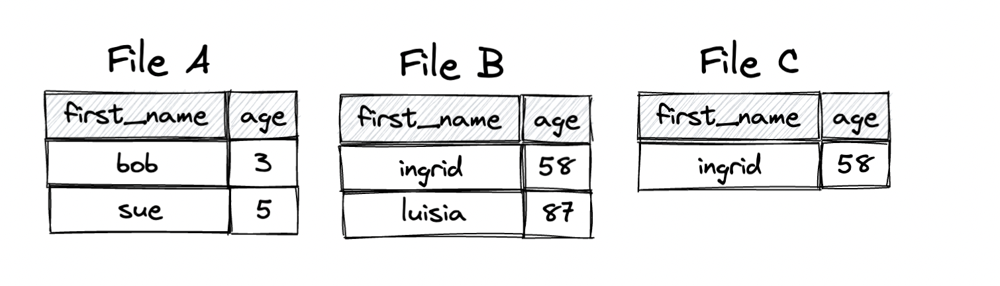
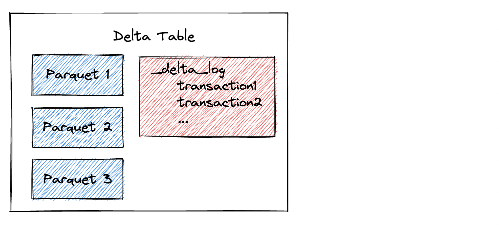

Delta Lake makes it easy to efficiently delete rows from a Delta table.

This post will show you how to delete rows from a Delta table and how the transaction is implemented under the hood, so you can understand how Delta Lake performs the computation quickly.

You’ll also see why delete operations are better with Delta Lake than data lakes. All computations are in [this notebook](https://github.com/MrPowers/delta-examples/blob/master/notebooks/pyspark/delete-rows.ipynb) if you’d like to run these computations on your machine while following along.

Important note: Deleting rows is significantly faster with deletion vectors enabled, see [this blog post](https://delta.io/blog/2023-07-05-deletion-vectors/) for more information.

## Delta Lake Delete Rows Example

Let’s create a Delta table that contains data from two write transactions. Start by creating a DataFrame and then writing it out as a Delta table:

```python
df = spark.createDataFrame([("bob", 3), ("sue", 5)]).toDF("first_name", "age")

df.repartition(1).write.format("delta").save("tmp/sunny-table")
```

Note: We’re using `repartition(1)` to output a single file and simplify the demonstration.

Now create another DataFrame and append it to the existing Delta table:

```python
df = spark.createDataFrame([("ingrid", 58), ("luisa", 87)]).toDF("first_name", "age")

df.repartition(1).write.mode("append").format("delta").save("tmp/sunny-table")
```

Let’s inspect the contents of the Delta table and make sure it contains all the data.

```
spark.read.format("delta").load("tmp/sunny-table").show()

+----------+---+
|first_name|age|
+----------+---+
|    ingrid| 58|
|     luisa| 87|
|       bob|  3|
|       sue|  5|
+----------+---+
```

Our Delta Lake currently contains two files as illustrated in the following diagram:



Notice how the Delta transaction log stores the min/max values for each column in each file. This metadata is used when optimizing delete operations.

Delete all the rows where the age is greater than 75.

```
import delta
import pyspark.sql.functions as F

dt = delta.DeltaTable.forPath(spark, "tmp/sunny-table")
dt.delete(F.col("age") > 75)
```

Read the contents of the Delta table and make sure the rows were deleted.

```
spark.read.format("delta").load("tmp/sunny-table").show()

+----------+---+
|first_name|age|
+----------+---+
|    ingrid| 58|
|       bob|  3|
|       sue|  5|
+----------+---+
```

Delta Lake makes it easy to delete rows from a Delta table. Let’s see how Delta Lake implements the delete transactions under the hood.

## How Delta Lake records delete transactions in the transaction log

Let’s take a look at how Delta Lake recorded the delete operation in the transaction log. Delta Lake delete operations add a new transaction that tombstones any files with data that should be deleted and adds new files with the deleted rows filtered out.



File C contains all the data from File B except the rows that were deleted.

File A is left unchanged because Delta Lake knows it doesn’t contain any rows that should be deleted based on the file-level metadata. The highest age in File A is only 5, so it obviously doesn’t contain any rows of data greater than 75. Delta Lake minimizes the number of files that get rewritten, which is faster than rewriting all of the data.

The following diagram illustrates the data in each of the files:



Let’s look at some of the limitations of the Parquet file format to better understand why the transaction must be implemented in this manner instead of mutating File B.

## Delta Lake Delete Limitations because of Parquet

Delta Lakes consist of a transaction log and data stored in Parquet files.



Parquet files are immutable, which means that they don’t allow you to add or delete rows. If you want to “delete” rows from a Parquet file, you need to read the data into memory, filter out the rows you don’t want, and create a new Parquet file.

Delta Lake has to write new files when deleting rows because of the immutable nature of Parquet files.

## Delta Lake delete operations vs data lakes

You’ve seen how you can delete rows from a Delta Lake - let’s revisit the command:

```python
dt.delete(F.col("age") > 75)
```

Let’s imagine trying to replicate this same on a Parquet data lake. You could read the entire Parquet table into memory, cache it (making sure it all fits in memory and none spills to disk), run the filtering operation and then overwrite the existing data, but that’s dangerous. If your cluster errored out while performing the write, you’d lose your data.

You could also iterate through all the Parquet files, figure out which ones need to be updated, read them into memory, filter them, append the new data files, and then manually delete all the old files. Here are the downsides to this approach:

- Your data lake is unusable while you’re performing this operation. There is no transaction isolation, so a reader would see duplicate data after the new data files were added.
- It’s a dangerous operation. What if you delete the wrong files by accident?
- It’s a lot of work.

Delta Lake makes common data tasks like deleting rows efficient and easy. This is yet another example of where Delta Lake saves you a lot of time and energy compared to what you’d have to do if you were working with a data lake.

## Delta Lake physically removing data from storage

When you run a delete operation with Delta Lake, the removed rows are not immediately physically removed from storage. Let’s revisit the filesystem operations:


The delete operation marks File B for deletion (a logical operation), but it doesn’t physically remove File B from storage.

Sometimes you’ll actually want to remove files from storage, perhaps to save on storage costs or for regulatory reasons. In that case, you’ll need to make sure to [vacuum the data](https://docs.delta.io/latest/delta-utility.html) after running the delete commands to physically remove the files from storage.

Important note: when deletion vectors are enabled, removing files from storage first requires running the `PURGE` command, see the [deletion vector blog post](https://delta.io/blog/2023-07-05-deletion-vectors/) for more information.

## Conclusion

Delta Lake makes it easy for you to remove rows of data from your Delta table. The Delta Lake delete operation is executed efficiently because it only rewrites the minimal subset of files. When deletion vectors are enabled, the delete operations run even faster.

Delta Lake delete operations are ACID transactions that keep your Delta table in a usable state, even while the delete transaction is being performed.

Delete operations are a real pain to run on data lakes. You need to write a bunch of custom code, suffer from table downtime, and run the risk of making a mistake and losing data. Delta Lakes are much better for delete operations because they’re reliable and don’t require manual work.

See this blog post on [Delta Lake vs. Parquet](https://delta.io/blog/delta-lake-vs-parquet-comparison/) to learn more about the advantages of Delta Lake compared to data lakes.
