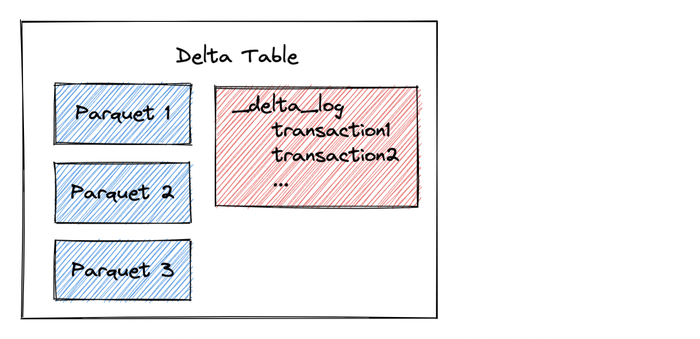

This blog post shows you how to add and delete partitions in Delta tables. You’ll learn why Delta Lake does not have `ADD PARTITION` and `DROP PARTITION` commands as Hive does and how Delta Lake treats Hive-style partitions differently.

Let’s start by creating a partitioned Delta table and then see how to add and remove partitions. All code covered in this blog post is in [this notebook](https://github.com/MrPowers/delta-examples/blob/master/notebooks/pyspark/hive-style-partitioning.ipynb) if you would like to follow along.

## Create Delta Lake table with partitions

Start by creating a DataFrame with `first_name`, `last_name`, and `country` columns.

```
df = spark.createDataFrame(
    [
        ("Ernesto", "Guevara", "Argentina"),
        ("Maria", "Sharapova", "Russia"),
        ("Bruce", "Lee", "China"),
        ("Jack", "Ma", "China"),
    ]
).toDF("first_name", "last_name", "country")
```

Write the DataFrame out to a Delta table called `country_people`:

```
df.repartition(F.col("country")).write.partitionBy("country").format(
    "delta"
).saveAsTable("country_people")
```

Here are the contents of the Delta table:

```
spark-warehouse/country_people
├── _delta_log
│   └── 00000000000000000000.json
├── country=Argentina
│   └── part-00000-03ceafc8-b9b5-4309-8457-6e50814aaa8b.c000.snappy.parquet
├── country=China
│   └── part-00000-9a8d67fa-c23d-41a4-b570-a45405f9ad78.c000.snappy.parquet
└── country=Russia
    └── part-00000-c49ca623-ea69-4088-8d85-c7c2de30cc28.c000.snappy.parquet
```

The Delta table consists of a `_delta_log` folder which contains the transaction entries. The data is stored in Parquet files in nested directories, exactly following Hive partitioning conventions.

Let’s see how to add an additional partition to the Delta table.

## Add Partition to Delta Lake table

Let’s create another DataFrame with some individuals from Colombia.

```
df = spark.createDataFrame(
    [
        ("Orlando", "Cabrera", "Colombia"),
        ("Carlos", "Vives", "Colombia"),
    ]
).toDF("first_name", "last_name", "country")
```

Append this DataFrame to the partitioned Delta table:

```
df.repartition(F.col("country")).write.mode("append").partitionBy("country").format(
    "delta"
).saveAsTable("country_people")
```

Take a look at the contents of the Delta table. You’ll notice that the Delta table now contains a `country=Colombia` partition with the new data that was appended.

```
spark-warehouse/country_people
├── _delta_log
│   ├── 00000000000000000000.json
│   └── 00000000000000000001.json
├── country=Argentina
│   └── part-00000-03ceafc8-b9b5-4309-8457-6e50814aaa8b.c000.snappy.parquet
├── country=China
│   └── part-00000-9a8d67fa-c23d-41a4-b570-a45405f9ad78.c000.snappy.parquet
├── country=Colombia
│   └── part-00000-7e3d3d49-39e9-4eb2-ab92-22a485291f91.c000.snappy.parquet
└── country=Russia
    └── part-00000-c49ca623-ea69-4088-8d85-c7c2de30cc28.c000.snappy.parquet
```

You can add partitions to tables with Hive by using the `ADD PARTITION` command. With Delta Lake, you can just append data and it will create a new partition automatically. If the partition already exists, the data will just be appended to the existing partition.

## Remove Partition from Delta Lake table

You can delete all rows from a given partition to remove the partition from the Delta table.

Here’s how to delete all the rows with individuals from Argentina.

```
dt = delta.DeltaTable.forName(spark, "country_people")

dt.delete(F.col("country") == "Argentina")
```

Let’s run the vacuum twice and observe how the Argentina partition is deleted from the filesystem.

```
spark.conf.set("spark.databricks.delta.retentionDurationCheck.enabled", "false")

spark.sql("VACUUM country_people RETAIN 0 HOURS")
spark.sql("VACUUM country_people RETAIN 0 HOURS")
```

NOTE: We’re only setting the retention period to 0 hours in this example to demonstrate disk structure changes. The retention period should normally be at least 7 days. A retention period of 0 hours is dangerous because it can break concurrent write operations and time travel.

View the contents of the filesystem and make sure that the Argentina partition was removed.

```
spark-warehouse/country_people
├── _delta_log
│   ├── 00000000000000000000.json
│   ├── 00000000000000000001.json
│   └── 00000000000000000002.json
├── country=China
│   └── part-00000-9a8d67fa-c23d-41a4-b570-a45405f9ad78.c000.snappy.parquet
├── country=Colombia
│   └── part-00000-7e3d3d49-39e9-4eb2-ab92-22a485291f91.c000.snappy.parquet
└── country=Russia
    └── part-00000-c49ca623-ea69-4088-8d85-c7c2de30cc28.c000.snappy.parquet
```

You need to run vacuum twice to completely remove the Argentina partition. The first vacuum run deletes the files with Argentina data, and the Argentina directory becomes empty. The second vacuum run deletes the empty Argentina directory. You don’t normally have to run vacuum twice for all changes to take effect, but this is a special edge case. See [this blog post](https://delta.io/blog/2023-01-03-delta-lake-vacuum-command/) to learn more about the vacuum command.

## How Delta Lake treats partitions differently than Hive

Partitioning is used to skip data for certain queries which is a performance optimization. Suppose you want to run this query: `SELECT * FROM country_people where country = 'China'`. The execution engine can identify that the table is partitioned and only reads the files in the `country=China` directory. Skipping data in this manner can be a huge query performance optimization.

However, unlike Hive which relies on the directory structure to organize the partitions and needs to perform file listing operations to find out files in a partition, Delta tables store metadata information in a transaction log with table metadata information as illustrated in the following diagram:



When a Delta Lake reads a partitioned dataset, it analyzes the transaction log to identify the relevant files for the query. Delta Lake can identify the relevant files for a given partition from the transaction log - It doesn’t need to look at the filesystem and perform a file listing operation as Hive does.

File listing operations can be slow, even for a given partition. Some partitions contain a lot of files. It’s better to get the files directly from the transaction log than to perform a file listing operation.

## Why Delta Lake follows Hive-style disk layout

Delta Lake follows Hive-style disk layout even though the disk layout is not used when reading files because Delta Lake was designed to be compatible with legacy systems. Delta Lakes can be converted to “regular Parquet data lakes” by setting the retention period to zero, running the vacuum command, and deleting the `_delta_log` directory. There is no lock-in when you use Delta Lake - you can convert to Parquet tables.

Delta Lake doesn’t need a special disk layout for performance optimizations as Hive does. Delta Lake relies on file metadata information in the transaction log to identify the relevant files for a query. It doesn’t use directories and file listing operations to read data.

## Why Hive needs ADD PARTITION and DROP PARTITION commands

Hive needs `ADD PARTITION` and `DROP PARTITION` commands for the following types of situations:

- when a user performs operations to directories on disk (this is not uncommon for external tables) that are not reflected in the Hive metastore
- when a query crashes causing the directories and the partition information in Hive metastore to be inconsistent. The user needs to manually add/remove partitions in the Hive metastore to reflect the changes on disk. Otherwise, Hive will ignore the new directories or try to read deleted directories.

The `ADD PARTITION` and `DROP PARTITION` Hive commands are used to manually sync the data on disk with the Hive metastore (some service providers offered this as an auto discovery process). Needless to say, this was a terrible user experience.

Delta Lake stores the partition data in the transaction log. Thanks to ACID, metadata and date files in a Delta Lake table are always consistent and cannot get out of sync. The better design eliminates the needs of legacy partition commands.

## Conclusion

With Delta Lake, it’s easy to create Hive-style partitioned datasets, add partitions, and remove partitions. Delta Lake doesn’t explicitly support legacy Hive partition command syntax like `ADD PARTITION` and `DROP PARTITION` because they’re unnecessary. You can just run regular Delta table commands and partitions will automatically be added and removed as needed.
