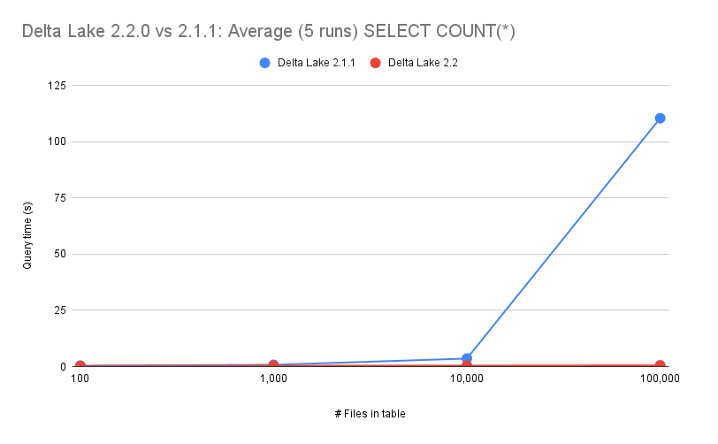
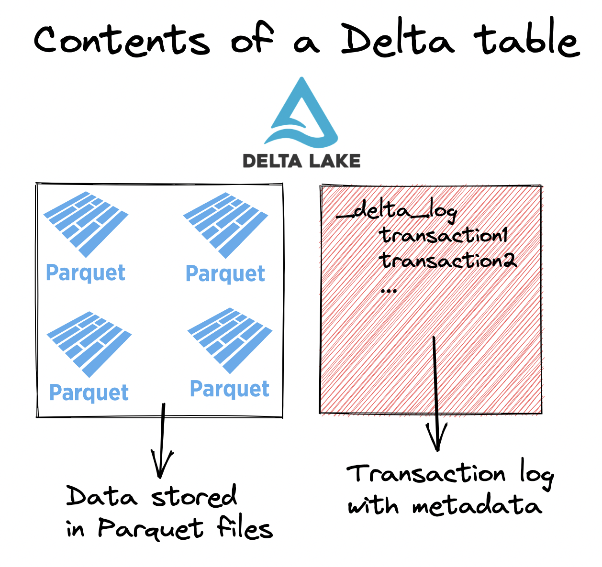

This blog post explains how Delta Lake was updated to leverage metadata to make certain aggregation benchmarks run much faster on larger datasets.

These aggregation improvements were added to Delta Lake 2.2.0, so the benchmarks will compare Delta Lake 2.2.0 with Delta Lake 2.1.1.

Let’s look at how these benchmarks were run.

## Benchmarking setup

We generated a synthetic dataset with five columns. Here’s a few rows from the dataset:

```
+------+------------------------------------+----+-----+---+-----+
|id    |uuid                                |year|month|day|value|
+------+------------------------------------+----+-----+---+-----+
|20470 |09797ddf-13ab-4ccd-bb6a-d6b1693e8123|2010|10   |2  |470  |
|148546|864b31b5-f337-4e08-afe3-d72c834efa1f|2002|10   |6  |546  |
|459007|08a60ad9-664a-4609-bf25-2598bef92520|2021|7    |3  |7    |
|248874|1ebee359-4548-4509-9bc0-5e11bcc49336|2010|6    |10 |874  |
|139382|5eee63fe-d559-4002-857b-3251a8e4df80|2012|2    |26 |382  |
+------+------------------------------------+----+-----+---+-----+
```

We wrote this dataset out to 100, 1_000, 10_000, and 100_000 different files, so we would have different scenarios for running the benchmarks. See the appendix for the script used to generate the synthetic dataset.

The queries were run on a Macbook M1 laptop with 64GB of RAM. Let’s take a look at the results.

## Counting all rows of data in a Delta Lake table

Let’s look at how Delta Lake 2.2+ makes the the following query run faster: `select count(*) from the_table`.

This query was run on 100, 1_000, 10_000, and 100_000 files for Delta Lake 2.1.1 and Delta Lake 2.2 as shown in the following graph:



For Delta Lake 2.1.1 and earlier, the query runtime increased as the number of files increased. With the new optimizations that were added in Delta Lake 2.2, the query time does not increase as the number of files increases.

The number of records in each file of a Delta table is contained in the Delta transaction log. You don’t need to actually query the data to compute the number of records, you can simply consult the metadata.

Delta Lake 2.2+ performs this query as a metadata-only operation and that’s why it can scale to more files without taking any longer to run.

Let’s look at another query performance enhancement that was added in Delta Lake 2.2.

## Selecting a single row of data from a Delta table

Let’s look at how Delta Lake 2.2+ makes the the following query run faster: `select * from the_table limit 1`.

This query was run on 100, 1_000, 10_000, and 100_000 files for Delta Lake 2.1.1 and Delta Lake 2.2 as shown in the following graph:


Delta Lake 2.1.1 never took the limit into account during query planning. So the physical plan that Delta Lake generated involved scanning all of the data in your table. Spark would then apply the LIMIT onto that result.

Delta Lake 2.2, instead, does take into account the limit during query planning, and internally uses per-file statistics to determine the minimum amount of data files that need to be read. With this much smaller set, Spark can read only a few files and then apply the LIMIT onto that much smaller result. Check out the commit that implements this [here](https://github.com/delta-io/delta/commit/1a94a585b74477896cbcae203fc26eaca733cbaa).

In this example that uses `select * from the_table limit 1`, Spark will only need to read one row from a single file. This query will be able to run just as fast regardless on how many files are in the Delta table.

Let’s look at the contents of the Delta Lake transaction log to gain intuition on how Delta table queries can be optimized by leveraging the information in the transaction log.

## Delta Lake Transaction log intuition

Let’s take a look at the basic structure of a Delta table:



Data is stored in Parquet files and transaction metadata information is stored in the transaction log (aka `_delta_log`).

There are certain types of queries that can be addressed solely by consulting the transaction log. Let’s look at a representative transaction log entry:

```
{
  "commitInfo": {
    "delta-rs": "0.8.0",
    "timestamp": 1679608176735
  }
}
{
  "protocol": {
    "minReaderVersion": 1,
    "minWriterVersion": 1
  }
}
{
  "metaData": {
    "id": "efc48132-57a7-4b93-a0aa-7300bb0bdf94",
    "name": null,
    "description": null,
    "format": {
      "provider": "parquet",
      "options": {}
    },
    "schemaString": "{\"type\":\"struct\",\"fields\":[{\"name\":\"x\",\"type\":\"long\",\"nullable\":true,\"metadata\":{}}]}",
    "partitionColumns": [],
    "createdTime": 1679608176735,
    "configuration": {}
  }
}
{
  "add": {
    "path": "0-66a9cef6-c023-46a4-8714-995cad909191-0.parquet",
    "size": 1654,
    "partitionValues": {},
    "modificationTime": 1679608176735,
    "dataChange": true,
    "stats": "{\"numRecords\": 3, \"minValues\": {\"x\": 1}, \"maxValues\": {\"x\": 3}, \"nullCount\": {\"x\": 0}}",
    "tags": null
  }
}
```

Look closely at the `"stats"` portion of the transaction log that contains the `numRecords`. You can get the number of rows in a file by looking at the `numRecords`. The `select count(*) from some_table` query can be executed by simply summing the `numRecords` for all the files in a given Delta table version.

## Conclusion

This blog post has shown how Spark can use the Delta Lake transaction log to make certain queries run much faster as the number of files in a Delta table grows.

Delta Lake is a constantly evolving project with new features and performance enhancements constantly being added. As a user, you don’t need to change your code at all to take advantage of the aggregation optimizations introduced in this post. You can simply upgrade your Delta Lake version and immediately enjoy the benefits of these performance enhancements.

[Follow us on LinkedIn](https://go.delta.io/linkedin) to get high quality information about new releases and Delta Lake features. We regularly post great information that will help you level-up your Delta Lake skills!

## Appendix: Data generation script

We generated the synthetic dataset for this benchmarking analysis with the following code snippet:

```
import pyspark.sql.functions as F
from pyspark.sql.types import StringType

def create_table(total_rows, total_files, table_base_path):
    rows_per_commit = 10_000_000
    num_commits = int(total_rows / rows_per_commit)
    num_files_per_commit = int(total_files / num_commits)
    table_path = (
        f"{table_base_path}/{int(total_rows / 1_000_000)}_mil_rows_{total_files}_files"
    )

    for i in range(num_commits):
        (
            spark.range(rows_per_commit)
            .withColumn("uuid", F.expr("uuid()"))
            .withColumn("year", F.col("id") % 22 + 2000)
            .withColumn("month", F.col("id") % 12)
            .withColumn("day", F.col("id") % 28)
            .withColumn("value", (F.col("id") % 1000).cast(StringType()))
            .repartition(num_files_per_commit)
            .write.format("delta")
            .mode("append")
            .save(table_path)
        )

create_table(100_000_000, 100, "/Users/matthew.powers/benchmarks/tables")
create_table(100_000_000, 1000, "/Users/matthew.powers/benchmarks/tables")
create_table(100_000_000, 10000, "/Users/matthew.powers/benchmarks/tables")
create_table(100_000_000, 100000, "/Users/matthew.powers/benchmarks/tables")
```
