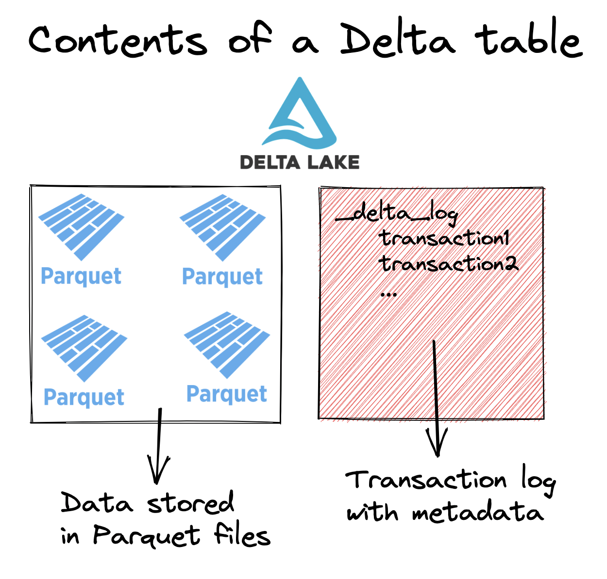
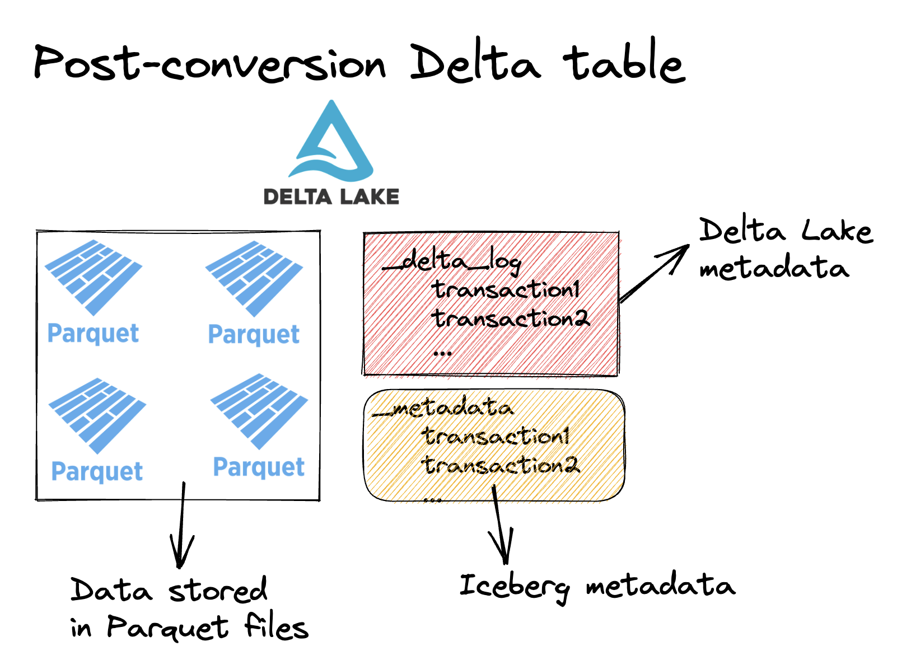

Delta Lake continues to be the best open source storage format for the lakehouse. The Delta 2.0 release has been wildly successful with widespread adoption and we continue to build upon this success.

With the release of 2.3, Delta now has even more capabilities that makes deploying Lakehouses super easy.

This new release makes it easier to transition from Iceberg to Delta Lake, write advanced MERGE statement logic, query the change data feed, and much more. The features outlined below are just a few of the many features included in the release - see [the Delta Lake 2.3 Release Notes](https://github.com/delta-io/delta/releases/tag/v2.3.0) for more.

This post will show you why you should upgrade to Delta 2.3 and how to take advantage of these amazing features.

## Delta Lake SHALLOW CLONE

The Delta Lake SHALLOW CLONE command creates a Delta table in a new location while leaving the existing data files in their current location.

You can create a shallow clone of a Parquet table, a Delta table, or even an Iceberg table.

Let’s look at the architecture of a Delta table to get a better understanding of how shallow clones work. Delta tables are normally constructed of Parquet files and a colocated transaction log, as illustrated in the following diagram:



Let’s create a Delta Lake table and then clone it in another location. Start by creating a Delta Lake table with PySpark.

```python
data = [(0, "Bob", 23), (1, "Sue", 25), (2, "Jim", 27)]
df = spark.createDataFrame(data).toDF("id", "name", "age")
df.write.format("delta").save("/tmp/my_people")
```

The Delta table contains metadata files and data stored in Parquet as follows:

```
/tmp/my_people
├── _delta_log
│   └── 00000000000000000000.json
├── part-00000-b33f79ee-473d-4b98-ad79-a8b087ae5c50-c000.snappy.parquet
├── part-00003-3de8e2cd-bb73-4ed6-af3c-2d61911670d0-c000.snappy.parquet
├── part-00006-206bd2a6-bc3f-47d4-9b6c-e9fb8d317732-c000.snappy.parquet
└── part-00009-1c687cd5-4515-4966-9aeb-27e03bc00818-c000.snappy.parquet
```

Now clone the table in another location.

```
spark.sql("CREATE TABLE delta.`/tmp/my_cloned_people` SHALLOW CLONE delta.`/tmp/my_people`")
```

Run a query on the clone to make sure that everything is working all right:

```
spark.read.format("delta").load("/tmp/my_cloned_people").show()

+---+----+---+
| id|name|age|
+---+----+---+
|  2| Jim| 27|
|  1| Sue| 25|
|  0| Bob| 23|
+---+----+---+
```

The cloned table only contains metadata files, it doesn’t contain any data files:

```
/tmp/my_cloned_people
└── _delta_log
    ├── 00000000000000000000.checkpoint.parquet
    ├── 00000000000000000000.json
    └── _last_checkpoint
```

Shallow clone is useful when you want to continue updating the source table but want to read or write to an independent copy of it. For example, shallow clone can be used to experiment and test on a production table. Creating a shallow clone means you can run arbitrary operations on the cloned table without corrupting the production table or disrupting any production workloads.

We’ll dive into the details of cloning in a future blog post and how it can be used along with `CONVERT TO DELTA`.

## Convert Iceberg to Delta Lake

Companies are looking to migrate from Iceberg to Delta Lake to get access to better performance and reliability, as explained in the [Analyzing and Comparing Lakehouse Storage Systems](https://www.cidrdb.org/cidr2023/papers/p92-jain.pdf) paper.

In Delta 2.3 you can easily convert Iceberg tables to the Delta Lake format with `CONVERT TO DELTA`. It performs a one-time conversion to the Delta Lake format and also supports converting Parquet tables.

Suppose you have an Iceberg table named `some_table` that’s stored at `/some/path/some_table`. You can convert it to a Delta table with the following command:

```
CONVERT TO DELTA iceberg.`/some/path/some_table`
```

Since both Iceberg tables and Delta tables consist of metadata transaction logs and data stored in Parquet files, converting from Iceberg to Delta Lake is an in-place operation. Converting an Iceberg table just creates a Delta transaction log and doesn’t rewrite any of the data files. After converting an Iceberg table to Delta Lake it will look something like this:



After performing `CONVERT TO DELTA` the table is now a Delta table and can take advantage of all the awesome Delta Lake features. Note that any subsequent Delta operations could corrupt the Iceberg source table and will not update the Iceberg metadata. Convert to Delta is best used for one-time conversions when you don’t plan to update the source table in the source format anymore.

## “when not matched by source” clauses for the Merge command

The merge command enables updating an existing Delta table (target) with information in a source table. Previously only two clauses were supported; “when matched” which allows updating or deleting a target row, and “when not matched” which allows inserting a source row. “When not matched by source” enables you to `UPDATE` or `DELETE` rows in the target table that do not have corresponding records in the source table.

Suppose you have the following target table with customers, their ages, the last time they were seen in your store, and an active flag. A customer will be considered active if they’ve gone to your store in the last month.

Imagine you’re running this analysis on April 12th, 2023. Here’s the existing customer table.

```
+---+----+---+----------+--------+
| id|name|age| last_seen|  status|
+---+----+---+----------+--------+
|  0| Bob| 23|2022-01-02|inactive|
|  1| Sue| 25|2023-04-05|  active|
|  2| Jim| 27|2023-02-07|  active| # should be inactive now
+---+----+---+----------+--------+
```

You’d like to update the Delta table with the following information:

```
+---+-----+---+------------+
| id| name|age|current_date|
+---+-----+---+------------+
|  0|  Bob| 23|  2023-04-12| # update existing row
|  3|Sally| 30|  2023-04-12| # new row
+---+-----+---+------------+
```

Here’s a summary of the changes that are needed:

- Bob needs `last_seen` updated and needs to become `active`
- Sue shouldn’t change
- Jim should be made `inactive`
- Sally should be added and made `active`

With the new “when not matched by source clause” here’s the Delta Lake code that will allow for this merge logic:

```python
(
    customers_table.alias("target")
    .merge(new_df.alias("source"), "target.id = source.id")
    .whenMatchedUpdate(
        set={"target.last_seen": "source.current_date", "target.status": "'active'"}
    )
    .whenNotMatchedInsert(
        values={
            "target.id": "source.id",
            "target.name": "source.name",
            "target.age": "source.age",
            "target.last_seen": "source.current_date",
            "target.status": "'active'",
        }
    )
    .whenNotMatchedBySourceUpdate(
        condition="target.last_seen <= (current_date() - INTERVAL '30' DAY)",
        set={"target.status": "'inactive'"},
    )
    .execute()
)
```

Check to make sure the `MERGE` was properly performed:

```
DeltaTable.forPath(spark, "tmp/customers").toDF().show()

+---+-----+---+----------+--------+
| id| name|age| last_seen|  status|
+---+-----+---+----------+--------+
|  0|  Bob| 23|2023-04-12|  active|
|  1|  Sue| 25|2023-04-05|  active|
|  2|  Jim| 27|2023-02-07|inactive|
|  3|Sally| 30|2023-04-12|  active|
+---+-----+---+----------+--------+
```

The new `whenNotMatchedBySourceUpdate` is critical to allow Jim to be updated to have a status of `inactive`. Without the “when not matched by source” clause this same operation would require two separate writes to the table: (1) a `MERGE` operation to update the table with the new information and (2) an `UPDATE` operation to set customer’s status to `inactive` if they haven’t been seen in 30 days.

## CREATE TABLE LIKE to create empty Delta tables

`CREATE TABLE LIKE` makes it easy to build a new table with the same columns and schema as an existing table.

Let’s create a Delta table and then create another table with the same schema.

Start by creating a Delta table:

```
df = spark.createDataFrame(
    [(0, "Bob", "Loblaw", 23), (1, "Sue", "Grafton", None), (2, "Jim", "Carrey", 61)]
).toDF("id", "first_name", "last_name", "age")

df.write.format("delta").saveAsTable("default.famous_people")
```

Now use `CREATE TABLE LIKE` to create an empty table with the same columns and data types.

```
spark.sql("CREATE TABLE famous_people_duplicate LIKE famous_people")
```

We can confirm that the table is empty:

```
spark.sql("select * from famous_people_duplicate").show()
```

`CREATE TABLE LIKE` is a handy feature whenever you want to replicate a table schema exactly without manually typing all the code for the column names and column types.

## Support reading Change Data Feed (CDF) in SQL queries

Delta Lake supports a Change Data Feed (CDF) which tracks row-level changes made to a Delta table over time. The CDF can be great for building intelligent incremental updates or as an audit log.

You can use the `table_changes` SQL function to read the change data feed in SQL queries.

Here’s how to read the entire change data feed for the `students` table.

```
SELECT * FROM table_changes('students', 0)

+---+-----+---+------------+---------------+----------------------+
|id |name |age|_change_type|_commit_version|_commit_timestamp     |
+---+-----+---+------------+---------------+----------------------+
|0  |Bob  |23 |delete      |3              |2023-04-19 12:06:11.5 |
|1  |Sue  |25 |delete      |3              |2023-04-19 12:06:11.5 |
|2  |Jim  |27 |delete      |3              |2023-04-19 12:06:11.5 |
|5  |Jack |18 |insert      |2              |2023-04-19 12:06:06.24|
|6  |Nora |19 |insert      |2              |2023-04-19 12:06:06.24|
|7  |Clare|20 |insert      |2              |2023-04-19 12:06:06.24|
|0  |Bob  |23 |insert      |1              |2023-04-19 12:05:57.84|
|1  |Sue  |25 |insert      |1              |2023-04-19 12:05:57.84|
|2  |Jim  |27 |insert      |1              |2023-04-19 12:05:57.84|
+---+-----+---+------------+---------------+----------------------+
```

And here’s how to read the change data feed only for commit versions 2 and 3.

```
SELECT * FROM table_changes('students', 2, 3)

+---+-----+---+------------+---------------+----------------------+
|id |name |age|_change_type|_commit_version|_commit_timestamp     |
+---+-----+---+------------+---------------+----------------------+
|0  |Bob  |23 |delete      |3              |2023-04-19 12:06:11.5 |
|1  |Sue  |25 |delete      |3              |2023-04-19 12:06:11.5 |
|2  |Jim  |27 |delete      |3              |2023-04-19 12:06:11.5 |
|5  |Jack |18 |insert      |2              |2023-04-19 12:06:06.24|
|6  |Nora |19 |insert      |2              |2023-04-19 12:06:06.24|
|7  |Clare|20 |insert      |2              |2023-04-19 12:06:06.24|
+---+-----+---+------------+---------------+----------------------+
```

Previously the change data feed was only easily accessible via the Spark DataFrameReader APIs in Python and Scala. Now the change data feed is also easily accessible via the SQL API.

## Conclusion

The Delta Lake 2.3 release adds a variety of new functionality to Delta Lake.

These changes make it easier to migrate workloads to Delta Lake and perform complex analyses and build a highly scalable, performant, production grade Lakehouse. Delta Lake is a growing project and new features are regularly being added to make it continuously better.

Feel free to [follow us on LinkedIn](https://go.delta.io/linkedin), join our [Slack community](https://go.delta.io/slack), or read the [Guide on Getting Started Contributing to Delta Spark](https://delta.io/blog/2023-03-07-delta-lake-spark-development/) if you’d like to get involved!
