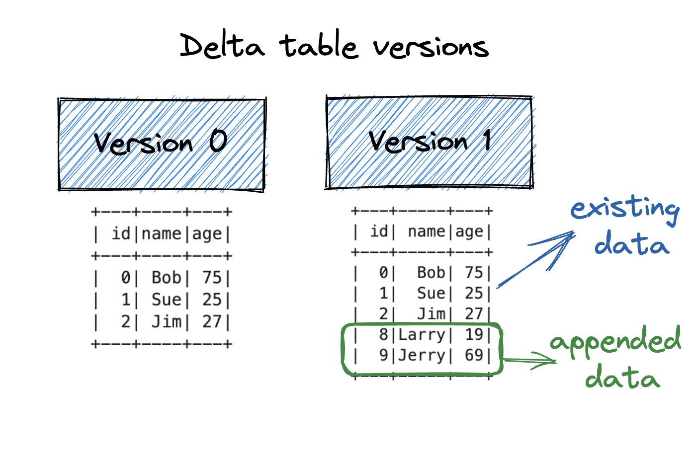

This blog post explains how to use Ibis to query Delta Lakes with the PySpark backend.

Ibis lets you query data with the same syntax using a variety of engines like pandas, DuckDB, and Spark. You can seamlessly swap from one backend to another when using Ibis without changing your application code. For example, you can develop locally with DuckDB as the backend and then switch the backend to Spark when running the analysis in production.

Ibis can easily run queries on data that’s stored in CSV, Parquet, databases, or Delta Lake tables.

Let’s look at an example of how to query Delta Lake tables with Ibis and then discuss the advantages of Ibis/Delta Lake for PySpark users. All code snippets in this blog post are in [this notebook](https://github.com/delta-io/delta-examples/blob/master/notebooks/pyspark/pyspark-ibis-delta-lake.ipynb).

## Using PySpark to query Delta Lake tables with Ibis

This section shows you how to create a Delta Lake table and then query it with Ibis using the PySpark backend.

Start by creating the Delta table:

```
df = spark.createDataFrame([(0, "Bob", 75), (1, "Sue", 25), (2, "Jim", 27)]).toDF(
    "id", "name", "age"
)

df.write.format("delta").save("tmp/fun_people")
```

Now append some more data to the table:

```
df = spark.createDataFrame([(8, "Larry", 19), (9, "Jerry", 69)]).toDF(
    "id", "name", "age"
)

df.write.format("delta").mode("append").save("tmp/fun_people")
```

Let’s inspect the content of the Delta table.

```
+---+-----+---+
| id| name|age|
+---+-----+---+
|  0|  Bob| 75|
|  1|  Sue| 25|
|  2|  Jim| 27|
|  8|Larry| 19|
|  9|Jerry| 69|
+---+-----+---+
```

The Delta table contains the data from the initial write operation and the data that was subsequently appended.

Let’s expose the Delta Lake as a temporary view with Spark:

```
spark.read.format("delta").load("tmp/fun_people").createOrReplaceTempView("fun_people")
```

Create an Ibis table from the temporary view.

```
import ibis

con = ibis.pyspark.connect(spark)
table = con.table("fun_people")
```

Run a query on the Ibis table that filters the dataset to only include individuals that are 50 years or older

```
table.filter(table.age >= 50)

	id	name	 age
0	9	Jerry	 69
1	0	Bob	 75
```

Now run a query that simply grabs the first two rows of data from the Delta table:

```
table.head(2)

	id	name	 age
0	9	Jerry	 69
1	2	Jim	 27
```

It’s easy to query a Delta table with Ibis syntax using the PySpark connector.

Let’s now time travel back to the original version of the data and run the same queries with Ibis.

## Querying previous versions of the Delta table with Ibis

Delta Lake supports time travel, so you can switch between different versions of the Delta table.

The Delta table we’ve created has the following two versions.



Let’s create a view that corresponds with version 0 of the Delta table and then run the same queries as before.

```
spark.read.format("delta").load("tmp/fun_people").createOrReplaceTempView(
    "fun_people_v0"
)
```

Run a query on the Ibis table that filters the dataset to only include individuals that are 50 years or older in version 0 of the Delta table:

```
table_v0.filter(table_v0.age >= 50)

	id	name	age
0	0	Bob	75
```

This is a subset of the original result.

Now run a query that simply grabs the first two rows of data from version 0 of the Delta table:

```
table_v0.head(2)

	id	name	age
0	2	Jim	27
1	0	Bob	75
```

Delta Lake makes it easy to query prior versions of data with Ibis. Now let’s turn our attention to the advantages Ibis provides PySpark users.

## Ibis Advantages for PySpark users

Ibis provides users with the ability to write code that’s executed with one backend locally and another backend in production.

For example, you can write code that’s executed with the DuckDB backend locally on small datasets and with PySpark in production on larger datasets. This could let you write unit tests that execute faster locally. It can also bridge the gap between teams with different technology preferences.

Developers that are already familiar with Ibis can seamlessly transition to the PySpark backend, without learning a new DataFrame query syntax.

Most developers choose to write PySpark locally and in production, so this is just a matter of preference.

## Delta Lake Advantages for Ibis users

Delta Lake is great for Ibis users for the same reasons it’s advantageous for pandas or PySpark users. Here are a few of the reasons:

- Versioned data allows for [time travel](https://delta.io/blog/2023-02-01-delta-lake-time-travel/)
- ACID transaction guarantees
- [Schema enforcement](https://delta.io/blog/2022-11-16-delta-lake-schema-enforcement/) prevents you from appending data with a mismatched schema
- [Shema evolution](https://delta.io/blog/2023-02-08-delta-lake-schema-evolution/) allows you to safely change the table schema over time
- [Generated columns](https://delta.io/blog/2023-04-12-delta-lake-generated-columns/) allow you to consistently and automatically populate certain columns based on values in other columns
- Delta Lake supports [advanced merge commands](https://delta.io/blog/2023-02-14-delta-lake-merge/)
- Small files can easily be [compacted with OPTIMIZE](https://delta.io/blog/2023-01-25-delta-lake-small-file-compaction-optimize/)
- [Constraints and checks](https://delta.io/blog/2022-11-21-delta-lake-contraints-check/) enforce the values that can be appended to columns
- [Dropping columns](https://delta.io/blog/2022-08-29-delta-lake-drop-column/) is really fast
- You can [rollback to an earlier version of a Delta table](https://delta.io/blog/2022-10-03-rollback-delta-lake-restore/) to undo mistakes
- You can easily [delete rows from a table](https://delta.io/blog/2022-12-07-delete-rows-from-delta-lake-table/)
- And many more…

Delta Lake has tons of features that are imperative for data practitioners that aren’t available in CSV or Parquet data lakes.

Delta Lake is flexible and amenable to advanced AI or ML workloads, unlike databases.

Delta Lake gives the best of both worlds, see the [Lakehouse paper](https://www.cidrdb.org/cidr2021/papers/cidr2021_paper17.pdf) to learn more.

## Conclusion

Ibis is a cool technology for writing backend agnostic code. This provides the possibility of seamlessly switching backends for different execution environments or as technology trends evolve.

Suppose you have a 40,000 line codebase written for Clickhouse. Transitioning this codebase to DuckDB could be difficult. If you instead wrote this code in Ibis, the transition would be easy (as long as you’re not using Clickhouse-specific features).

If you’d like to learn even more, see this blog post on [Scaling out to Apache Spark with Ibis](https://voltrondata.com/resources/scaling-out-to-apache-spark-with-ibis).
