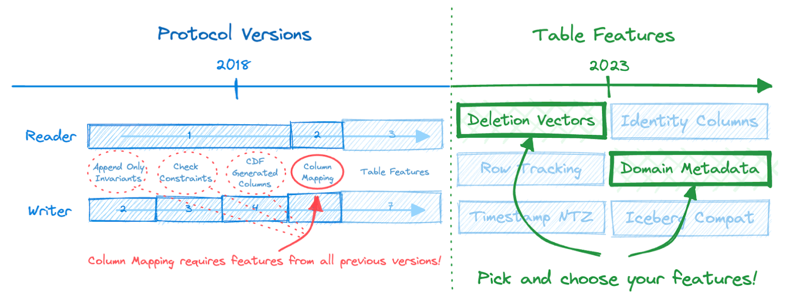
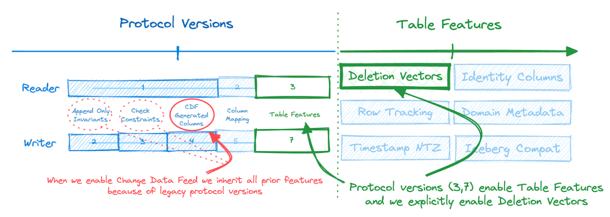

The original design of the Delta Lake Transaction Protocol specified two integers called “protocol versions” to keep track of both reader and writer features. Protocol versions allowed Delta Lake clients to safely handle tables by detecting incompatible protocol versions, and therefore helped manage the evolution of features in the Delta Lake protocol.

This design has served Delta Lake well since inception, but has not come without complexities and constraints. In the integer based protocol versioning scheme, each version number bundles multiple features, and features across version numbers are cumulative. So, in order to get a new feature in a particular protocol version, users and developers would have to not only enable or implement all the features in a given version, but all features in all versions prior too!

Versioning is a particularly difficult problem for a project like Delta Lake, which must consider users, administrators, and developers, across multiple stacks with their own sets of constraints - all at once in a single open protocol. This is why we’re super excited to introduce a new table compatibility management approach for Delta Lake, Table Features, which replaces integer based protocol reader and writer versions as the primary versioning scheme for Delta Lake tables.

## What are Delta Lake Table Features?

Delta Lake Table Features are a discrete feature-based compatibility scheme that replaces the traditional continuous integer-based protocol versioning scheme as the primary feature management mechanism for Delta Lake tables and clients.



With Table Features, users define their tables in terms of the features they use, instead of version numbers, which greatly simplifies table usability, maintenance, and upgrades. Developers can also now pick and choose to develop only the features necessary for their use case, instead of having to implement all features bundled in all the preceding version numbers.

## How do Delta Lake Table Features work?

To link Delta Lake Table features to the legacy protocol versioning scheme, support for Table Features semantics is itself considered a feature as a part of the final protocol versions: reader version 3 and writer version 7. These are the last protocol versions to be introduced by the Delta Lake protocol, and all subsequent features are now explicitly enabled through their respective features flag.

### As a user of Delta Spark

The move from protocol versions to table features is designed to be transparent to the user. Existing tables do not need to be explicitly upgraded to benefit, as the logic to match and handle legacy protocol versioning with table features is done by the client. You can still choose to [upgrade protocol versions manually](https://docs.delta.io/latest/versioning.html#upgrading-protocol-versions).

To highlight how Table Features work in practice, let’s take a look at the evolution of a table using the latest release of Delta Spark connector, v2.4.0. The earliest Delta Spark version to support Table Features is v2.3.0.

Creating a new table results in the following protocol action added to the Delta log:

```
CREATE TABLE t1 (id INT) USING delta

...

{"protocol":{"minReaderVersion":1,"minWriterVersion":2}}
```

Because there was no use or explicit enabling of a table feature like Change Data Feed or Deletion Vectors during creation, the current table state assumes the lowest possible reader and writer version.

Let’s enable Change Data Feed and observe the changes to the log.

```
ALTER TABLE t1 SET TBLPROPERTIES (delta.enableChangeDataFeed = true)

...

{"protocol":{"minReaderVersion":1,"minWriterVersion":4}}
```

We can see that enabling Change Data Feed caused Delta Spark to upgrade the table to the protocol version (minWriterVersion 4) that contains the Change Data Feed feature. The mapping of legacy protocol versions to features is available in the [documentation](https://docs.delta.io/latest/versioning.html#features-by-protocol-version).

Now let’s see the protocol action added to the Delta log by the client when we enable one of the latest features available in Delta Lake, Deletion Vectors.

```
ALTER TABLE t1 SET TBLPROPERTIES (delta.enableDeletionVectors = true)

...

{
    "protocol": {
        "minReaderVersion": 3,
        "minWriterVersion": 7,
        "readerFeatures": [
            "deletionVectors"
        ],
        "writerFeatures": [
            "deletionVectors",
            "checkConstraints",
            "generatedColumns",
            "invariants",
            "changeDataFeed",
            "appendOnly"
        ]
    }
}
```

This time we see that Delta Spark has upgraded the table to `"minReaderVersion": 3` and `"minWriterVersion": 7`, which are the final legacy protocol versions that enable support for the new Table Features versioning scheme, which Deletion Vectors belong to.

We also see that new fields appear in the protocol action, `readerFeatures` and `writerFeatures`, which contain the list of features as they apply to both reading and writing of the table, respectively.

We didn’t explicitly add a number of the features in the list. This is because they are bundled to the legacy protocol version upgrade we inherited when enabling Change Data Feed. The image below matches the features listed above, and captures which protocol versions each feature came from.



Some features appear in both `readerFeatures` and `writerFeatures` of the protocol action while others only appear in one of the two. This is because not all features require changes to both write and read behavior. The table below summarizes which features apply to one or both of `readerFeatures` and `writerFeatures`.

<div align="center">

| Feature            | Name               | Readers or Writers? |
| ------------------ | ------------------ | ------------------- |
| Append-only Tables | `appendOnly`       | Writers only        |
| Column Invariants  | `invariants`       | Writers only        |
| CHECK constraints  | `checkConstraints` | Writers only        |
| Change Data Feed   | `changeDataFeed`   | Writers only        |
| Generated Columns  | `generatedColumns` | Writers only        |
| Column Mapping     | `columnMapping`    | Readers and writers |
| Identity Columns   | `identityColumns`  | Writers only        |
| Deletion Vectors   | `deletionVectors`  | Readers and writers |

</div>

### As a developer of Delta Lake clients

Developers of Delta Lake clients should implement the table features semantics detailed in the [PROTOCOL](https://github.com/delta-io/delta/blob/master/PROTOCOL.md), the [design document](https://docs.google.com/document/d/1UZ4W4nnKH4x9t3hy0eh68P0RFRAchoHihdXftdnycDQ/edit?usp=sharing), upgrade their minimum supported protocol versions to reader version 3, writer version 7, and implement the features desired.

For new clients which have not yet implemented support for previous protocol versions, claiming support for the latest protocol versions and adding support for the `appendOnly` and `invariants` features is sufficient. Those two features are required by the earliest protocol versions, reader version 1 and writer version 2.

The client must maintain a list of features it supports and implement the correct logic to confirm if the client can read and/or write a Delta Lake table. For example, by enabling Table Features with protocol reader version 3 and writer version 7, you can selectively develop a feature like Change Data Feed without having to also develop all features between writer version 2 and 4.

Below is an excerpt from the [Table Features design document](https://docs.google.com/document/d/1UZ4W4nnKH4x9t3hy0eh68P0RFRAchoHihdXftdnycDQ/edit?usp=sharing) of the semantics of Table Features to follow when developing a Delta Lake client:

- When **reading** a table, a reader compares if
  - The table’s `readerFeatures` is a subset of the client’s `supportedReaderFeatures`
- When **writing** a table without reading data, a writer compares if
  - The table’s `writerFeatures` is a subset of the client’s `supportedWriterFeatures`
- When **reading & writing** a table, a writer compares if
  - The table’s `readerFeatures` is a subset of the client’s `supportedReaderFeatures`, and
  - The table’s `writerFeatures` is a subset of the client’s `supportedWriterFeatures`

Delta Lake clients that would like to continue to support legacy table versions (reader version < 3 and writer version < 7) should use the [map of legacy protocol versions to the table features they bundle](https://docs.delta.io/latest/versioning.html#features-by-protocol-version) to transparently determine what table features must be supported by the client to allow safe use of the table.

You can refer to the reference implementation in the Delta Spark connector [here](https://github.com/delta-io/delta/blob/master/spark/src/main/scala/org/apache/spark/sql/delta/TableFeature.scala#L36-L56).

## Next steps

Table features support is currently only available in the reference Delta Spark connector. Support for Table features in Delta Standalone and other non-Spark clients is currently in progress.

## Conclusion

In this post we introduced Table Features, which replaces the legacy integer-based protocol versioning scheme in the Delta Lake protocol. Table Features are enabled by the final protocol versions, reader version 3 and writer version 7, which will no longer be used to manage or introduce new features to the Delta Lake protocol.

Users and administrators can now enable only the features they need instead of inheriting all the features bundled to specific protocol versions before reader version 3 and writer version 7. This simplifies the table management lifecycle by making table features distinct and explicitly listed, removing the dependency on obtuse numbered protocol versions which arbitrarily bundle many features.

Developers too can now implement Delta Lake clients to only support the features they require. By stating compatibility with the protocol versions that enable Table Features (reader version 3, writer version 7), developers can now more clearly express which features the client supports and simultaneously remove the burden of implementing features that may not be required, as was the case with the legacy integer-based protocol versioning scheme.

Table Features marks a significant milestone for the Delta Lake protocol, and highlights the pace of innovation and adaptability of the protocol to changing requirements. We’re excited to see the speed of that innovation increase even further thanks to this feature!

### Further Reading

- [How does Delta Lake manage feature compatibility?](https://docs.delta.io/latest/versioning.html#what-are-table-features)
- [Delta Table Features Design Doc](https://docs.google.com/document/d/1UZ4W4nnKH4x9t3hy0eh68P0RFRAchoHihdXftdnycDQ/edit?usp=sharing)
- [Delta Lake Transaction Protocol](https://github.com/delta-io/delta/blob/master/PROTOCOL.md)
