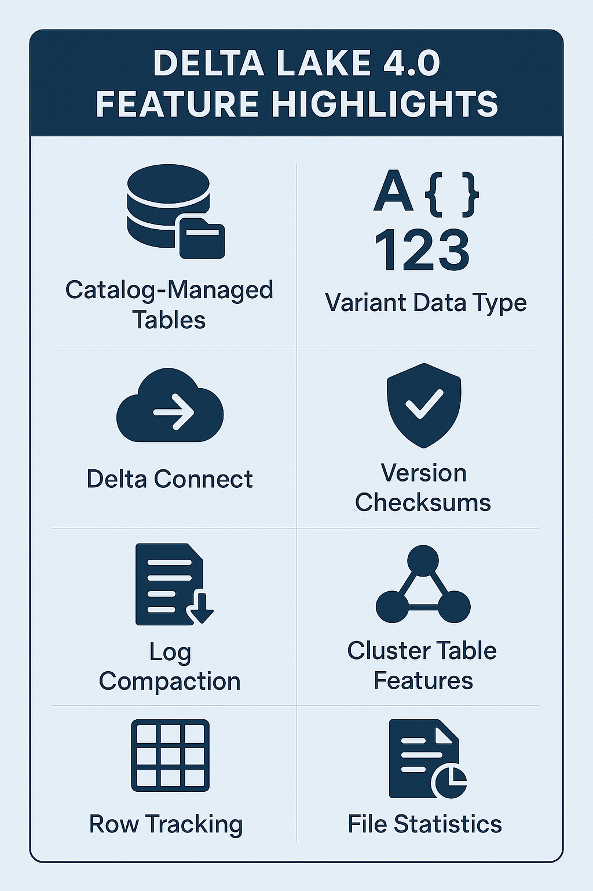

# Delta Lake 4.0: The Future of Open Data Lakehouses
We’re thrilled to announce the release of Delta Lake 4.0, a milestone release packed with powerful new features, performance optimizations, and foundational enhancements for the future of open data lakehouses. With new catalog integration, enhanced support for semi-structured data, smarter change tracking, and improved performance, this release delivers practical solutions to everyday data challenges. 

Let’s dive into the highlights!

# Community-Driven Release
Delta Lake 4.0 is the result of a true community effort, with contributions from an incredible group of contributors from around the world. More than 70 individuals came together to deliver the features in this release.

A big thank you to everyone who contributed code, ideas, feedback, and support. Your passion and commitment drive the Delta Lake project forward and help make the open data lakehouse vision a reality for organizations everywhere.

# Spark Integration: Laying the Groundwork for the Future

## Catalog-Managed Tables (Preview)
Delta Lake 4.0 introduces catalog-managed tables as a preview feature—a major shift that enables seamless integration with catalogs. While Delta Lake continues to support its popular “filesystem-managed” tables, catalog-managed tables are the foundation for  a whole new set of possibilities.

Expect more advanced features like enhanced observability, foreign key constraints, and multi-table / multi-statement transactions built on this foundation in future releases!

## Delta Connect: Extending Spark Connect
Delta Lake 4.0 brings Delta Connect: an extension that enables Delta-specific operations over the Spark Connect wire protocol. This means:
- Delta APIs everywhere: Access Delta Lake features from any Spark Connect client, including Python variants.
- Future-proofing: Server and client can evolve independently, making upgrades and integrations smoother than ever.

## Variant Data Type: Embracing Semi-Structured Data
The new variant data type is a game-changer for anyone dealing with semi-structured data (think JSON payloads with evolving schemas):
- Schema-on-read: No need to define a rigid schema up front. Extract structured data at query time.
- Efficient storage: Store dynamic payloads efficiently, with high-performance encoding.
- Shredded Variants (Preview): Extract specific columns from variant data and collect statistics for faster queries and file skipping.

This is a highly anticipated feature, developed with broad community support across many projects. Contributors from Apache Parquet, Apache Arrow, Apache Iceberg, Delta Lake, Apache Spark, and many more are coming together to deliver these features across the data ecosystem.

## Drop Feature: Streamlined Table Evolution
Previously, removing a feature from a Delta table required truncating the entire history—a major pain point. With Delta Lake 4.0, dropping features retains table history, making it easier to evolve your tables and enable compatibility with more clients.

# Kernel Enhancements: Performance and Advanced Table Features

## Version Checksums: Faster, More Reliable Table Reads
The Java kernel now supports reading and writing version checksums—think of them as mini-checkpoints for your Delta logs. Benefits include:
Accelerated log parsing: Quickly access the most current protocol and metadata.
Detailed metrics: File counts, table size, and data distribution histograms for stronger consistency and easier debugging.

## Log Compaction: Read & Write Support
Kernel now supports reading and writing log compaction files, further optimizing table scan performance and reducing overhead for large tables.

## Advanced Table Feature Support
This release contains some major improvements to the internal table features framework, which governs how table features are enabled in Delta Kernel. As part of this change, engines using Delta kernel can now write to tables with the deletionVectors, v2Checkpoint, and timestampNtz features enabled.

On top of this, two foundational new table features are now supported.
- Row Tracking allows tracking individual rows across inserts, updates, and deletes and enables highly efficient implementations for Change Data Feeds
- Clustered Tables support enables Kernel to define and update the clustering columns on a table, making clustering information available for Delta clustering implementations. 

## File Statistics: Enhanced File Skipping
Improved support for writing file statistics means even more effective file skipping—speeding up queries and reducing resource usage.

# Looking Ahead
Delta Lake 4.0 is a leap forward, setting the stage for even more powerful data warehouse features, greater flexibility, and blazing-fast performance. We’re excited to see what you build with it!

## Ready to get started?
Check out the Delta Lake 4.0 documentation and join the conversation in our community forums.