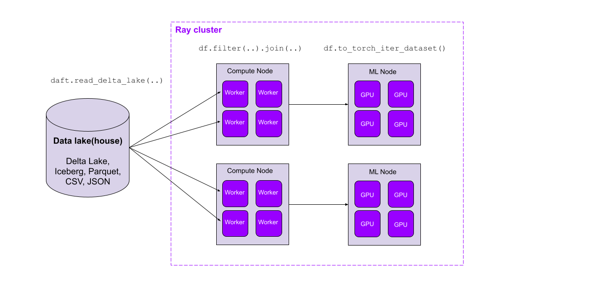
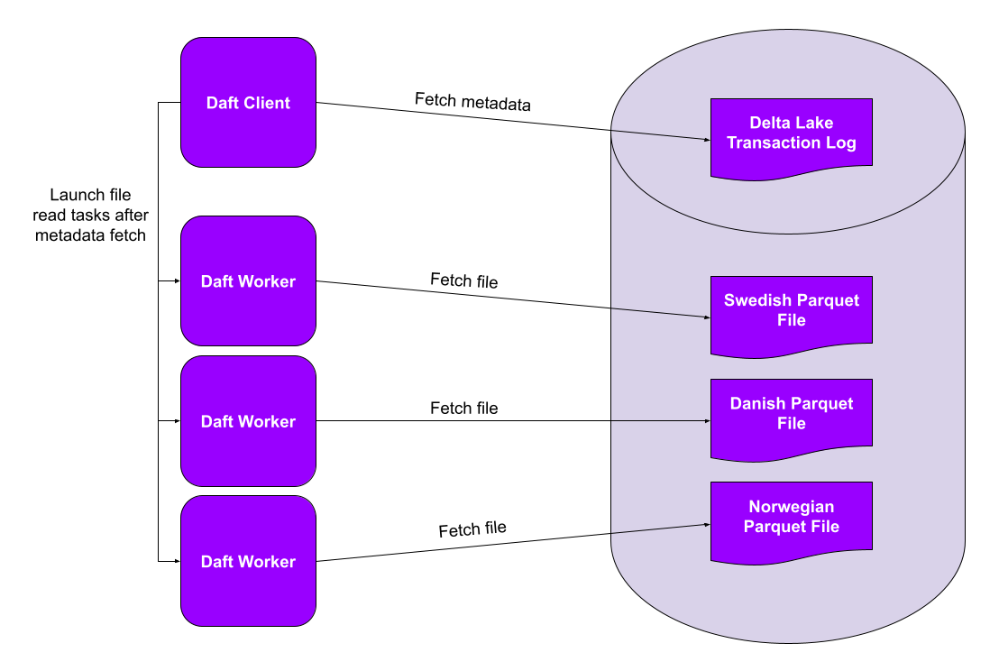
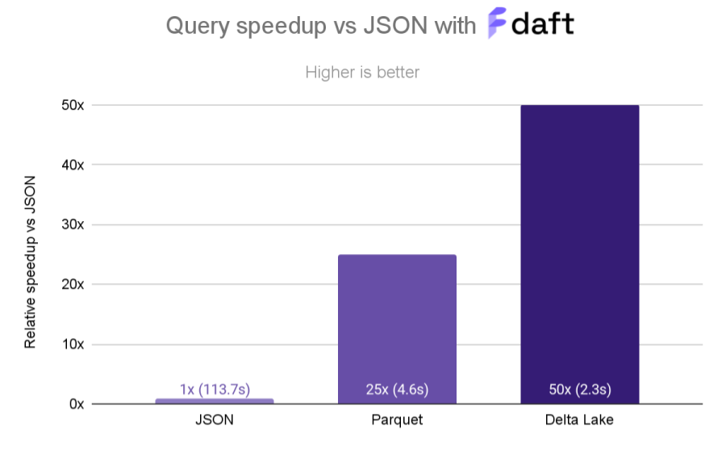
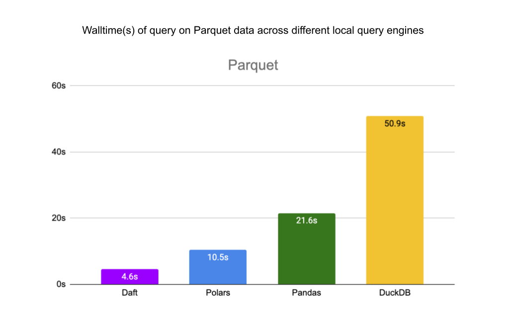
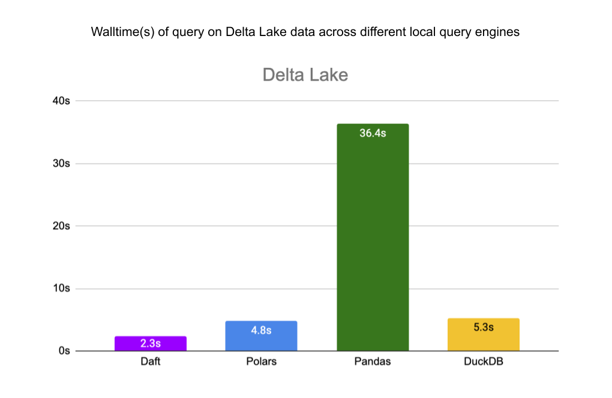

### Bridging Your Lakehouse and ML Pipeline with a Performant Distributed Query Engine

[Daft](https://www.getdaft.io/), a distributed dataframe library for Python, has recently added support for distributed and parallel reads of Delta Lake tables, enabling high-throughput reading from your lakehouse. Daft also implements performance-critical optimizations like automatic partition pruning and stats-based file pruning for filter predicates, skipping data that doesn’t need to be read.

## Reading Delta Lake with Daft

Daft is a framework for ETL, analytics, and ML/AI at scale. Its familiar Python dataframe API is built to exceed Spark in both performance and ease of use, while providing first-class integrations with modern data storage systems (such as data catalogs, lakes, and lakehouses) and ML training and inference pipelines.



[Delta Lake](https://delta.io/) is an open source ACID table storage framework that allows users to achieve a [lakehouse architecture](https://www.databricks.com/wp-content/uploads/2020/08/p975-armbrust.pdf) on top of cloud storage, providing scalable access to massive datasets while unifying their ETL, data warehousing, and ML data around one tabular file format. As a distributed dataframe library for the modern ML stack, Daft provides unified compute for Delta Lake’s unified storage.

To read Delta Lake tables with Daft, install Daft with the `getdaft[deltalake]` extra (this will also install the `deltalake` Python package):

```
pip install -U "getdaft[deltalake]"
```

You can create a local Delta Lake table from a pandas DataFrame with the newly installed `deltalake` library, which you can then read with Daft:

```python
# Create a local Delta Lake table.
from deltalake import write_deltalake
import pandas as pd

df = pd.DataFrame({
    "group": [1, 1, 2, 2],
    "num": [1, 2, 3, 4,
    "letter": ["a", "b", "c", "d"],
})

# This will write out two partitions, for group=1 and group=2.
write_deltalake("some-table", df, partition_by="group")
```

With just the table URI, you can read a Delta Lake table into a Daft DataFrame:

```python
# Read Delta Lake table into a Daft DataFrame.
import daft

df = daft.read_delta_lake("some-table")
```

This table can be read from your favorite cloud store, such as AWS S3, GCP GCS, or Azure Blob Storage. Under the hood, Daft’s highly performant parallel I/O layer reads the Delta Lake table’s underlying Parquet files:

```python
# Read Delta Lake table in S3 into a Daft DataFrame.
table_uri = (
    "s3://daft-public-datasets/red-pajamas/"
    "stackexchange-sample-north-germanic-deltalake"
)
df = daft.read_delta_lake(table_uri)
```

This [RedPajama](https://huggingface.co/datasets/togethercomputer/RedPajama-Data-1T) StackExchange subset contains only records in North Germanic languages (Swedish, Danish, and Norwegian). It consists of three Parquet files (one for each language) that Daft will read in parallel.



Together with Daft’s [full-featured dataframe API](https://www.getdaft.io/projects/docs/en/latest/user_guide/basic_concepts/dataframe_introduction.html) and first-class support for multimodal data, this parallel Delta Lake reader seamlessly marries the modern data stack with today’s ML pipelines. In the next section, we’ll see how Daft’s lakehouse-tailored query optimizations lead to order-of-magnitude performance improvements on large datasets.

## Data Skipping Optimizations—Read Only What You Need

The fastest read is a read elided! One of the significant benefits of a query engine with a smart optimizer is the ability to avoid materializing data that isn’t needed for the query. A common example is pushing filter predicates from a `df.where()` into file scans, where we drop records that don’t satisfy the predicate before having to fully materialize them in the in-memory table. With metadata-rich file formats like Parquet, which contain column statistics, we might be able to determine from the metadata that we don’t even need to read the file.

When paired with a lakehouse containing rich partitioning and column statistics metadata, we can take this even further, skipping files or even entire partitions of data. And the best part? This metadata is conveniently stored in the Delta Lake transaction log and can be fetched with a single network request, regardless of the number of files and partitions in the table. These data skipping optimizations can lead to order-of-magnitude performance improvements when reading large tables with a selective filter.

Let’s take the following simple query as an example, reading a 6 GB sample of the StackExchange subset of the [RedPajama](https://github.com/togethercomputer/RedPajama-Data) dataset and performing some light filtering on the data to return English data with a question score above 5:

```python
df = daft.read_delta_lake("s3://...")
df = df.where((df["language"] == "en") & (df["question_score"] > 5))
df.to_pandas()
```

We’ll compare the relative execution speed when reading data from three sources:

1. **Single JSON file:** The folks at [Together AI](https://www.together.ai/) provide a single [80 GB newline-delimited JSON file](https://data.together.xyz/redpajama-data-1T/v1.0.0/stackexchange/stackexchange.jsonl) for the entire StackExchange dataset. We took a 6 GB sample of this data and saved it as a single file in AWS S3:

   ```
   s3://daft-public-datasets/red-pajamas/stackexchange-sample-jsonl/stackexchange.jsonl
   ```

2. **Just Parquet files:** We then rewrote the single JSON file into Parquet files using Daft, without any partitioning or sorting:

   ```
   s3://daft-public-datasets/red-pajamas/stackexchange-sample-parquet-2/
   ```

3. **Delta Lake table:** Finally, we wrote the Parquet files in S3 into a Delta Lake table using the Delta Lake Python SDK, partitioned by the `"language"` column and z-ordered by the `"question_score"` column:

   ```
   s3://daft-public-datasets/red-pajamas/stackexchange-sample-deltalake-zorder/
   ```

When comparing to the baseline of reading the single JSON file, reading this data from the Parquet files is 25x faster, and reading the Delta Lake table is 50x faster.



**From JSON to Parquet: 113.7s vs. 4.6s**

As expected, reading from the JSON file takes (by far) the longest; it’s about 25x slower than reading from Parquet files! This is because Parquet’s optimizations for compression and parallel access via Parquet’s “row groups” allows Daft to access data with extremely high throughput.

**From Parquet to Delta Lake: 4.6s vs. 2.3s**

Storing the data in a Delta Lake table gives us a further 2x speedup over Parquet due to the Delta Lake table’s partitioning and z-ordering. Daft is able to leverage the data layout in Delta Lake to efficiently skip reading data, ultimately touching only 15% of the files in storage for this query.

We can use `df.explain()` to see what optimizations Daft is performing under the hood when it queries Delta Lake:

```python
df.explain(True)

# == Unoptimized Logical Plan ==
# * Filter: [col(language) == lit("en")] & [col(question_score) > lit(5)]
# |
# * PythonScanOperator: DeltaLakeScanOperator(None)
# |   ...

# == Optimized Logical Plan ==
# * PythonScanOperator: DeltaLakeScanOperator(None)
# |   Partitioning keys = [PartitionField(language#Utf8)]
# |   Filter pushdown = col(question_score) > lit(5)
# |   Partition Filter = col(language) == lit("en")
# |   ...
```

When executing this query with Delta Lake, Daft pushes the `Filter` plan node into the `DeltaLakeScanOperator`, which is then able to leverage this information to ensure only the required data is read:

- Daft applies the `Filter` to each file that it reads, making use of file-level metadata when available to perform the filtering. Since the data is z-ordered (sort-clustered) by the `"question_score"` column, this data will be tightly clustered on the filter column, and Daft can easily skip entire chunks of files/row groups that do not match the `col(question_score) > lit(5)` filter.
- Our Delta Lake table is partitioned by the `"language"` column, which allows Daft to skip reading entire partitions that do not match the` col("language") == "en"` filter.

## Local Benchmarks

We also benchmarked Daft’s reads from the same files in S3 against other local query engines: [pandas](https://pandas.pydata.org/docs/index.html#), [Polars](https://pola.rs/) and [DuckDB](https://duckdb.org/). Daft’s native integration with Delta Lake, S3, and Parquet allows it to outperform these libraries by a significant margin.

All benchmarks were performed on an AWS EC2 c7g.4xlarge machine in the same region as the buckets that contain our data (us-west-2). This machine has access to 16 CPUs, 128 GB of memory, and 10 Gbps network bandwidth. See this [GitHub gist](https://gist.github.com/jaychia/039bd724e351aac449adad75ba791cd7) for the local benchmarking code, and note that we used the following library versions:

- `getdaft[deltalake]==0.2.19`
- `polars[deltalake]==0.20.15`
- `pandas==2.2.1`
- `duckdb==0.10.0`
- `deltalake==0.16.0`
- `pyarrow==15.0.2`

For the single JSON file, Daft is 3.5x faster than Polars and about as fast as DuckDB. Pandas ran out of memory before completing the query.


For the Parquet files, Daft is 2x faster than Polars, 4.7x faster than Pandas, and 11x faster than DuckDB.



Finally, for the Delta Lake table, Daft is 2x faster than Polars, 15.8x faster than Pandas, and 2.3x faster than DuckDB.



## Conclusion

Daft enables fast and easy-to-use parallel reading from Delta Lake, with data skipping optimizations that lead to order-of-magnitude performance improvements on massive datasets. We showed that on a single machine, Daft’s parallel reader outperforms **pandas by 15.8x**, **DuckDB by 2.3x**, and **Polars by 2x** for partitioned and z-ordered Delta Lake tables.

Daft’s full-featured dataframe API and first-class support for multimodal data make it possible to seamlessly read data from your catalogs and data lake(house)s, transform it into ML-ready data, and ingest it directly into your ML pipelines, all on the same cluster and without intermediate persistence to storage. Modern data and ML stacks, unite!

## Roadmap

In future blog posts, we’ll dive into Daft’s ability to read massive Delta Lake tables that can’t fit onto a single machine and how Daft compares to other distributed query engines. We’ll also go over some features that have already landed, such as the ability for Daft to read Delta Lake tables from [Databricks Unity Catalog](https://www.databricks.com/product/unity-catalog) and [AWS Glue Data Catalog](https://docs.aws.amazon.com/glue/latest/dg/catalog-and-crawler.html).

We have some exciting new features around Delta Lake in the pipeline too. These include:

- Read support for [deletion vectors](https://docs.delta.io/latest/delta-deletion-vectors.html) ([issue](https://github.com/Eventual-Inc/Daft/issues/1954))
- Read support for [column mappings](https://docs.delta.io/latest/delta-column-mapping.html) ([issue](https://github.com/Eventual-Inc/Daft/issues/1955))
- Writing new Delta Lake tables ([issue](https://github.com/Eventual-Inc/Daft/issues/1967), [in-progress PR](https://github.com/Eventual-Inc/Daft/pull/2073))
- Writing back to an existing table with appends, overwrites, upserts, or deletes ([issue](https://github.com/Eventual-Inc/Daft/issues/1968))

Please let us know on the linked issues if you would like to see any of these features, and [join our Slack community](https://github.com/Eventual-Inc/Daft/issues/1968) to get involved.

P.S., if you’re interested in exploring the intersection of modern data and ML stacks, our team is [hiring](https://www.ycombinator.com/companies/eventual/jobs)! :)
