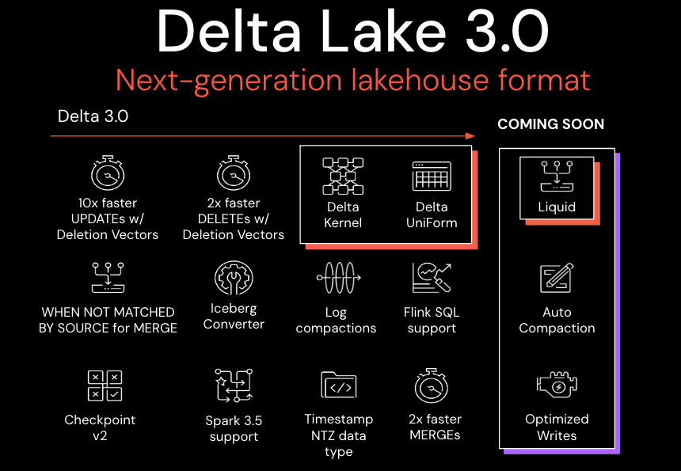
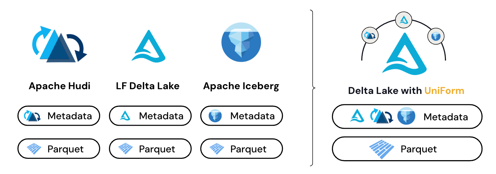
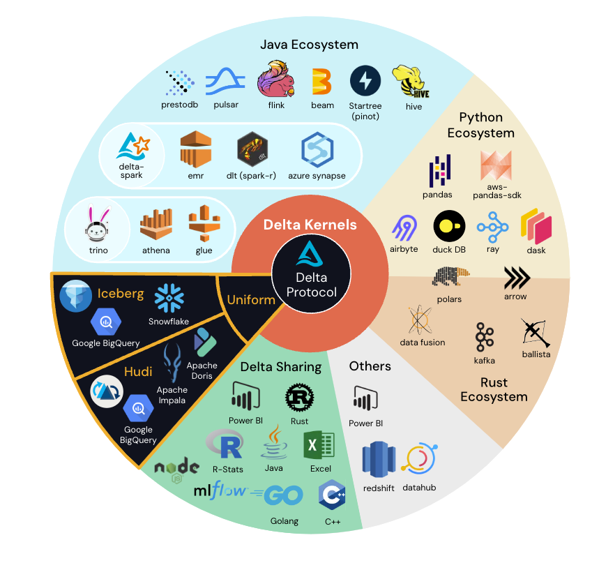
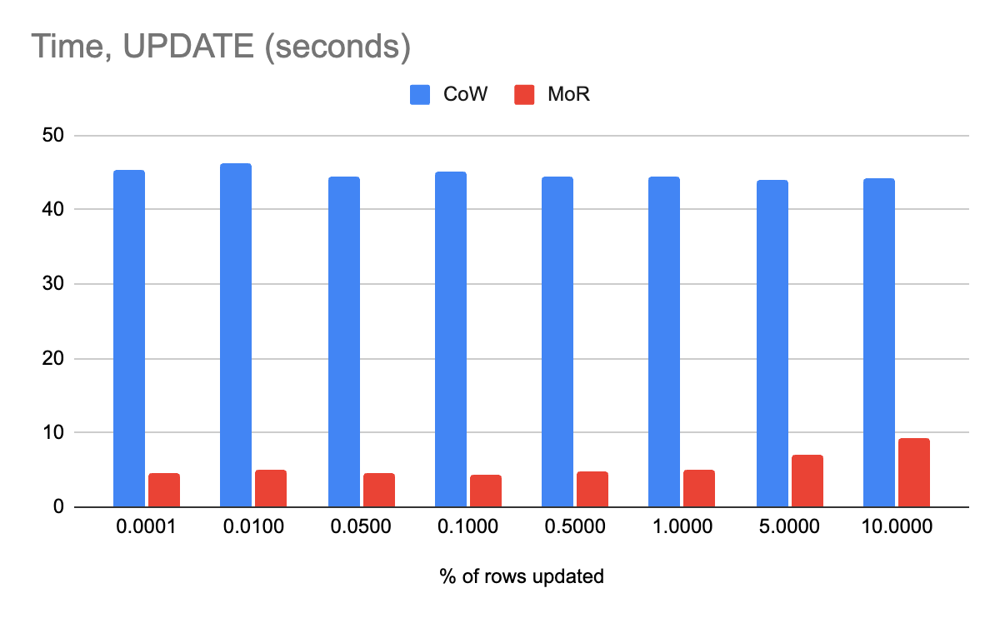

We are pleased to announce the release of Delta Lake 3.0 ([release notes](https://github.com/delta-io/delta/releases/tag/v3.0.0)) on [Apache Spark 3.5](https://spark.apache.org/releases/spark-release-3-5-0.html), with features that make it easier to use and standardize on Delta Lake.

This release includes hundreds of improvements and bug fixes, but we'd like to call out the following:

- [Delta UniForm](#uniform): expands compatibility with all engines,
- [Delta Kernel](#kernel): makes building and maintaining Delta connectors simpler,
- Faster [DML Statements](#merge-update-delete)

Delta Lake 3.0 marks a collective commitment to making Delta Lake interoperable across formats, easier to work with, and more performant.

<Info title="" level="info">
The Linux Foundation applauds the release of Delta Lake 3.0, which includes Delta Kernel and UniForm, showcasing the continued advancement and innovation in the open-source ecosystem. As the pace of data processing accelerates, the release of Delta Lake 3.0 demonstrates the critical importance of community-driven projects that prioritize scalability, reliability, and interoperability for the future of technology.

> – Jim Zemlin, Executive Director of the Linux Foundation

</Info>

## What’s new in Delta Lake 3.0?

Delta Lake has been rapidly introducing features since Delta Lake 2.0. This blog will review a few of these that are going to have an impact on performance and interoperability.



### <a id="uniform"></a> Delta Universal Format (Delta UniForm)

Like Delta Lake, Apache Iceberg and Apache Hudi include metadata on top of Parquet data. Until the release of Delta UniForm, the primary way to operate across table formats was to copy and/or convert the metadata. While this approach is viable, it has a significant drawback in that every change to the Parquet data or one of the lakehouse formats needs to trigger an updated conversion.

[Delta UniForm](https://github.com/delta-io/delta/commit/9b50cd206004ae28105846eee9d910f39019ab8b) automatically generates the metadata for Iceberg alongside Delta Lake, against a single copy of their shared underlying Parquet data. Delta UniForm offers a live view of the data for all readers, without needing additional data copies or conversions.



To set up a Delta UniForm table, all you need to do is set the table property:

```
CREATE TABLE main.default.table_name (msg STRING)
TBLPROPERTIES('delta.universalFormat.enabledFormats' = 'iceberg');
```

Once a table has been enabled as a Delta UniForm table, any table modification triggers the asynchronous generation of Iceberg metadata. Any Iceberg reader can then consume the data without further modifications, provided that client is written to the open source Iceberg specification. Support for Hive Metastore is also [available](https://github.com/delta-io/delta/commit/01fee68c).

### <a id="kernel"></a> Delta Kernel

The Delta Lake connector ecosystem has seen drastic growth over the last few years. The popularity and success of the project is a cause for celebration, and yet we recognize that this has led to some challenges for developers: variability of performance and correctness across connectors, and a longer time to adoption of new protocol features.



[Delta Kernel](https://github.com/delta-io/delta/tree/master/kernel), introduced at [Data+AI Summit 2023](https://www.databricks.com/dataaisummit/session/delta-kernel-simplifying-building-connectors-delta/), abstracts out the Delta Lake protocol details behind simple core library APIs. This simplification means that developers can build a connector using stable API calls, and Kernel applies the protocol-specific logic to return the correct row data.

For more information on how to use Kernel in a standalone Java program or in a distributed processing connector, please refer to the [user guide](https://github.com/delta-io/delta/blob/branch-3.0/kernel/USER_GUIDE.md).

### <a id="merge-update-delete"></a> MERGE, UPDATE, and DELETE performance enhancements

#### Merge

Enhancements to the `MERGE` command were incorporated in [Delta Lake PR 1827](https://github.com/delta-io/delta/issues/1827). The key improvements include:

- Data Skipping for `MATCHED`-Only Merges
- Enhanced Handling of `INSERT`-Only Merges
- Efficient Row Change Writing
- Efficient Metrics Counter

You can learn more about using `MERGE` by reading the [Merge — Delta Lake documentation](https://docs.delta.io/latest/delta-update.html), watching the [Tech Talk | Diving into Delta Lake Part 3: How do DELETE, UPDATE, and MERGE work](https://www.youtube.com/watch?v=7ewmcdrylsA) video on YouTube, or by reviewing our earlier blog [Delta Lake Merge](https://delta.io/blog/2023-02-14-delta-lake-merge/).

#### Update

The `UPDATE` command now supports writing [Deletion Vectors](https://docs.delta.io/latest/delta-deletion-vectors.html#enable-deletion-vectors) (DVs). This will bring up to 10x speed-up for `UPDATE` operations on Delta tables, especially point updates. Refer to [Delta Lake PR 1942](https://github.com/delta-io/delta/pull/1942) for more details.



Currently this feature must be enabled manually:

```
SET spark.databricks.delta.update.deletionVectors.persistent = 'true;
UPDATE table_name SET id = -1 WHERE id % 2 = 0;
```

#### Delete

An [improvement](https://github.com/delta-io/delta/commit/fc39f78d) to the `FILE_PATH` canonicalization logic reduces expensive `Path.toUri.toString` calls for each row in a table. Instead, canonicalized paths are now cached, which results in a 2x or more performance improvement for `DELETE` commands when Deletion Vectors have been enabled.

### Additional Features in Delta Lake 3.0

- A new [checkpoint format](#bookmark=id.ttt3bvou4dru) (v2) solves many of the existing reliability issues and limitations of the v1 checkpoint format and opens up doors for more optimization in future. Refer to [Delta Lake PR 1793](https://github.com/delta-io/delta/issues/1793) for more details.
- Support for [zero-copy convert to Delta from Iceberg](https://docs.delta.io/3.0.0/delta-utility.html#convert-an-iceberg-table-to-a-delta-table) tables on Apache Spark 3.5. CONVERT TO DELTA generates a Delta table in the same location without rewriting Parquet files.
- [Log compaction files](https://github.com/delta-io/delta/commit/5d43f1db5975dca31da29f714b1a155aa4367aee) have been added to the Delta Protocol Specification, which may reduce the frequency of Delta checkpoints. Read support for log compaction files is added in Delta Spark.

This release is full of even more features. Please see the [release notes](https://github.com/delta-io/delta/releases/tag/v3.0.0) for the full list.

## Credits

Thank you to everyone involved with the release of Delta Lake 3.0:

Adam Binford, Ahir Reddy, Ala Luszczak, Alex, Allen Reese, Allison Portis, Ami Oka, Andreas Chatzistergiou, Animesh Kashyap, Anonymous, Antoine Amend, Bart Samwel, Bo Gao, Boyang Jerry Peng, Burak Yavuz, CabbageCollector, Carmen Kwan, ChengJi-db, Christopher Watford, Christos Stavrakakis, Costas Zarifis, Denny Lee, Desmond Cheong, Dhruv Arya, Eric Maynard, Eric Ogren, Felipe Pessoto, Feng Zhu, Fredrik Klauss, Gengliang Wang, Gerhard Brueckl, Gopi Krishna Madabhushi, Grzegorz Kołakowski, Hang Jia, Hao Jiang, Herivelton Andreassa, Herman van Hovell, Jacek Laskowski, Jackie Zhang, Jiaan Geng, Jiaheng Tang, Jiawei Bao, Jing Wang, Johan Lasperas, Jonas Irgens Kylling, Jungtaek Lim, Junyong Lee, K.I. (Dennis) Jung, Kam Cheung Ting, Krzysztof Chmielewski, Lars Kroll, Lin Ma, Lin Zhou, Luca Menichetti, Lukas Rupprecht, Martin Grund, Min Yang, Ming DAI, Mohamed Zait, Neil Ramaswamy, Ole Sasse, Olivier NOUGUIER, Pablo Flores, Paddy Xu, Patrick Pichler, Paweł Kubit, Prakhar Jain, Pulkit Singhal, RunyaoChen, Ryan Johnson, Sabir Akhadov, Satya Valluri, Scott Sandre, Shixiong Zhu, Siying Dong, Son, Tathagata Das, Terry Kim, Tom van Bussel, Venki Korukanti, Wenchen Fan, Xinyi, Yann Byron, Yaohua Zhao, Yijia Cui, Yuhong Chen, Yuming Wang, Yuya Ebihara, Zhen Li, aokolnychyi, gurunath, jintao shen, maryannxue, noelo, panbingkun, windpiger, wwang-talend, sherlockbeard

We’d also like to extend special things to Scott Sandre for his contribution.

And, as always, a huge thank you to the contributions from our open-source [community](https://delta.io/community).

## Join the community today!

We are always excited to work with our current contributor community and welcome new members. If you’re interested in helping the Delta Lake project, please join our community through any of our forums, including [GitHub](https://go.delta.io/github), [Slack](https://go.delta.io/slack), [X](https://twitter.com/DeltaLakeOSS), [LinkedIn](https://go.delta.io/linkedin), [YouTube](https://go.delta.io/youtube), and [Google Groups](https://go.delta.io/groups).
