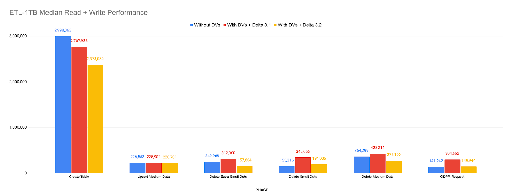
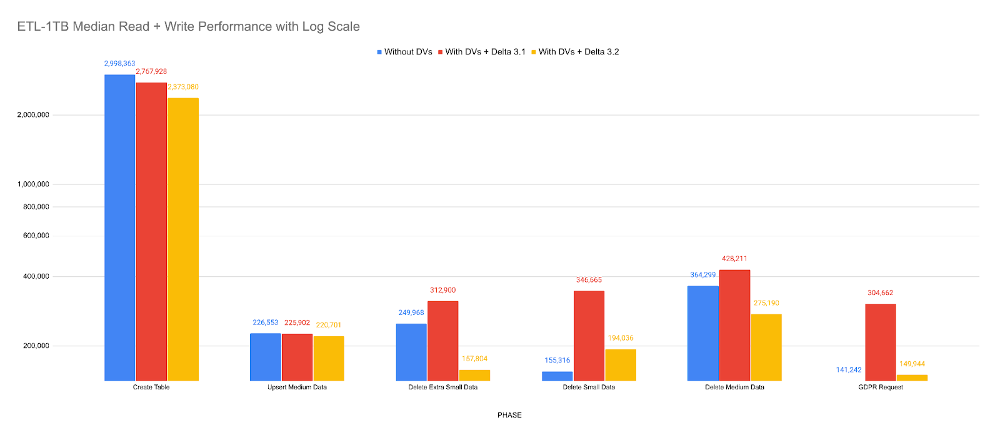

We are pleased to announce the release of Delta Lake 3.2 ([release notes](https://github.com/delta-io/delta/releases/tag/v3.2.0)) on [Apache Spark 3.5](https://spark.apache.org/releases/spark-release-3-5-0.html), with features that improve the performance and interoperability of Delta Lake.

This release includes many improvements and bug fixes, but we'd like to highlight the following:

- [Liquid clustering](#liquid-clustering): A more performant, flexible table layout
- [Hudi write support in UniForm](#hudi-write-support-in-uniform): Expansion of the popular UniForm feature to Hudi
- [Type widening](#type-widening): An easier way to handle schema updates when data changes
- [Vacuum inventory support](#vacuum-inventory-support): Faster VACUUM operations for large tables
- [Delta Kernel updates](#delta-kernel-updates): Time travel support, metadata read improvements, additional protocol support for the connector ecosystem and preview version of APIs to create and append data to Delta tables.
- [Deletion Vectors read performance improvements](#deletion-vectors-read-performance-improvements): Faster Deletion Vectors read performance

## What’s new in Delta Lake 3.2?

Building on the features released in Delta Lake 3.0 and 3.1, Delta Lake 3.2 introduces a host of performance enhancements and optimizations.

### Liquid clustering

We are pleased to announce the GA of [Liquid Clustering](https://docs.delta.io/3.1.0/delta-clustering.html) in Delta Lake 3.2.0. The key changes are as follows:

- Support for ZCube-based incremental clustering: A ZCube is a group of files with Hilbert-clustered data produced by the same OPTIMIZE command. Already clustered files are tagged in the file metadata (that is, in the Delta log) by ZCube ID, and new `OPTIMIZE` commands will only rewrite unclustered files. This significantly limits the write amplification.
- Support for ALTER TABLE … CLUSTER BY to change clustering columns
- Support for DESCRIBE DETAIL to inspect the clustering columns
- Support for DeltaTable [clusterBy API](<https://docs.delta.io/3.2.0/api/scala/spark/io/delta/tables/DeltaTableBuilder.html#clusterBy(colNames:String*):io.delta.tables.DeltaTableBuilder>) in Scala and Python.

Liquid Clustering is fully pluggable in Delta Lake, allowing the open-source community to contribute to other clustering algorithms. The default technique in Liquid Clustering uses [Hilbert Curve](https://en.wikipedia.org/wiki/Hilbert_curve), a continuous fractal space-filling curve as a multi-dimensional clustering technique, which significantly improves data skipping over `ZORDER`. We encourage and are looking for contributions of different clustering techniques.

### Hudi write support in UniForm

[Delta Universal Format](https://docs.delta.io/latest/delta-uniform.html) enables you to write a single copy of your data and make it available to any engine that supports [Delta Lake](https://delta.io/), [Iceberg](https://iceberg.apache.org/), and now in Delta 3.2, [Hudi](https://hudi.apache.org/). Delta automatically generates metadata needed for Hudi clients, so users don’t have to manage manual conversions to work across ecosystems. Now with Hudi support, Delta is the universal format, unifying all three open table formats.

### Type Widening

We are excited to introduce the Preview of [Type Widening](https://docs.delta.io/latest/delta-type-widening.html) in Delta 3.2, which addresses one of the significant challenges in ETL processes—continuously evolving data schemas. This new feature allows the widening of data types, such as evolving a column from INT to LONG without rewriting data. Type changes can be applied manually using the ALTER TABLE CHANGE COLUMN TYPE command or automatically using schema evolution in INSERT and MERGE operations. By enabling this, Delta Lake not only supports [schema evolution](https://delta.io/blog/2023-02-08-delta-lake-schema-evolution/) but also ensures seamless data ingestion and processing by automatically upcasting data types during reads.

### Vacuum inventory support

Delta Lake 3.2 introduces [vacuum inventory support](https://docs.delta.io/3.2.0/delta-utility.html#inventory-table), a feature that allows users to specify an inventory table in a VACUUM command. By utilizing an inventory table, the VACUUM operation selectively processes only the files listed, bypassing the labor-intensive task of scanning the entire directory of a table. For large tables in particular, the difference in performance can be dramatic, making data management tasks both more efficient and cost-effective. Stay tuned for a deep dive blog post on the origin of this feature, coming soon.

### Delta Kernel updates

The Delta Kernel project is a set of Java libraries ([Rust](https://github.com/delta-incubator/delta-kernel-rs) will be coming soon!) for building Delta connectors that can read (and, soon, write to) Delta tables without the need to understand the [Delta protocol details](https://github.com/delta-io/delta/blob/master/PROTOCOL.md)). In this release, we improved the read support to make it production-ready by adding numerous performance improvements, additional functionality, improved protocol support, and fixing any rough edges.

- Support for time travel. Now you can read a table snapshot at a [version id](https://docs.delta.io/3.2.0/api/java/kernel/io/delta/kernel/Table.html#getSnapshotAsOfVersion-io.delta.kernel.client.TableClient-long-) or snapshot at a [timestamp](https://docs.delta.io/3.2.0/api/java/kernel/io/delta/kernel/Table.html#getSnapshotAsOfTimestamp-io.delta.kernel.client.TableClient-long-).
- Improved Delta protocol support.
  - [Support](https://github.com/delta-io/delta/pull/2826) for reading tables with <code>[checkpoint v2](https://github.com/delta-io/delta/blob/master/PROTOCOL.md#v2-checkpoint-table-feature)</code>.
  - Support for reading tables with <code>timestamp</code> partition type data column.
  - [Support](https://github.com/delta-io/delta/pull/2855) for reading tables with column data type <code>[timestamp_ntz](https://github.com/delta-io/delta/blob/master/PROTOCOL.md#timestamp-without-timezone-timestampntz)</code>.
- Improved table metadata read performance and reliability on very large tables with millions of files
  - Improved [checkpoint reading latency](https://github.com/delta-io/delta/pull/2872) by pushing the partition predicate to the checkpoint Parquet reader to minimize reading number of checkpoint files read.
  - Improved state reconstruction latency by [using](https://github.com/delta-io/delta/pull/2770) <code>LogStore</code>s from <code>[delta-storage](https://github.com/delta-io/delta/blob/master/storage/src/main/java/io/delta/storage/LogStore.java)</code> module for faster <code>listFrom</code> calls.
  - [Retry](https://github.com/delta-io/delta/pull/2812) loading the <code>\_last_checkpoint</code> checkpoint in case of transient failures. Loading the last checkpoint info from this file helps construct the Delta table state faster.
  - [Optimization](https://github.com/delta-io/delta/pull/2817) to minimize the number of listing calls to object store when trying to find a last checkpoint at or before a version.

In this release, we also added a <strong><em>preview version</em></strong> of APIs that allows connectors to:

- Create Delta tables
- Insert data into Delta tables. Current support is for blind appends only.
- Idempotently update the Delta table.

The above functionality is available both for the partitioned and unpartitioned tables. Refer to the [examples](https://github.com/delta-io/delta/tree/branch-3.2/kernel/examples) for sample connector code to create and blind append data to the tables. We are still developing and evolving these APIs. Please give it a try and let us know your feedback.

### Deletion Vectors read performance improvements

We continue to improve the performance of merge-on-read with Deletion Vectors (DV).

- We [improved](https://github.com/delta-io/delta/commit/be7183bef85feaebfc928d5f291c5a90246cde87) stability by [removing broadcasting of DV information to executors](https://github.com/delta-io/delta/commit/be7183bef85feaebfc928d5f291c5a90246cde87), which reduces drivers’ memory consumption, and prevents potential Driver OOM for very large Delta tables like 1TB+. This work also improves performance by saving us fixed broadcasting overhead in reading small Delta Tables.
- We improved the performance of DV reads with filter queries by enabling [predicate pushdown and file splitting](https://github.com/delta-io/delta/pull/2982).
- We benchmarked these improvements using [a real world workload](https://www.brooklyndata.co/ideas/2022/11/28/benchmarking-open-table-formats) that uses a combination.

### Additional features

This release includes even more features, including the improvements below. Please see the full release notes for more information on all the exciting features and instructions on how to use the release candidate artifacts.

- [Support for Vacuum Writer Protocol Check](https://github.com/delta-io/delta/commit/2e197f130765d91f201b6b649f30190a44304b29): Delta Spark can now support `vacuumProtocolCheck` ReaderWriter feature which ensures consistent application of reader and writer protocol checks during `VACUUM` operations, addressing potential protocol discrepancies and mitigating the risk of data corruption due to skipped writer checks.
- [In-Commit Timestamp Preview](https://github.com/delta-io/delta/commit/b15a2c97432c8892f986c1526ceb2c3f63ed5d2c): When enabled, this [preview feature](https://github.com/delta-io/delta/issues/2532) persists monotonically increasing timestamps within Delta commits, ensuring they are not affected by file operations. When enabled, time travel queries will yield consistent results, even if the table directory is relocated.

## Credits

Thank you to everyone involved with the release of Delta Lake 3.2:

Adam Binford, Ala Luszczak, Allison Portis, Ami Oka, Andreas Chatzistergiou, Arun Ravi M V, Babatunde Micheal Okutubo, Bo Gao, Carmen Kwan, Chirag Singh, Chloe Xia, Christos Stavrakakis, Cindy Jiang, Costas Zarifis, Daniel Tenedorio, Davin Tjong, Dhruv Arya, Felipe Pessoto, Fred Storage Liu, Fredrik Klauss, Gabriel Russo, Hao Jiang, Hyukjin Kwon, Ian Streeter, Jason Teoh, Jiaheng Tang, Jing Zhan, Jintian Liang, Johan Lasperas, Jonas Irgens Kylling, Juliusz Sompolski, Kaiqi Jin, Lars Kroll, Lin Zhou, Miles Cole, Nick Lanham, Ole Sasse, Paddy Xu, Prakhar Jain, Rachel Bushrian, Rajesh Parangi, Renan Tomazoni Pinzon, Sabir Akhadov, Scott Sandre, Simon Dahlbacka, Sumeet Varma, Tai Le, Tathagata Das, Terry Kim, Thang Long Vu, Tim Brown, Tom van Bussel, Venki Korukanti, Wei Luo, Wenchen Fan, Xupeng Li, Yousof Hosny, Gene Pang, Jintao Shen, Kam Cheung Ting, panbingkun, ram-seek, Sabir Akhadov, sokolat, tangjiafu

We’d also like to extend special thanks to Scott Sandre for his contributions in making the release.

And, as always, a huge thank you to the contributions from our open source [community](delta.io/community).

## Join the community today!

We are always excited to work with our current contributor community and welcome new members. If you’re interested in helping the Delta Lake project, please take a look at the project [roadmap](https://delta.io/roadmap/) and join our community through any of our forums, including [GitHub](https://go.delta.io/github), [Slack](https://go.delta.io/slack), [X](https://twitter.com/DeltaLakeOSS), [LinkedIn](https://go.delta.io/linkedin), [YouTube](https://go.delta.io/youtube), and [Google Groups](https://go.delta.io/groups).
