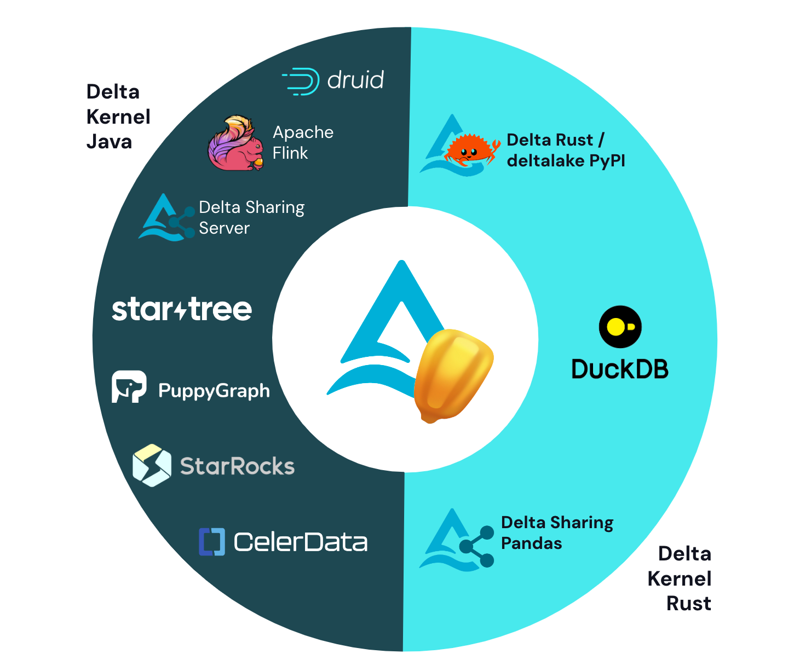

We are pleased to announce the preview release of Delta Lake 4.0 ([release notes](https://github.com/delta-io/delta/releases/tag/v4.0.0rc1) on [Apache Spark™ 4.0](https://spark.apache.org/news/spark-4.0.0-preview1.html) Preview. The individual features are too many to enumerate here, but we’ll highlight the notable additions, along with other news from the Delta Lake community.

## What’s new in Delta Lake 4.0?

Delta Lake 4.0 is the biggest release to date, with features for reliability, performance, and ease of use.

**Reliability and performance features**: Delta Lake is the fastest storage format for the data lakehouse and is trusted by more than 60% of the Fortune 500. Additional features are being added to Delta to make it easier to debug applications, manage transactions across your data systems, and to handle different kinds of data.

- [Delta Connect](#delta-connect-available-in-preview) (preview): Support in Delta Lake for the new client-server architecture in Spark.
- [Coordinated Commits](#coordinated-commits-available-in-preview) (preview): Multi-cloud and multi-engine writes, without relying on the filesystem to coordinate commits.
- [Open Variant type](#variant-type-available-in-preview) (preview): Semi-structured data support that is flexible for changing schemas, with high performance.

**Convenience features**: Lakehouses need to adapt to changing data and types. Delta Lake is flexible and can accommodate data types that expand over time, with convenience features that make it easier to work with your data.

- [Type widening](#type-widening-available-in-preview) (preview): Accommodate changing data sizes without having to rewrite tables.
- [Identity Columns (coming soon)](#identity-columns-coming-soon): Automatically generated unique column IDs for use as reference keys.
- [Collations (coming soon)](#collations-coming-soon): Specify how values are ordered and compared in a table.

The Delta Lake ecosystem also continues to grow rapidly. We are highlighting three key areas of the ecosystem:

- [Delta Lake UniForm](#uniform-ga): With Delta 3.2 on Spark 3.5, UniForm now supports Apache Hudi and Apache Iceberg
- [Delta Kernel](#delta-kernel) project has significantly expanded the Delta Lake connector ecosystem with latest connnectors for DuckDB, Apache Druid, Apache Flink, and Delta Sharing, all built on Kernel
- [delta-rs 1.0](#delta-rs-10): The community-based Rust implementation of Delta Lake

### Reliability and Performance

Delta Lake is the fastest table format for the lakehouse, and now it’s getting even more reliable. With Delta Lake’s support for Spark Connect, it will be easier to control memory usage and version mismatches in data applications. The client/server architecture is easy to debug and provides performance observability.

#### Delta Connect (available in Preview)

Delta Connect adds Spark Connect support to Delta Lake for Apache Spark. [Spark Connect](https://spark.apache.org/docs/latest/spark-connect-overview.html) is a new initiative that adds a decoupled client-server infrastructure that allows remote connectivity from Spark from everywhere. Delta Connect allows all Delta Lake operations to work in your application running as a client connected to the Spark server. For the preview, users can do Delta table scan over Spark Connect.

Delta Connect is expected to bring the same benefits as Spark Connect. These benefits are:

1. It’s easier to upgrade to more recent versions of Spark and Delta, as the client interface is completely decoupled from the server.
2. Simpler integration of Spark and Delta with developer tooling.
3. IDEs no longer have to integrate with the full Spark and Delta implementation, and instead can integrate with a thin client. Support for languages other than Java/Scala and Python.
4. Clients "merely" have to generate Protocol Buffers and therefore become simpler to implement. Spark and Delta will become more stable, as user code is no longer running in the same JVM as Spark's driver.
5. Remote connectivity. Code can now run anywhere, as there is a gRPC layer between the user interface and the driver.

#### Coordinated Commits (available in Preview)

In addition, Delta Lake is moving toward support for multi-statement and multi-table transactions, with Coordinated Commits, a centralized commit service that coordinates writes to Delta tables.

The updated Delta Lake commit protocol enables reliable multi-cloud and multi-engine writes that do not rely on the filesystem to provide commit atomicity. Users can designate a “Commit Coordinator” for their Delta tables which will manage all writes to the table. The “Commit Coordinator” coordinates concurrent writes from different clusters and ensures that readers get the freshest table version. This release comes with a DynamoDB Commit Coordinator. This change also paves the way for multi-statement and multi-table transactions by introducing a centralized coordinator for writes to a Delta table. Stay tuned for more exciting updates in the coming months!

#### Variant Type (available in Preview)

Delta Lake is also getting more data types to support additional use cases. Many lakehouse use cases use semi-structured data, including IoT telemetry data, marketing analytics, etc. Before VARIANT, you were limited in how you could store semi-structured data. The most flexible option was to store JSON in single-column as strings, but that incurred a performance hit on reads. Historically, to retain performance, you’d have to enforce strict schemas using structs and develop additional processing steps for handling updates to the schema.

Some proprietary data warehouses have developed support for a variant data type for these use cases, and now we’re introducing VARIANT in Delta Lake. [Variant](https://github.com/delta-io/delta/blob/master/protocol_rfcs/variant-type.md) is flexible, so you don’t have to define an explicit schema, and it performs significantly better than string-based solutions.

### Ease of use

Lakehouses need to adapt to changing data and types. Delta Lake is flexible and can accommodate semi-structured data and column data types that expand over time. Delta Lake also provides a flexible data layout that adapts to changing query patterns and supports changing clustering keys in place without requiring time-consuming and cost-intensive rewrites.

#### Type Widening (available in Preview)

The preview of [Type Widening](https://docs.delta.io/latest/delta-type-widening.html) introduced in Delta 3.2 now supports more type changes with Delta 4.0. This feature allows the widening of data types, such as evolving a column from INT to LONG without rewriting data. Type changes can be applied manually using the ALTER TABLE CHANGE COLUMN TYPE command or automatically using schema evolution in INSERT and MERGE operations. By enabling this, Delta Lake not only supports data type changes with schema evolution but also ensures seamless data ingestion and processing by automatically upcasting data types during reads.

#### Identity Columns (coming soon)

Identity columns are columns in a table that automatically generate a unique ID for each new row of the table. A long-time staple of data warehousing workloads, they commonly serve as primary and foreign keys when modeling data. Coming soon, Delta Lake 4.0 will support automatically creating identity columns with unique, auto-incrementing ID numbers for each new row. This dramatically simplifies data modeling, and avoids the need to roll manual, brittle solutions.

#### Collations (coming soon)

Collations specify how values are ordered and compared within a table. They’re used across a wide variety of cases, including specifying whether comparisons should be case-sensitive, or defining the proper sorting and searching across language or cultural contexts. Coming soon, you’ll be able to specify the collation for columns in your Delta Lake tables, allowing query engines like Spark to perform the correct sorting and comparison behaviors.

## Delta Ecosystem Update

#### UniForm GA

[Delta Lake Universal Format](https://docs.delta.io/latest/delta-uniform.html), or UniForm, has been in heavy use since it was first announced in Delta Lake 3.0. The Delta 3.2 release of UniForm includes support for Apache Hudi, thanks to a contribution by the Apache XTable™ community. Now, users can write data once with UniForm across all formats.

#### Delta Kernel

For background on the Kernel project, check out our [recent blog post](https://delta.io/blog/delta-kernel/) on the background of the project.. In recent weeks, there has been an uptick in the number of connectors that use Delta Kernel, including [DuckDB](https://duckdb.org/2024/06/10/delta.html), [StarTree](https://delta.io/blog/unlocking-delta-lake/), Apache Druid, Apache Flink, and Delta Sharing.

#### delta-rs 1.0

Delta Rust is a community-driven implementation of Delta Lake, and the project has seen incredible growth in new features and expanded support over the last year. The 1.0 release of delta-rs includes the following features for data reliability, performance, and ease of use:

- Change Data Feed support
- Constraints
- Schema evolution for all Rust/Python writers
- Deletion vector support
- Rust-based writer engine for Python by default
- Stablized API for DataFusion integration
- Stabilized API for configuration via environment variables for object store

## Credits

Thank you to everyone involved with the release of Delta Lake 4.0:

Abhishek Radhakrishnan, Allison Portis, Ami Oka, Andreas Chatzistergiou, Anish, Carmen Kwan, Chirag Singh, Christos Stavrakakis, Dhruv Arya, Felipe Pessoto, Fred Storage Liu, Hyukjin Kwon, James DeLoye, Jiaheng Tang, Johan Lasperas, Jun, Kaiqi Jin, Krishnan Paranji Ravi, Lin Zhou, Lukas Rupprecht, Ole Sasse, Paddy Xu, Prakhar Jain, Qianru Lao, Richard Chen, Sabir Akhadov, Scott Sandre, Sergiu Pocol, Sumeet Varma, Tai Le Manh, Tathagata Das, Thang Long Vu, Tom van Bussel, Venki Korukanti, Wenchen Fan, Yan Zhao, zzl-7

We’d also like to extend special thanks to Allison Portis for her contributions in making the release.

And, as always, a huge thank you to the contributions from our open source [community](delta.io/community).

## Join the community today!

We are always excited to work with our current contributor community and welcome new members. If you’re interested in helping the Delta Lake project, please take a look at the project [roadmap](https://delta.io/roadmap/) and join our community through any of our forums, including [GitHub](https://go.delta.io/github), [Slack](https://go.delta.io/slack), [X](https://twitter.com/DeltaLakeOSS), [LinkedIn](https://go.delta.io/linkedin), [YouTube](https://go.delta.io/youtube), and [Google Groups](https://go.delta.io/groups).
