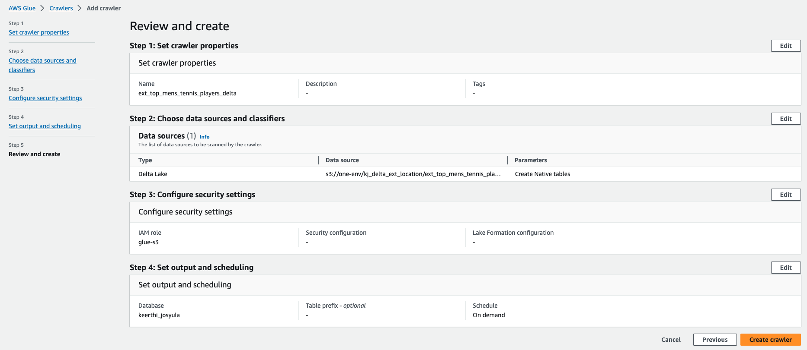
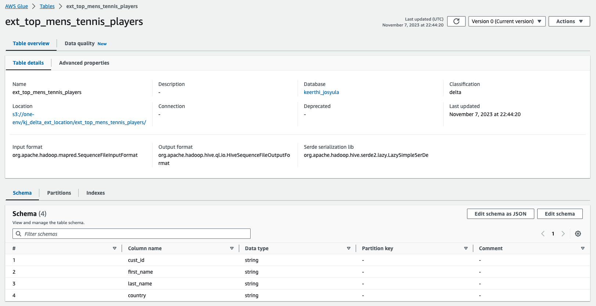
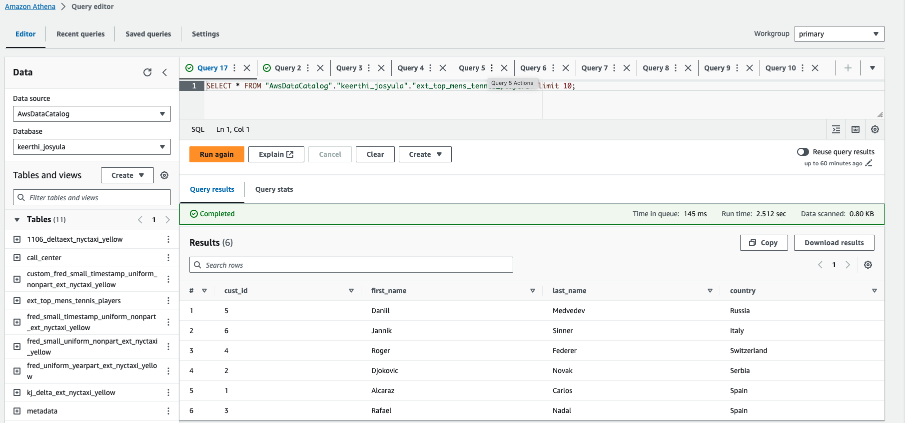
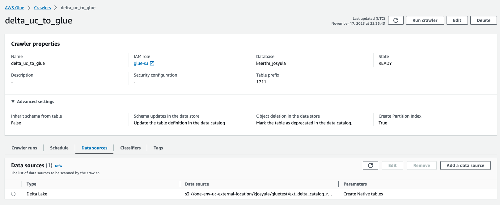
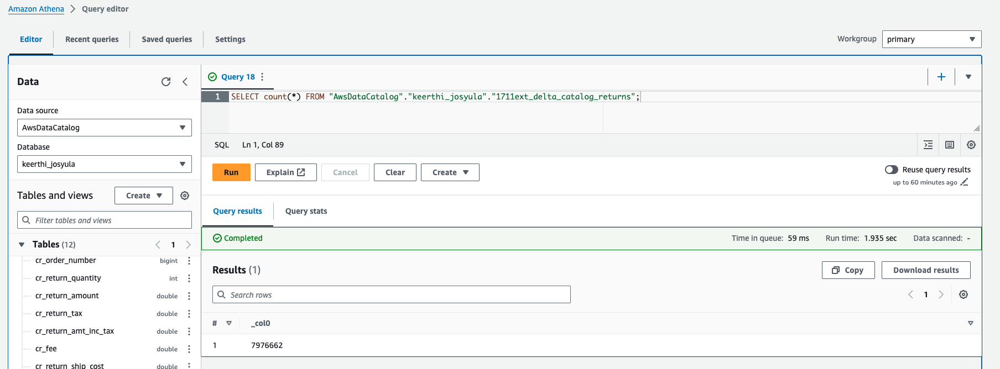
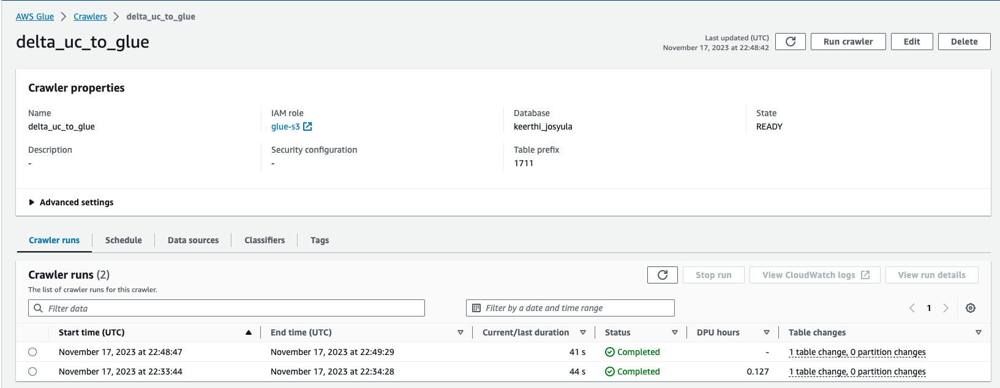
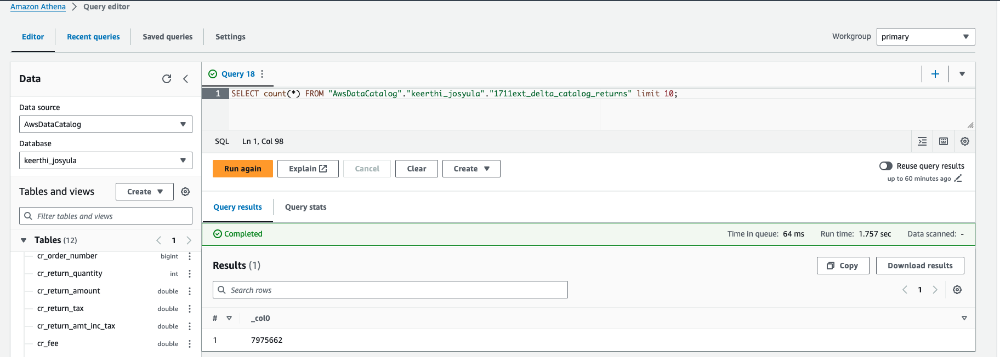

This blog post explains how to register Delta tables in the AWS Glue Data Catalog and query the data with engines like Amazon Athena, Amazon Redshift, and Amazon EMR.

You will learn about why it’s beneficial to register Delta tables in AWS Glue for specific workflows and the advantages of using Delta Lake tables.

Let’s start by creating a Delta table in AWS S3 and then registering the table.

## Register Delta Lake tables in the AWS Glue Data Catalog

The AWS Glue Data Catalog is where you can register tables so they’re easily accessible in various services.

You can register a Delta table in the AWS Glue Data Catalog and then easily query it via Amazon Athena, Amazon Redshift, AWS Lambda, and EMR.

Let’s see how to register some Delta tables in the AWS Glue Data Catalog with the AWS Glue Crawler.

## Delta Lake AWS Glue Crawler

Let’s start by creating a Delta table in AWS S3 with PySpark.

```
df = spark.createDataFrame(
   [
       ("4", "Roger", "Federer", "Switzerland"),
       ("3","Rafael", "Nadal", "Spain"),
       ("2","Djokovic", "Novak", "Serbia"),
       ("1","Alcaraz", "Carlos", "Spain")
   ]
).toDF("cust_id","first_name", "last_name", "country")

(df.write
.format("delta")
.option("path", "s3://one-env/kj_delta_ext_location/ext_top_mens_tennis_players")
.saveAsTable("ext_top_mens_tennis_players"))
```

Now append some more data to the table:

```
df1 = spark.createDataFrame(
   [
       ("5", "Daniil", "Medvedev", "Russia"),
       ("6","Jannik", "Sinner", "Italy")
   ]
).toDF("cust_id","first_name", "last_name", "country")

(df1.write
.format("delta")
.mode("append")
.saveAsTable("ext_top_mens_tennis_players"))
```

Let’s use the AWS Glue Crawler to register this Delta table in the AWS Glue Data Catalog.




Take a look at the tables registered in the AWS Glue Data Catalog to make sure it’s registered.



Now, let’s see how to query the registered Delta table.

## Query Delta Lake table registered in AWS Glue Data Catalog

You can also easily query this Delta table with AWS Athena. See the following example:



You can query the data based on the name registered in the AWS Glue Data Catalog. You don’t need to remember the path of the Delta table in AWS S3. Referencing it by name is much easier.

Registering the Delta table in the AWS Glue Data Catalog makes it easy to query by multiple Amazon services.

Let’s investigate other advantages of registering this table in the AWS Glue Data Catalog.

## Advantages of registering Delta tables in the AWS Glue Data Catalog

The AWS Glue Data Catalog organizes Delta tables in a catalog/database/table hierarchy so you can create different databases to group related tables. You can assign permissions to the tables so certain users can access some tables but not others.

As we mentioned before, it’s easy for users to read tables registered in the AWS Glue Data Catalog from various AWS services. Many organizations will have one team responsible for creating a table and another team to generate reports and analyze the tables.

The team reading the tables doesn’t need to know where they’re stored or the permission details. They can just read the tables to get their jobs done.

It’s also possible to register Delta tables in multiple catalogs.

## Registering Delta Lake tables in both AWS Glue Data Catalog and Unity Catalog

You can register Delta tables in multiple catalogs, like the AWS Glue Data Catalog and the Unity Catalog.

You may have a Delta table that’s registered in the Unity Catalog and is updated every minute with a Spark-based ETL process. You can also register this table with the AWS Glue Data Catalog so the table is easy to query with AWS Athena.

Here’s how to table that’s already registered in the Unity Catalog in the AWS Glue Data Catalog as well. Start by creating the table.

```
%sql
--Registering a table to unity catalog
--catalog : kj
--schema : gluetest
--table : ext_delta_catalog_returns
CREATE TABLE kj.gluetest.ext_delta_catalog_returns
LOCATION 's3://one-env-uc-external-location/kjosyula/gluetest/ext_delta_catalog_returns'
as select * from pqt_vw;

%sql
select count(*) from kj.gluetest.ext_delta_catalog_returns
7975662
```

Now register the table to the Glue Catalog using the Glue Delta crawler:



You can now query the table from Athena:

```
SELECT count(*) FROM "AwsDataCatalog"."keerthi_josyula"."1711ext_delta_catalog_returns";

--7975662
```



You can append data to the Delta table with the existing workload:

```
%sql
insert into kj.gluetest.ext_delta_catalog_returns
select * from pqt_vw limit 1000;
```

Simply rerun the crawler to update the Delta table in the AWS Glue Data Catalog:



Rerun the query for table count in Athena:

```
SELECT count(*) FROM "AwsDataCatalog"."keerthi_josyula"."1711ext_delta_catalog_returns";

--7976662
```



Make sure to note that when you’re working with multiple engines, you need to manage [concurrency control](https://docs.delta.io/latest/concurrency-control.html).

Delta tables can be registered in multiple catalogs.

## Conclusion

It’s easy to register Delta tables in the AWS Glue Data Catalog and query them from various data tools in the AWS ecosystem. See this blog post for even more details on [crawling Delta Lake tables using AWS Glue Crawler](https://aws.amazon.com/blogs/big-data/crawl-delta-lake-tables-using-aws-glue-crawlers/).

You can also watch this excellent video on processing Delta Lake Tables on AWS Using AWS Glue, Amazon Athena, and Amazon Redshift:

<iframe
  width="560"
  height="315"
  src="https://www.youtube.com/embed/o6Wd84-lxCI?si=sQo_amCC4hvvTrR7"
  title="YouTube video player"
  frameborder="0"
  allow="accelerometer; autoplay; clipboard-write; encrypted-media; gyroscope; picture-in-picture; web-share"
  allowfullscreen
></iframe>

It’s also easy to register a Delta table with multiple catalogs, like both the AWS Glue Data Catalog and Unity Catalog. It’s instrumental to register tables in multiple catalogs when different execution environments query the data, or you need to leverage features that are available in one catalog but not another.
