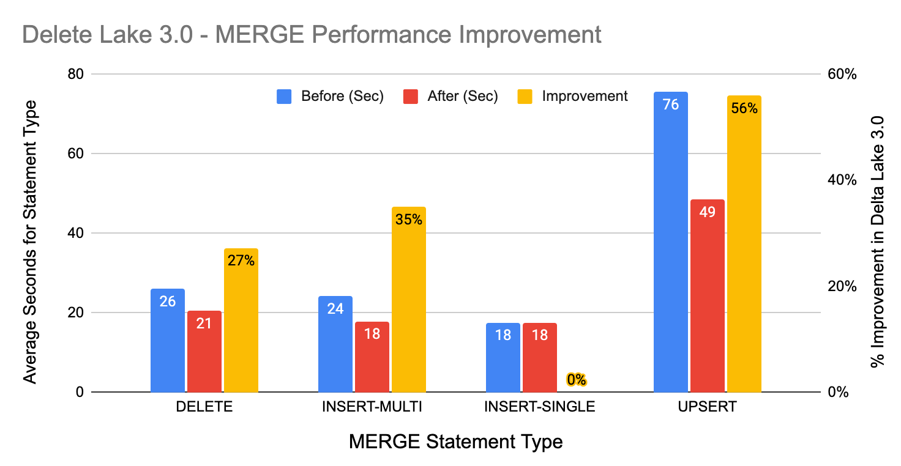

This post explains why Delta Lake is a performant data storage system for different query engines.

It also describes the changes made to Delta Lake over time to help it execute data operations faster.

## MERGE Improvements in Delta Lake 3.0

This section reviews the MERGE performance improvements in Delta Lake 3.0. These changes improve the execution speed of MERGE operations by up to 56%. We’ll explore these enhancements and demonstrate the substantial performance gains they provide.

Our earlier post [Demystifying MERGE in Delta Lake](https://delta.io/blog/2023-02-14-delta-lake-merge/) highlighted the power and versatility of the MERGE command:

> MERGE is the most powerful operation you can do with Delta Lake. With merge, you can apply all three standard data manipulation language operations (INSERT, UPDATE, and DELETE) in a single transaction. You can also add multiple conditions to each of these operations for more complex scenarios and datasets.

The recent enhancements to the `MERGE` command were incorporated in [Delta Lake PR 1827](https://github.com/delta-io/delta/issues/1827). The key improvements include:

- Data Skipping for `MATCHED`-Only Merges
- Enhanced Handling of `INSERT`-Only Merges
- Efficient Row Change Writing
- Efficient Metrics Counter

### Data Skipping for MATCHED Only Merges

We now employ data skipping when a `MERGE` statement includes only MATCHED clauses. This accelerates the search for matches by using target-only MATCHED conditions for data skipping. For example, in the following query, predicates `target.value = 5 OR target.value = 7` can exclude unnecessary scans of any file that is known not to contain those values:

### Enhanced Handling of Insert-Only Merges

In Delta Lake 3.0 insert-only `MERGE` statements support any number of `NOT MATCHED` clauses, whereas previously only a single `NOT MATCHED` clause was allowed. This improvement allows consolidation of diverse `MERGE … INSERT` operations into fewer steps, increasing overall efficiency. We now also switch to insert-only `MERGE` if the `MATCHED` clause(s) do not have any matches.

### Efficient Row Change Writing

We’ve refined the row change writing process for improved efficiency. Rather than processing individual partitions separately, we construct a single dataframe with all the rows to be written, using a comprehensive expression that applies the correct `MERGE` action to each row.

### Efficient Metrics Counter

When updating metrics during `MERGE`/`UPDATE`/`DELETE` actions we replaced the UDFs previously used with dedicated native expressions. This change optimizes code generation, resulting in a more efficient and streamlined method of incrementing metrics.

### Benchmarking MERGE Performance

We created a small new benchmark to test the improvement to `MERGE`. The increased efficiency of `MERGE` means operations are now faster overall. Here is the summary by statement type:

- `DELETE` improves 27%
- `INSERT` (with multiple `NOT MATCHED` clauses) improves 35%
- `INSERT` (with a single `NOT MATCHED` clause) is unchanged
- `UPSERT` (combined `INSERT` and `UPDATE`) improves 56%.

The new `MERGE` benchmark has been added to the existing benchmarks in [delta-io / benchmarks](https://github.com/delta-io/delta/tree/master/benchmarks) and you can easily run the tests yourself to see the impact.

### Summary

In Delta Lake 3.0 we've improved the performance for `MERGE` statements by up to 56%, providing a speed boost to your Lakehouse data pipelines. We saw that the performance improvements are the combined effect of several changes that increase the efficiency of `MERGE`.

You can learn more about using `MERGE` by reading the [Merge — Delta Lake documentation](https://docs.delta.io/latest/delta-update.html), watching the [Tech Talk | Diving into Delta Lake Part 3: How do DELETE, UPDATE, and MERGE work](https://www.youtube.com/watch?v=7ewmcdrylsA) video on YouTube, or by reviewing our earlier blog [Delta Lake Merge](https://delta.io/blog/2023-02-14-delta-lake-merge/).
