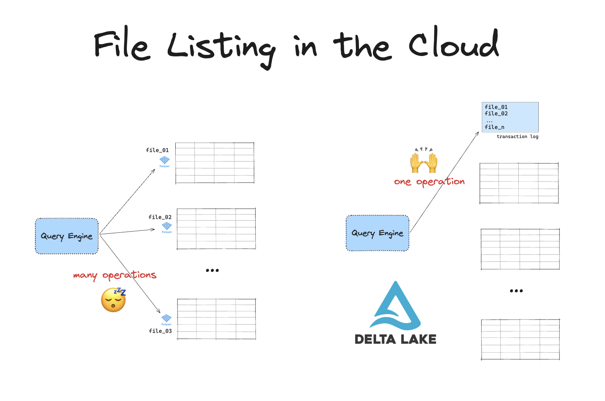
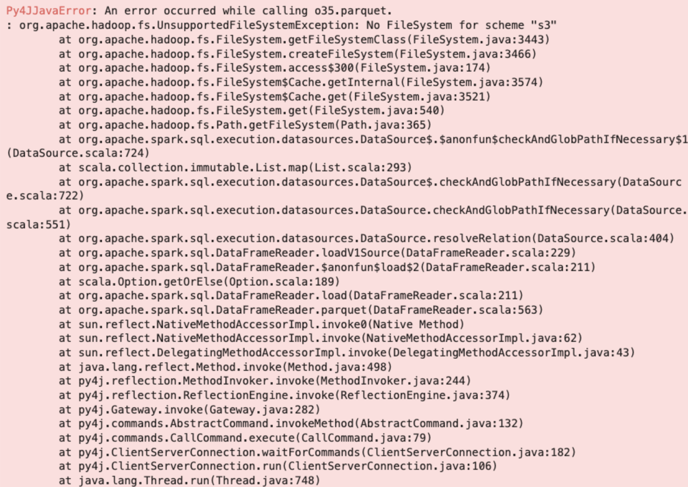

This article shows you how to use Delta Lake with the AWS S3 object store.

Delta Lake is a great storage format for reliable and fast data storage. It provides features like ACID transactions, scalable metadata handling, high-performance query optimizations, schema enforcement and time travel. With these features you can build a performant lakehouse architecture on top of your data lake.

S3 is a popular place to store data objects in the cloud. Storage on S3 is cheap and accessing it is efficient, especially for batch workloads. Many organizations use S3 to build a data lake, for example with Parquet files.

This article will show you how to read and write Delta tables from and to S3. We will cover code examples with Spark and Polars.

You will learn:

- Why Delta Lake is a great choice for S3 workloads
- How to configure your Spark session for proper S3 access with Delta Lake
- How to set up your Python environment for proper S3 access with Delta Lake

Let's jump in! 🪂

## Why Delta Lake is great for S3

Cloud object stores are slow at listing files. This can become a serious problem when you're working with large volumes of data. Delta Lake makes your queries on data in object stores much more efficient.

Cloud-based file systems use a flat namespace rather than a hierarchical file system. This means that there are no real directories. Directories are simulated by attaching prefixes to object keys. Listing operations require the engine to scan _all_ of the files and filter based on these prefixes.

Cloud-based file systems also impose API rate limits. This means you have to make many API calls to list your files. Together, these two factors can cause bottlenecks when you're listing many files.

Suppose you have a table stored in a data lake on S3. The data in this table is spread over many files in a directory. To run a query on this table, your engine will first need to list all the files and then filter for the relevant ones. On S3, a LIST operation is limited to 1000 objects. If your table has millions of files, this will result in high latency and slower queries.

Delta Lake stores all the file paths in a separate transaction log. This way you can avoid expensive file listing operations. Your engine only needs to perform a single operation to get the paths to all the relevant files for your query. This is much more efficient.



Delta Lake has many more benefits compared to data lakes on S3. You can read about them in the [Delta Lake vs Data Lake](https://delta.io/blog/delta-lake-vs-data-lake/) blog.

## How to use Delta Lake on S3

Many query engines support reading and writing Delta Lake on S3.

For example, you can read Delta Lake tables with Spark using:

```python
    df = spark.read.format("delta").load(path/to/delta)
```

And you can write data to Delta Lake table with Spark using:

```python
	df.write.format("delta").save(path/to/delta)
```

You can also use [Delta Lake without Spark](https://delta.io/blog/delta-lake-without-spark/).

Some query engines require a few extra configuration steps to get up and running with Delta Lake. The following two sections will walk you through working with Delta Lake on S3 with Spark (using [delta-spark](https://docs.delta.io/latest/index.html)) and Python engines (using [python-deltalake](https://delta-io.github.io/delta-rs/)).

Let's look at an example of using Delta Lake on S3 with the Spark engine.

## Delta Lake on S3 with Spark

Your Spark session will need additional configuration to read/write Delta Lake tables. Specifically, you will need to install dependency JARs to reference, connect and authenticate with AWS S3.

These dependencies need to be carefully and manually specified. Not all versions of the dependencies work together.

In other words, you can't simply start up a basic Spark session and use it read or write Delta tables:

```python
import pyspark
from delta import *

builder = (
    pyspark.sql.SparkSession.builder.master("local[4]")
    .appName("parallel")
    .config("spark.sql.extensions", "io.delta.sql.DeltaSparkSessionExtension")
    .config(
        "spark.sql.catalog.spark_catalog",
        "org.apache.spark.sql.delta.catalog.DeltaCatalog",
    )
)

spark = configure_spark_with_delta_pip(builder).getOrCreate()

df = spark.read.format("delta").load("s3a://bucket/delta-table")

```

This will error out with:

```sh
Py4JJavaError: An error occurred while calling o35.parquet.
: org.apache.hadoop.fs.UnsupportedFileSystemException: No FileSystem for scheme "s3"
```

And produce a long traceback that looks something like this:



This error is telling you that your Spark session does not know how to handle references to an S3 filesystem. You will need to add the following JARs to your Spark session:

- hadoop-aws
- hadoop-common
- aws-java-sdk-bundle

Follow these steps to configure your Spark session to read/write Delta tables to S3:

1.  Install the latest version of Spark
2.  Get matching versions of the `hadoop-aws` and `hadoop-common` JARs. \
     \
    The general rule is: Spark x.y.z --> hadoop-aws/common x.y.z. For spark 3.5.0, use hadoop-aws/common 3.3.4 (the latest version) \
     \
    To be sure you get the right version number for hadoop-aws and hadoop-common, you can run the following command in your terminal from wherever you have Spark installed. You want to match the version number of `hadoop-client-runtime`:

    > `cd pyspark/jars && ls -l | grep hadoop`

```
        …
        -rw-rw-r--  4 avriiil  staff  30085504  4 Oct  2023 hadoop-client-runtime-3.3.4.jar
        …
```

3.  Get a matching version of `aws-java-sdk-bundle`, see compatible versions [here](https://mvnrepository.com/artifact/org.apache.hadoop/hadoop-aws/3.3.4).
4.  Add these 3 dependency JARs to your Spark session builder. \
     \
    You may be used to doing this by adding the JARs to your Spark Config object with something like: \

```python
builder = (
    pyspark.sql.SparkSession.builder.master("local[4]")
    .appName("s3-write")
    .config("spark.sql.extensions", "io.delta.sql.DeltaSparkSessionExtension")
    .config(
        "spark.sql.catalog.spark_catalog",
        "org.apache.spark.sql.delta.catalog.DeltaCatalog",
    )
    .config(
        "spark.jars.packages",
        "org.apache.hadoop:hadoop-aws:3.3.4, org.apache.hadoop:aws-java-sdk-bundle:1.12.262, org.apache.hadoop:hadoop-common:3.3.4",
    )
    .config("spark.hadoop.fs.s3a.impl", "org.apache.hadoop.fs.s3a.S3AFileSystem")
    .config("spark.hadoop.fs.s3a.access.key", access_key)
    .config("spark.hadoop.fs.s3a.secret.key", secret_key)
)
```

        But the `jars.packages` configs will get overridden by the `configure_spark_with_delta_pip` utility function.

        Instead, use the extra_packages kwarg option to the `configure_spark_with_delta_pip` function:

```python
conf = (
    pyspark.conf.SparkConf()
    .setAppName("MY_APP")
    .set(
        "spark.sql.catalog.spark_catalog",
        "org.apache.spark.sql.delta.catalog.DeltaCatalog",
    )
    .set("spark.sql.extensions", "io.delta.sql.DeltaSparkSessionExtension")
    .set("spark.hadoop.fs.s3a.access.key", access_key)
    .set("spark.hadoop.fs.s3a.secret.key", secret_key)
    .set("spark.sql.shuffle.partitions", "4")
    .setMaster(
        "local[*]"
    )  # replace the * with your desired number of cores. * for use all.
)

extra_packages = [
    "org.apache.hadoop:hadoop-aws:3.3.4",
    "org.apache.hadoop:hadoop-common:3.3.4",
    "com.amazonaws:aws-java-sdk-bundle:1.12.262",
]

builder = pyspark.sql.SparkSession.builder.appName("MyApp").config(conf=conf)
spark = configure_spark_with_delta_pip(
    builder, extra_packages=extra_packages
).getOrCreate()
```

5.  Launch your Spark session. You can confirm that the correct JARs are installed using `spark.sparkContext.getConf().getAll()`
6.  Create a dataframe with some toy data.

```python
`import pandas as pd`

df = pd.DataFrame({'x': [1, 2, 3]})
df = spark.createDataFrame(df)
```

7. Write the data to a Delta table on S3.

```python
	s3_path = "s3a://avriiil/delta-test-spark"
	df.write.format("delta").save(s3_path)
```

Note that Spark references to S3 require the prefix `s3a`.

### Single vs Multi-Cluster Support

By default, Spark sessions will run in a single cluster mode.

In [this default mode](https://docs.delta.io/latest/delta-storage.html#single-cluster-setup-default), you can use Delta Lake to _read_ in parallel from multiple clusters but any parallel writes must originate from a single Spark driver in order for Delta Lake to provide transactional guarantees. This is because S3 currently does not provide mutual exclusion. There is no way to ensure that only one writer is able to create a file, potentially leading to data corruption.

You can enable multi-cluster concurrent write support by explicitly configuring Delta Lake to use a LogStore. In this case, DynamoDB will be used to guarantee the mutual exclusion that S3 does not provide. Read more in the [Multi-Cluster Writes](https://delta.io/blog/2022-05-18-multi-cluster-writes-to-delta-lake-storage-in-s3/) blog post.

Next, let’s look at an example of using Delta Lake on S3 with a python-deltalake query engine like Polars.

## Delta Lake on S3 with delta-rs

You don’t need to install extra dependencies to write Delta tables to S3 with engines that use the `delta-rs` implementation of Delta Lake. You do need to configure your AWS access credentials correctly.

Many Python engines use [boto3](https://boto3.amazonaws.com/v1/documentation/api/latest/index.html) to connect to AWS. This library supports reading credentials automatically from your local `.aws/config` or `.aws/creds` file.

For example, if you’re running locally with the proper credentials in your local `.aws/config` or `.aws/creds` file then you can write a Parquet file to S3 like this with pandas:

```python
    import pandas as pd
    df = pd.DataFrame({'x': [1, 2, 3]})
    df.to_parquet("s3://avriiil/parquet-test-pandas")
```

The `delta-rs` writer does not use `boto3` and therefore does not support taking credentials from your `.aws/config` or `.aws/creds` file. If you’re used to working with writers from Python engines like Polars, pandas or Dask, this may mean a small change to your workflow.

You can pass your AWS credentials explicitly by using:

- the `storage_options `kwarg
- Environment variables
- EC2 metadata if using EC2 instances
- AWS Profiles

Let's work through an example with Polars. The same logic applies to other Python engines like Pandas, Daft, Dask, etc.

Follow the steps below to use Delta Lake on S3 with Polars:

1. Install Polars and deltalake. \
    \
   For example, using: \
    \
   `pip install polars deltalake`

2. Create a dataframe with some toy data.

   `df = pl.DataFrame({'x': [1, 2, 3]})`

3. Set your `storage_options` correctly.

```python
storage_options = {
    "AWS_REGION":<region_name>,
    'AWS_ACCESS_KEY_ID': <key_id>,
    'AWS_SECRET_ACCESS_KEY': <access_key>,
    'AWS_S3_LOCKING_PROVIDER': 'dynamodb',
    'DELTA_DYNAMO_TABLE_NAME': 'delta_log',
}
```

4. Write data to Delta table using the `storage_options` kwarg.

   ```python
   df.write_delta(
       "s3://bucket/delta_table",
       storage_options=storage_options,
   )
   ```

Just like the Spark implementation, `delta-rs` uses DynamoDB to guarantee safe concurrent writes. If for some reason you don't want to use DynamoDB as your locking mechanism you can choose to set the `AWS_S3_ALLOW_UNSAFE_RENAME` variable to `true` in order to enable S3 unsafe writes.

## Delta Lake on S3: Safe Concurrent Writes

You need a locking provider to ensure safe concurrent writes when writing Delta tables to S3. This is because S3 does not guarantee mutual exclusion.

A locking provider guarantees that only one writer is able to create the same file. This prevents corrupted or conflicting data.

You can use a DynamoDB table as your locking provider for safe concurrent writes.

Run the code below in your terminal to create a DynamoDB table that will act as your locking provider.

```
    aws dynamodb create-table \
    --table-name delta_log \
    --attribute-definitions AttributeName=tablePath,AttributeType=S AttributeName=fileName,AttributeType=S \
    --key-schema AttributeName=tablePath,KeyType=HASH AttributeName=fileName,KeyType=RANGE \
    --provisioned-throughput ReadCapacityUnits=5,WriteCapacityUnits=5
```

Delta-spark supports safe concurrent writes by default from a single cluster. Multi-cluster writes require additional configuration. See the “Delta Lake on S3 with Spark” section above for more detail on both cases.

delta-rs supports safe concurrent writes. You will need a DynamoDB table. You can disable the safe concurrent writes guarantee if you don't want to use a DynamoDB table. See the “Delta Lake on S3 with delta-rs” section for more detail.

## Delta Lake on S3: Required permissions

You need to have permissions to get, put and delete objects in the S3 bucket you're storing your data in. Please note that you must be allowed to delete objects even if you're just appending to the Delta Lake, because there are temporary files into the log folder that are deleted after usage.

In AWS S3, you will need the following permissions:

- s3:GetObject
- s3:PutObject
- s3:DeleteObject

In DynamoDB, you will need the following permissions:

- dynamodb:GetItem
- dynamodb:Query
- dynamodb:PutItem
- dynamodb:UpdateItem

## Using Delta Lake on S3

You can read and write Delta Lake tables from and to AWS S3 cloud object storage.

Using Delta Lake with S3 is a great way to make your queries on cloud objects faster by avoiding expensive file listing operations.

You can use Delta Lake with S3 using many different query engines. Some of these engines require some additional configuration to get up and running.

Whichever query engine you choose to use, you will gain the benefits of Delta Lake's core performance and reliability features like query optimization, efficient metadata handling and transaction guarantees.
