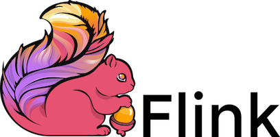

This post shows you how to use Delta Lake without Spark.

You might want to use Delta Lake without Spark because:

- You don’t want to learn Spark
- Your team doesn’t use Spark
- You don’t want to use the Java Virtual Machine (JVM)
- You are working with relatively small datasets

You can use Delta Lake without Spark using many other languages, like SQL, Python, and Rust. This post will show you examples of the most popular ways of using Delta Lake without Spark.

Let’s jump in! 🪂

## How to use Delta Lake without Spark

There are many ways to use Delta Lake without Spark.

Let’s group them into two categories for clarity:

- dedicated **Delta Connectors** let you use Delta Lake from engines like Flink, Hive, Trino, PrestoDB, and many others
- the [**delta-rs**](https://delta-io.github.io/delta-rs/) package lets you use Delta Lake in Rust or Python, e.g. with pandas, polars, Dask, Daft, DuckDB and many others

This post will show you a brief code example for each of these options to use Delta Lake without Spark. You can also find [the full list of integrations](https://delta.io/integrations) on the Delta Lake website.

## Delta Lake without Spark: Dedicated Connectors

Many non-Spark query engines have dedicated connectors to use Delta Lake. These are all based on [Delta Standalone](https://docs.delta.io/latest/delta-standalone.html): a JVM library for Java / Scala that can be used to read from and write to Delta tables. You can use Delta Standalone to build your own Delta connector for services that are not listed on the Integrations page.

_Note: if you want to avoid the JVM entirely, refer to the [delta-rs](#delta-lake-without-spark-with-delta-rs) section below_

You can use Delta Lake without Spark with a dedicated Delta connector from:

- Apache Flink
- Apache Hive
- PrestoDB
- Trino
- Amazon Athena
- Snowflake
- Google BigQuery
- Microsoft Fabric

Some of these connectors support limited Delta Lake functionality. Make sure to check the “Known Limitations” section for each connector to learn more.

### Delta Lake without Spark: Apache Flink



You can use the [Flink/Delta connector](https://github.com/delta-io/delta/tree/master/connectors/flink/) to use Delta Lake from Apache Flink. The connector supports data writes in both batch and streaming mode.

The connector includes:

- `DeltaSink` for writing data from Apache Flink to a Delta table.
- `DeltaSource` for reading Delta tables using Apache Flink.

You can use Delta Lake with the Flink Python or SQL API.

#### Delta Lake with Flink: Python

The code below is an example of how you can write data to a partitioned table using one partitioning column `surname`.

```
    import io.delta.flink.sink.DeltaBucketAssigner;
    import io.delta.flink.sink.DeltaSinkBuilder;

    public DataStream<RowData> createDeltaSink(
            DataStream<RowData> stream,
            String deltaTablePath) {
        String[] partitionCols = { "surname" };
        DeltaSink<RowData> deltaSink = DeltaSink
            .forRowData(
                new Path(deltaTablePath),
                new Configuration(),
                rowType)
            .withPartitionColumns(partitionCols)
            .build();
        stream.sinkTo(deltaSink);
        return stream;
    }
```

You can also use Delta Lake’s time-travel functionality from Apache Flink. For example like this:

```
    public DataStream<RowData> createBoundedDeltaSourceWithTimeTravel(
            StreamExecutionEnvironment env,
            String deltaTablePath) {

        DeltaSource<RowData> deltaSource = DeltaSource
            .forBoundedRowData(
                new Path(deltaTablePath),
                new Configuration())
            // could also use `.versionAsOf(314159)`
            .timestampAsOf("2022-06-28 04:55:00")
            .build();

        return env.fromSource(deltaSource, WatermarkStrategy.noWatermarks(), "delta-source");
    }
```

#### Delta Lake with Flink: SQL

Starting from Flink version 3.0.0, the Delta connector can be used for Flink SQL jobs. Both Delta Source and Delta Sink can be used as Flink Tables for SELECT and INSERT queries.

For example, you can load an entire Delta table into another Delta table using:

```
    INSERT INTO sinkTable SELECT * FROM sourceTable;
```

In the SQL query above, `sourceTable` and `sinkTable` both refer to Delta tables configured using the Delta/Flink connector. The table schema's must match.

Or to create a new, partitioned table:

```
    CREATE TABLE testTable (
        id BIGINT,
        data STRING,
        part_a STRING,
        part_b STRING
      )
      PARTITIONED BY (part_a, part_b);
      WITH (
        'connector' = 'delta',
        'table-path' = '<path-to-table>',
        '<arbitrary-user-define-table-property' = '<value>',
        '<delta.*-properties>' = '<value'>
    );
```

You do not need to write any Spark to use Delta Lake with Apache Flink.

Note that the Flink/Delta SQL connector must be used together with a Delta Catalog. Trying to execute SQL queries on Delta table using Flink API without Delta Catalog configured will cause the SQL job to fail.

#### Known Limitations

- Only `append` write operations are currently supported; no `overwrite` or `upsert`.
- Azure Blob Storage currently only supports reading. Writing to Azure Blob Storage is not supported by Flink due to an [issue](https://issues.apache.org/jira/browse/FLINK-17444) with class shading.
- For AWS S3 storage, in order to ensure concurrent transactional writes from different clusters, use [multi-cluster configuration guidelines](https://docs.delta.io/latest/delta-storage.html#multi-cluster-setup). Please see this [example](https://github.com/delta-io/delta/tree/master/connectors/flink/#3-sink-creation-with-multi-cluster-support-for-delta-standalone) for how to use this configuration in Flink Delta Sink.
- The Delta SQL connector currently supports only Physical columns. The Metadata and Computed columns are currently not supported. For details please see [here](https://nightlies.apache.org/flink/flink-docs-master/docs/dev/table/sql/create/#columns).

### Delta Lake without Spark: Apache Hive


You can use the [Hive connector](https://github.com/delta-io/delta/tree/master/connectors/hive) to use Delta Lake from Apache Hive. You can use this connector to query data from Delta tables in Hive. You cannot use it to write data from Hive to Delta tables.

To work with Delta Lake, you will need to define an external Hive table pointing to a Delta table, for example on S3 like this:

```
    CREATE EXTERNAL TABLE deltaTable(col1 INT, col2 STRING)
    STORED BY 'io.delta.hive.DeltaStorageHandler'
    LOCATION '/delta/table/path'
```

The table schema in the CREATE TABLE statement should match the schema of the Delta table you are reading.

Once you have defined your external Hive table, you can then query it as follows:

```
    select * from deltaTable;
```

You do not need to write any Spark to use Delta Lake with Apache Hive.

#### Known Limitations

- This connector is READ ONLY. No write operations are supported.
- Only EXTERNAL Hive tables are supported. The Delta table must be created using Spark before an external Hive table can reference it.

### Delta Lake without Spark: PrestoDB


You can use the [PrestoDB connector](https://prestodb.io/docs/current/connector/deltalake.html) to use Delta Lake from Presto. This connector is based on the Hive connector and shares a lot of the same configuration options.

Your Delta table will need to be registered in a Hive metastore.

You can create a Presto table from an existing Delta table on S3 as follows:

```
    CREATE TABLE sales.apac.sales_data_new (sampleColumn INT)
    WITH (external_location = 's3://db-sa-datasets/presto/sales_data_new');
```

To register a table in the Hive metastore, you don’t need to pass the full schema of the table as the Delta Lake connector gets the schema from the metadata located at the Delta Lake table location. To get around the `no columns error` in Hive metastore, provide a sample column as schema of the Delta table being registered.

To access a Delta table `sales_data` that is already registered in the Hive metastore as part of the `apac` database and `sales` Catalog, you can simply run:

```
    SELECT * FROM sales.apac.sales_data LIMIT 200;
```

You can also query the Delta table directly from S3 by passing the `path`:

```
    SELECT * FROM sales."$path$"."s3://db-sa-datasets/presto/sales_data" LIMIT 200;
```

You can travel back to specific versions of your Delta table by adding the version to the table name as follows:

```
    SELECT * FROM sales.apac."sales_data@v4" LIMIT 200;
```

#### Known Limitations

- This connector is READ ONLY. No write operations are supported.
- This connector reuses many of the modules existing in Hive connector, i.e. for connectivity and security such as S3, Azure Data Lake, AWS Glue metastore etc. The configurations for these modules are the same as those available in the [Hive connector documentation](https://github.com/delta-io/delta/tree/master/connectors/hive). \

You do not need to write any Spark to use Delta Lake with PrestoDB.

### Delta Lake without Spark: Trino


You can use the [Trino connector](https://trino.io/docs/current/connector/delta-lake.html) to use Delta Lake from Trino. You can then use SQL to query and transform your Delta tables. Note that your Delta tables must be registered with a metastore, e.g. Hive metastore or AWS Glue.

The Trino connector supports reading and writing operations. You can [append, overwrite and merge](https://trino.io/docs/current/connector/delta-lake.html#data-management) your Delta tables.

For example, you can create a Delta Lake table, add some data, modify some data and add more data like this:

```
    CREATE TABLE users(id int, name varchar) WITH (column_mapping_mode = 'name');
    INSERT INTO users VALUES (1, 'Alice'), (2, 'Bob'), (3, 'Mallory');
    ALTER TABLE users DROP COLUMN name;
    INSERT INTO users VALUES 4;
```

Use the following statement to look at all data in the table:

```
    > SELECT * FROM users ORDER BY id;

    id
    ----
      1
      2
      3
      4
```

Use the `$history` metadata table to see a record of past operations:

```
    > SELECT version, timestamp, operation
    > FROM "users$history";

    version |             timestamp              |  operation
    ---------+------------------------------------+--------------
           0 | 2024-04-10 17:49:18.528 Asia/Tokyo | CREATE TABLE
           1 | 2024-04-10 17:49:18.755 Asia/Tokyo | WRITE
           2 | 2024-04-10 17:49:18.929 Asia/Tokyo | DROP COLUMNS
           3 | 2024-04-10 17:49:19.137 Asia/Tokyo | WRITE
```

Then travel back in time to version 1:

```
    > SELECT *
    > FROM users FOR VERSION AS OF 1;

    id |  name
    ----+---------
      1 | Alice
      2 | Bob
      3 | Mallory
```

You do not need to write any Spark to use Delta Lake with Trino.

#### Writing to Cloud storage

- Writes to the Azure ADLS Gen2 and Google Cloud Storage are enabled by default. Trino detects write collisions on these storage systems when writing from multiple Trino clusters, or from other query engines.
- Writes to [Amazon S3](https://trino.io/docs/current/object-storage/legacy-s3.html) and S3-compatible storage must be enabled with the `delta.enable-non-concurrent-writes` property. Writes to S3 can safely be made from multiple Trino clusters; however, write collisions are not detected when writing concurrently from other Delta Lake engines. You must make sure that no concurrent data modifications are run to avoid data corruption.

#### Data Type Mapping

- Trino and Delta Lake each support data types that the other does not. For this reason, the connector modifies some types when reading or writing data. Refer to the connector documentation on [type mapping](https://trino.io/docs/current/connector/delta-lake.html#type-mapping) to learn more.

### Delta Lake without Spark: Amazon Athena


You can use the [Athena connector](https://docs.aws.amazon.com/athena/latest/ug/delta-lake-tables.html) to use Delta Lake from Amazon Athena.

Note that your Delta Lake table must be registered with an AWS Glue metastore.

If your table is in Amazon S3 but not in AWS Glue, run a CREATE EXTERNAL TABLE statement first:

```
    CREATE EXTERNAL TABLE
      [db_name.]table_name
      LOCATION 's3://DOC-EXAMPLE-BUCKET/your-folder/'
      TBLPROPERTIES ('table_type' = 'DELTA')
```

Delta Lake table metadata are inferred from the Delta Lake transaction log and synchronized directly to AWS Glue. You do not need to provide column or schema definitions.

You can then query your Delta tables with standard SQL syntax. For example:

```
    SELECT * FROM delta_table_users ORDER BY id;
```

You do not need to write any Spark to use Delta Lake with Amazon Athena.

#### Known Limitations

- This connector is READ ONLY. No write operations or time travel is supported.
- For an example of handling UPSERTS with Athena and AWS Glue, check out [this article](https://aws.amazon.com/blogs/big-data/handle-upsert-data-operations-using-open-source-delta-lake-and-aws-glue/).
- Only certain data types can be used for partition columns, see the [documentation](https://docs.aws.amazon.com/athena/latest/ug/delta-lake-tables.html#delta-lake-tables-supported-data-types-partition-columns).

### Delta Lake without Spark: Snowflake


You can use the [Snowflake connector](https://docs.snowflake.com/en/user-guide/tables-external-intro#delta-lake-support) to use Delta Lake from Snowflake.

You will need to create a [Snowflake external table](https://docs.snowflake.com/en/sql-reference/sql/create-external-table) that points to your Delta Lake stored in cloud storage. Supported cloud storage services are: Amazon S3, Google Cloud Storage, and Microsoft Azure.

You can then query your Delta tables using standard SQL syntax.

For example, you can create an external table backed by a Delta Lake as follows:

```
    CREATE EXTERNAL TABLE twitter_feed(
     PARTITION BY (date_part)
     LOCATION=@mystage/daily/
     FILE_FORMAT = (TYPE = PARQUET)
     TABLE_FORMAT = DELTA;
```

Note the `FILE_FORMAT = (TYPE = PARQUET)` and the `TABLE_FORMAT = DELTA`. These values must be set in this way.

For optimal performance, it is recommended to define partition columns for the external table. In this example, we’ve defined `date_part` as the partition column.

You do not need to write any Spark to use Delta Lake with Snowflake.

#### Known Limitations

- This connector is currently a preview feature.
- The ability to automatically refresh the metadata is not available for external tables that reference Delta Lake files. Instead, periodically execute an [ALTER EXTERNAL TABLE … REFRESH](https://docs.snowflake.com/en/sql-reference/sql/alter-external-table) statement to register any added or removed files.
- The following Snowflake parameters are not supported when referencing a Delta Lake:
  - `AWS_SNS_TOPIC = 'string'`
  - `PATTERN = 'regex_pattern'`

### Delta Lake without Spark: Google BigQuery


You can use the [BigQuery connector](https://cloud.google.com/bigquery/docs/create-delta-lake-table) to use Delta Lake from Google BigQuery.

You will need to define your existing Delta table as an External table in BigQuery. This is referred to as a Delta Lake BigLake.

You can do so as follows:

```
    CREATE EXTERNAL TABLE `PROJECT_ID.DATASET.DELTALAKE_TABLE_NAME`
    WITH CONNECTION `PROJECT_ID.REGION.CONNECTION_ID`
    OPTIONS (
      format ="DELTA_LAKE",
      uris=['DELTA_TABLE_GCS_BASE_PATH']);
```

After creating your Delta Lake BigLake, you can query it using GoogleSQL. For example:

```
    SELECT field1, field2 FROM mydataset.my_cloud_storage_table;
```

You do not need to write any Spark to use Delta Lake with Google BigQuery.

Read more in the [dedicated blog post](https://delta.io/blog/query-delta-lake-bigquery/).

#### Known Limitations

- This connector is available as a pre-GA feature. Pre-GA features are available "as is" and might have limited support.
- Supports Delta Lake [reader version](https://github.com/delta-io/delta/blob/master/PROTOCOL.md#reader-version-requirements) 3 with deletion vectors and column mapping.
- You must list the reader version in the last log entry file. For example, new tables must include `00000..0.json`.
- Change data capture (CDC) operations aren't supported. Any existing CDC operations are ignored.
- The schema is autodetected. Modifying the schema by using BigQuery isn't supported.
- Table column names must adhere to BigQuery [column name restrictions](https://cloud.google.com/bigquery/docs/schemas#column_names).
- Materialized views aren't supported.
- Data types may be converted according to the [type mapping matrix](https://cloud.google.com/bigquery/docs/create-delta-lake-table#data-mapping).

## Delta Lake without Spark with delta-rs

The [delta-rs](https://delta-io.github.io/delta-rs/) library lets you read, write, and manage [Delta Lake](https://delta.io/) tables with Python or Rust without Spark or Java. It uses [Apache Arrow](https://arrow.apache.org/) under the hood, so it is compatible with other Arrow-native or integrated libraries such as [pandas](https://pandas.pydata.org/), [DuckDB](https://duckdb.org/), and [Polars](https://www.pola.rs/).

Using Delta Lake with delta-rs avoids the JVM entirely.

delta-rs has two public APIs:

1. “rust deltalake” refers to the Rust API of delta-rs
2. “python deltalake” refers to the Python API of delta-rs

The python deltalake API lets you use Delta Lake from many OSS query engines, including

- pandas
- polars
- Dask
- Daft
- DuckDB
- Datafusion

Take a look at the [Integrations page](https://delta-io.github.io/delta-rs/integrations/delta-lake-arrow/) in the delta-rs documentation for more information.

### Delta Lake without Spark: pandas


You can use delta-rs to use Delta Lake with [pandas](https://pandas.pydata.org/docs/). Let’s look at an example.

Start by importing delta-rs and pandas as follows:

```
    import pandas as pd
    from deltalake import write_deltalake, DeltaTable
```

Define two dictionaries to store some data:

```
    data = {'first_name': ['bob', 'li', 'leah'], 'age': [47, 23, 51]}
    data_2 = {"first_name": ["suh", "anais"], "age": [33, 68]}
```

Create a DataFrame with the first dictionary and write it to a Delta Lake table:

```
    df = pd.DataFrame.from_dict(data)
    write_deltalake("tmp/pandas-table", df)
```

Load the Delta table to check the results:

```
    > DeltaTable("tmp/pandas-table/").to_pandas()

     first_name  age
    0        bob   47
    1         li   23
    2       leah   51
```

Let’s append the rest of the data:

```
    df2 = pd.DataFrame(data_2)
    write_deltalake("tmp/pandas-table", df2, mode="append")
```

Read it back in to double-check:

```
    > DeltaTable("tmp/pandas-table/").to_pandas()

     first_name  age
    0        bob   47
    1         li   23
    2       leah   51
    3        suh   33
    4      anais   68
```

You can time travel to a previous version using the version keyword:

```
    > DeltaTable("tmp/pandas-table/", version=0).to_pandas()

     first_name  age
    0        bob   47
    1         li   23
    2       leah   51
```

Refer to the [Pandas integration page](https://delta-io.github.io/delta-rs/integrations/delta-lake-pandas/) in the delta-rs documentation for more information.

### Delta Lake without Spark: Polars


You can use delta-rs to use Delta Lake with [Polars](https://docs.pola.rs/). Let’s look at an example.

Start by importing polars:

```
    import polars as pl
```

Define two dictionaries to store some data:

```
    data = {'first_name': ['bob', 'li', 'leah'], 'age': [47, 23, 51]}
    data_2 = {"first_name": ["suh", "anais"], "age": [33, 68]}
```

Create a DataFrame with the first dictionary and write it to a Delta Lake table:

```
    df = pl.DataFrame(data)
    df.write_delta("tmp/polars_table")
```

Read the Delta table and print the DataFrame to visualize it:

```
    > print(pl.read_delta("tmp/polars_table"))

    ┌────────────┬─────┐
    │ first_name ┆ age │
    │ ---        ┆ --- │
    │ str        ┆ i64 │
    ╞════════════╪═════╡
    │ bob        ┆ 47  │
    │ li         ┆ 23  │
    │ leah       ┆ 51  │
    └────────────┴─────┘
```

Create another DataFrame with the second dictionary and append it to the first:

```
    df = pl.DataFrame(data_2)
    df.write_delta("tmp/polars_table", mode="append")
```

Read and visualize:

```
    > print(pl.read_delta("tmp/polars_table"))

    ┌────────────┬─────┐
    │ first_name ┆ age │
    │ ---        ┆ --- │
    │ str        ┆ i64 │
    ╞════════════╪═════╡
    │ suh        ┆ 33  │
    │ anais      ┆ 68  │
    │ bob        ┆ 47  │
    │ li         ┆ 23  │
    │ leah       ┆ 51  │
    └────────────┴─────┘
```

Use time-travel functionality to travel back to an earlier version:

```
    > print(pl.read_delta("tmp/polars_table", version=0))

    ┌────────────┬─────┐
    │ first_name ┆ age │
    │ ---        ┆ --- │
    │ str        ┆ i64 │
    ╞════════════╪═════╡
    │ bob        ┆ 47  │
    │ li         ┆ 23  │
    │ leah       ┆ 51  │
    └────────────┴─────┘
```

Note that unlike pandas, polars has its own `read_delta` and `write_delta` methods. This means you don’t need to import `deltalake` explicitly; it is used under the hood by `Polars` as a dependency.

Refer to the [Polars integration page](https://delta-io.github.io/delta-rs/integrations/delta-lake-polars/) in the delta-rs documentation for more information.

### Delta Lake without Spark: Dask


You can use delta-rs to use Delta Lake with Dask. This functionality is available through the `dask-deltatable` library.

_Note that `dask-deltatable` only works with `deltalake==0.13.0`_

Let’s look at an example.

If you are running `dask >= 2024.3.0` you will have to disable Dask’s new query planner to work with `dask-deltatable`. You can do so by setting:

```
    dask.config.set({'dataframe.query-planning': False})
```

This only works if you set the config **before** importing `dask-deltatable`. See [the Dask docs](https://docs.dask.org/en/stable/changelog.html#v2024-3-0) for more information on the query planner.

Next, import `dask-deltatable` and `dask.dataframe`:

```
    import dask_deltatable as ddt
    import dask.dataframe as dd
```

Define two dictionaries with toy data:

```
    data = {'first_name': ['bob', 'li', 'leah'], 'age': [47, 23, 51]}
    data_2 = {"first_name": ["suh", "anais"], "age": [33, 68]}
```

Let’s create a Dask DataFrame from the first dictionary:

```
    > ddf = dd.from_dict(data, npartitions=1)
> ddf.compute()

     first_name  age
    0        bob   47
    1         li   23
    2       leah   51
```

Now, write this Dask DataFrame to a Delta table:

```
    ddt.to_deltalake("tmp/dask-table", ddf)
```

And read it back in to confirm:

```
    > delta_path = "tmp/dask-table/"
    > ddf = ddt.read_deltalake(delta_path)
    > ddf.compute()

     first_name  age
    0        bob   47
    1         li   23
    2       leah   51
```

Let’s create a second DataFrame with data to append to our Delta table:

```
    > ddf_2 = dd.from_dict(data_2, npartitions=1)
    > ddf_2.compute()

    	 first_name  age
    0        suh   33
    1      anais   68
```

And perform a write in `append` mode to add this to our existing Delta table:

```
    ddt.to_deltalake("tmp/dask-table", ddf_2, mode="append")
```

Read it back in to confirm:

```
    > delta_path = "tmp/dask-table/"
    > ddf = ddt.read_deltalake(delta_path)
    > ddf.compute()

     first_name  age
    0        bob   47
    1         li   23
    2       leah   51
    0        suh   33
    1      anais   68
```

Excellent.

You can also time travel to earlier versions of your Delta table using the `version` kwarg:

```
    > delta_path = "tmp/dask-table/"
    > ddf = ddt.read_deltalake(delta_path, version=0)
    > print(ddf.compute())

     first_name  age
    0        bob   47
    1         li   23
    2       leah   51
```

Refer to the [Dask integration page](https://delta-io.github.io/delta-rs/integrations/delta-lake-dask/) in the delta-rs documentation for more information.

### Delta Lake without Spark: Daft


You can use delta-rs to use Delta Lake with Daft.

Daft currently supports read operations without time travel. Write operations are available in a [non-public preview API feature](https://github.com/Eventual-Inc/Daft/commit/06b00a6e977f6d093e2ad86f94d14366ff463330).

Let’s take a look at an example.

You can read an existing Delta table into a Daft DataFrame as follows:

```
    > df = daft.read_delta_lake("tmp/pandas-table")
    > df.collect()

    ╭────────────┬───────╮
    │ first_name ┆ age   │
    │ ---        ┆ ---   │
    │ Utf8       ┆ Int64 │
    ╞════════════╪═══════╡
    │ bob        ┆ 47    │
    ├╌╌╌╌╌╌╌╌╌╌╌╌┼╌╌╌╌╌╌╌┤
    │ li         ┆ 23    │
    ├╌╌╌╌╌╌╌╌╌╌╌╌┼╌╌╌╌╌╌╌┤
    │ leah       ┆ 51    │
    ├╌╌╌╌╌╌╌╌╌╌╌╌┼╌╌╌╌╌╌╌┤
    │ suh        ┆ 33    │
    ├╌╌╌╌╌╌╌╌╌╌╌╌┼╌╌╌╌╌╌╌┤
    │ anais      ┆ 68    │
    ╰────────────┴───────╯
```

You can then query or transform your data. For example:

```
    > df.where(df["age"] > 40).collect()

    ╭────────────┬───────╮
    │ first_name ┆ age   │
    │ ---        ┆ ---   │
    │ Utf8       ┆ Int64 │
    ╞════════════╪═══════╡
    │ bob        ┆ 47    │
    ├╌╌╌╌╌╌╌╌╌╌╌╌┼╌╌╌╌╌╌╌┤
    │ leah       ┆ 51    │
    ├╌╌╌╌╌╌╌╌╌╌╌╌┼╌╌╌╌╌╌╌┤
    │ anais      ┆ 68    │
    ╰────────────┴───────╯
```

You can then use `write_deltalake` to write the data to a Delta table:

```
df.write_deltalake("tmp/daft-table", mode="overwrite")
```

Daft supports multiple write modes.

Refer to the [Daft integration page](https://delta-io.github.io/delta-rs/integrations/delta-lake-daft/) in the delta-rs documentation for more information.

### Delta Lake without Spark: DuckDB


You can use delta-rs to use Delta Lake with DuckDB.

Delta Lake tables can be exposed as [Arrow tables and Arrow datasets](https://delta-io.github.io/delta-rs/integrations/delta-lake-arrow/), which allows for interoperability with a variety of query engines. You can use Arrow as a go-between step to use Delta Lake with DuckDB.

Let’s look at an example.

Start by importing `duckdb` and `deltalake`:

```
    import duckdb
    from deltalake import write_deltalake, DeltaTable
```

Now load in an existing Delta table, for example the one we created earlier with `pandas`:

```
    dt = DeltaTable("tmp/pandas-table/")
```

Convert this Delta table to a DuckDB dataset, using Arrow dataset as the go-between step:

```
    arrow_data = dt.to_pyarrow_dataset()
    duck_data = duckdb.arrow(arrow_data)
```

Now you can query your DuckDB dataset:

```
    > query = """
    > select
    >  age
    > from duck_data
    > order by 1 desc
    > """

    > duckdb.query(query)

    ┌───────┐
    │  age  │
    │ int64 │
    ├───────┤
    │    68 │
    │    51 │
    │    47 │
    │    33 │
    │    23 │
    └───────┘
```

To write this data to a Delta table, convert it to an Arrow table first. Then use `write_deltalake` to write it to a Delta table:

```
    arrow_table = duckdb.query(query).to_arrow_table()

    write_deltalake(
        data=arrow_table,
        table_or_uri="tmp/duckdb-table",
        mode="overwrite",
    )
```

Read it back in to confirm:

```
    > dt = DeltaTable("tmp/duckdb-table/")
    > dt.to_pandas()

      age
    0   68
    1   51
    2   47
    3   33
    4   23
```

Excellent.

Now let’s update our query to limit it to only 3 records:

```
    query = """
    select
      age
    from duck_data
    order by 1 desc
    limit 3
    """
```

And overwrite the existing Delta table:

```
    arrow_table = duckdb.query(query).to_arrow_table()

    write_deltalake(
        data=arrow_table,
        table_or_uri="tmp/duckdb-table",
        mode="overwrite",
    )
```

Read it back in to confirm:

```
    > dt = DeltaTable("tmp/duckdb-table/")
    > dt.to_pandas()

      age
    0   68
    1   51
    2   47
```

You can time travel between different versions of your Delta table using the `version` keyword argument:

```
    > dt = DeltaTable("tmp/duckdb-table/", version=0)
    > dt.to_pandas()

      age
    0   68
    1   51
    2   47
    3   33
    4   23
```

There is also an experimental DuckDB extension for Delta Lake. This extension is maintained by DuckDB and you can read about it in [the Github repo](https://github.com/duckdb/duckdb_delta). The extension currently only supports read operations.

### Delta Lake without Spark: Datafusion


You can use delta-rs to use Delta Lake with Datafusion. You can use [Arrow](https://delta-io.github.io/delta-rs/integrations/delta-lake-arrow/) as a go-between step to use Delta Lake with DuckDB.

Let’s look at an example.

Start by importing `datafusion` and `deltalake`:

```
    from datafusion import SessionContext
    from deltalake import write_deltalake, DeltaTable
```

Initialize a Datafusion session context:

```
    ctx = SessionContext()
```

Now load in an existing Delta table, for example the one we created earlier with `pandas`:

```
    table = DeltaTable("tmp/pandas-table/")
```

Convert this Delta table to a PyArrow dataset and register it as a Datafusion table:

```
    arrow_data = table.to_pyarrow_dataset()
    ctx.register_dataset("my_delta_table", arrow_data)
```

Now you can query your Datafusion dataset:

```
    > query = "select age from my_delta_table order by 1 desc"
    > ctx.sql(query)

    DataFrame()
    +-----+
    | age |
    +-----+
    | 68  |
    | 51  |
    | 47  |
    | 33  |
    | 23  |
    +-----+
```

To write this data to a Delta table, convert it to an Arrow table first. Then use `write_deltalake` to write it to a Delta table:

```
    arrow_table = ctx.sql(query).to_arrow_table()

    write_deltalake(
        data=arrow_table,
        table_or_uri="tmp/datafusion-table",
    )
```

Read it back in to confirm:

```
    > dt = DeltaTable("tmp/datafusion-table/")
    > dt.to_pandas()

      age
    0   68
    1   51
    2   47
    3   33
    4   23
```

Excellent.

Now let’s update our query to limit it to only 3 records:

```
    query =
    "select age from my_delta_table order by 1 desc limit 3"
```

And overwrite the existing Delta table:

```
    arrow_table = ctx.sql(query).to_arrow_table()

    write_deltalake(
        data=arrow_table,
        table_or_uri="tmp/datafusion-table",
        mode="overwrite",
    )
```

Read it back in to confirm:

```
    > dt = DeltaTable("tmp/datafusion-table/")
    > dt.to_pandas()

      age
    0   68
    1   51
    2   47
```

You can time travel between different versions of your Delta table using the `version` keyword argument:

```
    > dt = DeltaTable("tmp/datafusion-table/", version=0)
    > dt.to_pandas()

      age
    0   68
    1   51
    2   47
    3   33
    4   23
```

Refer to the [Datafusion integration page](https://delta-io.github.io/delta-rs/integrations/delta-lake-datafusion) in the delta-rs documentation for more information.

## Delta Lake without Spark: Conclusion

There are many ways to use Delta Lake without Spark.

Dedicated** Delta Connectors** let you use Delta Lake from engines like Flink, Hive, Trino, PrestoDB, and many others.

The [**delta-rs**](https://delta-io.github.io/delta-rs/) package lets you use Delta Lake in Rust or Python, e.g. with pandas, polars, Dask, Daft, DuckDB and many others.

Take a look at the [example notebook](https://github.com/delta-io/delta-examples/blob/master/notebooks/python-deltalake/delta-lake-without-spark.ipynb) to run the delta-rs code for yourself.
