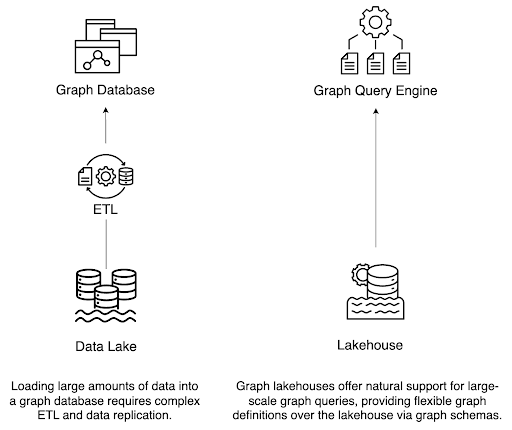
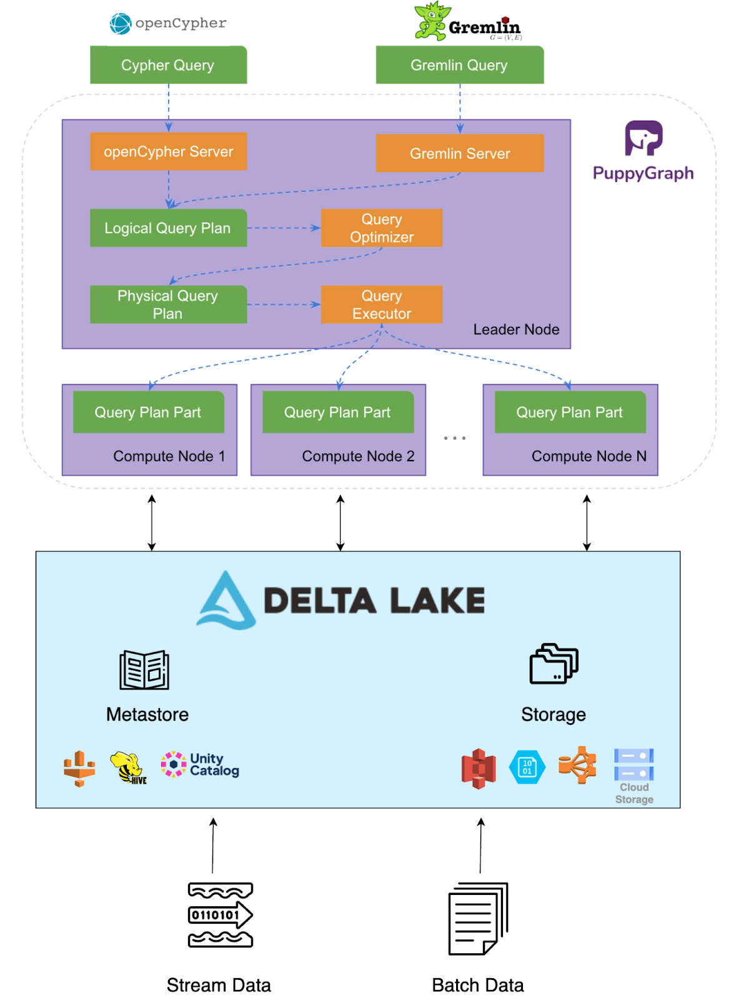

# System Introduction and Motivation

Graph workloads are becoming increasingly prevalent across domains. Security teams trace attack paths through
complex networks. Financial institutions analyze transaction flows. Supply chains track dependencies across
vendor ecosystems. These tasks rely on efficiently querying relationships within large datasets that continue
to grow in size and complexity, often distributed across multiple systems.

To manage this scale, many organizations adopt data lakes and lakehouses as centralized platforms for
storing diverse data. While these architectures are effective for handling volume and variety,
traditional query engines are not built for graph-specific operations such as traversals or multi-hop
exploration. As a result, teams often maintain separate systems: a lakehouse for general analytics and
a graph database for relationship-driven analysis. This split architecture introduces ongoing data movement,
duplication, and pipeline maintenance, resulting in increased latency and operational overhead.
What remains missing is a way to support graph analytics directly within the lakehouse, without
requiring the copying or transformation of the underlying data.

The goal is to have a lakehouse equipped with a graph query engine that operates directly on the data.
We refer to this architecture as a **graph lakehouse**.

## What is a graph lakehouse?

A Graph Lakehouse is a data management architecture that extends the lakehouse model to support graph
structures, graph queries, and graph analytics directly on top of lakehouse storage. It treats graph
workloads as a native part of the lakehouse environment without requiring separate graph databases or
complex data pipelines.

### Key Features of a Graph Lakehouse

- **Graph Structures Defined Over Lakehouse Tables**: A graph lakehouse allows users to define vertices, edges, and graph structures directly on existing lakehouse tables as pure metadata. From the user's perspective, there is no need for complex ETL processes or data duplication.

- **Versioned and Multi-View Graphs:** Since graphs are defined logically over the data, a graph lakehouse enables the creation of multiple graph views from the same Delta Lake tables without duplication. The same graph definitions can also be applied to historical snapshots, enabling time-travel graph analytics, reproducible experiments, and rollback to earlier states with minimal effort.

- **Native Graph Query Support**: Graph-specific queries, such as traversals, multi-hop exploration, and pattern matching, have traditionally required loading data into dedicated systems. A graph lakehouse provides native support for standard graph query languages, such as Gremlin and Cypher, allowing users to express and execute complex graph patterns efficiently.

- **Scalable Storage for Analytical Workloads**: A graph lakehouse leverages modern lakehouse storage formats such as Parquet and Delta Lake, which provide columnar efficiency, metadata optimization, and schema evolution. These features enable the system to manage rapidly growing datasets while maintaining compact and query-friendly storage.

- **Elastic Compute for Graph Queries**: Like the lakehouse architecture it builds on, a graph lakehouse separates storage from compute. This separation enables processing power to scale independently of the data layer, allowing compute resources to be tuned to meet workload demands. Graph queries, therefore, run elastically at scale without disrupting the stability or structure of the underlying storage.

- **Seamless Integration with the Lakehouse Ecosystem:**: A graph lakehouse is a natural extension of the lakehouse ecosystem. It runs on the same foundation that already supports SQL analytics, machine learning, and streaming workloads, so graph queries can be combined with or run alongside other analytical methods. At the same time, it benefits from the massive ecosystem of existing connectors and integrations built for Delta Lake. Anything that can write to Delta tables, including streaming pipelines and batch ETL jobs, can feed directly into the graph lakehouse at no additional cost.

- **Governed Graph Analytics on Shared Data:** Because a graph lakehouse operates directly on governed Delta Lake tables, graph queries inherit the same access controls, auditing, and compliance policies defined at the storage layer. Governance is applied once and consistently enforced, so organizations can secure graph analytics without duplicating rules or managing separate systems.

- **Support for Semi-Structured and Evolving Data:** Delta Lake supports nested structures and semi-structured JSON data, enabling the tracking of dynamically evolving or unpredictable information alongside well-structured graph entities. This ensures that even heterogeneous or rapidly changing domains, such as logs, events, and sensor data, can be incorporated into the graph without requiring rigid schema migrations.

## Delta Lake and PuppyGraph: The Core Building Blocks8

We build the Graph Lakehouse architecture using two core components: Delta Lake and PuppyGraph.

### Delta Lake: The Foundation for Reliable Data Lakes

[Delta Lake](https://delta.io/) is an open-source storage framework designed to bring reliability, performance, and data management capabilities (akin to data warehouses) to data lakes. Launched by Databricks in 2019, it operates directly on top of existing data lake storage infrastructure (such as S3, ADLS, and GCS) and typically uses Apache Parquet as its underlying file format. Delta Lake enhances standard data lakes with several key technical features:

- **ACID Transactions:** It enforces Atomicity, Consistency, Isolation, and Durability (ACID) guarantees for data operations, ensuring data consistency even with concurrent reads and writes. This is crucial for reliable updates across multiple files or tables.
- **Time Travel (Data Versioning):** Delta Lake maintains a transaction log of all changes made to the data, allowing users to query previous versions of a table for audits, rollbacks, or reproducing experiments.
- **Schema Enforcement and Data Checks:** Delta Lake ensures data integrity by validating that new records conform to the defined schema at write time. It also supports constraints such as required fields and conditional checks, preventing invalid or inconsistent data from being stored.
- **Schema Evolution and Generated Columns:** As requirements change, Delta Lake enables easy table extension by adding new columns or modifying existing ones without costly rewrites. It also supports automatically derived fields, so values can be computed from other columns to maintain consistency and reduce redundancy.
- **Efficient Metadata Management:** Delta Lake is optimized to handle metadata for tables containing billions of files or petabytes of data.
- **Unified Batch and Streaming:** Delta Lake tables can serve as both batch tables and streaming sources/sinks, simplifying architectures that need to process both historical and real-time data.
- **Optimized Data Layout:** Features like Z-order clustering help optimize data layout for faster query performance.
- **Delta Universal Format (UniForm):** This feature enables compatibility across various table formats (such as Apache Iceberg and Hudi) and query engines, promoting interoperability within the lakehouse ecosystem. Delta Lake supports APIs for various languages, including Scala, Java, Rust, and Python.

Essentially, Delta Lake provides the robust, transactional foundation required for building reliable and performant Lakehouse architectures, supporting diverse workloads from SQL analytics to machine learning.

### PuppyGraph: A Graph Query Engine for the Lakehouse

[PuppyGraph](https://hubs.ly/Q03kN5mH0) is positioned as a graph query engine, distinct from traditional [graph database](https://www.puppygraph.com/blog/graph-database) management systems such as Neo4j or JanusGraph. Its primary function is to enable graph queries and analytics directly on data residing in existing relational or lakehouse storage systems, such as Delta Lake, without requiring data duplication or complex ETL processes. Key technical aspects include:

- **Direct Data Connection:** Instead of managing its own storage, PuppyGraph connects directly to Delta Lake. This requires configuring the data source connection details and defining a graph schema.
- **Logical Graph Definition:** Users define graph structures (vertices and edges) by mapping them logically to existing tables and columns in the source system (e.g., Delta Lake tables). This mapping is stored in a PuppyGraph schema, often represented as a JSON file, which can be created manually or via a GUI.
- **Optimized for Columnar Storage:** PuppyGraph is designed to leverage the performance benefits of columnar storage formats (like Parquet, used by Delta Lake), which accelerates complex analytical queries over large datasets, differing from the row-based or key-value stores often used by transactional graph databases.
- **Distributed MPP Query Engine:** PuppyGraph utilises a massively parallel processing (MPP) architecture for its query engine, enabling it to distribute computations across multiple nodes for enhanced scalability and performance. Adding more machines can linearly boost performance.
- **Multi-Language Support:** It supports standard graph query languages like [openCypher](https://docs.puppygraph.com/reference/cypher-query-language/?h=cypher) and [Apache Gremlin](https://docs.puppygraph.com/reference/gremlin-query-language/?h=gremlin) through dedicated client and server endpoints.

## System Architecture: Integrating PuppyGraph and Delta Lake

The Graph Lakehouse architecture integrates the graph query engine PuppyGraph directly with the underlying lakehouse storage layer, Delta Lake. The core interaction is illustrated in the diagram below.

At a high level, the system operates as follows:

1. Data Storage: Enterprise data, including data intended for graph representation (potential nodes and edges), resides in Delta Lake tables on standard cloud storage. Delta Lake provides the necessary reliability, transactionality (ACID), and scalability for this data.
2. Graph Definition: PuppyGraph [connects to Delta Lake](https://docs.puppygraph.com/connecting/connecting-to-delta-lake/) and supports various metastores and storage systems, including Databricks Unity Catalog with [credential vending](https://docs.puppygraph.com/reference/databricks-credential-vending/) enabled. Using a PuppyGraph schema (typically a JSON file), users logically map Delta Lake tables and columns to graph constructs (vertices and edges) without moving or transforming the underlying data.
3. Query Execution: When a graph query (e.g., Gremlin or openCypher) is submitted, PuppyGraph translates it into optimized logical and physical plans. Data is read from Delta Lake tables defined in the graph schema or from the local cache if enabled, and executed on PuppyGraph’s distributed MPP engine with efficient columnar access.
4. Results: The results of the graph query are returned to the user or application. This architecture allows graph analytics workloads to run alongside other lakehouse workloads (SQL, ML, streaming) on the same governed data foundation provided by Delta Lake, streamlining data management and enabling holistic analysis.

## Try PuppyGraph and Delta Lake Today

PuppyGraph \+ Delta Lake together form the graph lakehouse. By combining Delta Lake’s unified data management with PuppyGraph’s purpose-built graph query engine, organizations can enable native graph analytics on the lakehouse—reducing cost and complexity while accelerating time to insight. See the [tutorial](https://docs.puppygraph.com/connecting/connecting-to-delta-lake/) for details on how to connect PuppyGraph to Delta Lake.

If you’re exploring graph workloads on Delta Lake, PuppyGraph is the solution to consider. Join the [Delta Lake Slack](https://go.delta.io/slack) and download [PuppyGraph’s forever free developer edition](https://hubs.ly/Q03kN5kJ0) to get started.
