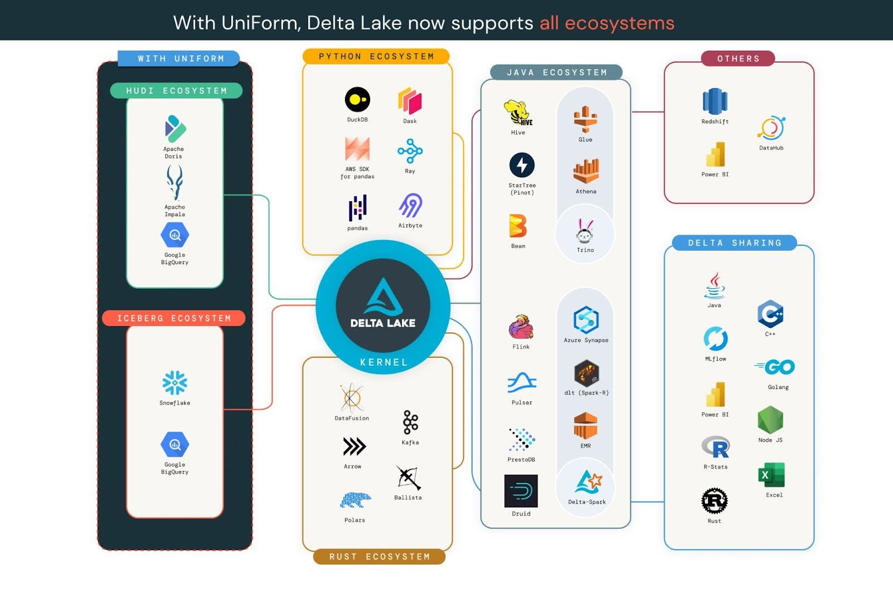
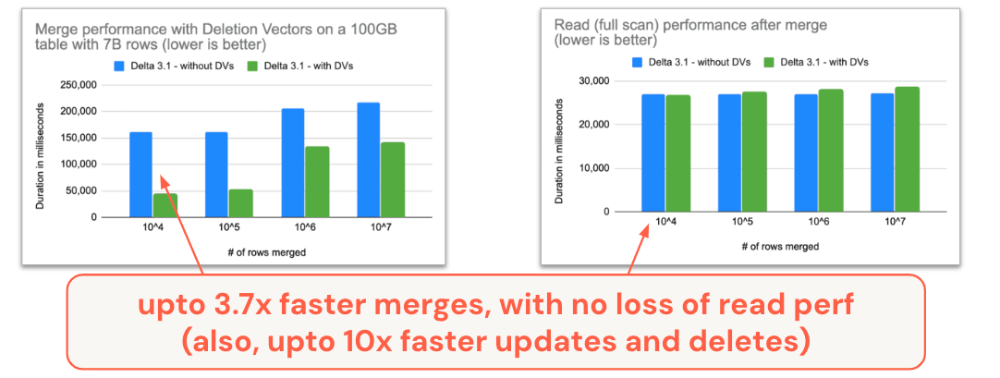
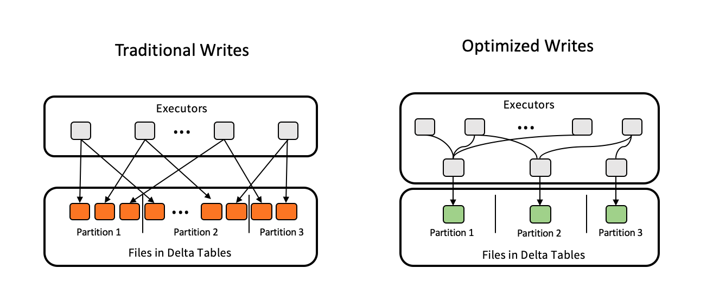

_This is part 2 of a 2 part blog series:_  
_[Part I: Delta Lake - State of the Project](/blog/state-of-the-project-pt1/)_  
_[Part II: Delta Lake - State of the Project](/blog/state-of-the-project-pt2/)_

## The future is interoperable

In our first State of the Project [blog](/blog/state-of-the-project-pt1), we discussed the impressive growth and activity in the Delta Lake community and the feature innovations that we’ve released, like [Liquid clustering](https://docs.delta.io/latest/delta-clustering.html) and [Deletion Vectors](https://docs.delta.io/latest/delta-deletion-vectors.html). In part 2, we’re going to dig a bit deeper into some of the differentiating features of the format, specifically Interoperability and Performance.

## Interoperability across engines, connectors, and formats

### Delta UniForm: Easy interoperability across all formats

One of the key challenges that organizations face when adopting the open data lakehouse is selecting the optimal format for their data. Among the available options, [Linux Foundation Delta Lake](https://delta.io/), [Apache Iceberg](https://iceberg.apache.org/), and [Apache Hudi](https://hudi.apache.org/) are all excellent storage formats that enable data democratization and interoperability. Any of these formats is better than putting your data into a proprietary format. However, choosing a single storage format to standardize on can be a daunting task, which can result in decision fatigue and fear of irreversible consequences. But what if you didn’t have to choose just one?

In 2023, we announced a new initiative called [Delta Lake Universal Format](https://docs.delta.io/latest/delta-uniform.html) (UniForm), which offers a simple, easy-to-implement, seamless unification of table formats without creating additional data copies or silos. UniForm takes advantage of the fact that Delta Lake, Iceberg, and Hudi are all built on [Apache Parquet](https://parquet.apache.org/) data files. The main difference among the formats is in the metadata - the metadata for all three formats serves the same purpose and contains overlapping sets of information. When enabled on Delta tables, UniForm automatically writes metadata of other formats (only Iceberg released today, but our community is adding [support for Hudi](https://github.com/delta-io/delta/pull/2333)). This allows you to use Delta Lake-compliant engines and Iceberg-compliant engines without having to manually convert your data, or maintain multiple copies of the data in different formats.

In addition, you can also do a one-time, [zero-copy, in-place conversion](https://docs.delta.io/3.0.0/delta-utility.html#convert-an-iceberg-table-to-a-delta-table) of Iceberg tables to Delta tables.

### Delta Kernel: Simplifying the connector ecosystem

While we are adding protocol features to the Delta format at an ever-increasing pace, we must ensure that all systems can continue to operate on Delta tables. The Delta connector ecosystem is already expansive and our goal is to keep expanding and enhancing all their capabilities to make it as easy as possible to use Delta tables anywhere in your data stack. However, until last year, connector developers often needed to understand all the details of the Delta protocol to implement all the protocol features correctly. This definitely makes it challenging for the ecosystem to keep up with the pace of innovation. Based on the community feedback, in 2023, we started a new initiative called [Delta Kernel](https://www.youtube.com/watch?v=KVUMFv7470I).

The goal of the Delta Kernel project is to simplify the process of building and maintaining Delta Lake connectors. Delta Kernel is a library that abstracts out all the protocol details behind simple, stable APIs. Connectors built using the Kernel library only need to update to the latest version to get the latest Delta protocol support. The two key features of the Kernel are:

- [Pluggable architecture](https://docs.google.com/presentation/d/1PGSSuJ8ndghucSF9GpYgCi9oeRpWolFyehjQbPh92-U/edit#slide=id.g27c41229cec_0_1023) - While we want to hide all the protocol-level details from the connector, we do not want to prevent any engine from making customizations to their Delta connector. Kernel provides additional APIs that allow custom component implementations to be plugged in. For example, the Kernel library provides an out-of-box "default" implementation for reading the underlying Parquet files. A connector can choose to use that or replace it with its own engine-native Parquet reader for better performance. This provides the right balance of simplicity and customizability.
- Multi-language support - We are building the Delta Kernel in two languages: [Java](https://github.com/delta-io/delta/tree/master/kernel) (for the JVM-based engines) and [Rust](https://github.com/delta-io/delta-rs) (for engines built in Rust, C, C++, Python or any language that interoperates with Rust via FFIs).

The Java Kernel in Delta 3.0 (the first release of the Java Kernel) released in October 2023 has already been adopted by [Apache Druid to provide Delta Lake read support](https://github.com/apache/druid/blob/master/docs/development/extensions-contrib/delta-lake.md#version-support). In [Delta 3.1](https://github.com/delta-io/delta/releases/tag/v3.1.0), the [Flink Sink](https://github.com/delta-io/delta/tree/master/connectors/flink) includes an experimental Kernel integration that reduced the Flink pipeline initialization time by 45x (that is, by faster table metadata fetch) when writing to an 11 PB table with 7M files. With the upcoming Delta 3.2, Kernel will support time travel, For more information, see the following:

- [Deep dive into the Kernel concept](https://docs.google.com/presentation/d/1PGSSuJ8ndghucSF9GpYgCi9oeRpWolFyehjQbPh92-U/edit#slide=id.g27c41229cec_0_1023)
- [Talk at the Data + AI Summit 2023](https://www.youtube.com/watch?v=KVUMFv7470I)
- [User guide](https://github.com/delta-io/delta/blob/master/kernel/USER_GUIDE.md) and [examples](https://github.com/delta-io/delta/tree/master/kernel/examples) for Delta Kernel Java
- [Good byte-sized issues](https://github.com/delta-io/delta/issues?q=+is%3Aissue+label%3A%22good+first+issue%22+label%3Akernel+) for contributing to the Delta Kernel Java

While we are racing to add all the existing protocol features support to this ground-up reimplementation in Delta Kernel, the rest of the connectors continue to add major enhancements. A few highlights are as follows:

- **[Apache Flink](https://github.com/delta-io/delta/tree/master/connectors/flink)** - Delta connector for Apache Flink saw major improvements
  - Delta Sink is now production-ready with[ DoorDash using to ingest PBs of data / week](https://youtu.be/DdX2AuS4ZjQ?feature=shared&t=1844) into Delta tables.
  - Read support, SQL support and Catalog support has been added to Flink.
- **[Trino](https://trino.io/docs/current/connector/delta-lake.html)** - The Delta Trino connector now supports Deletion Vectors, Column Mapping, and other key features from the main Delta Lake spec. It also saw performance improvements across the board.
- **[Apache Druid](https://druid.apache.org/docs/latest/development/extensions-contrib/delta-lake/)** - [Apache Druid 29 has added support for Delta Lake](https://druid.apache.org/docs/latest/release-info/release-notes/#druid-2900) using [Delta Kernel](https://github.com/apache/druid/blob/master/docs/development/extensions-contrib/delta-lake.md#version-support).
- **[Delta Rust](https://github.com/delta-io/delta-rs)** **(delta-rs crate / deltalake PyPI)** - This immensely popular project ([2M+ PyPI downloads/month as of April 3, 2024](https://pypistats.org/packages/deltalake)) has added many API improvements:

  - Support for popular operations - `DELETE, UPDATE, MERGE, OPTIMIZE ZORDER, CONVERT TO DELTA`
  - Support for table constraints - writes will ensure data constraints defined in the table will not be violated
  - Support for schema evolution

  With these improvements, you can do more advanced operations on Delta tables directly from your Rust and Python applications.

- **Support for Delta in GenAI tools** - This deltalake now powers multiple new experimental integrations for Python libraries important in the current #GenAI world.
  - [Delta Torch](https://github.com/delta-incubator/deltatorch) for Pytorch (read the [blog](https://www.google.com/url?sa=t&rct=j&q=&esrc=s&source=web&cd=&cad=rja&uact=8&ved=2ahUKEwjd16mrhe-EAxVgjYkEHTQ4DVoQFnoECBUQAQ&url=https%3A%2F%2Fdelta.io%2Fblog%2Fdeltatorch-intro%2F&usg=AOvVaw0KOe0g62vTHE3AcP8gEYdR&opi=89978449))
  - [Delta Ray](https://github.com/delta-incubator/deltaray) for Ray
  - [Delta Dask](https://github.com/dask-contrib/dask-deltatable) for Dask
- **[Delta Sharing](https://delta.io/sharing/)** - Delta Sharing has added support for securely sharing tables with Deletion Vectors via a new protocol, [Delta Format Sharing](https://github.com/delta-io/delta-sharing/issues/341). This new capability shares the Delta logs with recipients which enables them to query their tables, [preferably using Delta Kernel](https://github.com/delta-io/delta-sharing/issues/438). Using this approach makes the sharing protocol future-proof to any advances in the Delta protocol.
- **[Delta DotNet](https://github.com/delta-incubator/delta-dotnet)** - New connector written a .Net binding on Delta Rust.
- **[Delta Go](https://github.com/rivian/delta-go)** - Contributed by Rivian, this is a new connector written completely from scratch in Go.

## Out-of-the-box Performance

Another focus area over the last year has been on out-of-the-box performance. As mentioned above, the merge-on-read approach with Deletion Vectors can produce some impressive performance improvements.

MERGE, UPDATE, and DELETE commands all now support [Deletion Vectors](https://delta.io/blog/2023-07-05-deletion-vectors/), with some pretty impressive results when you enable it on your Delta table.

- DELETE: 2x speed up since [Delta 2.4](https://github.com/delta-io/delta/releases/tag/v2.4.0)
- UPDATE: 10x speed up since [Delta 3.0](https://github.com/delta-io/delta/releases/tag/v3.0.0)
- MERGE: 3.7X speed up since [Delta 3.1](https://github.com/delta-io/delta/releases/tag/v3.1.0)

Note that the speed-up in merge does not hurt the read performance. Conventional wisdom and observations from other formats have until now suggested that the "merge-on-read" approach makes writes faster at the cost of slowing down reads, at least compared to copy-on-write. With our approach to merge-on-read, you don't have to make hard performance trade-off choices; you can enable deletion vectors without any read performance regressions.

If for some reason, you choose to not enable deletion vectors, you can still enjoy 2x faster merges since [Delta 3.0](https://github.com/delta-io/delta/releases/tag/v3.0.0).

Out-of-the-box read performance has also gotten a boost over the last year, most recently with the addition of [Optimized Write](https://docs.delta.io/3.1.0/optimizations-oss.html#optimized-write) and [Auto Compaction](https://docs.delta.io/3.1.0/optimizations-oss.html#auto-compaction). Both of these features help solve the small file problem, in slightly different ways. Optimized Write forces any distributed Delta on Spark write operations to rebalance data using a data shuffle prior to writing files. This additional step adds a negligible amount of time to the write operation but significantly reduces the chances of writing small files and helps to preserve read performance. In cases of append-only streaming data ingestion, where each write includes only a small amount of data, Optimized Write can only do so much. This is where Auto Compaction provides additional performance protection. Auto Compaction performs a “mini Optimize” operation after each write to compact any small files left after previous writes. In combination, these two features improve out-of-the-box read performance.

Seemingly simple aggregation queries like MIN and MAX can be prohibitively time-intensive for large tables. These operations have been made [faster](https://github.com/delta-io/delta/issues/2092) by using the table metadata, reducing the need for full table scans and improving performance by up to 100x.

## Looking ahead: Delta 4.0

The [future](https://delta.io/roadmap/) of Delta Lake is marked by a commitment to pushing the boundaries of data technology while ensuring ease of use and access for our growing community. We plan to further enhance Delta Lake's capabilities, particularly in areas like real-time analytics, machine learning integration, and cross-platform collaboration. We aim to make Delta Lake not just a storage format, but a comprehensive data management solution that addresses the evolving needs of modern data architectures. Expect to see deeper integrations with GenAI tools, more sophisticated data sharing mechanisms, and advancements in performance that redefine the benchmarks for data processing.

Specifically, a major event that we are excited about is Spark 4.0 that is expected to be released this year. This major release will bring new capabilities (e.g. Spark Connect) that will further empower the Delta ecosystem to innovate. If you are interested in a teaser, take a look at our recent [community meetup where we discuss what to expect in Delta 4.0 on Spark 4.0](https://www.youtube.com/live/et7wYOl5R9Y?feature=shared&t=174). To stay tuned with the latest information in the Delta Lake project, please join our community through any of our forums, including [GitHub](https://go.delta.io/github), [Slack](https://go.delta.io/slack), [X](https://twitter.com/DeltaLakeOSS), [LinkedIn](https://go.delta.io/linkedin), [YouTube](https://go.delta.io/youtube), and [Google Groups](https://go.delta.io/groups).

We're excited to continue this path with our community, partners, and all data practitioners, driving towards a future where data is more accessible, actionable, and impactful than ever before!
