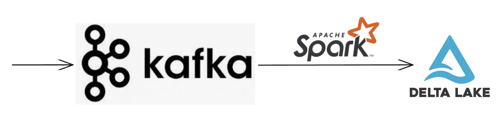
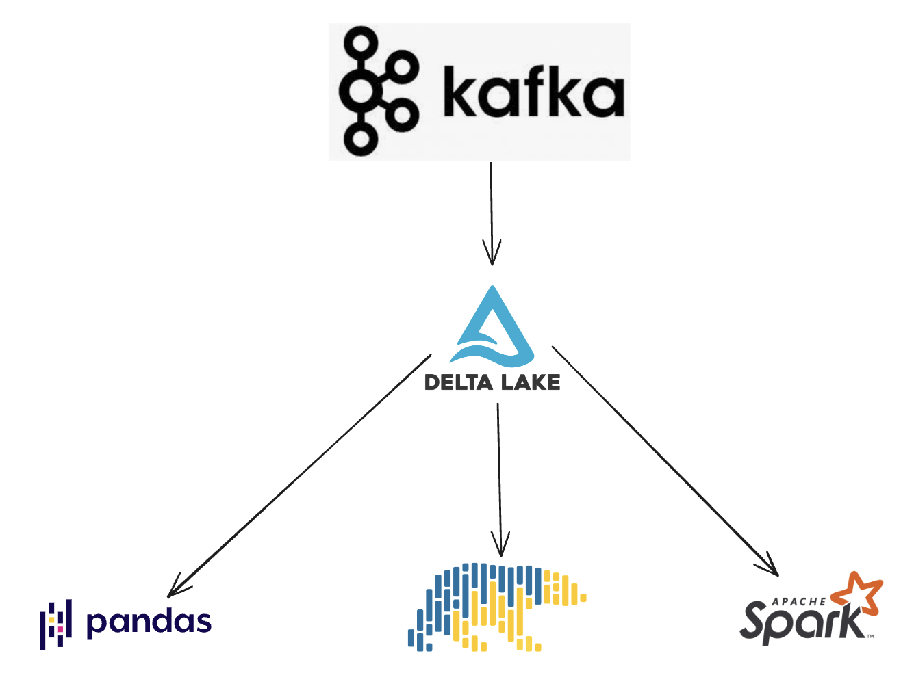

This blog post explains how to convert a Kafka stream to a Delta Lake table with Spark Structured Streaming.

Data is usually only stored in Kafka for between a couple of hours or a few days, so it’s often best to persist this data in a longer-term storage format. Delta Lake provides lots of data management techniques that are useful for streaming use cases. Delta Lake also allows for fast downstream queries with a variety of engines.

Let’s start by showing how to read a Kafka stream and write to a Delta Lake table



## Read Kafka stream and write to a Delta Lake table periodically

Suppose you have a Kafka stream that’s outputting data in the following JSON format:

```
{"student_name":"someXXperson", "graduation_year":"2023", "major":"math"}
{"student_name":"liXXyao", "graduation_year":"2025", "major":"physics"}
```

The `student_name` field contains the first name and last name delimited by `XX`. We want to ingest this Kafka stream into a Delta table and split the `student_name` field into `first_name` and `last_name` fields.

Here’s how to read a Kafka stream into a Spark DataFrame:

```
df = (
    spark.readStream.format("kafka")
    .option("kafka.bootstrap.servers", "host1:port1,host2:port2")
    .option("subscribe", subscribeTopic)
    .load()
)
```

We need to manually define the schema of the Kafka stream to ingest it:

```python
schema = StructType([
 StructField("student_name", StringType()),
 StructField("graduation_year", StringType()),
 StructField("major", StringType()),
])
```

Create a function that will process the JSON input data and return a properly formatted Spark DataFrame that can be output to the Delta table:

```
def with_normalized_names(df, schema):
    parsed_df = (
        df.withColumn("json_data", from_json(col("value").cast("string"), schema))
        .withColumn("student_name", col("json_data.student_name"))
        .withColumn("graduation_year", col("json_data.graduation_year"))
        .withColumn("major", col("json_data.major"))
        .drop(col("json_data"))
        .drop(col("value"))
    )
    split_col = split(parsed_df["student_name"], "XX")
    return (
        parsed_df.withColumn("first_name", split_col.getItem(0))
        .withColumn("last_name", split_col.getItem(1))
        .drop("student_name")
    )
```

Now create a function that will read all of the new data in Kafka whenever it’s run.

```
def perform_available_now_update():
    checkpointPath = "data/tmp_students_checkpoint/"
    deltaPath = "data/tmp_students_delta"
    return df.transform(lambda df: with_normalized_names(df)).writeStream.trigger(
        availableNow=True
    ).format("delta").option("checkpointLocation", checkpointPath).start(deltaPath)
```

Invoke the `perform_available_now_update()` function and see the contents of the Delta table.

```
perform_available_now_update()
spark.read.format("delta").load(deltaPath).show()
```

We can invoke the `perform_available_now_update()` function whenever we’d like to update the Delta table with the latest data in the Kafka stream. You can run this function every 10 minutes, every hour, or every day depending on the latency needs of your business.

The `checkpointPath` tracks the Kafka data that’s already been processed, so you don’t need to manually track the data that’s already been ingested into the Delta table. Spark Structured Streaming makes these incremental updates quite easy.

## Read Kafka stream and write to a Delta Lake table continuously

In the previous example, we showed how to read the Kafka stream with the trigger to `availableNow` which allows for periodic processing. Now let’s see how to use Spark Structured Streaming to continuously process new data from the Kafka stream.

Here is a function that reads the latest data from Kafka and continuously process it every 10 seconds:

```
def perform_trigger_fixed_interval_update():
    checkpointPath = "data/tmp_students_checkpoint/"
    deltaPath = "data/tmp_students_delta"
    return df.transform(lambda df: with_normalized_names(df)).writeStream.trigger(
        processingTime='10 seconds'
    ).format("delta").option("checkpointLocation", checkpointPath).start(deltaPath)
```

For continuous streaming, you need a cluster that’s always running. That is usually more expensive than periodically provisioning a new cluster and incrementally processing the new data.

Continuous streaming is good for low-latency data processing pipelines. Incremental processing is good when the latency requirements are higher.

For a continuous streaming query, you can also skip manually setting a trigger and rely on the default trigger. This could have lower latency compared to the processing time trigger if the data can be processed within the pre-defined processing time.

Let’s now turn our attention to how ingesting Kafka streams into Delta tables can create lots of small files.

## Why streaming can cause the small file problem

Query engines perform best when Lakehouse storage systems contain files that are not too big or too small. A Delta table with an excessive number of small files has the small file problem which causes queries to run slowly.

Streaming data from Kafka to Delta tables can cause lots of small files, especially when the latency is low and/or the Delta table uses a Hive-style partition key that’s not conducive for streaming.

If you’re streaming to a Delta table every 5 seconds, then lots of small files are likely to be created. Delta tables that are partitioned by a key like `ingestion_date` shouldn’t create an excessive number of small files. But Delta tables that are partitioned by a high cardinality column, like `medical_code` could also create a lot of small files. See this blog post on [the pros and cons of Hive-style partitioning](https://delta.io/blog/pros-cons-hive-style-partionining/) for more details.

You should design your Kafka data ingestion pipelines to generate the minimal number of small files possible. Luckily Delta Lake has a built-in solution to fix the small file problem.

## Small file compaction

Delta Lake makes it easy to compact small files and fix the small file problem.

Whenever a Delta table accumulates a lot of small files, you can run a single-line command to rearrange the small files into properly sized files.

You can also use predicates to only compact a subset of the Delta table, so the operation is relatively lightweight. You can run a job on a daily basis that compacts all the files ingested in the previous day for example.

See this blog post on [Delta Lake small file compaction with OPTIMIZE](https://delta.io/blog/2023-01-25-delta-lake-small-file-compaction-optimize/) to learn more.

Delta Lake also offers several other benefits for Kafka workloads.

## Advantages of Delta Lake for Kafka streaming data

There are several other advantages of Delta Lakes for Kafka workflows.

- [Schema enforcement](https://delta.io/blog/2022-11-16-delta-lake-schema-enforcement/): Delta tables enable schema enforcement by default, so if the schema of the Kafka streaming data changes, mismatched data won’t corrupt your table
- [Schema evolution](https://delta.io/blog/2023-02-08-delta-lake-schema-evolution/): You can optionally enable schema evolution so the schema of your table can change over time.
- [Concurrency control](https://docs.delta.io/latest/concurrency-control.html): Delta Lake offers different types of concurrency control so simultaneous commands will not corrupt the table.
- DML operations: Delta Lake makes it easy to run delete, update, and merge commands.
- Large connector ecosystem: Many engines can read and write to Delta tables. Ingesting a Kafta stream into a Delta table allows the data to be easily read by Spark, pandas, Polars, Trino, and many other query engines, see [the full list of integrations here](https://delta.io/integrations).



There are many good reasons to write Kafka stream data to a Delta table for better downstream processing.

## Conclusion

This blog post has shown you that it’s easy to read a Kafka stream and write it out to a Delta table with Spark Structured Streaming. You can also use other projects to write Kafka streams to Delta tables like [kafka-delta-ingest](https://github.com/delta-io/kafka-delta-ingest). This workflow provides practitioners with lots of benefits, especially when comparing Delta Lake with a traditional data lake. See [this blog post on why Delta Lake is better than Parquet data lakes](https://delta.io/blog/delta-lake-vs-parquet-comparison/) for more details.
