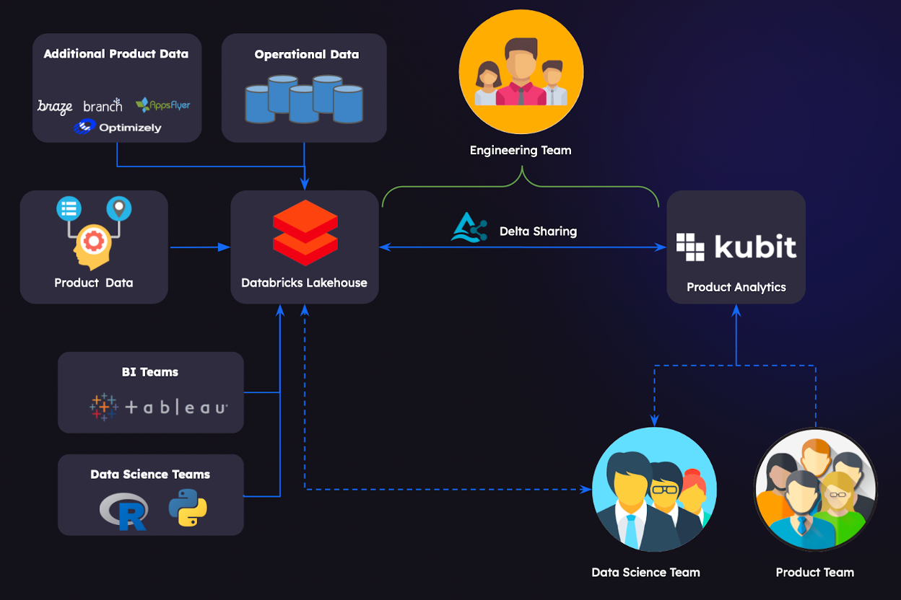

Kubit is a product analytics platform built to leverage data-sharing technologies that works closely with Databricks' Delta Sharing team to create a seamless integration that helps our customers take full advantage of everything that Delta Sharing offers.

## Why Delta Sharing is so Beneficial for Product Analytics

Let's start with a few lines about why Delta Sharing is such a great fit for product analytics, and, in particular, for how Kubit does product analytics.

At Kubit, many of our customers are enterprises with product data on a huge scale–such as media, entertainment, and telecom companies that are dealing with terabytes and even petabytes of streaming data.

Traditional product analytics platforms require companies to send their data to a black box, where they lose visibility over their data and end up paying double. These platforms can't cope with the large and rapidly-growing datasets that today's enterprises are working with.

The result for companies using traditional product analytics tools: they generally have to limit their product analyses to just sampled data. Another issue: getting data back to the Product teams is slowed down by having to run batch ETL jobs. Kubit uses data-sharing technologies like Delta Sharing, whose secure real-time protocols make it easy, fast, and affordable to provide customers with direct access to massive amounts of product data. All without the time, complications, and financial investments of ETLs and SDKs (software development kits).

Kubit has real-time access to the data share, and executes queries using a completely separate runtime environment (Serverless Warehouse) owned and paid for by Kubit. There's not a single byte of data being copied, and customers will never need to worry about compute cost or security exposures.

The advantages of Delta Sharing for product analytics, however, go deeper than just the obvious convenience of their trusted and practical real-time data-sharing workflows.

I'll go into more depth on just some of these below, and also offer some helpful hints for those of you venturing into trying product analytics on Delta Sharing + Kubit.

## Making the Most of Delta Sharing + Kubit

Kubit is designed to encourage self-service analytics, enabling members of the Product and Data teams to do extensive analysis and exploration and easily collaborate with Product, Data, Marketing, and Growth teams.

Delta Sharing makes this easy, and includes features to keep compute costs reasonable. Here are some of them:

#### Get a serverless warehouse

With self-service analytics, queries tend to be executed in sporadic bursts–so it's best to scale your compute resources on-demand. Delta Sharing's [Serverless Compute](https://docs.databricks.com/serverless-compute/index.html) allows you to do just that. Warehouse start-up times are very fast (between 2 and 5 seconds), and you can also auto-suspend after a period of inactivity. These capabilities go a long way towards managing costs because you're not paying for compute when you don't need it.

You can also, of course, adjust the standard controls to scale your warehouse vertically (to handle more computationally-expensive queries), and also horizontally (to allow for more parallel queries).

#### Use partitions wisely

Product data is made up of event-based and time-series data, on which customers tend to run lots of heavy analytical queries. Given that the tables are generally very large (many terabytes), you'll want to optimize your query performance to keep compute costs down and save your analysts' precious time.

The first key to optimizing your query performance: use partitions wisely. I'll explain how to do that. Databricks' storage layer is called [Delta Lake](https://docs.databricks.com/delta/index.html). In essence, it's a bunch of [Parquet files](https://www.databricks.com/glossary/what-is-parquet) with file-based transaction log and scalable metadata handling. A query execution plan starts with a table scan, and one big way to save query execution time is to reduce the scan to as few files as possible.

When working with time-series data for product analytics, it's an absolute must to partition those tables by date. Even simple queries, such as "Tell me how many unique users interacted with my app yesterday?" can easily end up doing a full table scan–if you forget to add the date partition.

Our recommendation is to also think about any other use cases where partitioning might help. For example, if you have multiple product offerings, and if a lot of the analysis will be limited to an individual product, you can also add a product partition.

#### Optimize the tables

Partitioning is one way to reduce the amount of files being scanned. Also, you should be aware that there's a lot of metadata associated with each file–and that's being scanned, too. This is where Delta Sharing's [OPTIMIZE](https://docs.databricks.com/sql/language-manual/delta-optimize.html) can come into play. OPTIMIZE lets you set the file size, and run background tasks to optimize all the table files to that size. You have a couple of options:

- Bin-packing: run over the whole table
- Z-ordering: can be run incrementally on a schedule.

Without getting into too much detail, the incremental nature of Z-ordering tends to be ideal for large tables.

## The Future of Product Analytics on Delta Sharing

Given the reality of product data in today's enterprises–massive, rapidly-growing, and evolving datasets–product analytics tools that use data-sharing technology are the only ones that really make sense.

At Kubit, we're excited about how the security and trusted nature of Delta Sharing can make warehouse-native product analytics a reality for enterprises, with a quick implementation that allows them to work with their own rich data model.

If you have ideas about how to improve product analytics using Delta Sharing, the Kubit team would love to hear from you.

_Stefan Enev is a founding Solutions Engineer at Kubit. You can write to him directly at stefan.enev@kubit.co and you can learn more about Kubit at [kubit.ai](https://kubit.ai/)._
