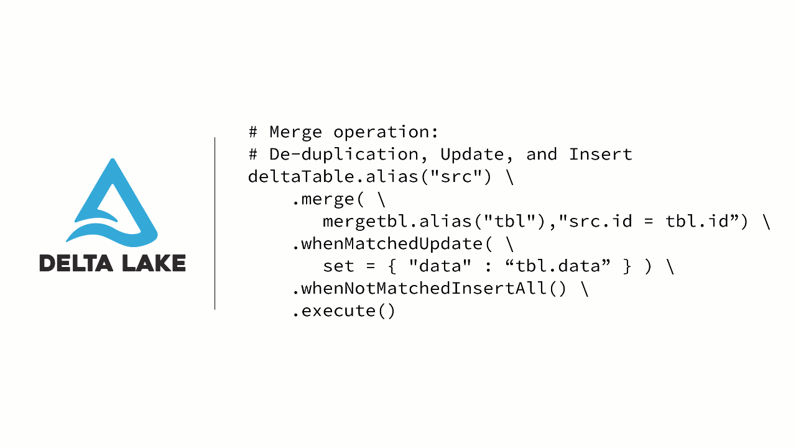

This edition of the Delta Lake Newsletter, find out more about the latest and upcoming webinars, meetups, and publications. For this edition, we will also focus on the many sessions at [Spark+AI Summit EU 2019](https://databricks.com/sparkaisummit/europe) in Amsterdam. Please share this newsletter with anyone who would like to know more about Delta Lake!

## Publications

With the release of [Delta Lake 0.4.0](https://github.com/delta-io/delta/releases/tag/v0.4.0), we have also published the blog [Simple, Reliable Upserts and Deletes on Delta Lake Tables using Python APIs](https://databricks.com/blog/2019/10/03/simple-reliable-upserts-and-deletes-on-delta-lake-tables-using-python-apis.html). A key feature of this release is the Python APIs - review the blog to see how you can get started with Delta Lake in minutes!

- [Diving Into Delta Lake: Schema Enforcement & Evolution](https://databricks.com/blog/2019/09/24/diving-into-delta-lake-schema-enforcement-evolution.html): Understand the details behind how schema enforcement and schema evolution work with this Diving into Delta Lake blog. This is a follow up to popular [Diving Into Delta Lake: Unpacking The Transaction Log](https://databricks.com/blog/2019/08/21/diving-into-delta-lake-unpacking-the-transaction-log.html).
- [Brand Safety with Structured Streaming, Delta Lake, and Databricks](https://databricks.com/blog/2019/09/26/brand-safety-with-structured-streaming-delta-lake-and-databricks.html): To ensure the safety of a company's brand when serving advertisements, Eyeview uses Delta Lake to support its streaming and batch scenarios while also solving issues surrounding underutilized resources and concurrent reads.
- [Engineering population scale Genome-Wide Association Studies with Apache Spark™, Delta Lake, and MLflow](https://databricks.com/blog/2019/09/20/engineering-population-scale-genome-wide-association-studies-with-apache-spark-delta-lake-and-mlflow.html): To perform populate-scale Genome-Wide Association Studies with Apache Spark, the underlying storage structure to support streaming and batch with ACID transactions is Delta Lake.
- [Scaling Bioinformatics Methods with Apache Spark™: Parallelizing SAIGE Across Hundreds of Cores](https://databricks.com/blog/2019/10/02/parallelizing-saige-across-hundreds-of-cores.html): To parallelize Genome-Wide Association Studies workflows such as SAIGE to hundreds of cores, the new Pipe Transformer tool integrates command-line tools with Apache Spark and Delta Lake.
- [Monitor Medical Device Data with Machine Learning using Delta Lake, Keras and MLflow](https://databricks.com/blog/2019/09/12/monitor-medical-device-data-with-machine-learning-using-delta-lake-keras-and-mlflow-on-demand-webinar-and-faqs-now-available.html): A follow up for the *Automated Monitoring of Medical Device Data with Data Science* webinar where you can learn to build a streaming pipeline for EKG data using Structured Streaming and Delta Lake.
- [Productionizing Machine Learning with Delta Lake](https://databricks.com/blog/2019/08/14/productionizing-machine-learning-with-delta-lake.html): Learn how data scientists can productionize their machine learning workflows by having reliable data with Delta Lake and MLflow.

## Webinars

Our most recent webinar was with Tathagata Das on his insightful session [Building Data Pipelines Using Delta Lake and Structured Streaming](https://pages.databricks.com/201909-US-WB-Building-Data-Pipelines-Using-Structured-Streaming-and-Delta-Lake_03.On-demandpage.html). Previous webinars that have a lot of great Delta Lake information include:

- [Simplify and Scale Data Engineering Pipelines with Delta Lake](https://pages.databricks.com/Simplify-and-Scale-Data-Engineering-Pipelines-Delta-Lake_Reg.html)
- [Delta Architecture, a step beyond Lambda Architecture](https://pages.databricks.com/201908-WB-Delta-Architecture-A-Step-Beyond-Lambda-Architecture_Reg.html)
- [Making Apache Spark™ Better with Delta Lake](https://vimeo.com/349735743)
- [Getting Data Ready for Data Science](https://vimeo.com/344418211)
- [Delta Lake - Open Source Reliability for Data Lakes](https://vimeo.com/338100834)
- [Simplifying Streaming Analytics using Delta Lake and Apache Spark™](https://pages.databricks.com/201906-US-WB-FS-Stock-Streaming-Analysis_Reg.html?_ga=2.253598029.571877340.1565187295-69048996.1529121564)

## Spark+AI Summit Delta Lake Sessions

At the [Spark+AI Summit EU 2019 in Amsterdam](https://databricks.com/sparkaisummit/europe), there are a lot of great Delta Lake sessions!

- [Building Data Pipelines for Apache Spark™ with Delta Lake Training Session](https://databricks.com/sparkaisummit/europe/apache-spark-training#building-data-pipelines)
- [New Developments in the Open Source Ecosystem: Apache Spark 3.0, Delta Lake, and Koalas Keynote](https://databricks.com/session_eu19/1-new-developments-in-the-open-source-ecosystem-apache-spark-3-0-delta-lake-and-koalas) with Michael Armbrust and Brooke Wenig
- [Ask Me Anything (AMA): Delta Lake](https://databricks.com/session_eu19/ama-delta-lake)
- [Building Reliable Data Lakes at Scale with Delta Lake (Tutorials)](https://databricks.com/session_eu19/building-reliable-data-lakes-at-scale-with-delta-lake)
- [Building an AI-Powered Retail Experience with Delta Lake, Spark, and Databricks](https://databricks.com/session_eu19/building-an-ai-powered-retail-experience-with-delta-lake-spark-and-databricks)
- [Simplify and Scale Data Engineering Pipelines with Delta Lake](https://databricks.com/session_eu19/simplify-and-scale-data-engineering-pipelines-with-delta-lake)
- [Powering Asurion's Connected Home Platform with Spark Structured Streaming, Delta Lake, and MLflow](https://databricks.com/session_eu19/powering-asurions-connected-home-platform-with-spark-structured-streaming-delta-lake-and-mlflow)
- [Petabytes, Exabytes, and Beyond: Managing Delta Lakes for Interactive Queries at Scale](https://databricks.com/session_eu19/petabytes-exabytes-and-beyond-managing-delta-lakes-for-interactive-queries-at-scale)
- [Power Your Delta Lake with Streaming Transactional Changes](https://databricks.com/session_eu19/power-your-delta-lake-with-streaming-transactional-changes)
- [Driver Location Intelligence at Scale using Apache Spark, Delta Lake, and MLflow on Databricks](https://databricks.com/session_eu19/driver-location-intelligence-at-scale-using-apache-spark-delta-lake-and-mlflow-on-databricks)
- [Designing ETL Pipelines with Structured Streaming and Delta Lake---How to Architect Things Right](https://databricks.com/session_eu19/designing-etl-pipelines-with-structured-streaming-and-delta-lake-how-to-architect-things-right)
- [Building Data Intensive Analytic Application on Top of Delta Lakes](https://databricks.com/session_eu19/building-data-intensive-analytic-application-on-top-of-delta-lakes)
- [Data Reproducibility, Audits, Immediate Rollbacks, and Other Applications of Time Travel with Delta Lake](https://databricks.com/session_eu19/data-reproducibility-audits-immediate-rollbacks-and-other-applications-of-time-travel-with-delta-lake)
- [Near Real-Time Data Warehousing with Apache Spark and Delta Lake](https://databricks.com/session_eu19/near-real-time-data-warehousing-with-apache-spark-and-delta-lake)

Come join us for these and other great sessions and the fun events! Use the code "Denny20" to get a 20% discount!

## Meetups and Events

Last week, we had a great Delta Lake session in Seattle, WA (United States) featuring Michael Armbrust presenting at [Delta Lake: Open Source Reliability for Data Lake with Apache Spark™](https://www.meetup.com/Seattle-Spark-Meetup/events/263821400/).

Featured here is Michael Armbrust speaking about Delta Lake and Judy Nash (organizer of the event at Salesforce Bellevue Offices) and Michael taking a picture with the Apache Spark cake! In the past month, we've had the following great meetups:

- 2019-08-22: Mahdi Askari presenting [Making Apache Spark™ Better with Delta Lake](https://www.meetup.com/Melbourne-Data-Engineering-Meetup/events/262658285/?_xtd=gqFyqTE4NDkwNjUzNaFwpmlwaG9uZQ&from=ref) in Melbourne, Australia.
- 2019-08-27: (Bonus) Denny Lee presenting [Simplifying the Machine Learning Lifecycle with MLflow and Koalas](https://www.meetup.com/Seattle-Spark-Meetup/events/263820543/) in Seattle, USA
- 2019-09-03: Daniel Arrizza presenting [Making Apache Spark™ Better with Delta Lake](https://www.meetup.com/Big-Data-Montreal/events/264229233/) in Montréal, Canada
- 2019-09-04: Tathagata Das presenting [Making Data Lakes More Reliable with Apache Spark](https://www.meetup.com/PDX-Data-Engineering/events/264400603/) in Portland, United States
- 2019-09-05: Mladen Kovacevic presenting [Making Apache Spark™ Better with Delta Lake](https://www.meetup.com/TAS-2-0-Toronto-Apache-Spark/events/264075662/) in Toronto, Canada.
- 2019-09-05: Quentin Ambard presenting [Delta Lake: Bring data reliability and performance to your data lakes](https://www.meetup.com/fr-FR/Paris-Spark-Meetup/events/264311260/) in Paris, France.
- 2019-09-12: Sajith Appukuttan presenting [Delta Lake: Open Source Reliability w/ Apache Spark™](https://www.meetup.com/Vancouver-Spark/events/263865177/) in Vancouver, Canada. Bonus, Bilal Obeidat presenting Customer (Residual) Lifetime Value CLV on Databricks.
- 2019-09-18: Boudewijn Braams presenting [Parquet Optimisations and Building Spark Data Pipelines](https://www.meetup.com/Spark-London/events/264184808/) in London, England.
- 2019-09-19: Reza Soltani Rezvandeh from Antares presenting [Making Apache Spark™ Better with Delta Lake](https://www.meetup.com/Sydney-Data-Engineering-Meetup/events/262330474/)
- 2019-09-24: Vincent Jolivet presenting [Delta Lake: Open Source Reliability for Data Lake with Apache Spark™](https://www.meetup.com/Lisbon-Databricks/events/262672006/?_xtd=gqFyqDIxNjk4NjkxoXCnYW5kcm9pZA&from=ref) in Lisbon, Portugal
- 2019-09-26: Xiao Li presenting [New Developments in Open Source Ecosystem: Apache Spark 3.0, Koalas, Delta Lake](https://yunqi.youku.com/2019/hangzhou/schedule?spm=a2c4e.11165380.1384564.3.3cbb30e10dCpZI) in Hangzhou, China.

For the month of October, there are also the following Delta Lake meetups:

- 2019-10-03: Daniel Arriza presenting [Productionizing Machine Learning with Delta Lake, Koalas, and MLflow](https://www.meetup.com/TAS-2-0-Toronto-Apache-Spark/events/265047255/) in Toronto, Canada
- 2019-10-08: Daniel Arriza presenting [Making Apache Spark™ Better with Delta Lake](https://www.meetup.com/Big-Data-Montreal/events/264822429/) in Montreal, Canada
- 2019-10-17: Xiao Li presenting [Delta Lake: Open Source Reliability for Data Lake with Apache Spark™](https://qcon.infoq.cn/2019/shanghai/presentation/1918) at [QCon in Shanghai (10/17/2019-10/19/2019)](https://qcon.infoq.cn/2019/shanghai/)
- 2019-10-24: [Bonus Session]: Matei Zaharia presenting [Simplifying Production Machine Learning with MLflow](https://www.meetup.com/tordatascience/events/265120720/) in Toronto, Canada.

We are also planning more meetups - and if you're interested in presenting or hosting one, please contact us! If you have any questions about how to run a meetup please do not hesitate to ping us via the Delta Lake Slack [#events](https://app.slack.com/client/TGABZH3N0/CM7HUSLSG) channel.

If you have any questions or feedback, please do not hesitate to provide feedback on the [#deltalake-oss](https://app.slack.com/client/TGABZH3N0/CJ70UCSHM) Slack channel. Join the Delta Lake Channel ([Register](https://join.slack.com/t/delta-users/shared_invite/enQtNTY1NDg0ODcxOTI1LWJkZGU3ZmQ3MjkzNmY2ZDM0NjNlYjE4MWIzYjg2OWM1OTBmMWIxZTllMjg3ZmJkNjIwZmE1ZTZkMmQ0OTk5ZjA) | [Login](https://delta-users.slack.com/)) and join the [Delta Users Email Distribution List](https://groups.google.com/forum/#!forum/delta-user) today!

Thanks!

Denny Lee, Developer Advocate
