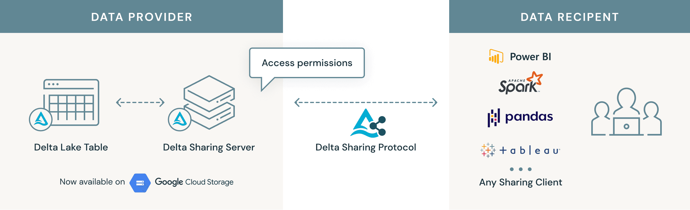
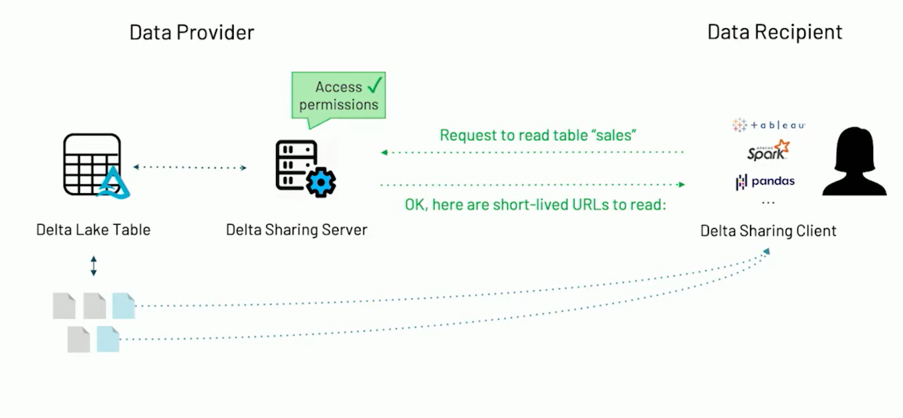

We are excited for the [release](https://github.com/delta-io/delta-sharing/releases/tag/v0.4.0) of Delta Sharing 0.4.0 for the open-source data lake project Delta Lake. The latest release introduces several key enhancements and bug fixes, including the following features:

- **Delta Sharing is now available for Google Cloud Storage** - You can now share Delta Tables on the Google Cloud Platform ([#81](https://github.com/delta-io/delta-sharing/pull/81), [#105](https://github.com/delta-io/delta-sharing/pull/105))
- **A new API for getting the metadata of a Delta Share** - a new `GetShare` REST API has been added for querying a Share by its name ([#95](https://github.com/delta-io/delta-sharing/pull/95), [#97](https://github.com/delta-io/delta-sharing/pull/97))
- **Delta Sharing Protocol and REST API enhancements** - the Delta Sharing protocol has been extended to include the Share Id and Table Ids, as well improved response codes and error codes ([#85](https://github.com/delta-io/delta-sharing/pull/85), [#89](https://github.com/delta-io/delta-sharing/pull/89), [#93](https://github.com/delta-io/delta-sharing/pull/93), [#98](https://github.com/delta-io/delta-sharing/pull/98))
- **Customize a recipient sharing profile in the Apache Spark™ connector** - a new Delta Sharing Profile Provider has been added to the Spark connector to enable easier access of the sharing profile ([#99](https://github.com/delta-io/delta-sharing/pull/99), [#107](https://github.com/delta-io/delta-sharing/pull/107))

In this blog post, we will go through each of the improvements in this release.

## Delta Sharing on Google Cloud Storage

New to this release, you can now share Delta Tables in [Google Cloud Storage](https://cloud.google.com/storage) using the reference implementation of a Delta Sharing Server.



<b>
  Fig.1 - With Delta Sharing 0.4.0, you can now share Delta Tables stored on
  Google Cloud Storage.
</b>

### Delta Sharing on Google Cloud Storage example

Sharing Delta Tables on Google Cloud Storage is easier than ever! For example, to share a Delta Table called `Time`, you can simply update the Delta Sharing server configuration with the location of the Delta table on Google Cloud Storage:

```yaml
version: 1
shares:
- name: "vaccineshare"
 schemas:
 - name: "samplecoviddata"
   tables:
   - name: "time"
     location: "gs://deltasharingexample/COVID/Time"
```

<b>
  {" "}
  Code.1 - Delta Sharing Server configuration file containing the location to a Delta
  table on Google Cloud Storage.
</b>
<br />
<br />

The Delta Sharing server will automatically process the data on Google Cloud Storage for a Delta Sharing query.

### Authenticating with Google Cloud Storage

The Delta Sharing Server acts as a gatekeeper to the underlying data in a Delta Share. When a recipient queries a Delta table in a Delta Share, the Delta Sharing Server first checks the permissions to make sure the data recipient has access to data. Next, if access is permitted, the Delta Sharing Server will look at the file objects that make up the Delta table and smartly filter down the files if a predicate is included in the query, for example. Finally, the Delta Sharing Server will generate short-lived, pre-signed URLs that allow the data recipient to access the files, or subset of files, from the Delta Sharing Client directly from cloud storage rather than streaming the data through the Delta Sharing Server.



<b>
  Fig.2 - The Delta Sharing Server acts as a gatekeeper to the underlying data
  in a Delta Share.
</b>
<br />
<br />

In order to generate the short-lived file URLs, the Delta Sharing Server uses a [Service Account](https://cloud.google.com/iam/docs/service-accounts) to read Delta tables from Google Cloud Storage. To configure the Service Account credentials, you can set the environment variable `GOOGLE_APPLICATION_CREDENTIALS` before starting the Delta Sharing Server.

```bash
export GOOGLE_APPLICATION_CREDENTIALS="/config/keyfile.json"
```

<b>
  {" "}
  Code.2 - Setting the location to the GCS keyfile as an environment variable on
  the Delta Sharing server.
</b>

## New API for getting a Delta Share

Sometimes, it might be helpful for a recipient to check if they still have access to a Delta Share. This release adds a new REST API, `GetShare`, so that users can quickly test if a Delta Share has exceeded its expiration time.

For example, to check if you still have access to a Delta Share you can simply send a `GET` request to the `/shares/{share_name}` endpoint on the sharing server:

```python
import requests
import json

response = requests.get(
   "http://localhost:8080/delta-sharing/shares/airports",
   headers={
       "Authorization":"Bearer token"
   }
)
print(json.dumps(response.json(), indent=2))
```

<b>
  {" "}
  Code.3 - Example GET request sent to the sharing server that enables recipients
  to check whether or not they still have access to a Delta Share.
</b>
<br />
<br />

```json
{
  "share": {
    "name": "airports"
  }
}
```

<b>
  {" "}
  Code.4 - Example response received from the GetShare REST API that is new to the Delta Sharing 0.4.0 release.

</b>
<br/><br/>

If the Delta Share has exceeded its expiration, the Sharing server will respond with a `403` HTTP error code.

## Delta Sharing protocol enhancements

Included in this release are improved error codes and error messages in the Delta Sharing protocol definition. For example, if a Delta Share is not located on the Delta Sharing Server, an error code and error message containing the details of the error is now included in this release.

```python
import requests
import json

response = requests.get(
   "http://localhost:8080/delta-sharing/shares/yellowcab",
   headers={
       "Authorization":"Bearer token"
   }
)
print(json.dumps(response.json(), indent=2))
```

<b>
  {" "}
  Code.5 - Example GET request for a Share that does not exist on the Delta Sharing Server.

</b>
<br/><br/>

```json
{
  "errorCode": "RESOURCE_DOES_NOT_EXIST",
  "message": "share 'yellowcab' not found"
}
```

<b>
  {" "}
  Code.6 - Example response containing an improved error code and details about the error that is new to the Delta Sharing 0.4.0 release.

</b>
<br/><br/>

Furthermore, this release extends the Delta Sharing Protocol to respond with the unique Delta Share and Table Ids. Unique Ids help the data recipient disambiguate the name of datasets as time passes. This is especially useful when the data recipient is a large organization and wants to apply access control on the shared dataset within their organization

## Customizing a recipient Sharing profile

The Delta Sharing profile file is a JSON configuration file that contains the information for a recipient to access shared data on a Delta Sharing server. A new provider has been added in this release that enables easier access to the Delta Sharing profile for data recipients.

```scala
/**
 * A provider that provides a Delta Sharing profile for data
 * recipients to access the shared data.
 */
trait DeltaSharingProfileProvider {
 def getProfile: DeltaSharingProfile
}
```

<b>
  {" "}
  Code.7 - The Delta Sharing profile file is a JSON configuration file that contains the information for a recipient to access shared data on a Delta Sharing server.

</b>

## What’s next

We are already gearing up for many new features in the next release of Delta Sharing. You can track all the upcoming releases and planned features in [GitHub milestones](https://github.com/delta-io/delta-sharing/milestones).

## Credits

We’d like to extend a special thanks for the contributions to this release to Denny Lee, Lin Zhou, Shixiong Zhu, William Chau, Xiaotong Sun, Kohei Toshimitsu.

Visit the [release notes](https://github.com/delta-io/delta-sharing/releases/tag/v0.4.0) to learn more about the release.
