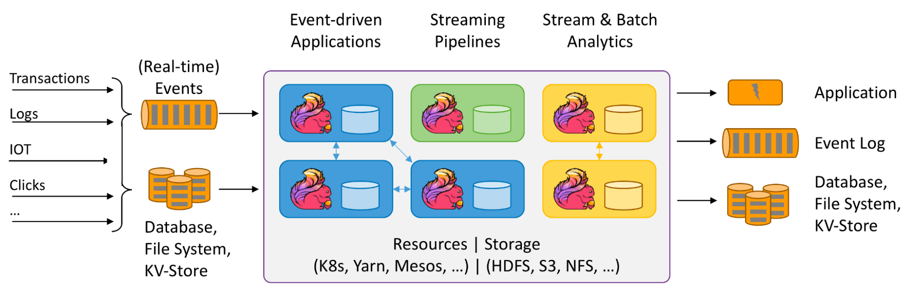
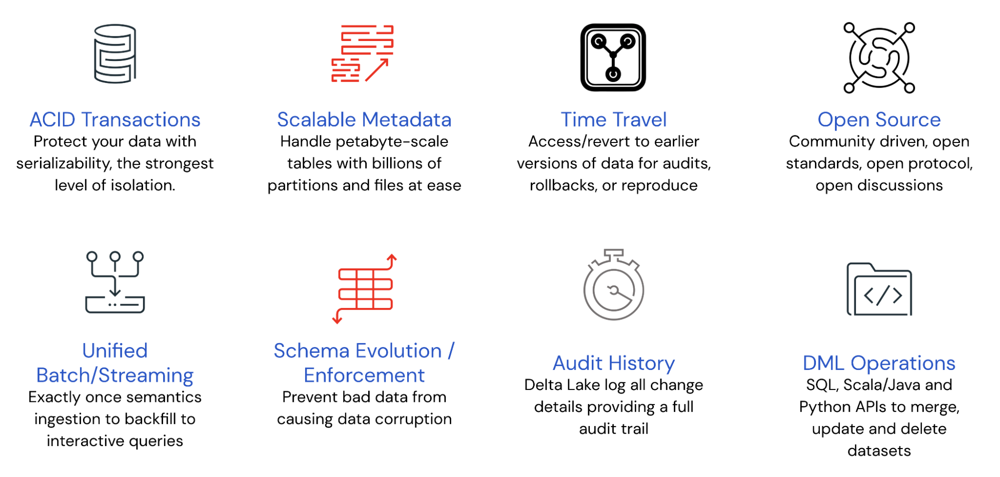
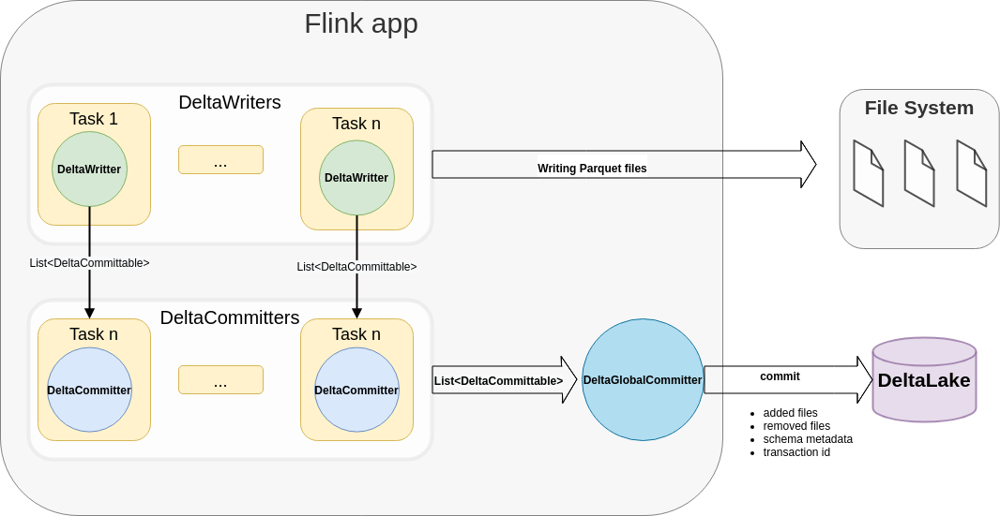

One of the most exciting aspects of the [Delta Connectors 0.3.0](https://github.com/delta-io/connectors/releases/tag/v0.3.0) is the addition of write functionality with new APIs to support creating and writing Delta tables without [Apache Spark™](https://spark.apache.org/). The latest release [0.4.0](https://github.com/delta-io/connectors/releases/tag/v0.4.0) of Delta Connectors introduces the [Flink/Delta Connector](https://github.com/delta-io/delta/tree/master/connectors/flink), which provides a sink that can write Parquet data files from Apache Flink and commit them to Delta tables atomically. This sink uses Flink’s [DataStream API](https://nightlies.apache.org/flink/flink-docs-release-1.14/docs/dev/datastream/overview/) and supports both batch and streaming processing.

A bit of background for [Apache Flink](https://flink.apache.org/) and [Delta Lake](https://delta.io/) before we dive into the details for the connector.

## Apache Flink - Distributed processing engine for stateful computations

Apache Flink is an open source distributed processing system for both streaming and batch data. It is designed to run in all common cluster environments, perform computations at in-memory speed and at any scale with fault tolerance and extremely low-latency. You can use Flink to process high volume real-time data streams as the data is being generated and after it is stored in a storage system. This enables real-time streaming applications and analytics.



In order to write a Flink program, users need to use API-agnostic connectors and a FileSource and FileSink to read and write data to external data sources such as Apache Kafka, Elasticsearch and so on. All connectors are in the general part of the program submitted to Flink. In this case, a program is either a jar that contains the connector dependency (DataStream API, Table API) or a SQL query where it is assumed that the Flink cluster can access the connector dependency accordingly.
For more information about Flink, see the [Apache Flink documentation](https://nightlies.apache.org/flink/flink-docs-stable/).

## Delta Lake - Open Source Data Lake Storage Standards

Delta Lake is an open-source project built for data [lakehouses](http://cidrdb.org/cidr2021/papers/cidr2021_paper17.pdf) supporting compute engines including Spark, PrestoDB, Flink, and Hive with APIs for Scala, Java, Rust, and Python. It is a data storage layer that brings reliability and improved performance to data lakes by providing [ACID transactions](https://docs.databricks.com/delta/concurrency-control.html), easily handling metadata for peta-byte scale partitions and unifying streaming and batch transactions on top of existing cloud data stores.

Delta Lake is fundamentally an advanced storage system that consists of storing data in parquet files with partitions, and maintains a rich transaction log to be able to provide capabilities like ACID transactions and time travel. In addition, the log also contains metadata such as min/max statistics for each data file, enabling an order of magnitude faster metadata searches than the “files in object store” approach. For more information, refer to VLDB whitepaper [Delta Lake: High-Performance ACID Table Storage over Cloud Object Stores](https://databricks.com/wp-content/uploads/2020/08/p975-armbrust.pdf).

The features listed in the diagram below make Delta Lake the optimal solution for building data lakehouses.



Delta uses optimistic concurrency protocols for storing metadata and transaction state in the underlying object store. This means that Delta tables can maintain state without needing any actively running servers and instead only need servers for executing queries, thus leveraging the benefits of separately scaling compute and storage.

## Native Flink Delta Lake Connector

For those of you who have leveraged Flink to build real-time streaming applications and/or analytics, we are excited to announce the new [Flink/Delta Connector](https://github.com/delta-io/delta/blob/master/connectors/flink/README.md) that enables you to store data in Delta tables such that you harness Delta’s reliability and scalability, while maintaining Flink’s end-to-end exactly-once processing.

The Flink/Delta Connector is designed to create Flink’s DataStreams API sinks for both batch and streaming use cases in append mode. The connector ensures that the data from Flink is written to Delta Tables in an idempotent manner such that even if the Flink pipeline is restarted from its checkpoint information, the pipeline will guarantee no data is lost or duplicated thus preserving the exactly-once semantics of Flink. If the pipeline is restarted without a checkpoint, then there are no guarantees for exactly-once processing.

Flink Delta Sink connector consists of the following key components:

### DeltaWriter

The goal of a <code>DeltaWriter</code> is to manage bucket writers for partitioned tables and pass incoming events to the correct bucket writer. One writer can write data to multiple buckets (also called partitions) at the same time but only one file per bucket can be in progress (aka “open”) state. If the Delta table is not partitioned, then there will be only one bucket writer for one DeltaWriter that will be writing to the table’s root path.

Delta files can be in 3 different states:

- **In-progress**: Files to which writers are currently appending new records, they are also called “opened” files.
- **Pending** : Files that have already been closed and are waiting to be committed to the Delta log during the next checkpoint. These files are in their final state and will not be appended anymore, only renamed during <code>DeltaCommitter.commit</code> operation.
- **Finished** : Files already written, closed, and successfully committed to Delta table.

### DeltaCommittable

This committable is either for one pending file to commit or one in-progress file to clean up. In addition, it contains the metadata of the written file, application unique identifier (<code>appId</code>), and <code>checkpointId</code> to which the committable belongs.

### DeltaCommitter

DeltaCommitter is responsible for committing the “pending” files and moving them to a “finished” state, so they can be consumed by downstream applications or systems. It receives various DeltaCommittables from DeltaWriter and commits the files locally, putting them in “finished” state so that they can be committed to the Delta log during the global commit.

### DeltaGlobalCommitter

The Global Committer combines multiple lists of DeltaCommittables received from multiple DeltaCommitters and commits all files to the Delta log.

## Architecture

The following architecture diagram illustrates how the data is written from a Flink application to Delta Lake tables. Each Flink job can have multiple parallel <code>DeltaWriter</code>s, <code>DeltaCommitter</code>s, and only one <code>DeltaGlobalCommitter</code>. For each checkpoint, DeltaWriter combines a list of DeltaCommittables from multiple bucket writers and sends it to the DeltaCommitter instance, which then is responsible for locally committing the files and marking them ready to be committed to the Delta log. DeltaGlobalCommiter combines the DeltaCommitables from all the DeltaCommitters and commits the files to the Delta Log.



### Implementation - Writing data from Flink into Delta Lake tables

The [Flink/Delta Lake Connector](https://github.com/delta-io/delta/tree/master/connectors/flink/) is a JVM library to read and write data from Apache Flink applications to Delta Lake tables utilizing the [Delta Standalone JVM library](https://github.com/delta-io/delta/tree/master/connectors#delta-standalone). It includes:

- Sink for writing data from Apache Flink to a Delta table ([#111](https://github.com/delta-io/connectors/issues/111), [design document](https://docs.google.com/document/d/19CU4eJuBXOwW7FC58uSqyCbcLTsgvQ5P1zoPOPgUSpI/edit#heading=h.gjdgxs))
  - Note, we are also working on creating a <code>DeltaSink</code> using Flink’s **Table API** (PR [#250](https://github.com/delta-io/connectors/pull/250)).
- Source for reading Delta Lake's table using Apache Flink ([#110](https://github.com/delta-io/connectors/issues/110), still in progress)

The Flink/Delta Sink is designed to work with Flink >= 1.12 and provides exactly-once delivery guarantees. This connector is dependent on the following packages:

- <code>delta-standalone</code>
- <code>flink-parquet</code>
- <code>flink-table-common</code>
- <code>hadoop-client</code>

Please refer to the linked build file examples for [maven](https://github.com/delta-io/delta/tree/master/connectors/flink#maven) and [sbt](https://github.com/delta-io/delta/tree/master/connectors/flink#sbt).

#### 1. Sink creation for non-partitioned tables

In this example we show how to create a <code>DeltaSink</code> and plug it to an existing <code>org.apache.flink.streaming.api.datastream.DataStream</code>.

```scala
package com.example;

import io.delta.flink.sink.DeltaSink;
import org.apache.flink.core.fs.Path;
import org.apache.flink.streaming.api.datastream.DataStream;
import org.apache.flink.table.data.RowData;
import org.apache.flink.table.types.logical.RowType;
import org.apache.hadoop.conf.Configuration;

public class DeltaSinkExample {

    public DataStream<RowData> createDeltaSink(DataStream<RowData> stream,
                                               String deltaTablePath,
                                               RowType rowType) {
        DeltaSink<RowData> deltaSink = DeltaSink
            .forRowData(
                new Path(deltaTablePath),
                new Configuration(),
                rowType)
            .build();
        stream.sinkTo(deltaSink);
        return stream;
    }
}
```

#### 2. Sink creation for partitioned tables

In this example we show how to create a <code>DeltaSink</code> for <code>org.apache.flink.table.data.RowData</code> to write data to a partitioned table using one partitioning column <code>surname</code>.

```scala
package com.example;

import io.delta.flink.sink.DeltaBucketAssigner;
import io.delta.flink.sink.DeltaSink;
import io.delta.flink.sink.DeltaSinkBuilder;
import org.apache.flink.core.fs.Path;
import org.apache.flink.streaming.api.datastream.DataStream;
import org.apache.flink.table.data.RowData;
import org.apache.flink.table.types.logical.RowType;

public class DeltaSinkExample {

  public static final RowType ROW_TYPE = new RowType(Arrays.asList(
          new RowType.RowField("name", new VarCharType(VarCharType.MAX_LENGTH)),
          new RowType.RowField("surname", new VarCharType(VarCharType.MAX_LENGTH)),
          new RowType.RowField("age", new IntType())
  ));

  public DataStream<RowData> createDeltaSink(DataStream<RowData> stream,
                                             String deltaTablePath) {
    String[] partitionCols = {"surname"};
    DeltaSink<RowData> deltaSink = DeltaSink
            .forRowData(
                new Path(deltaTablePath),
                new Configuration(),
                rowType)
            .withPartitionColumns(partitionCols)
            .build();
    stream.sinkTo(deltaSink);
    return stream;
  }
}
```

More information on how to build and test is [here](https://github.com/delta-io/delta/tree/master/connectors/flink).

## What’s next?

- Currently only DeltaSink is supported, and thus the connector only supports writing to Delta tables. Support for reading Delta tables is being worked on as noted in [Delta Source for Apache Flink (#110)](https://github.com/delta-io/connectors/issues/110).
- Flink/Delta Sink supports the append mode today and support for other modes like overwrite, upsert, etc. will be added in the upcoming releases.
- The current version only supports the Flink Datastream API. Support for Flink Table API / SQL, along with Flink Catalog's implementation for storing Delta table's metadata in an external metastore, are planned as noted in [Extend Delta connector for Apache Flink's Table APIs (#238)](https://github.com/delta-io/connectors/issues/238).
