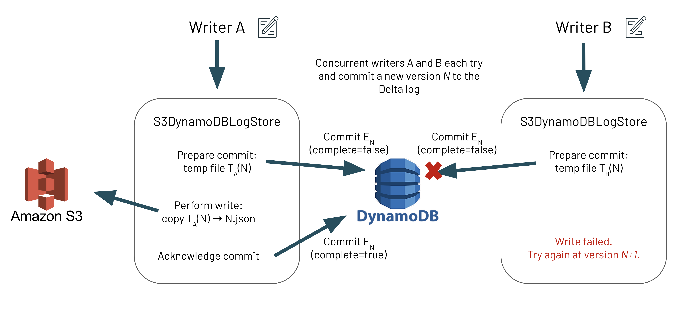

While Delta Lake has supported concurrent reads from multiple clusters since its inception, there were limitations for multi-cluster writes specifically to Amazon S3. Note, this was not a limitation for Azure ADLSgen2 nor Google GCS, as S3 currently lacks "_put-If-Absent_" consistency guarantees. Thus, to guarantee ACID transactions on S3, one would need to have concurrent writes originating from the same Apache Spark™ driver. This was one of the most requested [issues](https://github.com/delta-io/delta/issues/41) by the community and we are excited to announce that Delta Lake 1.2 ([release notes](https://github.com/delta-io/delta/releases/tag/v1.2.0), [blog](https://delta.io/blog/2022-05-05-delta-lake-1-2-released/)) now supports writing data from multiple clusters to S3 while maintaining the transactionality of the writes.

## S3 Multi-Cluster Writes

As noted earlier, Delta Lake did not have multi-cluster S3 writes until now due to S3 not supporting the “put-if-absent” consistency guarantee. Without this guarantee, Delta Lake is unable to achieve mutual exclusion during cross-cluster writes, as there would be no way to ensure that only one writer is creating or renaming a given file at a time. Let’s dive into why this is crucial for Delta Lake ACID transaction guarantees and how we have overcome it in Delta Lake 1.2.

Delta Lake manages atomicity for transactions by committing to a [transaction log](https://databricks.com/blog/2019/08/21/diving-into-delta-lake-unpacking-the-transaction-log.html) which creates a new log file only if it is not already present in the S3 storage system. However, S3 does not provide a way to atomically check if the file is present before writing it, which potentially causes concurrent writers to commit the same version of the file multiple times, thus overwriting previous changes in the file. This can cause data loss. With the new [S3DynamoDBLogStore](https://github.com/delta-io/delta/pull/1044) [LogStore API](https://github.com/delta-io/delta/blob/master/storage/src/main/java/io/delta/storage/LogStore.java), Delta Lake can now allow all writers across multiple clusters and/or Spark drivers to concurrently write to Delta Lake S3 while ensuring that only one writer succeeds with each transaction. This maintains atomicity and prevents file contents from ever being overwritten.

In order to build this mutual exclusion on top of S3, Delta Lake maintains a DynamoDB table that contains information on which files have attempted to commit and which files have successfully completed writing. By leveraging the atomic update operations of DynamoDB, Delta Lake can ensure that, for any number of concurrent writers and for a given file, only one writer will win and be allowed to write into S3.

### Design

Let’s take a look at how Delta Lake is designed under the hood to guarantee ACID transactions for writes from multiple clusters and/or Spark drivers to S3. It is important to note that we are discussing the [transaction log](https://databricks.com/blog/2019/08/21/diving-into-delta-lake-unpacking-the-transaction-log.html) writes to the <code>\_delta_log</code> folder; we are not referring to the writes for the Parquet data files. A new write algorithm inside of [S3DynamoDBLogStore](https://github.com/delta-io/delta/pull/1044) ensures that writers will first prepare the file commit by writing metadata (approx. 200 bytes) to DynamoDB before writing transaction log entries to the FileSystem. Writes to DynamoDB use the [PutItem](https://docs.aws.amazon.com/amazondynamodb/latest/APIReference/API_PutItem.html) operation, which ensures that the entry is only added to the table if it does not already exist. Since this is an atomic operation, if two concurrent writers are both trying to write the same version, only one will win during the DynamoDB commit, thus achieving the mutual exclusion paradigm needed for ACID transactions.

It could be possible that there will be an incomplete entry in DynamoDB and its target file does not exist in the FileSystem. This is solved in two ways:

- Readers will try to fix this by querying DynamoDB for the latest incomplete entry (should be at most one due to our invariant below) and performing a “recovery” operation on it
- Writers will always check that the previous transaction log file exists in the FileSystem, and if not, perform the same “recovery” operation before attempting the current commit



## Why S3 Multi-Cluster Writes at Samba TV?

[Samba TV](https://samba.tv/business) is the global leader in television technology powering real-time insights and audience targeting to enable unparalleled marketing efficiency and effectiveness. The company’s proprietary first-party data from tens of millions of opted-in televisions, across more than 20 TV brands sold in over 100 countries, provides advertisers and media companies a unified view of the entire consumer journey.

At Samba TV, we considered using Delta Lake from its early days in 2019 when it was launched at [Spark + AI Summit 2019](https://databricks.com/sparkaisummit/europe19) in Amsterdam. We were running parallel Spark jobs in Amazon EMR’s (Elastic Map Reduce) multi-cluster environment to process data stored on S3, and we knew Delta Lake wouldn't work for us, as Delta Lake documentation clearly mentioned that S3 was supported only for single cluster scenarios. This was logged as [an issue with the Delta OSS community](https://github.com/delta-io/delta/issues/41) which sparked (pun intended) many interesting discussions on possible solutions.

To tackle the problem, we began implementing these ideas using DynamoDB in this [PR (pull request)](https://github.com/delta-io/delta/pull/339). We tested this approach carefully (e.g. performing numerous stress tests under heavy loads) and we soon began using it in our production systems. Today, we have a number of our high-value datasets (dozens of TBs) stored in Delta Lake S3. We use a single DynamoDB table to store Delta log entries (with no retention policy) amounting to nearly 400K transactions.

Importantly, what Delta Lake provides for us is further CCPA / GDPR compliance. We are a privacy-forward company, and Delta Lake helps us support requests for the removal of personal data.

## Implementation - Writing data from Multi-Cluster into Delta Lake tables in S3

As of version 1.2, Delta Lake supports both concurrent reads and writes from multiple clusters and provides transactional guarantees. This has to be explicitly enabled by configuring Delta Lake to use the right [LogStore](https://github.com/delta-io/delta/blob/master/storage/src/main/java/io/delta/storage/LogStore.java) implementation that uses DynamoDB to provide the mutual exclusion that S3 is lacking.

Ensure that all nodes and/or Spark drivers in your multi-node cluster use this LogStore implementation as well as the same DynamoDB table and region. If some drivers use out-of-the-box Delta Lake while others use this experimental LogStore, there is the potential for data loss.

### Requirements

- S3 credentials: [IAM roles](https://docs.aws.amazon.com/IAM/latest/UserGuide/id_roles.html) (recommended) or access keys
- DynamoDB operating permissions
- Apache Spark associated with the corresponding Delta Lake version.
- Hadoop’s [AWS connector (hadoop-aws)](https://mvnrepository.com/artifact/org.apache.hadoop/hadoop-aws/) for the version of Hadoop that Apache Spark is compiled for.
- JAR Files: [<code>delta-storage-s3-dynamodb artifact</code>](https://mvnrepository.com/artifact/io.delta/delta-storage-s3-dynamodb/1.2.1)

### Setup Configuration

##### 1. Create the DynamoDB table.

You have the choice of creating the DynamoDB table yourself (recommended) or having it created for you automatically.

**Option 1: Creating the DynamoDB table yourself (recommended)**
This DynamoDB table will maintain commit metadata for multiple Delta tables, and it is important that it is configured with the [Read/Write Capacity Mode](https://docs.aws.amazon.com/amazondynamodb/latest/developerguide/HowItWorks.ReadWriteCapacityMode.html) (for example, on-demand or provisioned) that is right for your use cases. As such, we strongly recommend that you create your DynamoDB table yourself. The following example uses the AWS CLI. To learn more, see the [create-table](https://docs.aws.amazon.com/cli/latest/reference/dynamodb/create-table.html) command reference.

```bash
aws dynamodb create-table \
--region us-east-1 \
--table-name delta_log \
--attribute-definitions AttributeName=tablePath,AttributeType=S \
                        AttributeName=fileName,AttributeType=S \
--key-schema AttributeName=tablePath,KeyType=HASH \
             AttributeName=fileName,KeyType=RANGE \
--billing-mode PAY_PER_REQUEST
```

Note: once you select a table-name and region, you will have to specify them in each Spark session in order for this multi-cluster mode to work correctly. See table below

**Option 2: Automatic DynamoDB table creation**
Nonetheless, after specifying this LogStore implementation, if the default DynamoDB table does not already exist, then it will be created for you automatically. This default table supports 5 strongly consistent reads and 5 writes per second. You may change these default values using the table-creation-only configurations keys detailed in the table below.

##### 2. Follow the configuration steps listed in [single-cluster setup](https://docs.delta.io/1.2.0/delta-storage.html#-delta-storage-s3-single-cluster)’s Configuration section.

##### 3. Include the JARs for `delta-storage-s3-dynamodb` and `aws-java-sdk` in the classpath.

##### 4. Configure the LogStore implementation in your Spark session.

First, configure this LogStore implementation for the scheme s3.

```scala
spark.delta.logStore.s3.impl=io.delta.storage.S3DynamoDBLogStore
```

Next, specify additional information necessary to instantiate the DynamoDB client. You must instantiate the DynamoDB client with the same tableName and region each Spark session for this multi-cluster mode to work correctly. A list of per-session configurations and their defaults is given below:

| Configuration Key                                                     | Description                                     | Default                                                                                                                                                  |
| --------------------------------------------------------------------- | ----------------------------------------------- | -------------------------------------------------------------------------------------------------------------------------------------------------------- |
| `spark.io.delta.storage.S3DynamoDBLogStore.ddb.tableName`             | The name of the DynamoDB table to use           | `delta_log`                                                                                                                                              |
| `spark.io.delta.storage.S3DynamoDBLogStore.ddb.region`                | The region to be used by the client             | `us-east-1`                                                                                                                                              |
| `spark.io.delta.storage.S3DynamoDBLogStore.credentials.provider`      | The AWSCredentialsProvider\* used by the client | [`DefaultAWSCredentialsProviderChain`](https://docs.aws.amazon.com/AWSJavaSDK/latest/javadoc/com/amazonaws/auth/DefaultAWSCredentialsProviderChain.html) |
| `spark.io.delta.storage.S3DynamoDBLogStore.provisionedThroughput.rcu` | (Table-creation-only\*\*) Read Capacity Units   | `5`                                                                                                                                                      |
| `spark.io.delta.storage.S3DynamoDBLogStore.provisionedThroughput.wcu` | (Table-creation-only\*\*) Write Capacity Units  | `5`                                                                                                                                                      |

- \*For more details on AWS credential providers, see the [AWS documentation](https://docs.aws.amazon.com/sdk-for-java/v1/developer-guide/credentials.html).
- \*\*These configurations are only used when the given DynamoDB table doesn’t already exist and needs to be automatically created.

<Info title="Important!" level="warning">
  At this point, this multi-cluster setup is fully operational. However, there
  are [extra configuration
  steps](https://docs.delta.io/latest/delta-storage.html#production-configuration-s3-multi-cluster)
  you may do to improve performance and optimize storage when running in
  production.
</Info>

## Discussion

In this blog post, we described the reason why Delta Lake lacked multi-driver/cluster/JVM writes to AWS S3 due to the lack of "_put-if-absent_" consistency guarantees. To resolve this popular issue, we had leveraged our initial issue ([#41](https://github.com/delta-io/delta/issues/41)) and pull request ([#339](https://github.com/delta-io/delta/pull/339)) to build this current solution as described in this post. For more information, please refer to this pull request ([#1044](https://github.com/delta-io/delta/pull/1044)) and design document: [[2021-12-22] Delta OSS S3 Multi-Cluster Writes [Public]](https://docs.google.com/document/d/1Gs4ZsTH19lMxth4BSdwlWjUNR-XhKHicDvBjd2RqNd8/edit#heading=h.mjjuxw9mcz9h). If you have any questions, please join us on Dela Users [Slack](https://go.delta.io/delta-users), [Google Groups](https://groups.google.com/forum/#!forum/delta-users), [LinkedIn](https://linkedin.com/company/deltalake), or join one of our [bi-weekly office hours](http://youtube.com/c/deltalake).
