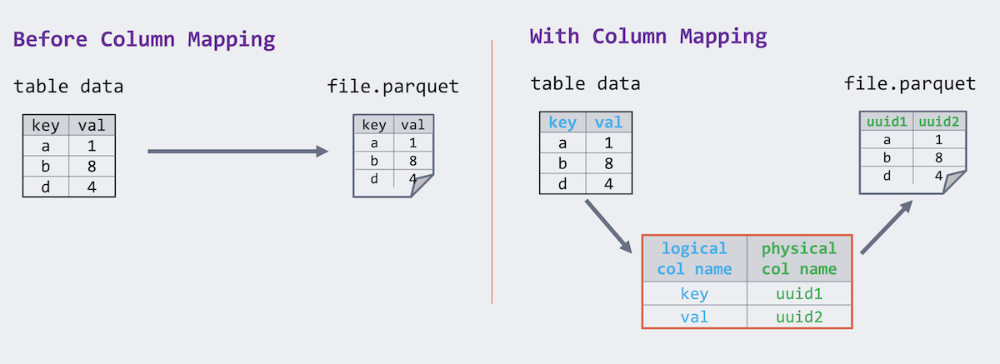

We are happy to announce the release of the Delta Lake 2.0 ([pypi](https://pypi.org/project/delta-spark/),[ maven](https://mvnrepository.com/artifact/io.delta/delta-core_2.13/2.0.0),[ release notes](https://github.com/delta-io/delta/releases/tag/v2.0.0)) on[ Apache Spark™ 3.2](https://spark.apache.org/releases/spark-release-3-2-0.html), with the following features including but not limited to:

- Support for[ change data feed](https://docs.delta.io/2.0.0/delta-change-data-feed.html),
- [Z-Order clustering](https://docs.delta.io/2.0.0/optimizations-oss.html#z-ordering-multi-dimensional-clustering) of data to reduce the amount of data to read,
- Support for[ idempotent writes to Delta tables](https://docs.delta.io/2.0.0/delta-streaming.html#idempotent-table-writes-in-foreachbatch),
- Support for[ dropping columns](https://docs.delta.io/2.0.0/delta-batch.html#drop-columns),
- Support for[ dynamic partition overwrite](https://docs.delta.io/2.0.0/delta-batch.html#dynamic-overwrites), and
- Experimental support for[ multi-part checkpoints](https://docs.delta.io/2.0.0/optimizations-oss.html#multi-part-checkpointing).

The significance of Delta Lake 2.0 is not just a number - though it is timed quite nicely with[ Delta Lake’s 3rd birthday](https://www.meetup.com/spark-users/events/286738371/). It reiterates our collective commitment to the[ open-sourcing of Delta Lake](https://databricks.com/blog/2019/04/24/open-sourcing-delta-lake.html), as announced by[ Michael Armbrust’s Day 1 keynote](https://youtu.be/BqB7YQ1-KKc?t=3025) at[ Data + AI Summit 2022](https://databricks.com/dataaisummit/).


_[Michael Armbrust’s Day 1 keynote](https://youtu.be/BqB7YQ1-KKc?t=3025) during [Data \+ AI Summit 2022](https://databricks.com/dataaisummit/)_

## What’s new in Delta Lake 2.0?

There have been a lot of new features released in the last year between Delta Lake 1.0, 1.2, and now 2.0. This blog will review a few of these specific features that are going to have a large impact on your workload.


### Improving data skipping

When exploring or slicing data using dashboards, data practitioners will often run queries with a specific filter in place. As a result, the matching data is often buried in a large table, requiring Delta Lake to read a significant amount of data. With data skipping via column statistics and Z-Order, the data can be clustered by the most common filters used in queries — sorting the table to skip irrelevant data, which can dramatically increase query performance.

#### Support for data skipping via column statistics

When querying any table from HDFS or cloud object storage, by default, your query engine will scan all of the files that make up your table. This can be inefficient, especially if you only need a smaller subset of data. To improve this process, as part of the[ Delta Lake 1.2](https://github.com/delta-io/delta/releases/tag/v1.2.0) release, we included support for data skipping by utilizing the Delta table’s column statistics.

For example, when running the following query, you do not want to unnecessarily read files outside of the `year` or `uid` ranges.


When Delta Lake writes a table, it will automatically collect the minimum and maximum values and store this directly into the Delta log (i.e. column statistics). Therefore, when a query engine reads the transaction log, those read queries can skip files outside the range of the min/max values as visualized below.


This approach is more efficient than row-group filtering within the Parquet file itself, as you do not need to read the Parquet footer. For more information on the latter process, please refer to[ How Apache Spark™ performs a fast count using the parquet metadata](https://github.com/dennyglee/databricks/blob/master/misc/parquet-count-metadata-explanation.md). For more information on data skipping, please refer to[ data skipping](https://docs.delta.io/2.0.0/optimizations-oss.html#data-skipping).

#### Support Z-Order clustering of data to reduce the amount of data read

But data skipping using column statistics is only one part of the solution. To maximize data skipping, what is also needed is the ability to skip with data clustering. As implied previously, data skipping is most effective when files have a very small minimum/maximum range. While sorting the data can help, this is most effective when applied to a single column.


_Regular sorting of data by primary and secondary columns (left) and 2-dimensional Z-order data clustering for two columns (right)._

But with ​​Z-order, its space-filling curve provides better multi-column data clustering. This data clustering allows column stats to be more effective in skipping data based on filters in a query. See the[ documentation](https://docs.delta.io/2.0.0/optimizations-oss.html#z-ordering-multi-dimensional-clustering) and[ this blog](https://databricks.com/blog/2018/07/31/processing-petabytes-of-data-in-seconds-with-databricks-delta.html) for more details.

### Support Change Data Feed on Delta tables

One of the biggest value propositions of Delta Lake is its ability to maintain data reliability in the face of changing records brought on by data streams. However, this requires scanning and reading the entire table, creating significant overhead that can slow performance.

With Change Data Feed (CDF), you can now read a Delta table’s change feed at the row level rather than the entire table to capture and manage changes for up-to-date silver and gold tables. This improves your data pipeline performance and simplifies its operations.

To enable CDF, you must explicitly use one of the following methods:

- **New table**: Set the table property `delta.enableChangeDataFeed = true` in the `CREATE TABLE` command.

  ```sql
  CREATE TABLE student (id INT, name STRING, age INT) TBLPROPERTIES (delta.enableChangeDataFeed = true)
  ```

- **Existing table**: Set the table property `delta.enableChangeDataFeed = true` in the `ALTER TABLE` command.

  ```sql
  ALTER TABLE myDeltaTable SET TBLPROPERTIES (delta.enableChangeDataFeed = true)
  ```

- **All new tables:**

  ```sql
  set spark.databricks.delta.properties.defaults.enableChangeDataFeed = true;
  ```

An important thing to remember is once you enable the change data feed option for a table, you can no longer write to the table using Delta Lake 1.2.1 or below. However, you can always read the table. In addition, only changes made after you enable the change data feed are recorded; past changes to a table are not captured.

**So when should you enable Change Data Feed? **The following use cases should drive when you enable the change data feed.

- **Silver and Gold tables**: When you want to improve Delta Lake performance by streaming row-level changes for up-to-date silver and gold tables. This is especially apparent when following `MERGE`, `UPDATE`, or `DELETE` operations accelerating and simplifying ETL operations.
- **Transmit changes**: Send a change data feed to downstream systems such as Kafka or RDBMS that can use the feed to process later stages of data pipelines incrementally.
- **Audit trail table**: Capture the change data feed as a Delta table provides perpetual storage and efficient query capability to see all changes over time, including when deletes occur and what updates were made.


See the[ documentation](https://docs.delta.io/2.0.0/delta-change-data-feed.html) for more details.

### Schema and Partition Operations: Dynamic Partition Overwrite and Drop Columns

When it comes to schema and partition operations, the following new features help with data write performance.

#### Support for dropping columns as a metadata operation

For versions of Delta Lake prior to 1.2, there was a requirement for Parquet files to store data with the same column name as the table schema. [ Delta Lake 1.2](https://github.com/delta-io/delta/releases/tag/v1.2.0) introduced a mapping between the _logical column name_ and the _physical column_ name in those Parquet files. While the physical names remain unique, the logical column renames become a simple change in the mapping _and_ logical column names can have arbitrary characters while the physical name remains Parquet-compliant.



As part of the[ Delta Lake 2.0 release](https://github.com/delta-io/delta/releases/tag/v2.0.0), we leveraged column mapping so that dropping a column is a metadata operation. Therefore, instead of physically modifying all of the files of the underlying table to drop a column, this can be a simple modification to the Delta transaction log (i.e. a metadata operation) to reflect the column removal. Run the following SQL command to drop a column:

```sql
ALTER TABLE myDeltaTable DROP COLUMN myColumn
```

See[ documentation](https://docs.delta.io/2.0.0/delta-batch.html#drop-columns) for more details.

#### Support for dynamic partition overwrites

In addition, Delta Lake 2.0 now supports Delta _dynamic_ partition overwrite mode for partitioned tables; that is, overwrite only the partitions with data written into them at runtime.

When in dynamic partition overwrite mode, we overwrite all existing data in each logical partition for which the write will commit new data. Any existing logical partitions for which the write does not contain data will remain unchanged. This mode is only applicable when data is being written in overwrite mode: either `INSERT OVERWRITE` in SQL, or a DataFrame write with `df.write.mode("overwrite")`. In SQL, you can run the following commands:

```sql
SET spark.sql.sources.partitionOverwriteMode=dynamic;
INSERT OVERWRITE TABLE default.people10m SELECT * FROM morePeople;
```

Note, dynamic partition overwrite conflicts with the option `replaceWhere` for partitioned tables. For more information, see the[ documentation](https://docs.delta.io/2.0.0/delta-batch.html#dynamic-partition-overwrites) for details.

### Additional Features in Delta Lake 2.0

In the spirit of performance optimizations, Delta Lake 2.0.0 also includes these additional features:

- **Support for idempotent writes to Delta tables** to enable fault-tolerant retry of Delta table writing jobs without writing the data multiple times to the table. See the[ documentation](https://docs.delta.io/2.0.0/delta-streaming.html#idempotent-table-writes-in-foreachbatch) for more details.
- **Experimental support for multi-part checkpoints** to split the Delta Lake checkpoint into multiple parts to speed up writing the checkpoints and reading. See[ documentation](https://docs.delta.io/2.0.0/optimizations-oss.html#multi-part-checkpointing) for more details.
- **Other notable changes**
  - [Improve](https://github.com/delta-io/delta/commit/258071dd) the generated column data skipping by adding the support for skipping by nested column generated column
  - [Improve](https://github.com/delta-io/delta/commit/57207c8a) the table schema validation by blocking the unsupported data types in Delta Lake.
  - [Support](https://github.com/delta-io/delta/commit/392f8bbb) creating a Delta Lake table with an empty schema.
  - [Change](https://github.com/delta-io/delta/commit/a6c161dc) the behavior of `DROP CONSTRAINT` to throw an error when the constraint does not exist. Before this version, the command used to return silently.
  - [Fix](https://github.com/delta-io/delta/commit/dde57a3b) the symlink manifest generation when partition values contain space in them.
  - [Fix](https://github.com/delta-io/delta/commit/5a829a25) an issue where incorrect commit stats are collected.
  - More ways to access the Delta table OPTIMIZE file compaction command.
    - Python OPTIMIZE APIs ([commit](https://github.com/delta-io/delta/commit/9d49cb22)), API[ documentation](https://docs.delta.io/2.0.0/api/python/index.html#delta.tables.DeltaTable.optimize).
    - Scala OPTIMIZE APIs ([commit](https://github.com/delta-io/delta/commit/198a4bb1)), API[ documentation](<https://docs.delta.io/2.0.0/api/scala/io/delta/tables/DeltaTable.html#optimize():io.delta.tables.DeltaOptimizeBuilder>).

### Building a Robust Data Ecosystem

As noted in[ Michael Armbrust’s Day 1 keynote](https://youtu.be/BqB7YQ1-KKc?t=3025) and our[ Dive into Delta Lake 2.0](https://www.youtube.com/watch?v=1TmjPe0mXTY) session, a fundamental aspect of Delta Lake is the robustness of its data ecosystem.


As data volume and variety continue to rise, the need to integrate with the most common ingestion engines is critical. For example, we’ve recently announced integrations with[ Apache Flink](https://github.com/delta-io/connectors/tree/master/flink),[ Presto](https://prestodb.io/docs/current/connector/deltalake.html), and[ Trino](https://trino.io/docs/current/connector/delta-lake.html) — allowing you to read and write to Delta Lake directly from these popular engines. Check out[ Delta Lake > Integrations](https://delta.io/integrations) for the latest integrations.


Delta Lake will be relied on even more to bring reliability and improved performance to data lakes by providing ACID transactions and unifying streaming and batch transactions on top of existing cloud data stores. By building connectors with the most popular compute engines and technologies, the appeal of Delta Lake will continue to increase — driving more growth in the community and rapid adoption of the technology across the most innovative and largest enterprises in the world.

### Updates on Community Expansion and Growth

We are proud of the community and the tremendous work over the years to deliver the most reliable, scalable, and performant table storage format for the lakehouse to ensure consistent high-quality data. None of this would be possible without the contributions from the open-source community. In the span of a year, we have seen the number of downloads skyrocket from 685K monthly downloads to over 7M downloads/month. As noted in the following figure, this growth is in no small part due to the quickly expanding Delta ecosystem.


All of this activity and the growth in unique contributions — including commits, PRs, changesets, and bug fixes — has culminated in an increase in contributor strength by 633% during the last three years (Source:[ The Linux Foundation Insights](https://insights.lfx.linuxfoundation.org/projects/deltalake/dashboard;quicktime=time_filter_3Y)).


But it is important to remember that we could not have done this without the contributions of the community.


## Credits

Saying this, we wanted to provide a quick shout-out to all of those involved with the release of Delta Lake 2.0: Adam Binford, Alkis Evlogimenos, Allison Portis, Ankur Dave, Bingkun Pan, Burak Yilmaz, Chang Yong Lik, Chen Qingzhi, Denny Lee, Eric Chang, Felipe Pessoto, Fred Liu, Fu Chen, Gaurav Rupnar, Grzegorz Kołakowski, Hussein Nagree, Jacek Laskowski, Jackie Zhang, Jiaan Geng, Jintao Shen, Jintian Liang, John O'Dwyer, Junyong Lee, Kam Cheung Ting, Karen Feng, Koert Kuipers, Lars Kroll, Liwen Sun, Lukas Rupprecht, Max Gekk, Michael Mengarelli, Min Yang, Naga Raju Bhanoori, Nick Grigoriev, Nick Karpov, Ole Sasse, Patrick Grandjean, Peng Zhong, Prakhar Jain, Rahul Shivu Mahadev, Rajesh Parangi, Ruslan Dautkhanov, Sabir Akhadov, Scott Sandre, Serge Rielau, Shixiong Zhu, Shoumik Palkar, Tathagata Das, Terry Kim, Tyson Condie, Venki Korukanti, Vini Jaiswal, Wenchen Fan, Xinyi, Yijia Cui, Yousry Mohamed.

We’d also like to thank Nick Karpov and Scott Sandre for their help with this post.

## How can you help?

We’re always excited to work with current and new community members. If you’re interested in helping the Delta Lake project, please join our community today through many forums, including[ GitHub](https://go.delta.io/github),[ Slack](https://go.delta.io/slack),[ Twitter](https://go.delta.io/twitter),[ LinkedIn](https://go.delta.io/linkedin),[ YouTube](https://go.delta.io/youtube), and[ Google Groups](https://go.delta.io/groups).


