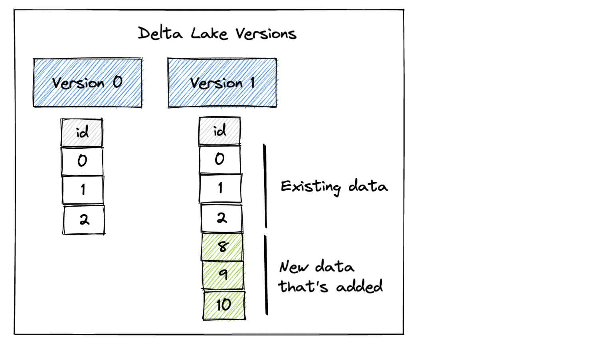
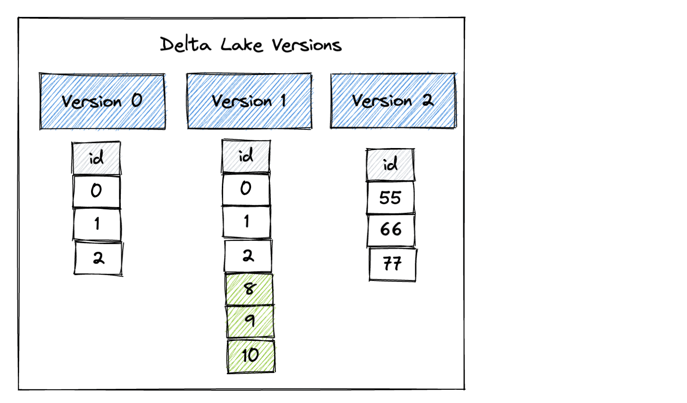

This post shows how you can easily version your datasets with pandas and the incredible benefits this provides. Versioned data lets you time travel, undo mistakes, and append data to existing datasets in a safe manner. It also lets you run your models on the same dataset over different points in time to see how the new data has impacted your model accuracy.

All the computations in this post are in [this Jupyter Notebook](https://github.com/MrPowers/delta-examples/blob/master/notebooks/pandas/pandas-versioned-dataset.ipynb), so you can run this code on your machine and follow along.

## Install Delta Lake and pandas

You can install Delta Lake with `pip install deltalake` and install pandas with `pip install pandas`.

Delta Lake was originally built for Spark, but the `deltalake` implementation does not have a Spark dependency. `delta-spark` depends on Spark, `deltalake` does not.

## Create a versioned Delta Lake with pandas

You can easily write out a pandas DataFrame to a Delta table.

Start by importing pandas and creating the pandas DataFrame. You can run this command in a Jupter notebook or your command line:

```
import pandas as pd

df = pd.DataFrame({"x": [1, 2, 3]})
```

Now write out the pandas DataFrame to a Delta table. You need to create the directory where the Delta table will be written.

```
import os
from deltalake.writer import write_deltalake

os.makedirs("tmp/some_delta_lake", exist_ok=True)
write_deltalake("tmp/some_delta_lake", df)
```

Delta Lake stores the data in a Parquet file and keeps a transaction log that records the data operations performed on the table. The transaction log allows for versioned data and time travel.

Read in the Delta table to another pandas DataFrame to make sure it’s easily accessible:

```
from deltalake import DeltaTable

dt = DeltaTable("tmp/some_delta_lake")
dt.to_pandas()

      x
0     1
1     2
2     3
```

Now let’s use pandas to add some more data to the Delta table.

## Append to a versioned dataset with pandas

Create another pandas DataFrame and append it to the Delta table.

```
df2 = pd.DataFrame({"x": [9, 8, 10]})

write_deltalake("tmp/some_delta_lake", df2, mode="append")
```

Read the Delta table contents to make sure the data was correctly appended:

```
DeltaTable("tmp/some_delta_lake").to_pandas()

      x
0     1
1     2
2     3
3     9
4     8
5     10
```

Our Delta table has two versions now. Version 0 contains the initial data and Version 1 includes the data that was appended.



When you append data to a CSV or Parquet data lake, you’re always stuck reading the latest version of the dataset. Delta Lake gives you the amazing flexibility to be able to read prior versions of the data. Let’s see how to read Version 0 of the dataset.

## Time travel versioned data with pandas

Here’s how to time travel to Version 0 of the dataset with pandas:

```
dt = DeltaTable("tmp/some_delta_lake", version=0)

dt.to_pandas()

      x
0     1
1     2
2     3
```

If you don’t specify the version, then you’ll read the latest version of the Delta table by default:

```
DeltaTable("tmp/some_delta_lake").to_pandas()

      x
0     1
1     2
2     3
3     9
4     8
5     10
```

Let’s perform another transaction that will overwrite the contents of the Delta table with a new DataFrame.

```
df3 = pd.DataFrame({"x": [55, 66, 77]})

write_deltalake("tmp/some_delta_lake", df3, mode="overwrite")
```

Here are the different versions of the Delta table after the overwrite operation:



Read in the latest version of the Delta table to confirm it has been updated:

```
DeltaTable("tmp/some_delta_lake").to_pandas()

      x
0     55
1     66
2     77
```

Now read in Version 0 of the dataset to confirm it’s still accessible:

```
DeltaTable("tmp/some_delta_lake", version=0).to_pandas()

      x
0     1
1     2
2     3
```

Also read in Version 1 of the dataset to confirm it’s still accessible:

```
DeltaTable("tmp/some_delta_lake", version=1).to_pandas()

      x
0     1
1     2
2     3
3     9
4     8
5     10
```

All versions of the dataset remain accessible, even after overwrite operations. Accessing legacy versions of your data is impossible if you’re using CSV or Parquet data lakes.

## Schema enforcement prevents bad appends

Another advantage of Delta Lake is that it prevents you from appending data to a Delta table with a schema that doesn’t match the existing data. Parquet, CSV, and JSON data lakes, on the other hand, are easily corruptible because they let you append data with any schema.

The Delta table we’ve been using thus far has a single `x` column. Let’s create another DataFrame with a single `y` column and see what happens when we try to append it to our existing Delta table.

```
df4 = pd.DataFrame({"y": [111, 222]})

write_deltalake("tmp/some_delta_lake", df4, mode="append")
```

Here’s the error you’ll get:

```
ValueError: Schema of data does not match table schema
Table schema:
y: int64
-- schema metadata --
pandas: '{"index_columns": [{"kind": "range", "name": null, "start": 0, "' + 357
Data Schema:
x: int64
```

Delta Lake is doing you a huge favor here. It’s preventing you from corrupting your data lake.

## Interoperable versioned dataset

Delta Lakes are interoperable with a variety of other technologies. You can read/write to Delta tables with Apache Flink, Apache Hive, Apache Kafka, PrestoDB, Apache Spark, Trino, and programming languages like Rust, Python, Scala, Java, and more.

Here are some examples of how to use pandas and Delta Lake in your production ETL pipeline:

- You may use pandas and deltalake to build a data ingestion platform that incrementally updates a dataset every hour. This dataset may be too large to be queried by pandas, so perhaps you’ll query the data with Trino.
- Or you may do the opposite. Maybe you have a large dataset that can be aggregated and cleaned with Spark. If the Spark aggregation shrinks the data sufficiently, you can let downstream users query it with deltalake and pandas. This workflow is great for data scientists that are more comfortable with pandas.

Delta Lake is a great way to build ETL pipelines with multiple technologies.

## Conclusion

This post showed you how to create a versioned dataset with pandas and Delta Lake. It demonstrates how you can easily time travel between different versions of your data with pandas.

You also saw how Delta Lake provides schema enforcement which prevents you from writing data with an incompatible schema to the Delta table. This prevents you from corrupting your dataset.

Future blog posts will discuss even more advantages Delta Lake provides pandas programmers. Delta Lake offers many advantages, often at no cost, compared to file formats like CSV, Parquet, and JSON. Many pandas users can switch to Delta Lake and immediately start enjoying some significant data quality and performance benefits right away.
