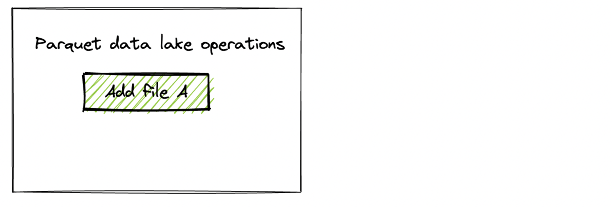

This post explains the `append` and `overwrite` PySpark [save mode](https://spark.apache.org/docs/latest/api/python/reference/pyspark.sql/api/pyspark.sql.DataFrameWriter.mode.html) write operations and how they’re physically implemented in Delta tables. You’ll see how these operations are implemented differently for Parquet tables and learn why the Delta Lake implementation is superior. You’ll also learn about how the PySpark `errorifexists` and `ignore` save mode write operations are implemented with Delta Lake.

Here’s the logical interpretation of the different [save modes](https://spark.apache.org/docs/latest/sql-data-sources-load-save-functions.html#save-modes):

- Append: add additional data to an existing table
- Overwrite: remove the existing data from the table and replace it with new data
- Error (aka `errorifexists`): throw an error if the table exists and contains data
- Ignore: don’t write if the table already exists, but don’t throw an error either

The Delta Lake implementation of these different save modes allows for ACID transactions and a great developer experience.

The limitations of Parquet tables make the developer experience less pleasant, especially for overwrite transactions. Let’s compare how the different write modes are implemented in Parquet and Delta Lake.

All the code snippets covered in this post are in [this notebook](https://github.com/MrPowers/delta-examples/blob/master/notebooks/pyspark/pyspark-append-overwrite.ipynb) if you’d like to reproduce these computations on your machine.

## Parquet append and overwrite save modes

Create a DataFrame with a row of data and write it out in the Parquet file format.

```
columns = ["singer", "country"]
data1 = [("feid", "colombia")]
rdd1 = spark.sparkContext.parallelize(data1)
df1 = rdd1.toDF(columns)

df1.repartition(1).write.format("parquet").save("tmp/singers1")
```

Take a look at the Parquet file written to disk.

```
tmp/singers1
├── _SUCCESS
└── part-00000-ffcc616b-4009-462a-a60d-9e2bd7130083-c000.snappy.parquet
```

We used `repartition(1)` so only one file is written and the intention of our example is clear. You normally want to write out datasets to multiple files in parallel, so `repartition(1)` is only appropriate for really small datasets.

We’ll refer to this as “File A” in the following diagram of operations:



Now create another DataFrame and append it to the existing Parquet table.

```
data2 = [("annita", "brasil")]
rdd2 = spark.sparkContext.parallelize(data2)
df2 = rdd2.toDF(columns)

df2.repartition(1).write.mode("append").format("parquet").save("tmp/singers1")
```

Here are the contents of the Parquet table:

```
spark.read.format("parquet").load("tmp/singers1").show()

+------+--------+
|singer| country|
+------+--------+
|annita|  brasil|
|  feid|colombia|
+------+--------+
```

New files are added to a Parquet table when the save mode is set to `append`.

```
tmp/singers1
├── _SUCCESS
├── part-00000-49da366f-fd15-481b-a3a4-8b3bd26ef2c7-c000.snappy.parquet
└── part-00000-ffcc616b-4009-462a-a60d-9e2bd7130083-c000.snappy.parquet
```


Now create a third DataFrame that will be used to overwrite the existing Parquet table. Here’s the code to create the DataFrame and overwrite the existing data.

```
data3 = [("rihanna", "barbados")]
rdd3 = spark.sparkContext.parallelize(data3)
df3 = rdd3.toDF(columns)

df3.repartition(1).write.mode("overwrite").format("parquet").save("tmp/singers1")
```

Here’s the content of the Parquet table after the overwrite operation:

```
+-------+--------+
| singer| country|
+-------+--------+
|rihanna|barbados|
+-------+--------+
```

Here are the new files on storage:

```
tmp/singers1
├── _SUCCESS
└── part-00000-63531918-401d-4983-8848-7b99fff39713-c000.snappy.parquet
```


When the save mode is set to `overwrite`, Parquet will write out the new files and delete all of the existing files. There are several downsides to this implementation:

- The old data is deleted, so there is no way to perform a rollback and undo a mistake if your storage format doesn’t support versioning or enable versioning. The changes are permanent.
- The Parquet table is in an unusable state for readers while the overwrite operation is being performed. For example, a concurrent reader may see a “mid-computation state”: file A gets deleted but file B still exists, which is not a valid table state.
- If the compute cluster performing the overwrite dies while the operation is being performed, your data lake is left in a “mid-computation state” and will likely be corrupted. The corruption type depends on how much the overwrite operation had completed when the error occurred.

Let’s look at these same operations on a Delta table and see how they’re much more robust and user-friendly.

## Delta Lake append and overwrite save modes

Let’s perform the same operations with a Delta table with the save mode set to `append` and `overwrite` to see how they’re implemented differently.

Create a separate Delta Lake with the same `df1` from earlier.

```
df1.repartition(1).write.format("delta").save("tmp/singers2")
```

Here are the contents of the Delta table.

```
+------+--------+
|singer| country|
+------+--------+
|  feid|colombia|
+------+--------+
```

Here are the files in the Delta Lake:

```
tmp/singers2
├── _delta_log
│   └── 00000000000000000000.json
└── part-00000-946ae20f-fa5a-4e92-b1c9-49322594609a-c000.snappy.parquet
```

Now append `df2` to the Delta Lake.

```
df2.repartition(1).write.mode("append").format("delta").save("tmp/singers2")
```

Here are the contents of the Delta Lake:

```
+------+--------+
|singer| country|
+------+--------+
|annita|  brasil|
|  feid|colombia|
+------+--------+
```

Here are the files in the Delta Lake:

```
tmp/singers2
├── _delta_log
│   ├── 00000000000000000000.json
│   └── 00000000000000000001.json
├── part-00000-946ae20f-fa5a-4e92-b1c9-49322594609a-c000.snappy.parquet
└── part-00000-adda870a-83a2-4f5c-82a0-c6ecc60d9d2e-c000.snappy.parquet
```

Now overwrite the Delta Lake with `df3`.

```
df3.repartition(1).write.mode("overwrite").format("delta").save("tmp/singers2")
```

Here are the contents of the Delta Lake:

```
+-------+--------+
| singer| country|
+-------+--------+
|rihanna|barbados|
+-------+--------+
```

Here are the files in the Delta Lake:

```
tmp/singers2
├── _delta_log
│   ├── 00000000000000000000.json
│   ├── 00000000000000000001.json
│   └── 00000000000000000002.json
├── part-00000-2d176e2d-66e0-44b6-8922-6bc3a15a6b96-c000.snappy.parquet
├── part-00000-946ae20f-fa5a-4e92-b1c9-49322594609a-c000.snappy.parquet
└── part-00000-adda870a-83a2-4f5c-82a0-c6ecc60d9d2e-c000.snappy.parquet
```

Important: Note that a Delta Lake overwrite operation does not delete any of the underlying Parquet files. It simply makes an entry in the transaction log to ignore the existing files (a logical delete). It doesn’t actually remove the files (a physical delete). Take a look at the following diagram to get some intuition about the three transaction log entries corresponding to the actions taken on this Delta Lake.


The Delta Lake approach to overwriting data is almost always preferable!

## Why Delta Lake is safer

A Delta Lake overwrite operation does not physically remove files from storage, so it can be undone. When you overwrite a Parquet table, the old files are physically removed from storage, so the operation can not be undone if your storage doesn’t support versioning or enable versioning. Performing an accidental overwrite on a Parquet table can still be a costly mistake even if you enable versioning on your storage.

Delta Lake’s [design protocol](https://github.com/delta-io/delta/blob/master/PROTOCOL.md) makes versioned data a built-in feature. Time travel and restoring to previous versions with the restore command are features that are easily allowed for by Delta Lake because versioned data is a core aspect of Delta Lake’s design. All of these features are extremely useful for data practitioners. Parquet tables don’t offer these features, so Delta Lake is almost always better.

For completeness, let’s look at the other PySpark save modes and how they’re implemented with Delta Lake.

## PySpark error / errorifexists save modes in Delta Lake

The default PySpark save mode is error, also known as errorifexists. This will create a Delta Lake if one doesn’t exist already and error out if the Delta Lake already exists.

Let’s use `df1` to create another Delta Lake and explicitly set the save mode to `error`.

```
df1.repartition(1).write.mode("error").format("delta").save("tmp/singers3")
```

That works since tmp/singers3 didn’t exist.

Now let’s see what happens when we write `df2` to `tmp/singers3`, a Delta Lake that now exists.

That operation errors out with the following message:

```
AnalysisException: Cannot write to already existent path file:/Users/…/tmp/singers3 without setting OVERWRITE = 'true'.
```

We’ve confirmed that PySpark will error when writing to an existing Delta Lake if the save mode is set to error.

## PySpark ignore save mode with Delta Lake

The PySpark ignore save mode will create the Delta Lake if it doesn’t exist yet. If the Delta Lake exists, the PySpark ignore save mode won’t do anything (it won’t write data or error out).

Let’s write out the contents of `df1` to a new Delta Lake with save mode set to ignore.

```
df1.repartition(1).write.mode("ignore").format("delta").save("tmp/singers4")
```

Here are the contents of the Delta Lake:

```
spark.read.format("delta").load("tmp/singers4").show()

+------+--------+
|singer| country|
+------+--------+
|  feid|colombia|
+------+--------+
```

Let’s append `df2` to this Delta Lake. Recall that `df2` contains the following data:

```
df2.show()

+------+-------+
|singer|country|
+------+-------+
|annita| brasil|
+------+-------+
```

Now let’s write out the contents of `df2` to a new Delta Lake with save mode set to ignore:

```
df2.repartition(1).write.mode("ignore").format("delta").save("tmp/singers4")
```

Here are the contents of the Delta Lake after the write with save mode set to ignore:

```
+------+--------+
|singer| country|
+------+--------+
|  feid|colombia|
+------+--------+
```

When the save mode is set to ignore, the data in `df2` is not appended and an error is not thrown.

Here’s the entry that’s made to the transaction log for the second write operation with save mode set to ignore:

```
{
   "commitInfo":{
      "timestamp":1664801261318,
      "operation":"WRITE",
      "operationParameters":{
         "mode":"Ignore",
         "partitionBy":"[]"
      },
      "readVersion":0,
      "isolationLevel":"SnapshotIsolation",
      "isBlindAppend":true,
      "operationMetrics":{


      },
      "engineInfo":"Apache-Spark/3.3.0 Delta-Lake/2.1.0",
      "txnId":"dcb6992b-24cb-4f3e-bcd3-203837c7986e"
   }
}
```

This transaction log entry doesn’t add or remove files. It’s a no-op.

## Conclusion

PySpark’s save operations are implemented differently in Parquet tables and Delta Lake. In particular, Parquet overwrite operations physically delete files from storage, whereas Delta Lake overwrite operations only tombstone files in the transaction log.

Delta Lake supports versioned data and time travel. It only physically removes files from disk when you run the vacuum command to remove unneeded old files to save your storage cost.

PySpark operations on Parquet tables can be quite dangerous. Suppose you’d like to append a small DataFrame to an existing dataset and accidentally run `df.write.mode("overwrite").format("parquet").save("some/lake")` instead of `df.write.mode("append").format("parquet").save("some/lake")`. That relatively small mistake causes you to delete all your existing data. You’ll only be able to recover the data if it’s been backed up, but that could be a huge hassle as well.

Delta Lake provides a much better user experience because you can easily undo an accidental overwrite command by [restoring to an earlier version of your Delta Lake](https://delta.io/blog/2022-10-03-rollback-delta-lake-restore/). Versioned data makes life a lot easier for data practitioners.

It’s good to build up a basic intuition on how PySpark write operations are implemented in Delta Lake under the hood. Understanding how Delta Lake works at a high level makes it easier for you to optimize your lake and build better data pipelines.
