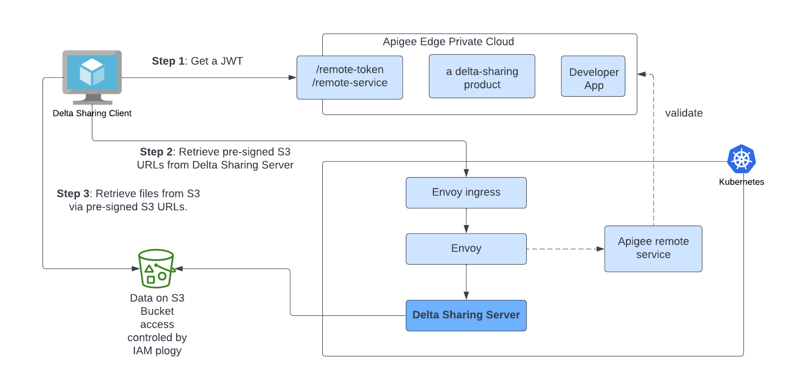
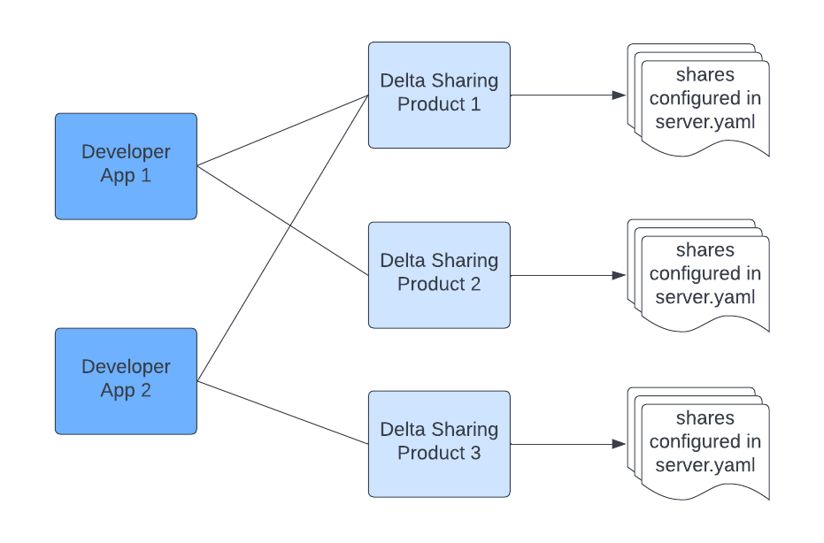

## Introduction

[Delta Sharing](https://delta.io/sharing/) is the industry’s first open protocol for secure data sharing, introduced in [2021](https://databricks.com/blog/2021/05/26/introducing-delta-sharing-an-open-protocol-for-secure-data-sharing.html). Delta Sharing simplifies the data-sharing process with other organizations regardless of which computing platforms they use. With Delta Sharing, organizations can easily share existing large-scale datasets without needlessly duplicating the data.

Data Sharing has become one of the most important parts of machine learning and data analytics. For example, data and machine learning teams from a government agency often need to enrich their own dataset using external data from another agency. In this blog, we will discuss how Delta Sharing is deployed and enhanced at the [United States Citizenship and Immigration Services (USCIS)](https://www.uscis.gov/) to satisfy several inter-agency data-sharing requirements.

## Architecture Overview

Delta Sharing has two parties involved: Data Provider and Data Recipient. A Data Provider generates [Delta Lake](https://delta.io) tables and can leverage Delta Sharing to share their Delta tables or specific versions of the tables with the Data Recipient. The Data Providers can configure what data they can share and control the permissions to access the data via a Delta Sharing server. Data Recipients can choose from various Delta Sharing clients to connect to and read the shared data.

The Delta Sharing platform comprises two components: the client and the server. The Delta Sharing server is an implementation of an open REST protocol that defines how Delta tables share the data based on the requests from the client. The server is the component that accesses the raw Delta files in Azure, GCP, AWS in this deployment, and serves up the [pre-signed S3 URLs](https://docs.aws.amazon.com/AmazonS3/latest/userguide/ShareObjectPreSignedURL.html) to the client. It is deployed and managed by the Data Provider. The client is invoked by the Data Recipient and responsible for making all of the REST requests to the server. The client creates pandas or Apache Spark™ data frames from the S3 URLs provided by the server. The image below shows an overview of the deployment.



In the USCIS implementation, the [Delta Sharing server](https://github.com/delta-io/delta-sharing) is deployed using an [EKS cluster.](https://aws.amazon.com/eks/) The Delta Sharing server sits behind an [Apigee envoy sidecar proxy](https://cloud.google.com/apigee/docs/api-platform/envoy-adapter/v1.0.x/concepts), which itself sits behind Apigee. Apigee handles token management.

- **Step 1: Get a JWT**: The Data Recipient (client) will need to request a JWT from Apigee. JSON Web Token (JWT) is an open standard that defines how to transmit information between parties as a JSON object securely.

- **Step 2: Retrieve pre-signed S3 URLs from Delta Sharing Server**: The client will send that token with the request for data sharing. The deployed Delta Sharing server accesses the underlying cloud storage by assuming the IAM role associated with the service account of the pod. No credentials and secrets are hard coded with the sharing server deployment.

- **Step 3: Retrieve files from S3 via pre-signed S3 URLs**: A request for data access is authenticated, the sharing server will create a list of pre-signed file URLs for the requested objects and send them back as a response to the client. The client will create Dataframes from the S3 URLs retrieved.

## Data Access Control

The pre-signed S3 URLs generated in the previous steps are valid only for a short-lived period of time, which ensures that access to data is only allowed during the time an Apigee JWT is valid. Once the pre-signed URL expires or the Apigee token expires, data recipients must re-authenticate. The Sharing server container assumes an IAM role via Kubernetes service account. Below is an example of associating an IAM role with a Kubernetes service account and then using that service account in a deployment:

```
apiVersion: v1
kind: ServiceAccount
metadata:
 name: delta-sharing-server
 namespace: delta-share
 annotations:
   eks.amazonaws.com/role-arn: arn:aws:iam::111111111111:role/DeltaShareAssumeRoleWebIdentity
```

```
apiVersion: apps/v1
kind: Deployment
metadata:
  name: deltashare
  labels:
    app.kubernetes.io/name: deltashare
    app.kubernetes.io/instance: deltashare
spec:
  replicas: 2
  selector:
    matchLabels:
      app.kubernetes.io/name: deltashare
      app.kubernetes.io/instance: deltashare
  template:
    metadata:
      labels:
        app.kubernetes.io/name: deltashare
        app.kubernetes.io/instance: deltashare
    spec:
      volumes:
        - name: config
          configMap:
            name: dss-config
      serviceAccountName: delta-share-server
```

The Sharing server uses Apache Hadoop’s [hadoop-aws module](https://hadoop.apache.org/docs/stable/hadoop-aws/tools/hadoop-aws/index.html) for AWS integration. A Hadoop configuration file named `core-site.xml` can be created and added to the Sharing server's conf directory. In the `core-site.xml` file, the credential provider (i.e., `fs.s3a.aws.credentials.provider`) needs to be configured as `WebIdentityTokenCredentialsProvider`:

```
<?xml version="1.0"?>
    <?xml-stylesheet type="text/xsl" href="configuration.xsl"?>
    <configuration>
        <property>
          <name>fs.s3a.aws.credentials.provider</name>
          <value>com.amazonaws.auth.WebIdentityTokenCredentialsProvider</value>
        </property>
    </configuration>
```

To package the implementation of the identity provider, [aws-java-sdk-bundle](https://mvnrepository.com/artifact/com.amazonaws/aws-java-sdk-bundle) needs to be added to `build.sbt`.

```
"com.amazonaws" % "aws-java-sdk-bundle" % "1.11.1034"
```

With the above configurations in place, a response will be sent back to the client with pre-signed URLs. The pre-signed URLs are like bearer tokens whoever possesses them will be able to access the data on the cloud storage. To further restrict access, conditions can be added to the bucket policy to require that the requests can only come from a specific VPC as noted in the following code snippet.

```
statement {
	sid = "AccessToSpecificVPConly"
	actions = ["s3:*"]
	effect = "Deny"
	resources = ["arn:aws:s3:::${var.bucket_name}/${var.demo_folder_name}", "arn:aws:s3:::${var.bucket_name}/${var.demo_folder_name}/*"]
	condition {
  	test = "StringNotEquals"
  	variable = "aws:SourceVpc"
  	values = ["${var.source_vpc}"]
    }
  }
```

## API Access Control

The API calls to the shared dataset are secured by the API gateway in front of the Delta Sharing server. In this example, callers to the Delta Sharing API are granted a unique id and secrets by Apigee for obtaining short-lived JWT. All APIs calls require a JWT to authenticate to the Delta share service. For reading shared data using the Delta Sharing [Python connector](https://github.com/delta-io/delta-sharing#python-connector), the JWT needs to be stored in the sharing [profile files](https://github.com/delta-io/delta-sharing/blob/main/PROTOCOL.md#profile-file-format).

Here is an example of a sharing profile file:

```
{
  "shareCredentialsVersion": 1,
  "endpoint": "http://<sharing server ip>:<port>/delta-sharing/",
  "bearerToken": "<JWT>",
  "expirationTime": "2022-11-12T00:12:29.0Z"
}
```

A Delta Sharing server hosts a collection of Delta tables to be shared with the Data Recipients. The collections of tables are defined in a Sharing server `server.yaml` file. The path to the `server.yaml` file can be configured for the sharing server using command line options `--config /config/delta-sharing-server.yaml`



Apigee generates an API key for developers to access the Delta Sharing products where the access to the API endpoints is governed by the application registration. A developer app can be registered with multiple products. As shown in the picture above, the “Developer App 1” can be registered to use product 1 and 2. The user access granularity to the set of tables is defined on the Apigee product level.

## Summary

In this blog, we described how a Delta Sharing server is deployed into production using Delta Sharing technology to support data sharing between government agencies. In this example, the Delta Sharing server is deployed in EKS. We discuss how the Delta Sharing server secures requests by using Apigee. We also provide details on how the underlying data is protected using IAM roles and how the roles can be assumed from a Kubernetes pod using a Service Account. The Delta Sharing can be extended to support unstructured data as well.

If you’d like to give Delta Sharing a try today, you can find all of the code and configuration files presented in this blog [here](https://github.com/lyliyu/delta-sharing). Interested in becoming a Delta Sharing contributor? Join our public [Slack channel](https://go.delta.io/slack) today!
