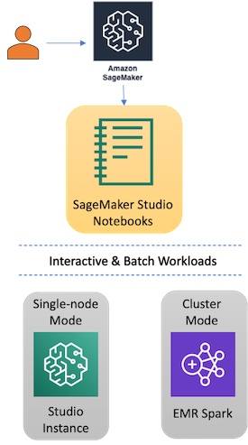

<Info title="Guest authors" level="info">
  This is a joint blog post is co-authored by [Vedant
  Jain](https://www.linkedin.com/in/vedantjain/), Sr. AI/ML Specialist SA,
  Amazon Web Services.
</Info>

The current influx of data — structured, semi-structured, and unstructured — being driven by an array of data sources is fueling opportunities to leverage machine learning to extract insights and accelerate innovations that can transform businesses and industries. As these data volumes continue to rise, companies are struggling with the complicated task of managing this data and figuring out how to harness it for analytics and AI.

Fortunately, there is a better way with a few native tools designed to help more easily access and transform your data, build pipelines that feed machine learning (ML) models, and manage the model lifecycle through deployment into production. In this blog, we’ll explore how connecting [Delta Lake](https://delta.io/), [Amazon SageMaker Studio](https://aws.amazon.com/sagemaker/studio/), and [Amazon EMR](https://aws.amazon.com/emr/) can simplify the end-to-end workflow required to support data engineering and data science projects.

## What is Delta Lake?

Before you can start to train your ML models, you first need to get all of your data into a single storage layer for ETL and sharing. One of the options for storing data in AWS is Delta Lake. Delta Lake is an open-source storage framework that enables building a Lakehouse architecture with compute engines, including Spark, PrestoDB, Flink, Trino, and Hive, and APIs for Scala, Java, Rust, Ruby, and Python.

The Delta Lake library enables reads and writes in open-source Apache Parquet file format, and provides capabilities like ACID transactions, scalable metadata handling, and unified streaming and batch data processing. Delta Lake offers a storage layer API that you can use to store data on top of an object-layer storage like Amazon Simple Storage Service (Amazon S3).

## What is Amazon SageMaker Studio?

Once the data is in Delta Lake, Amazon SageMaker can be used to remove the heavy lifting from each step of the ML process to make it easier to develop high-quality models. [Amazon SageMaker](https://aws.amazon.com/sagemaker/) is a fully managed ML service that combines the power of open source and purpose built proprietary features which give data scientists and developers the speed and ease to build, train, and deploy models directly into a production-ready hosted environment. An Integrated [JupyterLab](https://jupyter.org/) environment opens data sources for exploration and analysis without managing servers.

<em>Figure 1: End-to-end Machine Learning with SageMaker Studio</em>

Additionally, [Amazon SageMaker Studio](https://aws.amazon.com/sagemaker/studio/) is the built-in, integrated development environment (IDE) from SageMaker. It streamlines ML services and increases productivity within a single, integrated ML environment. Users can build, train, debug, deploy, monitor, and analyze models inside a unified visual interface. The all-in-one application accelerates ML outcomes by supplying all the necessary tools to take models from data prep to experimentation to production.

## Integrate SageMaker Studio with Delta Lake

Consistent and reliable data is the lifeblood of ML, AI and data science projects in general. Delta Lake stores the high-quality historical data necessary to fuel the insights businesses rely on for data-based decision-making. SageMaker Studio gives data practitioners a versatile environment to build ML solutions with customizable tooling for data ingestion, data processing, model training, and model hosting. Apache Spark™, a popular processing framework that works well with Delta Lake, facilitates modern data processing with an extensive API for loading and manipulating data. With Delta Lake, SageMaker Studio, and Apache Spark, users can simplify the process of ingesting data and training ML models for faster time-to-insights.
While there are multiple ways in reading Delta Lake data into SageMaker Studio, we will focus our efforts on using the Delta-Spark library. [Delta-Spark](https://pypi.org/project/delta-spark/) is a PyPi package which contains Python APIs for using Delta Lake with Apache Spark. Users have the option of reading/writing Delta Lake data using SageMaker Studio either using the default single SageMaker Studio instance (single-node mode) or in a distributed way using the Amazon EMR cluster backend (cluster mode).

<em>Figure 2: SageMaker Studio options for accessing Delta Lake</em>

### 1. Single-node Mode: Using SageMaker Studio to load and transform data from Delta Lake

First, SageMaker Studio notebooks load and transform the data in the Delta Lake format using a JupyterLab environment. We run Spark commands to read and write table data in CSV and Parquet format. The open-source [delta-spark](https://pypi.org/project/delta-spark/) library allows users to directly access the data in its native format. Via the library, users can utilize API operations for data transformation, make schema changes, and use Delta Lake time travel to view or revert back to previous versions of the data.

This approach is useful if the users want to prototype on a single node instance on a smaller dataset for cost savings. SageMaker studio also allows users to run Spark locally to the studio instance. Post prototyping phase, using SageMaker studio, users have ready access to distributed Spark environments for data processing using SageMaker Studio and Amazon EMR connectivity (as shown in the picture above) which we refer to as Cluster mode.

### 2. Cluster Mode: Distribute Delta Lake Workloads from SageMaker Studio using Amazon EMR

[Amazon Elastic MapReduce](https://aws.amazon.com/emr/) is a cloud big data platform for running large-scale distributed data processing jobs, interactive SQL queries, and ML applications using open-source analytics frameworks such as Apache Spark, Apache Hive, and Presto.

By using Delta Lake with Amazon EMR, you can create a transactional data lake platform and use SageMaker Studio to launch your notebook environment to spin up the underlying EMR compute clusters needed to support multiple analytical use cases.

<em>Figure 3: Read and Write Delta Tables from SageMaker Studio Notebooks</em>

 
 
SageMaker Studio supports interactive EMR processing through a graphical and
programmatic way of connecting to existing EMR clusters. Several kernels include
the [SageMaker Studio Analytics
Extension](https://pypi.org/project/sagemaker-studio-analytics-extension/) for
seamless EMR connectivity and generating pre-signed Spark UI links for
debugging. User's can leverage the
[SparkMagic](https://github.com/jupyter-incubator/sparkmagic) kernels for
interactively working with remote Spark clusters through
[Livy](http://livy.incubator.apache.org./) or libraries such as PyHive can be
used after connection to the cluster has been established. Spinning up/down,
connecting and configuring EMR Spark clusters from SageMaker Studio is
straightforward. Once cluster connectivity is established and the delta-spark
library is installed on the EMR cluster, users are able to run interactive jobs
on Amazon EMR’s Spark environment using SageMaker Studio interface. Also, users
are able to quickly and seamlessly switch between a single instance (single-node
mode) and distributed (cluster mode) environments.

<em>
  Figure 4: Deploying and Managing EMR Spark Clusters from SageMaker Studio
</em>

## The benefits of connecting SageMaker Studio and Delta Lake

Critical technologies that we have discussed in this post are utilizing open source frameworks, namely JupyterLab, Spark & Delta Lake and are integrated in a user-friendly way to let data teams take advantage of their preexisting data lakes and improve the overall productivity of data science teams.

Delta Lake is a great option for storing data in the AWS Cloud because it reads and writes in open-source Apache Parquet file format. This format makes it easy to write connectors from engines that can process Parquet.

With this design, users can update and replace objects in a serialized manner while maintaining high parallel throughput read and write performance from the objects themselves. Delta Lake’s transaction log contains granular metadata for each data file. These statistics produce faster metadata searches than the “files in object store” approach. Delta Lake also offers a storage layer API that can store data on top of an object-layer storage like Amazon S3. Cumulatively, Delta Lake’s critical capabilities deliver the structure necessary to build a high-performing Lakehouse architecture.

After reading Delta Lake data in SageMaker Studio’s managed JupyterLab environment, users can access purpose-built tools to perform all machine learning (ML) development steps, from preparing data to building, training, and deploying your ML models in a cost effective manner with faster time to value.

Users can also benefit from the breadth and depth of SageMaker’s features built using open-source (as well as some proprietary) technologies for simplifying the complex and iterative process of Machine Learning. To get started with Amazon SageMaker and its end-to-end Machine Learning experience, click [here](https://aws.amazon.com/sagemaker/?nc=sn&loc=1).

## Stay tuned for integration code

Coming soon, the AWS and Databricks blog will publish more integration code to help you drive the connection between Delta Lake and SageMaker Studio. In the meantime, get the benefits of Delta Lake and SageMaker Studio by visiting the [Delta Lake online hub](https://delta.io/). You can learn more, download the latest code, and join the Delta Lake community ([Slack](https://go.delta.io/slack), [Groups](https://go.delta.io/groups), [YouTube](https://go.delta.io/youtube), [LinkedIn](https://go.delta.io/linkedin), [Twitter](https://go.delta.io/twitter)).
