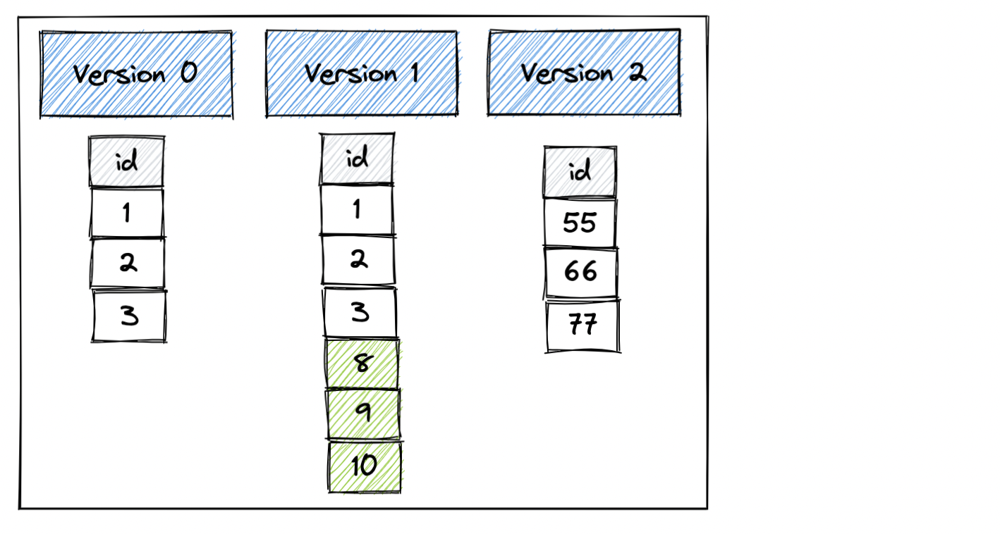
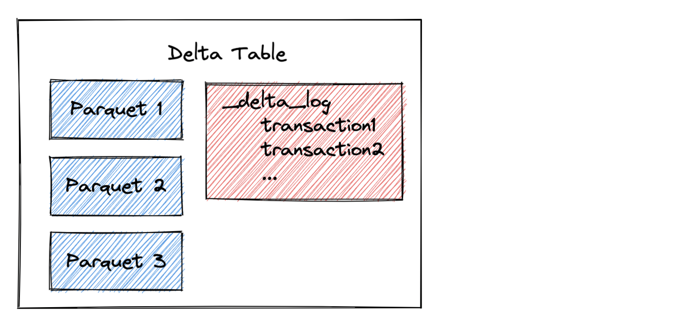

This post shows you how to read Delta Lake tables using Polars DataFrame library and explains the advantages of using Delta Lake instead of other dataset formats like AVRO, Parquet, or CSV.

Polars is an awesome DataFrame library primarily written in Rust which uses Apache Arrow format for its memory model. Delta Lake is a Lakehouse storage system that delivers reliability, security and performance for both streaming and batch operations.

Polars has blazing fast performance and Delta Lake has amazing features like ACID transactions, time travel, schema enforcement, and many more, so they are a match made in heaven. Let’s dig into some code!

## Creating Delta Table

Let’s create a Delta table with three different versions. That will allow us to easily illustrate time travel between the different Delta table versions with Polars.

Here’s the Delta table with three versions that we’ll create.



Let’s start by creating version 0 of the Delta table with pandas.

```
from deltalake.writer import write_deltalake
import pandas as pd

df = pd.DataFrame({"x": [1, 2, 3]})

write_deltalake("/tmp/bear_delta_lake", df)
```

Now let’s append another DataFrame to the existing Delta table which will create version 1.

```
df2 = pd.DataFrame({"x": [9, 8, 10]})

write_deltalake("/tmp/bear_delta_lake", df2, mode="append")
```

Now let’s overwrite the Delta table which will remove the existing data and add new data. This operation will create version 2 of the Delta table.

```
df3 = pd.DataFrame({"x": [55, 66, 77]})

write_deltalake("/tmp/bear_delta_lake", df3, mode="overwrite")
```

We’ve created a Delta table with three versions. Now let’s use Polars to read the Delta table.

## Read Delta Table with Polars

Here’s how to read the latest version of the Delta table with Polars.

```
import polars as pl

print(pl.read_delta("/tmp/bear_delta_lake"))
```

Here’s the DataFrame that’s printed:

```
+-----+
| x   |
| --- |
| i64 |
+=====+
| 55  |
|-----|
| 66  |
|-----|
| 77  |
+-----+
```

You can also read the DataFrame with `scan_delta` which will **lazily** read the Delta table. The `read_delta` method on the other hand immediately loads the Delta table into memory.

```
ldf = pl.scan_delta("/tmp/bear_delta_lake")

print(ldf.collect())

+-----+
| x   |
| --- |
| i64 |
+=====+
| 55  |
|-----|
| 66  |
|-----|
| 77  |
+-----+
```

Polars will use the Delta table transaction log to only read the files that are required. Polars will optimize the computation before performing any work on a lazy DataFrame.

## Time travel to different versions with Polars

The `scan_delta` and `read_delta` methods will read the latest version of the Delta table by default. Let’s look at how we can easily time travel across different versions of the Delta table using by setting the version parameter.

Start by reading version 0 of the Delta table.

```
print(pl.read_delta("/tmp/bear_delta_lake", version=0))

+-----+
| x   |
| --- |
| i64 |
+=====+
| 1   |
|-----|
| 2   |
|-----|
| 3   |
+-----+
```

Now read version 1 of the Delta table.

```
print(pl.read_delta("/tmp/bear_delta_lake", version=1))

+-----+
| x   |
| --- |
| i64 |
+=====+
| 1   |
|-----|
| 2   |
|-----|
| 3   |
|-----|
| 9   |
|-----|
| 8   |
|-----|
| 10  |
+-----+
```

The Polars Delta Lake connector is intelligent about only reading the data files that are required for each version. Version 0 of the Delta table only requires a single data file, so that’s all Polars will read. Time travel is executed efficiently.

## How Polars executes queries on Delta Lake tables

Delta tables store data in Parquet files and metadata information in a transaction log. The following image shows the high level architecture of a Delta table.



Polars doesn't run your queries naively but optimizes your query and ensures only the needed columns and rows are read from I/O. This works great with delta tables as Polars can query the transaction log to see what data files are needed.

Querying the transaction log is a lot more efficient than reading the footer for each individual Parquet file, building up all the data table metadata, and then executing the query. This is especially true for nested directories on cloud object stores.

## Why Delta Lake helps Polars users

Delta Lake offers Polars users reliable ACID transaction guarantees on a variety of different storage systems, including the popular clouds. ACID transactions give users the guarantee that operations will complete fully or not at all. Users don’t want an operation to partially complete and then error out halfway through, thus corrupting their dataset.

This blog demonstrates how users can efficiently time travel to different versions of an existing Delta Table, which is another great feature for production data workloads.

Delta Lake will add even more value to Polars users as more features are added.

## Future work

The Polars Delta Lake connector depends on [delta-rs](https://github.com/delta-io/delta-rs/), a Rust implementation of the Delta Lake protocol.

Delta Rust is under active development and new features like DML transactions, rollbacks, column mapping, Z ORDER, optimize and more. Support for writing to Delta Lake tables and other advanced features will be added soon.

## Install Delta Lake & Polars

The easiest way to install Polars and Delta Lake is via pip:

`$ pip install polars[deltalake]`.

You can also install with conda. Here’s how to make a conda environment with Delta Lake, Polars, Jupyter, and other handy dependencies. Start by creating a YML file with the dependencies.

```
name: delta-polars
channels:
  - conda-forge
  - defaults
dependencies:
  - python=3.9
  - ipykernel
  - nb_conda
  - jupyterlab
  - jupyterlab_code_formatter
  - isort
  - black
  - pytest
  - pandas
  - pip
  - pip:
    - deltalake==0.6.4
    - polars==0.15.7
```

Note: Use deltalake >= 0.6.2 when using the Polars integration.

Create the environment with `conda env create -f envs/delta-polars.yml`.

Activate the environment with `conda activate delta-polars`.

Run `jupyter lab` to fire up a notebook with this access to this environment and the required dependencies.

## Conclusion

Polars is a great DataFrame library. It has an elegant API and fast performance.

Delta Lake is a great Lakehouse storage system that gives users reliable transaction guarantees and lots of convenient data management functions. Thanks to the Delta Rust project, it’s been relatively easy to add Delta Lake support to Polars.

Both projects are also a great example of rust native libraries that push the boundaries in the Python landscape.

See [the Polars docs](https://pola-rs.github.io/polars/py-polars/html/reference/io.html#delta-lake) for more information about different Delta Lake read and scan scenarios.
