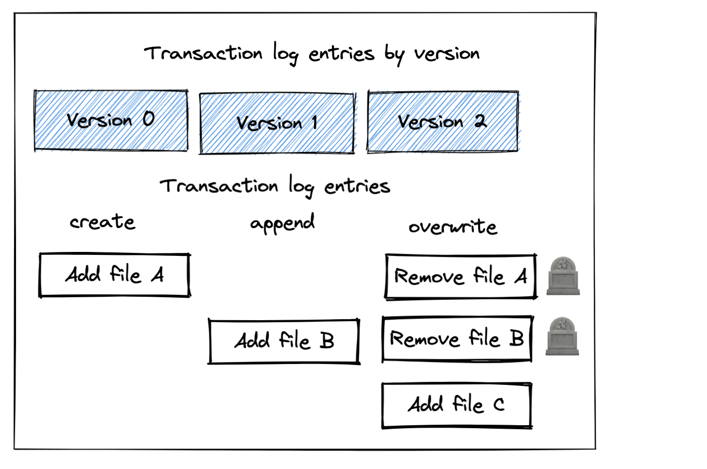

This blog post explains how to remove files marked for deletion (aka “tombstoned files”) from storage with the Delta Lake vacuum command. Delta Lake doesn't physically remove files from storage when operations “delete” the files. The vacuum command is used to physically remove files from storage that have been marked for deletion and are older than the retention period.

The main benefit of vacuuming is to save on storage costs. Vacuuming does not make your queries run any faster and can limit your ability to time travel to certain Delta table versions. You need to weigh the costs/benefits for each of your tables to develop an optimal vacuum strategy.

Let's start with a simple example and then dig into some of the edge cases. Then we'll look at the costs/benefits of vacuuming so you can weigh the tradeoffs and make an informed decision on how to best manage your Delta tables.

See [this notebook](https://github.com/MrPowers/delta-examples/blob/master/notebooks/pyspark/vacuum.ipynb) if you'd like to run these examples on your local machine.

## Delta Lake vacuum example

Let's start by creating a Delta table:

```python
df = spark.createDataFrame([("bob", 3), ("sue", 5)]).toDF("first_name", "age")
df.repartition(1).write.format("delta").saveAsTable("some_people")
```

Note: `repartition(1)` is used to output a single file to make the demonstration clearer.

Now append some more data to the Delta table:

```python
df = spark.createDataFrame([("ingrid", 58), ("luisa", 87)]).toDF("first_name", "age")
df.repartition(1).write.format("delta").mode("append").saveAsTable("some_people")
```

Here is the current content of the Delta table:

```python
spark.table("some_people").show()

+----------+---+
|first_name|age|
+----------+---+
|    ingrid| 58|
|     luisa| 87|
|       bob|  3|
|       sue|  5|
+----------+---+
```

The Delta table currently consists of two files, both of which are used when the latest version of the Delta table is read. Neither file has been marked for removal in the Delta transaction log (aka “tombstoned”), so they wouldn't be removed with the vacuum operation. Tombstoned files have been marked for removal in the transaction log, but haven't been physically removed from disk yet. The vacuum command only deletes files from storage that have been tombstoned.

Here are the files currently in the Delta table:

```
some_people
├── _delta_log
│   ├── 00000000000000000000.json
│   └── 00000000000000000001.json
├── part-00000-0e9cf175-b53d-4a1f-b132-8f71eacee991-c000.snappy.parquet
└── part-00000-9ced4666-4b26-4516-95d0-6e27bc2448e7-c000.snappy.parquet
```

Let's overwrite the existing Delta table with some new data, which will tombstone the existing data. Overwrite operations mark all the existing data for removal in the transaction log (aka “tombstones all the existing files”).

```python
df = spark.createDataFrame([("jordana", 26), ("fred", 25)]).toDF("first_name", "age")
df.repartition(1).write.format("delta").mode("overwrite").saveAsTable("some_people")
```

Here are the contents of the Delta table after the overwrite operation:

```python
spark.table("some_people").show()

+----------+---+
|first_name|age|
+----------+---+
|   jordana| 26|
|      fred| 25|
+----------+---+
```

As you can see in the following image, the overwrite operation has added a new file and tombstoned the existing files.



You can see all three files are still in storage:

```
spark-warehouse/some_people
├── _delta_log
│   ├── 00000000000000000000.json
│   ├── 00000000000000000001.json
│   └── 00000000000000000002.json
├── part-00000-0e9cf175-b53d-4a1f-b132-8f71eacee991-c000.snappy.parquet
├── part-00000-1009797a-564f-4b0c-8035-c45354018f21-c000.snappy.parquet
└── part-00000-9ced4666-4b26-4516-95d0-6e27bc2448e7-c000.snappy.parquet
```

Let's run the vacuum command in `DRY RUN` mode to get a listing of the files that will be removed from storage when the vacuum is run:

`spark.sql("VACUUM some_people DRY RUN")`

Here's the message that's returned:

> Found 0 files and directories in a total of 1 directories that are safe to delete.

The vacuum command won't actually delete any files because the tombstoned files aren't older than the retention period, which is 7 days by default.

Try to set the retention period to zero hours and get a listing of the files that will get removed from storage.

`spark.sql("VACUUM some_people RETAIN 0 HOURS DRY RUN")`

This will return an exception which is desirable because vacuuming with such a short retention period is potentially dangerous. You shouldn't normally set the retention period to zero - we're just doing this for demonstration purposes. Delta Lake doesn't want to let you perform dangerous actions unless you explicitly update your configurations. Here's the error message you'll receive:

> IllegalArgumentException: requirement failed: Are you sure you would like to vacuum files with such a low retention period?

> If you have writers that are currently writing to this table, there is a risk that you may corrupt the state of your Delta table.

> If you are certain that there are no operations being performed on this table, such as
> insert/upsert/delete/optimize, then you may turn off this check by setting:
> spark.databricks.delta.retentionDurationCheck.enabled = false

> If you are not sure, please use a value not less than "168 hours".

Here's how to update the configuration so you can set a retention period of zero.

`spark.conf.set("spark.databricks.delta.retentionDurationCheck.enabled", "false")`

Now that the configuration has been updated, we can run the vacuum operation with the retention period set to zero hours:

`spark.sql("VACUUM some_people RETAIN 0 HOURS").show(truncate=False)`

This command returns a DataFrame that shows the files that have been removed from storage.

- .../part-00000-0e9cf175-b53d-4a1f-b132-8f71eacee991-c000.snappy.parquet
- ...//part-00000-9ced4666-4b26-4516-95d0-6e27bc2448e7-c000.snappy.parquet

List the files to confirm that they've been removed from storage:

```
spark-warehouse/some_people
├── _delta_log
│   ├── 00000000000000000000.json
│   ├── 00000000000000000001.json
│   └── 00000000000000000002.json
└── part-00000-1009797a-564f-4b0c-8035-c45354018f21-c000.snappy.parquet
```

This confirms that the vacuum command has removed the files from storage. Let's turn our attention to a limitation of the vacuum command, specifically how it limits the ability to time travel.

## Vacuum limits the ability to time travel

Vacuuming will never remove files that the latest Delta table version relies on, but it can remove tombstoned files that earlier versions of a Delta table depend on.

Check that the latest version of the Delta table is still accessible, even after the vacuum command was run:

```python
spark.sql("SELECT * FROM some_people").show()

+----------+---+
|first_name|age|
+----------+---+
|   jordana| 26|
|      fred| 25|
+----------+---+
```

The latest version is still accessible, but older versions aren't accessible because the vacuum operation deleted files that were required for versions 0 and 1 of the Delta table.

Let's see what happens when you try to read version 1 of the Delta table.

`spark.sql("SELECT * FROM some_people VERSION AS OF 1").show()`

Here's the error message:

```
ERROR Executor: Exception in task 0.0 in stage 237.0 (TID 113646)
java.io.FileNotFoundException:
File: .../some_people/part-00000-0e9cf175-b53d-4a1f-b132-8f71eacee991-c000.snappy.parquet does not exist

It is possible the underlying files have been updated. You can explicitly invalidate the cache in Spark by running 'REFRESH TABLE tableName' command in SQL or by recreating the Dataset/DataFrame involved.
```

You can't read the first version of the Delta table because the Parquet files containing data for that version were physically removed from storage.

Vacuuming clearly reduces your ability to time travel. Let's see when you might want to vacuum despite this drawback.

## Delta Lake vacuum helps save on storage costs

Delta tables can be saved in a variety of storage systems like HDFS, AWS S3, or Azure Blob Storage. These storage systems usually cost money.

If your Delta table contains a lot of tombstoned files that you don't need because you're not time traveling beyond the retention period, then you can just vacuum the tombstoned files and save on storage costs.

Vacuuming obviously isn't viable in all situations. You may need to keep tombstoned files so you can time travel, for regulatory requirements, or for audit data retention. Vacuuming is a great way to save on storage costs, but it's not always desirable.

## Delta Lake vacuum is not a performance optimization

Some Delta Lake users mistakenly assume that vacuuming their Delta table will help queries run faster. Let's dive into how Delta Lake runs a query to gain better intuition on why it doesn't help query runtime.

When you query a Delta table, the query engine will first parse the transaction log to determine what files it needs to read and then will cherry-pick the relevant files for the query. Let's look at the `SELECT * FROM some_people VERSION AS OF 2` query as an example.

This query will parse the transaction log and figure out what files need to be read to get all the data in version 2. The query engine will then read the required files to execute the query.

Delta Lake only reads the files it needs. Having tombstoned files in storage doesn't impact query performance - tombstoned files are simply ignored.

This is why vacuuming a Delta table doesn't improve performance. Vacuuming can only help you to save on storage costs.

## Delta Lake logical vs physical operations

Some Delta Lake operations are logical operations that make entries in the transaction log but don't modify existing data files. Delta Lake tombstoning existing data files for an overwrite transaction is an example of a logical operation - the files are marked for removal, but they're not actually removed.

A physical operation actually adds or removes data files from storage. Vacuuming a Delta table is an example of a physical operation because files are actually deleted from storage.

Understanding the difference between logical and physical operations helps you understand how Delta Lake executes different types of operations under the hood.

## Other types of Delta Lake transactions that tombstone files

We've seen how PySpark append operations do not tombstone files and PySpark overwrite transactions tombstone all the existing files in the Delta table.

Here are other operations that tombstone files in a Delta table:

- [DELETE operations to remove rows from a Delta table](https://delta.io/blog/2022-12-07-delete-rows-from-delta-lake-table/)
- UPDATE operation to perform upserts
- MERGE operation that performs both DELETES and UPDATES in a single transaction
- OPTIMIZE command that removes small files and adds the same data to larger files

## Conclusion

This post has taught you how vacuuming your Delta tables can reduce your storage costs, but also how it limits your ability to time travel.

The optimal vacuum strategy for your tables depends on your business needs.

- Suppose you need to physically remove rows from a table for GDPR compliance needs. You will need to perform a delete operation and then vacuum the table to make sure the tombstoned files are physically removed from storage.
- Another table might have strict audit requirements and you may have to keep all tombstoned files for data retention purposes. This table should never be vacuumed.
- A third table may have data scientists that need to time travel for the last 3 months of data, but nothing longer than that. For this table, you can set a retention period of 3 months and periodically vacuum the tombstoned files.
- Another table might be append-only, so it never has any tombstoned files. For this table, vacuuming doesn't do anything because there are no tombstoned files to be physically removed from storage.

You've learned about how the vacuum command works and the tradeoffs in this post so you can properly clean up old files in your Delta tables. See the [vacuum documentation](https://docs.delta.io/latest/delta-utility.html) for more details on the vacuum command and additional considerations for advanced use cases.
