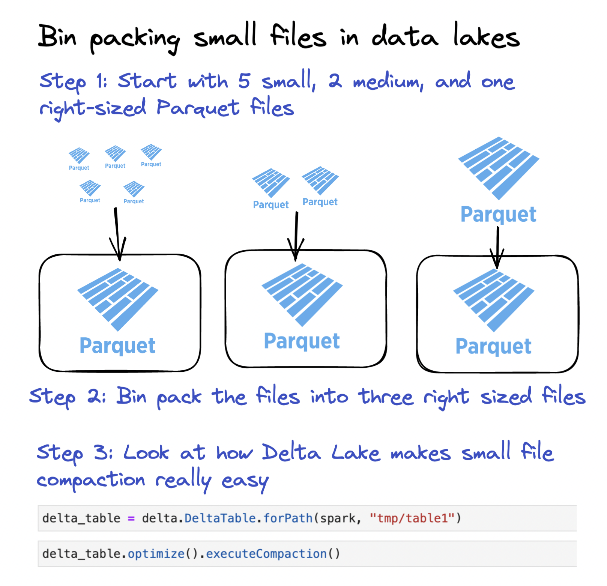

This blog post shows you how to compact small files into larger files with the Delta Lake `OPTIMIZE` command. You will learn why small file compaction is important and why it’s easier to compact small files with Delta Lake compared to regular data lakes.

Small files are problematic because they cause data queries to run slowly. They require a lot of I/O overhead, which is computationally expensive. They also create large metadata transaction logs which cause planning time slowness. Delta Lake provides an `OPTIMIZE` command that lets users compact the small files into larger files, so their queries are not burdened by the small file overhead.

The following diagram shows how Delta Lake can make bin packing your small files into right sized files easy:



Let’s see how the command works with an example.

## Delta Lake small file compaction with OPTIMIZE example

Create a DataFrame with 5 rows of data.

```
df = spark.range(0, 5)
```

Write this DataFrame to a Delta table in multiple files.

```
df.repartition(5).write.format("delta").save("tmp/table1")
```

Note: we’re using `repartition(5)`, so multiple files are output. You will normally not want to use `repartition(5)` when writing data.

Take a look at the files that are persisted in storage.

```
tmp/table1
├── _delta_log
│   └── 00000000000000000000.json
├── part-00000-4dc9742a-7c76-4527-a2c6-d7904f56d05d-c000.snappy.parquet
├── part-00001-18179b66-48f0-4d47-8f21-762678a7df66-c000.snappy.parquet
├── part-00002-03f9116e-189e-4e55-bfe7-d501fffe4ced-c000.snappy.parquet
└── part-00003-81cad732-eeaf-4708-9111-aa2e8136e304-c000.snappy.parquet
```

One row of data per file is obviously way too small. Let’s use the `OPTIMIZE` command to compact these tiny files into fewer, larger files.

```
from delta.tables import DeltaTable

delta_table = DeltaTable.forPath(spark, "tmp/table1")

delta_table.optimize().executeCompaction()
```

We can see that these tiny files have been compacted into a single file. A single file with only 5 rows is still way too small of course - we’re just using this micro example to demonstrate the functionality of `OPTIMIZE`.

Let’s vacuum the Delta table and list the files to demonstrate that all the data is now in a single file:

```
spark.conf.set("spark.databricks.delta.retentionDurationCheck.enabled", "false")
delta_table.vacuum(0)
```

Note: setting the retention period to zero will prevent you from being able to rollback and time travel to previous versions. We’re only doing it to demonstrate the `OPTIMIZE` command functionality.

Here are the files in the Delta table post-vacuum:

```
tmp/table1
├── _delta_log
│   ├── 00000000000000000000.json
│   └── 00000000000000000001.json
└── part-00000-2b164d47-0f85-47e1-99dc-d136c784baaa-c000.snappy.parquet
```

The transaction log contains two entries. The first entry is for when the Delta table was initially created and the second entry is for the `OPTIMIZE` command. Let’s look at the contents of the `00000000000000000001.json` file.

```
{
  "add": {
    "path": "part-00000-2b164d47-0f85-47e1-99dc-d136c784baaa-c000.snappy.parquet",
    "partitionValues": {},
    "size": 504,
    "modificationTime": 1671468211798,
    "dataChange": false,
    "stats": "{\"numRecords\":5,\"minValues\":{\"id\":0},\"maxValues\":{\"id\":4},\"nullCount\":{\"id\":0}}"
  }
}
{
  "remove": {
    "path": "part-00003-81cad732-eeaf-4708-9111-aa2e8136e304-c000.snappy.parquet",
    "deletionTimestamp": 1671468210066,
    "dataChange": false,
    "extendedFileMetadata": true,
    "partitionValues": {},
    "size": 478
  }
}
The other small files are also removed…
```

The `OPTIMIZE` command tombstoned all of the small data files and added a larger file with all the compacted data. Notice that `dataChange` is set to `false` for all the files that are added and removed.

A compaction operation does not add any new data to the Delta table. It just rearranges existing data from small files into larger files. This is useful when you have downstream jobs that watch your Delta table and incrementally update when new files arrive. The `dataChange` flag differentiates between data that’s been rearranged into larger files for compaction purposes and brand new data that’s been ingested into your Delta table.

Let’s take a look at the file size that Delta Lake targets when `OPTIMIZE` is run.

## Delta Lake target file size

Delta Lake targets 1 GB files when `OPTIMIZE` is run. The 1 GB default file size was selected from years of customer usage showing that this file size works well on common computational instances.

You can configure this property by setting the `spark.databricks.delta.optimize.maxFileSize` property. This enables you to set a target file size that’s different from the default.

The default file size of 1 GB has proven robust after years of testing on lots of Spark workloads. You should stick with the default unless you have a compelling reason to use a different file size.

## Delta Lake OPTIMIZE with predicate filtering

You can specify predicates to only compact a subset of your data. This is a good idea especially if you're running a compaction job on the same dataset every day. You don’t need to waste computational resources analyzing data files that have already been compacted.

Suppose you have a Delta table that’s partitioned by day and you have a daily job that compacts the small files. Here’s how to only compact newly added files that were added the previous day, in this case on November 18, 2021.

```
deltaTable.optimize().where("date='2021-11-18'").executeCompaction()
```

This is a good way to structure a compaction job on a Delta table that’s updated incrementally because it saves you from having to scan files that have already been compacted. You should compact the minimal dataset whenever possible.

## Delta Lake small file compaction pre-Delta 1.2

`OPTIMIZE` was added to Delta Lake as of version 1.2 (the Python bindings were added in version 2.0). Here’s how you can manually compact small files in Delta Lake versions prior to version 1.2. Let’s create some files to demonstrate with an example.

Create a separate Delta table with a bunch of small files:

```
df = spark.range(0, 5)
df.repartition(5).write.format("delta").save("tmp/table2")
```

Here’s how to compact the small files without using the `OPTIMIZE` command:

```
path = "tmp/table2"
numFiles = 1

(
    spark.read.format("delta")
    .load(path)
    .repartition(numFiles)
    .write.option("dataChange", "false")
    .format("delta")
    .mode("overwrite")
    .save(path)
)
```

Let’s vacuum the table to demonstrate that the data has been compacted in a single file:

```
delta_table = delta.DeltaTable.forPath(spark, "tmp/table2")
delta_table.vacuum(0)
```

There is only one remaining data file:

```
tmp/table2
├── _delta_log
│   ├── 00000000000000000000.json
│   └── 00000000000000000001.json
└── part-00000-2f60eca6-07ba-4f66-a89c-eab5caa94d25-c000.snappy.parquet
```

Manually compacting the files is inefficient and error prone.

- The user needs to correctly set the number of files. Figuring out the optimal number of files you should use when compacting your Delta table isn’t easy.
- The user needs to rewrite the entire dataset, including the small files and the large files. This can be really inefficient, especially if most data is in right-sized files and there are only some small files.

The `OPTIMIZE` command provides a much better user experience.

## What causes small files?

There are three principle causes of small data files:

- **User error**: Users can repartition datasets and write out data with any number of files. Suppose you have a 500 GB dataset. A user could write out that dataset into 100,000 files by using `repartition(100000)`. That would create a small file problem.
- **Hive-partitioned or over-partitioned datasets**: Disk partitioning requires splitting data by partition keys into different files. If the dataset is partitioned on a high-cardinality column or if there are deeply nested partitions, then more small files will be created. Suppose you have a 1 GB dataset. If that’s being written to a non-partitioned table, then the data can be written as a single file. If the data is being written to a Hive partitioned table with a partition key that has 5,000 unique values, then up to 5,000 files will be created when making the write.
- **Tables that are incrementally updated frequently**: The more frequently a table gets updated, the more small files that will be created. A job that updates a table every 2 minutes will create more small files than a job that runs every 8 hours. Remember that some tables are updated frequently to provide freshness to queries.

The ideal way to “solve” the small file problem is by architecting systems that don’t create small files in the first place. Sometimes small files are inevitable given business and query latency requirements, but other times they can be avoided. For example, you may be able to avoid a small file problem caused by Hive-style partitioning by instead using Z ORDER which can provide similar file skipping capabilities.

Let’s dig into the tradeoffs between end-to-end query latency and small files.

## ETL latency vs small files tradeoff

Suppose you have an ETL pipeline to ingest 5GB of data a day. The streaming data is ingested into a Delta table and queried by end users via a BI application.

If the incremental update job is set up to run every 5 minutes, then the pipeline will create at least 288 small files per day.

If the incremental update job is set up to run on a daily basis, then it can be configured to append five 1GB files. This setup won’t create any small files.

The optimal solution depends on the requirements of the BI user:

- If the BI user needs to refresh their dashboard throughout the day and make decisions based on recent data, then frequent updates are required.
- If the BI user only loads the dashboard once a day to generate a report, then updates every 5 minutes aren’t needed.

ETL pipelines with longer update latencies have fewer small files. In general, you should architect ETL pipelines with the highest latency that’s acceptable for the business requirements to minimize the number of small files created.

## When to run OPTIMIZE on Delta Lake

The `OPTIMIZE` command is used to solve the small file problem and should be run whenever there are enough small files to justify running the compaction operation.

If there are only a few small files, then you don’t need to run `OPTIMIZE`. The small file overhead only starts to become a performance issue where there are lots of small files.

You also don’t need to run `OPTIMIZE` on data that’s already been compacted. If you have an incremental update job, make sure to specify predicates to only compact the newly added data.

## Why Delta Lake OPTIMIZE is better than data lake compaction

Compacting small files is a surprisingly hard challenge for data lakes.

- While you’re running the compaction operation, your data lake will be in an unusable state for readers. Data lakes don’t support ACID transactions.
- Running the compaction operation is risky on a data lake. You need to manually delete the small files after they’ve been compacted which is error-prone.
- Data lakes don’t have a `dataChange=false` flag to differentiate files that contain new data from files that contain existing data that was just compacted into new files. Downstream ETL processes that watch for new data files will reprocess compacted data files just as they would with new data for data lakes.

Like most data operations, the `OPTIMIZE` command benefits greatly from the ACID transactions supported by Delta Lake. With Delta Lake you get a safe way to compact small files with a single command. With data lakes, you have to code custom logic and compact small files in a dangerous manner.

## Delta Lake bin packing

Compacting small files is an example of the bin packing problem: figuring out how to gather items of unequal sizes into a finite number of containers.

Bin packing is the general computer science challenge of building an algorithm that efficiently organizes the files into equal size containers. The Delta Lake `OPTIMIZE` command uses a bin packing algorithm to compact small files into right-sized files. Here’s how the bin packing algorithm works at a high level:

- filter all files for only files &lt; maxFileSize (default 1GB)
- sequentially add them to "bins" until the bin is ~1GB
- everytime you overflow a bin it starts a new bin
- this happens per partition

## Delta Lake OPTIMIZE vs Z ORDER

Delta Lake’s OPTIMIZE and Z ORDER commands serve completely different purposes, but they’re often used in conjuction.

Optimize is used to compact the small files in a Delta table. Z ORDER is used to intelligently sort the data so it’s more likely that files are skipped when common queries are run.

See [the documentation on Z ORDER for more information](https://docs.delta.io/latest/optimizations-oss.html#z-ordering-multi-dimensional-clustering).

## Conclusion

This post taught you how to compact your small data files, why this will improve your query times, and how Delta Lake makes this operation easy with the `OPTIMIZE` command.

You learned about common causes of small data files and how to architect ETL pipelines that are less likely to create small data files.

You also learned about why Delta Lake is a great technology for small file compaction. Delta Lake’s ACID transactions make the `OPTIMIZE` command safe. The Delta Lake `dataChange` flag also lets you architect pipelines to distinguish between data that’s recently been ingested and “new” data files that actually just contains old data you already processed.

`OPTIMIZE` is an important performance optimization and you’re now equipped to harness the full power of the command.
