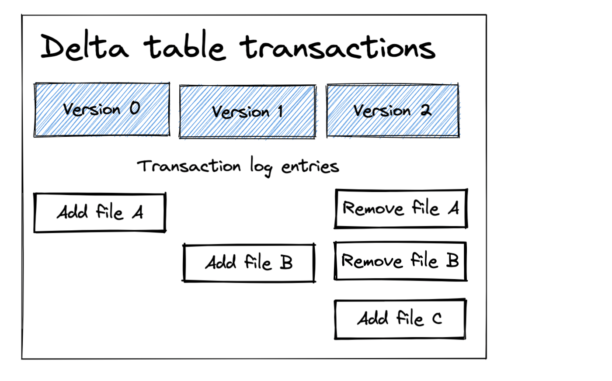

This post shows how to time travel between different versions of a Delta table with Delta Lake. You can time travel by table version or by timestamp. You’ll learn about the benefits of time travel and why it’s an essential feature for production data workloads.

You’ll also learn how the vacuum command can limit your ability to time travel. You must develop an optimal vacuum strategy that caters to your time travel needs.

Let’s dive into an example. If you'd like to follow along, all [code snippets are in this notebook](https://github.com/MrPowers/delta-examples/blob/master/notebooks/pyspark/time-travel.ipynb).

## Delta Lake time travel by version with Python example

Let’s make a Delta table with the following three versions:


We’ll build this Delta table with these three versions by creating the Delta table, appending some data, and then performing an overwrite operation.

Let’s start by creating the Delta table to create Version 0:

```
df = spark.range(0, 3)
df.repartition(1).write.format("delta").save("tmp/some_nums")
```

Note: We’re using `repartition(1)` to output a single file to simplify this demonstration. You usually shouldn’t output a single file.

Now append some data to the Delta table, which will create Version 1:

```
df = spark.range(8, 11)
df.repartition(1).write.mode("append").format("delta").save("tmp/some_nums")
```

Finally, overwrite the Delta table which will create Version 2 of the Delta table:

```
df = spark.createDataFrame([(55,), (66,), (77,)]).toDF("id")
df.repartition(1).write.mode("overwrite").format("delta").save("tmp/some_nums")
```

Let’s read in the latest version of the Delta table to confirm it only contains the Version 2 data:

```
spark.read.format("delta").load("tmp/some_nums").show()

+---+
| id|
+---+
| 55|
| 66|
| 77|
+---+
```

Let’s look at some examples where we’re time traveling to different versions of the data. Here’s how to time travel back to Version 0 and read an earlier version of the Delta table:

```
spark.read.format("delta").option("versionAsOf", "0").load("tmp/some_nums").show()

+---+
| id|
+---+
|  0|
|  1|
|  2|
+---+
```

Now read Version 1 of the Delta table:

```
spark.read.format("delta").option("versionAsOf", "1").load("tmp/some_nums").show()

+---+
| id|
+---+
|  8|
|  9|
| 10|
|  0|
|  1|
|  2|
+---+
```

We’ve already seen how Delta Lake will read in the latest version of the table by default when `versionAsOf` is not explicitly set. You can also explicitly read the latest version of the Delta table (Version 2 in this case):

```
spark.read.format("delta").option("versionAsOf", "2").load("tmp/some_nums").show()

+---+
| id|
+---+
| 55|
| 66|
| 77|
+---+
```

Delta Lake makes it easy to time travel and read different versions of your Delta table. You can use the `history` command to show all versions of the Delta table and the associated timestamps.

```
from delta.tables import DeltaTable

delta_table = DeltaTable.forPath(spark, "tmp/some_nums")
delta_table.history().select("version", "timestamp", "operation").show(truncate=False)
```

Here’s the table that’s displayed:

```
+-------+-----------------------+---------+
|version|timestamp              |operation|
+-------+-----------------------+---------+
|2      |2023-01-31 06:27:08.508|WRITE    |
|1      |2023-01-31 06:26:56.895|WRITE    |
|0      |2023-01-31 06:26:35.825|WRITE    |
+-------+-----------------------+---------+
```

Let’s learn more about how Delta Lake is architected to allow for this feature.

## Delta Lake time travel intuition

Delta Lake stores data in Parquet files and information about transactions in the `_delta_log` metadata folder.

The `_delta_log` metadata folder tracks the Parquet data files that are added and removed from the Delta table for each transaction.

The following diagram shows the files added and removed for each transaction in our example.



Let’s look at how Delta Lake will inspect the transaction log and figure out which files should be read for each version:

- For Version 0, Delta Lake just needs to read File A
- Delta Lake will see both File A and File B should be read for Version 1
- For Version 2, Delta Lake will see that File A, File B, and File C were added, but File A and File B were removed, so only File C should be read. Delta Lake will only read File C and skip the other files when reading Version 2.

Delta Lake is intelligent about reading files by consulting the transaction log. Query engines need to perform expensive file listing operations when reading files stored in data lakes. It’s much more efficient to intelligently query the transaction log to fetch the relevant files for a given version.

## Delta Lake time travel by timestamp

Delta Lake also lets you time travel based on timestamp.

```
spark.read.format("delta").option("timestampAsOf", "2019-01-01").load("tmp/some_nums")
```

Time travel by timestamp is a great way to visit your data at an earlier state without having to figure out the exact version.

Here’s an important detail worth knowing if you’re time-traveling based on timestamps and copying Delta tables to new locations. Delta Lake time-based time travel relies on file timestamps. When you copy a Delta Lake table to another location, it’s possible that the file timestamps will change, which will change the behavior of your time-based time travel code. So when copying Delta tables to another location, it’s crucial to retain the existing file timestamps.

Changing timestamps when you copy files isn’t a factor you need to consider if you’re time-traveling by version number of course.

## Delta Lake time travel SQL example

Here’s the SQL syntax to time travel to a specific version:

```
SELECT count(*) FROM my_table VERSION AS OF 5238
```

And here’s the SQL syntax to time travel to a specific timestamp:

```
SELECT count(*) FROM my_table TIMESTAMP AS OF "2019-01-01"
```

Time travel works the same whether you’re using the SQL or Python APIs. The only difference is the syntax.

## Delta Lake time travel after vacuum

Delta Lake supports a `VACUUM` command that removes files from storage that are older than the retention period and have been marked for removal in the transaction log.

If the `VACUUM` command removes a file from storage that a given Delta table version depends on you will no longer be able to time travel to that version of the Delta table.

You need to set the retention period of your Delta tables to suit your time travel needs for a given table. Some tables should never be vacuumed because you want to retain access to every version. Other tables should be vacuumed frequently to save on storage costs. See [this blog post on the vacuum command](https://delta.io/blog/2023-01-03-delta-lake-vacuum-command/) for more details.

You should make sure to set a vacuum strategy for your tables that’s optimized for your time travel needs.

## Delta Lake restore vs. time travel

Delta Lake supports a restore command that makes it easy to bring back a prior version of the Delta table to be considered the “current version”. See [this blog post on the RESTORE command](https://delta.io/blog/2022-10-03-rollback-delta-lake-restore/) for more information.

You have to specify the version every time you time travel because it doesn’t change the current version of the Delta table like RESTORE. Suppose a Delta table has three versions, and you time-travel back to Version 0. When you read the latest version of the Delta table again, it will still default back to the current version, even after you’ve time traveled

RESTORE is better when you want to reset the current version of the table. For example, restore is great for when you ingest bad data and would like to undo the append for other readers.

## Delta Lake time travel vs. data lake support

Delta Lake makes it easy to time travel between different versions of a Delta table. It’s a straightforward operation that’s a natural extension of the Delta Lake transaction log.

Data lakes do not support time travel. When you’re reading a data lake, you always have to read the latest version. Build-in time travel is an important feature Delta Lake offers compared to data lakes.

## Conclusion

This post taught you how to time travel between different versions of a Delta table by version number and by timestamp.

You learned how the Delta transaction log makes it easy to implement time travel and how deleting historical files in your Delta table can limit your ability to time travel to specific versions.

You need to be careful to set the retention period for your Delta tables so that you can time travel, but also with the right amount of flexibility to vacuum files and save on storage costs (if that’s important). See [the vacuum blog post](https://delta.io/blog/2023-01-03-delta-lake-vacuum-command/) for more details.

See [here for another blog on time travel](https://www.databricks.com/blog/2019/02/04/introducing-delta-time-travel-for-large-scale-data-lakes.html) that describes real-world use cases for this functionality.
