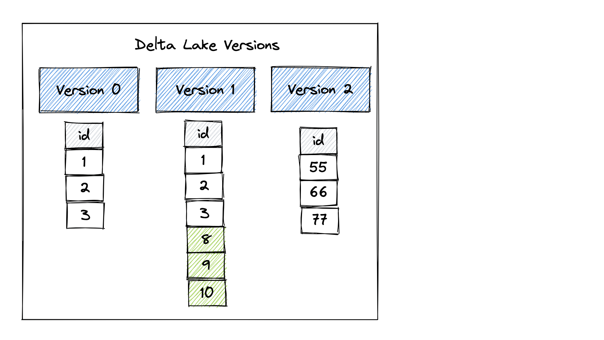
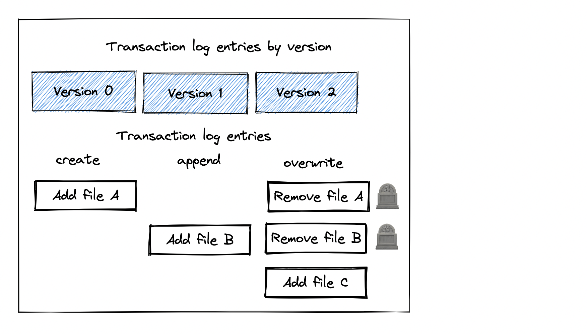

The deltalake 0.7.0 release includes exciting new features including a cleaner API for file listing operations, the ability to manually create checkpoints, and the power to fetch all the add actions of a Delta table.

This post demonstrates the new features and explains when you can use them in your production workflows. All the code snippets are in [this notebook](https://github.com/MrPowers/delta-examples/blob/master/notebooks/delta-rs-python/blog_0_7_0.ipynb) in case you’d like to follow along!

## Cleaner API for file listing operations

There used to be four different DeltaTable methods to get the list of files: `files()`, `file_paths()`, `file_uris()`, and `files_by_partition()`. These varied in whether you could pass filters (to select a subset of partitions) and whether they returned relative paths or absolute URIs. In 0.7.0, we've consolidated them into two functions:

- `DeltaTable.files()`: get the paths of the files as they are stored in the Delta Log (usually relative, but can be absolute, particularly if they are located outside of the Delta table root). Delta tables created with the SHALLOW CLONE command will have absolute file paths for example.
- `DeltaTable.file_uris()`: get the absolute URIs for the files.

Both of these functions optionally accept partition filters. Let’s create a Delta table to demonstrate this functionality:

```
import pandas as pd
from deltalake import DeltaTable, write_deltalake

example_df = pd.DataFrame({
    "part": ["a", "a", "b", "b"],
    "value": [1, 2, 3, 4]
})

write_deltalake(
    "example_table",
    example_df,
    partition_by=["part"],
    mode="overwrite"
)
```

This Delta table was partitioned by the `part` column which has two distinct values, so the data will be written as follows.

```
example_table
├── _delta_log
│   └── 00000000000000000000.json
├── part=a
│   └── 0-49068bca-183d-4d15-89a8-9f9b90f609c0-0.parquet
└── part=b
    └── 0-49068bca-183d-4d15-89a8-9f9b90f609c0-0.parquet
```

The `files()` method returns a list of all the files in the Delta table:

```
table = DeltaTable("example_table")

table.files() # ['part=b/0-49068bca-183d-4d15-89a8-9f9b90f609c0-0.parquet',
 'part=a/0-49068bca-183d-4d15-89a8-9f9b90f609c0-0.parquet']
```

You can also pass a predicate to the `files()` method to return a subset of the files. Here’s how to list all the files in the partition with `part=a`:

```
table.files([('part', '=', 'a')]) # ['part=a/0-49068bca-183d-4d15-89a8-9f9b90f609c0-0.parquet']
```

The `files()` method will return relative paths or URIs, depending on how the paths are stored in the Delta table. You can use the `file_uris()` method to always get the full path, even if the Delta table only contains relative paths.

```
table.file_uris() # ['/Users/matthew.powers/Documents/code/my_apps/delta-examples/notebooks/delta-rs-python/example_table/part=b/0-49068bca-183d-4d15-89a8-9f9b90f609c0-0.parquet',
 '/Users/matthew.powers/Documents/code/my_apps/delta-examples/notebooks/delta-rs-python/example_table/part=a/0-49068bca-183d-4d15-89a8-9f9b90f609c0-0.parquet']
```

The `file_uris()` method can also be invoked with predicates to get a subset of the files.

```
table.file_uris([('part', '=', 'a')]) # ['/Users/matthew.powers/Documents/code/my_apps/delta-examples/notebooks/delta-rs-python/example_table/part=a/0-49068bca-183d-4d15-89a8-9f9b90f609c0-0.parquet']
```

## Ability to manually create checkpoints

We now allow manually creating checkpoints. This can be useful if you have done several operations that create and remove many files (such as successive overwrites), but haven't yet hit an automatic checkpoint.

Let’s look at the files in the Delta table we created in the previous section:

```
example_table
├── _delta_log
│   └── 00000000000000000000.json
├── part=a
│   └── 0-49068bca-183d-4d15-89a8-9f9b90f609c0-0.parquet
└── part=b
    └── 0-49068bca-183d-4d15-89a8-9f9b90f609c0-0.parquet
```

Let’s use the new command to forcefully create a checkpoint.

```
table = DeltaTable("example_table")
table.create_checkpoint()
```

Here are the files in the Delta table after creating the checkpoint:

```
example_table
├── _delta_log
│   ├── 00000000000000000000.checkpoint.parquet
│   ├── 00000000000000000000.json
│   └── _last_checkpoint
├── part=a
│   └── 0-49068bca-183d-4d15-89a8-9f9b90f609c0-0.parquet
└── part=b
    └── 0-49068bca-183d-4d15-89a8-9f9b90f609c0-0.parquet
```

Notice how `00000000000000000000.checkpoint.parquet` and `_last_checkpoint` files were added to the Delta table by this command.

A checkpoint file is a fast way of getting all reconstructing the table snapshot from the metadata entries. Metadata can also be “big data”. Reading and processing lots of JSON metadata files can be slow. It’s more efficient to periodically collapse the JSON metadata files in Parquet checkpoints that can be read faster. This command gives developers the flexibility to checkpoint when they want and gives them more control over their Delta tables.

## Get DataFrame of active add actions

We also have a new experimental API to provide a table of the active add actions. The active add actions is the metadata about the set of files that are part of the table. This allows you to see their partition values, record counts, and statistics. This data can be useful in understanding how well compaction and Z-order are working for your table.

Let’s create a Delta table with three transactions and look at the add actions each step of the way. Here’s the table we’ll create:



Here are the three transactions:

1. Create the table
2. Append data to the table
3. Overwrite the table

Here’s an illustration of the transaction log entries for each operation:



Let’s start by creating the Delta table.

```
df = pd.DataFrame({"x": [1, 2, 3]})

write_deltalake("tmp/delta-table", df)
```

Now let’s take a look at the add actions:

```
table.get_add_actions(flatten=True).to_pandas()

+-------+------------+-------------+-------------+--------------+-------+-------+
|       | size_bytes | data_change | num_records | null_count.x | min.x | max.x |
+-------+------------+-------------+-------------+--------------+-------+-------+
| fileA |    1654    |    True     |      3      |      0       |   1   |   3   |
+-------+------------+-------------+-------------+--------------+-------+-------+
```

The Delta table initially only contains one file. The number of bytes, number of rows, and min/max value of the `x` column are stored in the add actions log. Note that we’re using “fileA” instead of the real Parquet filename to simplify the illustration.

Let’s append another DataFrame to the Delta table.

```
df2 = pd.DataFrame({"x": [9, 8, 10]})

write_deltalake("tmp/delta-table", df2, mode="append")
```

Let’s take a look at the add actions after this DataFrame has been appended:

```
table = DeltaTable("tmp/delta-table")

table.get_add_actions(flatten=True).to_pandas()

+-------+------------+-------------+-------------+--------------+-------+-------+
|       | size_bytes | data_change | num_records | null_count.x | min.x | max.x |
+-------+------------+-------------+-------------+--------------+-------+-------+
| fileA |    1654    |    True     |      3      |      0       |   1   |   3   |
| fileB |    1654    |    True     |      3      |      0       |   8   |  10   |
+-------+------------+-------------+-------------+--------------+-------+-------+
```

The Delta table now contains two files. You can immediately see how this metadata information is useful. For example, suppose you want to get a count of all the records in the Delta table where `x>5`. You can see how Delta Lake can skip fileA when performing this operation because five is greater than `max.x`. The add actions table gives you powerful insights into how much data you can skip when running queries.

Now let’s overwrite the Delta table with a different DataFrame.

```
df3 = pd.DataFrame({"x": [55, 66, 77]})

write_deltalake("tmp/delta-table", df3, mode="overwrite")
```

And let’s take another look at the table with add actions.

```
table = DeltaTable("tmp/delta-table")

table.get_add_actions(flatten=True).to_pandas()

+-------+------------+-------------+-------------+--------------+-------+-------+
|       | size_bytes | data_change | num_records | null_count.x | min.x | max.x |
+-------+------------+-------------+-------------+--------------+-------+-------+
| fileC |    1654    |    True     |      3      |      0       |  55   |  77   |
+-------+------------+-------------+-------------+--------------+-------+-------+
```

The add actions table doesn’t show the files that have been tombstoned by the overwrite operation. It only shows the active files for the latest version of the Delta table.

## Conclusion

The deltalake 0.7.0 release adds exciting new functions for Delta Lake users. The functions offer power users more ability to customize their Delta Lake workflows.

The file listing APIs are cleaner and you can now manually checkpoint your Delta table on command. You also now have access to the add actions table that lets you identify the number of small files in your Delta table and get more insight to how much data gets skipped for different types of queries.

The add actions operation gives you a lot more control over your Delta table and it’s a metadata-only operation so it’s fast.

The delta-rs team is doing a great job continuously improving the deltalake project!
