In this post we'll explore the full development loop with the Delta Lake Spark connector. You'll learn how to retrieve and navigate the codebase, make changes, and package and debug custom builds of the Delta Lake Spark Connector.

This post is for anyone who wants to start developing Delta Lake features or just wants to better understand the internals. If you're working in other languages or with different systems, you can still learn a lot from the reference Spark connector because it's currently the most mature and feature-rich connector available for Delta Lake.

If you're not a developer, you can still benefit from exploring the underlying implementation and running the Delta Lake Spark connector in debug mode when you encounter unexpected behavior in your daily usage. This is one of the main benefits of open source software!

We'll use git and IntelliJ, which is common for Java based projects, so you'll be able to adapt these steps to many other related projects too.

If you're using a Mac, you can execute all the commands in this post in your terminal. You may need to make changes for other operating systems. If you run into any issues, please join our Slack channel #deltalake-questions or #contributing.

Let's get started.

## How to get the Delta Lake Spark code

Let's begin first by forking the Delta Lake Spark Connector repository. Go to https://github.com/delta-io/delta and click **+ Create a new fork**.
Forking a repository creates a copy of it in our own Github account, which enables us to safely follow our git workflow on our own isolated copy.

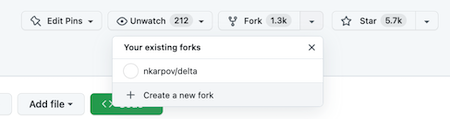

Now that we have a copy of the Delta Spark connector repository in our own account, we can clone the code to our local environment.

Clone the repository and open the new `delta` directory.

```
git clone https://github.com/nkarpov/delta
cd delta
```

Now run `git remote -v` and observe the output. The `git remote` command is used to manage a set of tracked repositories.

```
➜  delta git:(dev) git remote -v
origin	https://github.com/nkarpov/delta (fetch)
origin	https://github.com/nkarpov/delta (push)
```

You can see here that our local repository tracks only one remote, `origin`, which points to our forked repository in GitHub.
We also want our local repository to track the original `delta-io/delta` repository.
This is critical to ensure we can synchronize our fork with any changes to the original repository.
It's common to name the upstream remote, “upstream”, which we can do with the following command:

```
git remote add upstream https://github.com/delta-io/delta
```

Now let's confirm that the new “upstream” remote has been added by running `git remote-v` again:

```
➜  delta git:(dev) git remote -v
origin	https://github.com/nkarpov/delta (fetch)
origin	https://github.com/nkarpov/delta (push)
upstream https://github.com/delta-io/delta (fetch)
upstream https://github.com/delta-io/delta (push)
```

Our local environment can now track both our fork, which we refer to as `origin` and the original Delta Lake Spark connector repo, which we refer to as `upstream`.
You can name your remotes anything you want, but “origin” and “upstream” are common naming conventions followed by many developers.

Now let's fetch all the tags with this command:

```
git fetch --all --tags
```

Tags are an easy way to point to a specific git commit.
Delta Spark connector releases are tagged, like: `vX.X.X`, and we can reliably use these tags to get the exact code for a specific version, which we do by running the next command:

```
git checkout tags/v2.2.0 -b dev
```

This command checks out the commit referenced by the tag `v2.2.0` into a new local branch called “dev”.

Our local repository is now set to version `2.2.0` of the Delta Lake Spark connector.

We want to complete an entire development loop as fast as possible, so we'll return to this code later.
For now, let's move on to compiling and packaging our code base.

## How to compile and package Delta Lake Spark

The Delta Lake Spark connector build is managed by the `sbt` build tool, which is common for Scala and Java projects.
A version of `sbt` comes bundled with the project, so we can easily compile and package current code with just one command from the local repository directory:

```
build/sbt package
```

The `package` command will both compile and package the code into JAR files you can use with Spark to work with Delta Lake tables.
This might take several minutes the first time you run it, but will be faster in the future.
The build tool has to resolve and download all the dependencies of the project, which you may or may not already have.

When your package command completes, you should see a final message in your terminal like this:

```
[success] Total time: 22 s, completed Mar 2, 2023, 2:59:15 PM
```

If you haven't worked with JVM based projects before, you may encounter errors with your Java installation and/or version.
Make sure to have JDK 8 or JDK 11 installed and available on your machine.
You can start with [this guide](https://docs.oracle.com/en/java/javase/15/install/installation-jdk-macos.html), and see a list of vendors providing JDK distributions [here](https://sdkman.io/jdks)

Assuming you ran the package command successfully, you should now have some new directories and files, which you can confirm using the following find command:

```
➜  delta git:(dev) find . -name '*.jar'
...  # you'll have a few more results; the important modules are:
./core/target/scala-2.12/delta-core_2.12-2.2.0.jar
./storage/target/delta-storage-2.2.0.jar
...
```

You'll notice that `package` produced more than just one JAR file.
This is the first time we're seeing that the Delta Spark connector consists of a handful of separate, but related modules.
The two modules we actually need for our work today are listed above: delta-core and delta-storage.

Since we're focused on getting our code to run, we'll return to expand on these modules later.
For now you just need to know that the `delta-core` module contains both core Delta and Spark integration code, and the `delta-storage` module contains storage related code to make sure Delta works consistently across storage services like S3, Azure Data Lake, and Google Cloud Storage.

## How to run Delta Lake Spark

We've retrieved the code, compiled from source, and packaged our own copy of the Delta Lake Spark.
Now let's run it.

We'll need Apache Spark to run the connector.
If you don't already have it, you can use the following commands from your root directory to download and extract it.

```
curl -L https://dlcdn.apache.org/spark/spark-3.3.2/spark-3.3.2-bin-hadoop3.tgz | tar xz
cd spark-3.3.2-bin-hadoop3
```

Navigate to your Spark installation, or make sure it's available on your PATH, and run:

```
bin/spark-shell \
--jars ../delta/core/target/scala-2.12/delta-core_2.12-2.2.0.jar,\
../delta/storage/target/delta-storage-2.2.0.jar \
--conf "spark.sql.extensions=io.delta.sql.DeltaSparkSessionExtension" \
--conf "spark.sql.catalog.spark_catalog=org.apache.spark.sql.delta.catalog.DeltaCatalog"
```

The above command is taken directly from the [Delta Lake Documentation](https://docs.delta.io/latest/quick-start.html#spark-scala-shell) quickstart introduction with one small change.
Instead of using the `--packages` command which expects [Maven coordinates](https://maven.apache.org/pom.html#Maven_Coordinates), we use the `--jars` command so that we can provide Spark the exact JAR files we just built.
Note that we've used relative paths in the above example so you'll need to update those if you're working in a different directory structure.

There are many ways to improve how we provide the correct packaged code, but we've done it the most explicit way for now so you can see everything that's happening.
We share some additional links for further reading at the end of this post that are helpful for improving this workflow.

For now let's do our Delta Lake equivalent of Hello world to make sure everything is working as expected:

```
Welcome to
      ____              __
     / __/__  ___ _____/ /__
    _\ \/ _ \/ _ `/ __/  '_/
   /___/ .__/\_,_/_/ /_/\_\   version 3.3.2
      /_/

Using Scala version 2.12.15 (OpenJDK 64-Bit Server VM, Java 11.0.16.1)
Type in expressions to have them evaluated.
Type :help for more information.

scala> spark.range(1).write.format("delta").save("/tmp/helloworld") // write a 1 row table
…
scala> spark.read.format("delta").load("/tmp/helloworld").show() // print our table
+---+
| id|
+---+
|  0|
+---+
```

Success! We've stepped through the entire development loop: getting the code, compiling the code, and running the code.

Let's set up our project with an IDE, which will allow us to both navigate the code in a structured way, and easily run it with a debugger.

## How to configure IntelliJ with Delta Lake Spark

IntelliJ is the recommended IDE for working with the Delta Lake Spark connector.
If you don't already have IntelliJ, you can [download it here](https://www.jetbrains.com/idea/).
The community edition is completely free.

### Createa Delta Lake Spark IntelliJ project

Create a new _Project from Existing Sources_ and select the folder where you ran your build

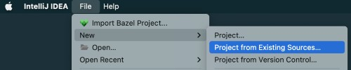

Select `sbt` as the external model

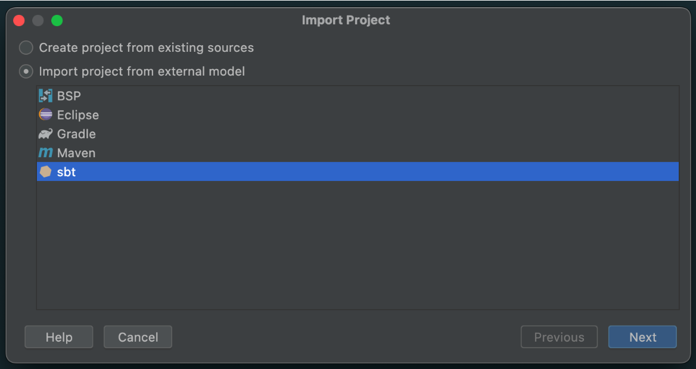

And make sure to select an appropriate **Project JDK** (JDK 1.8 or JDK 1.11):

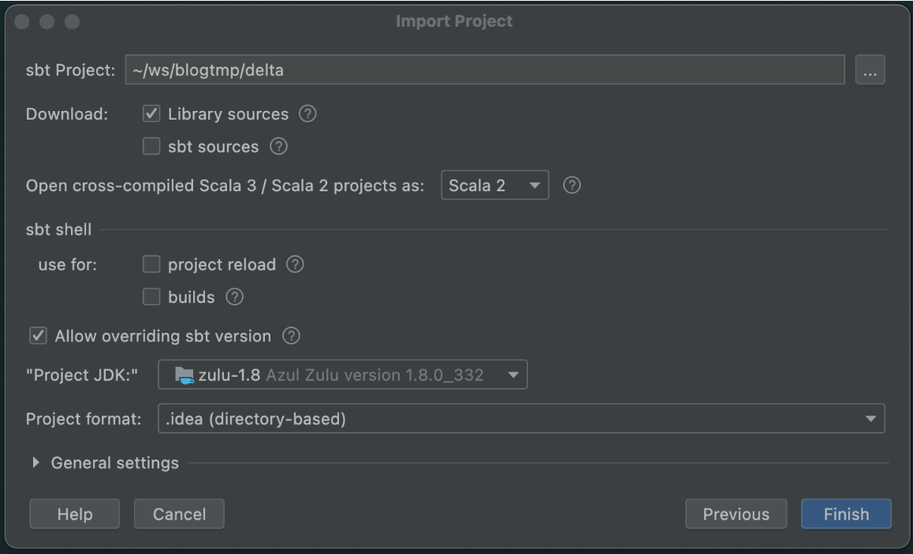

Click finish, and IntelliJ will load the project using the project definition.
When the loading process is complete you should see a screen like this, note the green checkmark in the bottom left panel showing that our sync was successful.

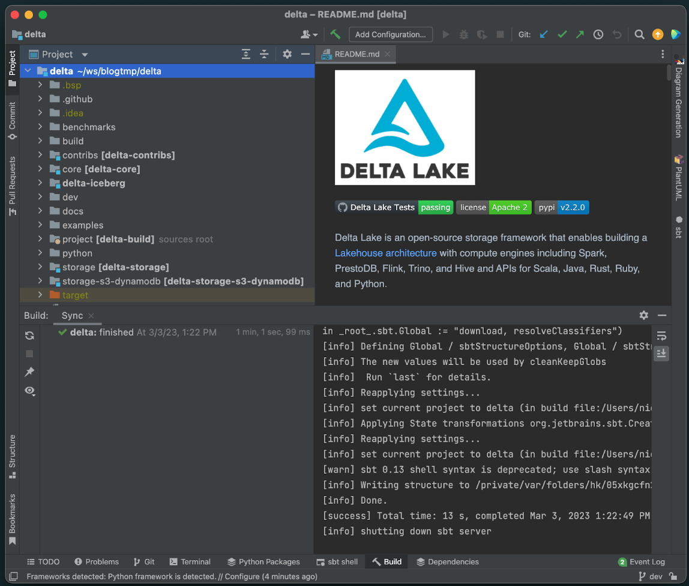

### Add a new debug configuration in IntelliJ

Now let's do the final configuration for debugging.

On the top panel, click **Add Configuration**

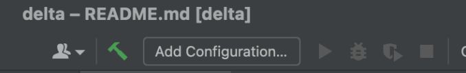

Click **Add new > Remote JVM Debug** in the window that appears

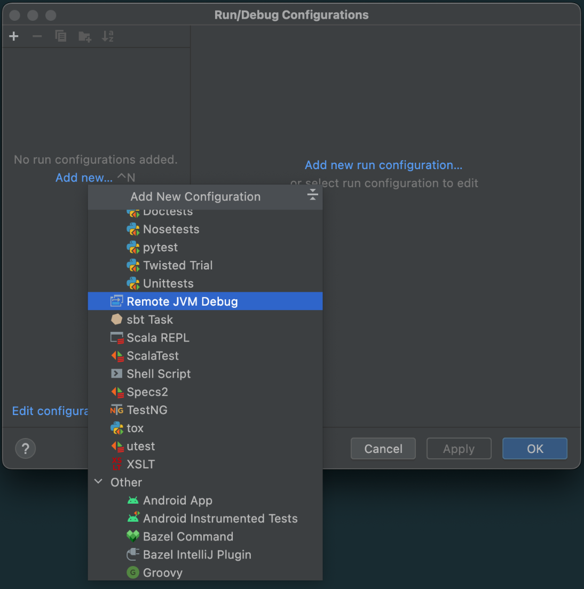

A new window will appear to set up this **Remote JVM Debug**.
We don't need to change anything here for now. Just copy and save the **Command line arguments for remote JVM**.

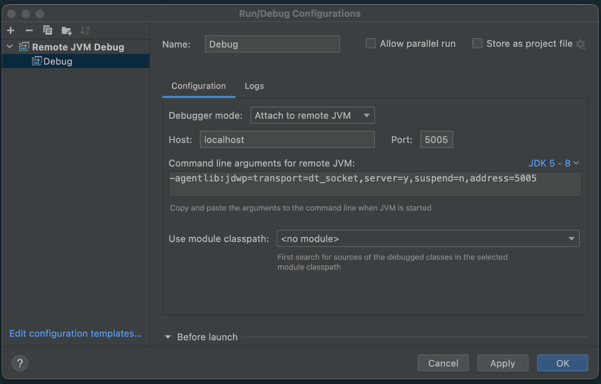

```
-agentlib:jdwp=transport=dt_socket,server=y,suspend=n,address=5005
```

We'll pass this configuration property to Spark from our terminal the next time we run so that it knows to listen on port 5005 for the IntelliJ debugging session.

## How to make changes to Delta Lake Spark

Let's make some changes to the code, and demonstrate their execution in debug mode.
We'll make these changes trivial so that we can focus on the development loop and not get lost in the implementation details.
Our primary goal is to get comfortable in this environment.

We'll make two changes.

### 1. Change the `SHOW COLUMNS` command

First, navigate to the [ShowTableColumnsCommand.scala](https://github.com/delta-io/delta/blob/v2.2.0/core/src/main/scala/org/apache/spark/sql/delta/commands/ShowTableColumnsCommand.scala) class and change the following line 53 from

```
snapshot.schema.fieldNames.map { x => Row(x) }.toSeq
```

to

```
snapshot.schema.fieldNames.map { x => Row(x.concat("COLUMN")) }.toSeq
```

This is a trivial change to add the word “COLUMN” to every field returned by SHOW COLUMNS.

You can use the CMD+O shortcut in IntelliJ to search for classes and jump to them easily.
You can also follow the gif below to get there manually.
Note that implementations of a number of Delta Lake commands are located in the same package, so you can take a look at them too.

Second, click just to the right of the line number as demonstrated in the gif below to set a breakpoint.
You'll see a bright red circle appear to confirm that a breakpoint was created.
A breakpoint instructs the JVM to literally “break”, or “pause” the execution.
This will allow us to take a look around and explore the runtime environment when we execute this command in the next section.

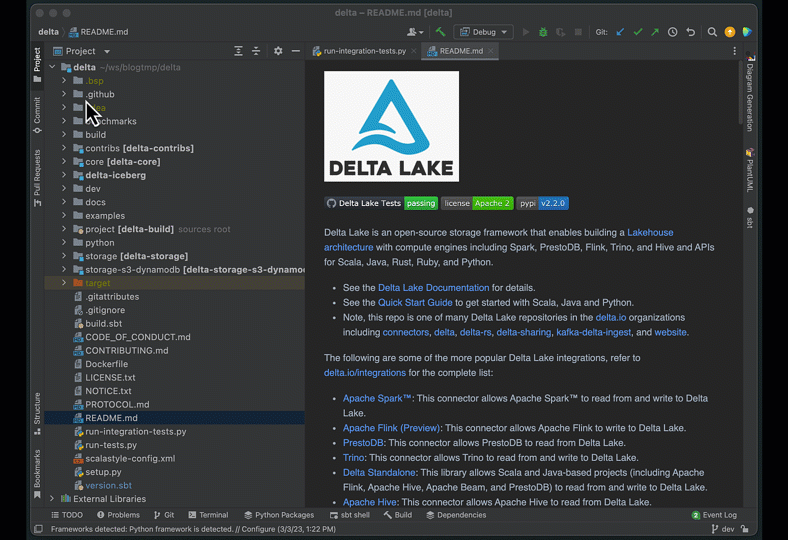

### 2. Change the version number of our custom build

The second change is purely cosmetic.
We'll change the version from `2.2.0` to `9.9.9-SNAPSHOT`.
Navigate to version.sbt in the root directory and change the version number accordingly.
This step isn't strictly necessary, but it will help us keep track of our development builds.
If we don't change this version number, we may accidentally use a custom build, and not realize it because our version will still be `2.2.0`.

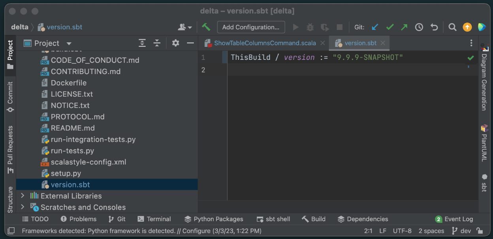

Now the final step, let's build our new `9.9.9-SNAPSHOT` package using the same `sbt` command as before

```
build/sbt package
```

And observe that we now have new JAR files tagged appropriately:

```
➜  delta git:(dev) ✗  find . -name '*.jar'
...
./core/target/scala-2.12/delta-core_2.12-9.9.9-SNAPSHOT.jar
./storage/target/delta-storage-9.9.9-SNAPSHOT.jar
```

## How to debug Delta Lake Spark in IntelliJ

Let's run our newly packaged code from the Spark Shell with IntelliJ running in debug mode.

First, navigate back to our Spark directory, and run an updated spark-shell command as follows:

```
bin/spark-shell \
--conf 'spark.driver.extraJavaOptions=-agentlib:jdwp=transport=dt_socket,server=y,suspend=n,address=5005' \
--jars ../delta/core/target/scala-2.12/delta-core_2.12-9.9.9-SNAPSHOT.jar,\
../delta/storage/target/delta-storage-9.9.9-SNAPSHOT.jar \
--conf "spark.sql.extensions=io.delta.sql.DeltaSparkSessionExtension" \
--conf "spark.sql.catalog.spark_catalog=org.apache.spark.sql.delta.catalog.DeltaCatalog"
```

Notice that we've changed the version number of the jars to our `9.9.9-SNAPSHOT` version, and added our debug string from the IntelliJ debug configuration as an additional `--conf` parameter.
We have to add this configuration so that the JVM running Spark knows to listen on port 5005 for IntelliJ.

Now, in IntelliJ, click the debug icon to start the debugger


You should see a message in IntelliJ confirming that it connected to the target JVM that's running Spark.

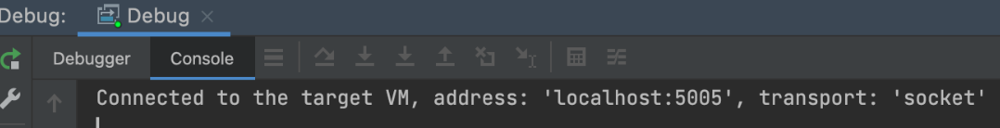

Finally, in the terminal with our Spark shell running, execute the following commands.

```
spark.range(5).write.format(“delta”).saveAsTable(“demo”)
spark.sql(“SHOW COLUMNS IN demo”).show()
```

After submitting the SHOW COLUMNS command, IntelliJ should come to the foreground and highlight the line of code where we set our breakpoint.
This means that the debugger successfully paused execution at this line and is ready for us to use.

Here is a clip showing the process, end to end, including stopping at our breakpoint, and showing the results of our new SHOW COLUMNS.

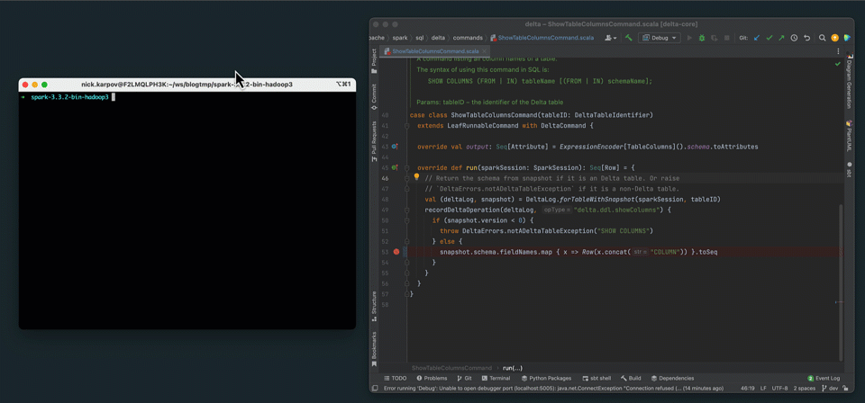

## Conclusion and Next Steps

In this post we stepped through the full development loop with the Delta Lake Spark connector. We learned how to set up the project locally, build and package the code, configure the IntelliJ debugger, and run our custom Delta Lake Spark connector in debug mode.

The possibilities from here are literally endless. We can set breakpoints anywhere in the code, interactively execute commands from the Spark shell, and step through the entire execution path as we wish.

In future posts we'll use this work as the basis to dig deeper into other areas of the Delta Lake Spark connector.

We followed a very manual setup process in this post to highlight all the moving pieces. There are many ways to improve our setup, but they're beyond the scope of this post. Here are some tips on what to try next:

1. Run the spark-shell directly from IntelliJ Terminal. You can read about how to do this here

2. Publish our builds using [`build/sbt publish`](https://www.scala-sbt.org/1.x/docs/Publishing.html). This allows us to use package names instead of JAR paths, and also allows us to include our custom builds as dependencies in other projects simply by using the adjusted version number (`9.9.9-SNAPSHOT in this case).

3. Explore the full functionality [available in the debugger](https://www.jetbrains.com/help/idea/debugging-your-first-java-application.html). We only demonstrated how to use a basic breakpoint to halt execution.
