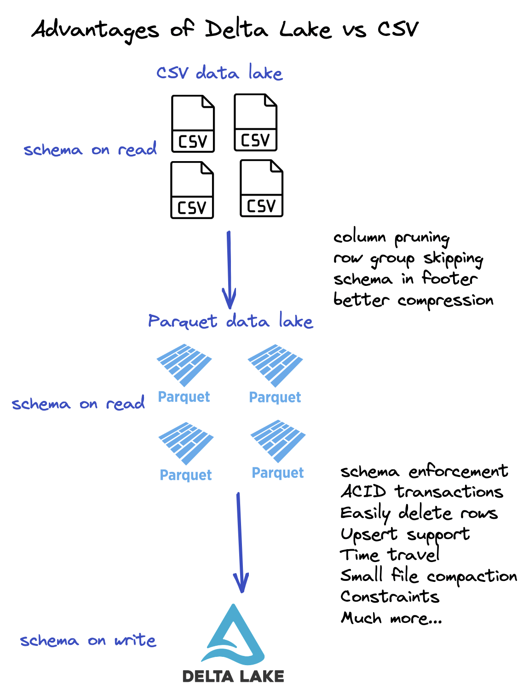
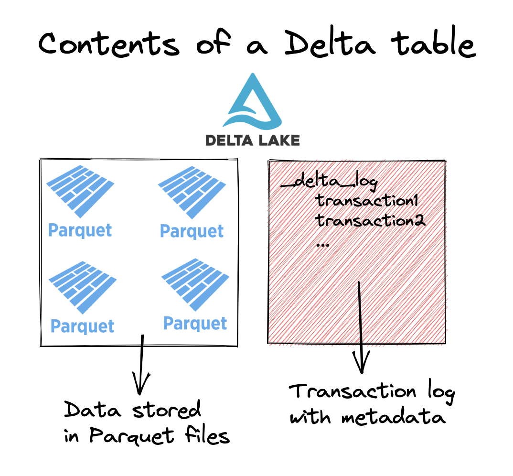

This blog post explains how to convert from CSV to Delta Lake and the wonderful benefits you’ll enjoy by using Delta Lake. CSV data lakes have many limitations that are improved upon with Parquet data lakes and even further enhanced with Delta Lake tables.

Switching from CSV to Delta Lake will give you immediate access to better performance, important features, and allow you to build more reliable data pipelines.

CSVs are OK for small datasets when human readability is important, but should generally be avoided for production data workflows. CSVs are slow and can easily be corrupted which can break your data pipelines.

Let’s look at an example to see how easy it is to convert from CSV to Delta Lake.

## Convert from CSV to Delta Lake example

Let’s look at how to convert three CSV files to a Delta Lake table.

Suppose you have three CSV files with data on students including the `student_name`, `graduation_year`, and `major`. Here’s the content of the _data/students/students1.csv_ file:

```
student_name,graduation_year,major
someXXperson,2023,math
liXXyao,2025,physics
```

Start by reading all of the CSV files into a PySpark DataFrame:

```
df = spark.read.format("csv").option("header", True).load("data/students/*.csv")

df.show()

+------------+---------------+-------+
|student_name|graduation_year|  major|
+------------+---------------+-------+
| chrisXXborg|           2025|    bio|
|davidXXcross|           2026|physics|
|sophiaXXraul|           2022|    bio|
|    fredXXli|           2025|physics|
|someXXperson|           2023|   math|
|     liXXyao|           2025|physics|
+------------+---------------+-------+
```

Now write out this DataFrame to a Delta Lake table:

```
df.write.format("delta").save("tmp/students_delta")
```

Look at the files that are outputted in the Delta table:

```
tmp/students_delta
├── _delta_log
│   └── 00000000000000000000.json
├── part-00000-55546730-18ac-4e4a-9c1a-da728de2a9eb-c000.snappy.parquet
├── part-00001-b62820a2-5641-43e5-bc02-f46c035900f1-c000.snappy.parquet
└── part-00002-2ebf1899-3e7c-4182-bfe2-2f68c6d4f826-c000.snappy.parquet
```

You can see the Delta table consists of three Parquet files where the data is stored and a `_delta_log` table that contains metadata about the transactions that have occurred. Thus far, the only transaction that has occurred was adding these three Parquet files to the Delta table.

Read in the Delta table and make sure it’s working as expected:

```
spark.read.format("delta").load("tmp/students_delta").show()

+------------+---------------+-------+
|student_name|graduation_year|  major|
+------------+---------------+-------+
| chrisXXborg|           2025|    bio|
|davidXXcross|           2026|physics|
|someXXperson|           2023|   math|
|     liXXyao|           2025|physics|
|sophiaXXraul|           2022|    bio|
|    fredXXli|           2025|physics|
+------------+---------------+-------+
```

Yep, that works perfect.

You can see that the `student_name` column separates the first name and last name with XX. In a production ingestion pipeline, you may split this field into `student_first_name` and `student_last_name` when converting the CSV data to a Delta Lake table.

Here is how you could clean the student_name column before writing to the Delta table:

```
from pyspark.sql.functions import col, split

clean_df = (
    df.withColumn("student_first_name", split(col("student_name"), "XX").getItem(0))
    .withColumn("student_last_name", split(col("student_name"), "XX").getItem(1))
    .drop("student_name")
)

clean_df.write.format("delta").save("tmp/clean_students_delta")
```

Let’s read the clean_students_data table and inspect the contents:

```
spark.read.format("delta").load("tmp/clean_students_delta").show()

+---------------+-------+------------------+-----------------+
|graduation_year|  major|student_first_name|student_last_name|
+---------------+-------+------------------+-----------------+
|           2025|    bio|             chris|             borg|
|           2026|physics|             david|            cross|
|           2022|    bio|            sophia|             raul|
|           2025|physics|              fred|               li|
|           2023|   math|              some|           person|
|           2025|physics|                li|              yao|
+---------------+-------+------------------+-----------------+
```

Sometimes you’ll want to add raw data to a Delta table and then clean it later. Other times, you’ll want to clean the data before adding it to a Delta table. Just make sure you clean the data before passing it off to end users.

Let’s look at some of the many reasons why you will benefit from switching from CSV to Delta Lake.

## Advantages of Delta Lake over CSV

Delta Lake stores data in Parquet files, so it has all the advantages of Parquet over CSV such as:

- Parquet files have schema information in the file footer
- Parquet files are easier to compress
- Parquet files are column-based and allow for column pruning, a important performance enhancement
- Parquet files contain column metadata which allows for predicate pushdown filtering
- Parquet files are immutable

See [this video](https://youtu.be/9LYYOdIwQXg) for a detailed discussion on the advantages of Parquet compared to CSV.

Delta Lake has several additional advantages over Parquet files:

- Delta Lake allows for time travel / rollback with restore
- Delta Lake supports versioned data
- Delta Lake has ACID transactions
- Delta Lake allows for schema enforcement / schema evolution
- And much more…

Take a look at the following diagram for a summary of these advantages:



Delta Lake stores metadata information in a transaction log and the underlying data in Parquet files. So Delta Lake also has all the advantages of Parquet compared to CSV. This diagram gives you a better understanding of the structure of a Delta table.



Let’s look at schema enforcement which is one Delta Lake advantage compared to CSV/Parquet data lakes.

## Highlighting one Delta Lake advantage over CSV: schema enforcement

Let’s write a DataFrame with a mismatched schema to the CSV data lake to see how it’s easily corrupted. Then let’s try to write the same mismatched DataFrame to a Delta table and see how Delta Lake prevents bad appends via schema enforcement.

Start by creating a DataFrame with a schema that doesn’t match the schema of the existing students table.

```
mismatched_df = spark.range(0, 3)

mismatched_df.show()

+---+
| id|
+---+
|  0|
|  1|
|  2|
+---+
```

Append this DataFrame to the CSV data lake:

```
mismatched_df.repartition(1).write.mode("append").format("csv").option(
    "header", True
).save("data/students")
```

Now attempt to read the CSV data lake into a DataFrame.

```
spark.read.format("csv").option("header", True).load("data/students/*.csv").show()

+------------+---------------+-------+
|student_name|graduation_year|  major|
+------------+---------------+-------+
| chrisXXborg|           2025|    bio|
|davidXXcross|           2026|physics|
|sophiaXXraul|           2022|    bio|
|    fredXXli|           2025|physics|
|someXXperson|           2023|   math|
|     liXXyao|           2025|physics|
|           0|           null|   null|
|           1|           null|   null|
|           2|           null|   null|
+------------+---------------+-------+
```

This read operation also outputs the following warning message:

```
22/12/24 16:40:46 WARN CSVHeaderChecker: Number of column in CSV header is not equal to number of fields in the schema:
 Header length: 1, schema size: 3
CSV file: file://…/data/students/part-00000-988a286d-a024-4612-8b6e-89cce5f2556e-c000.csv
```

The warning message is nice, but it’s not ideal. Our CSV data lake is now corrupted with bad data!

Let’s try to append this mismatched DataFrame to our Delta table and see what happens.

```
mismatched_df.repartition(1).write.mode("append").format("delta").save(
    "tmp/students_delta"
)
```

This errors out with the following message:

```
AnalysisException: A schema mismatch detected when writing to the Delta table (Table ID: 740d4bb1-d539-4d56-911e-18a616a37940).

To enable schema migration using DataFrameWriter or DataStreamWriter, please set: '.option("mergeSchema", "true")'.  For other operations, set the session configuration
spark.databricks.delta.schema.autoMerge.enabled to "true". See the documentation
specific to the operation for details.

Table schema:
root
-- student_name: string (nullable = true)
-- graduation_year: string (nullable = true)
-- major: string (nullable = true)

Data schema:
root
-- id: long (nullable = true)
```

Delta Lake doesn’t let you corrupt your Delta table by appending data with mismatched schema. It rejects the append and keeps your table in a correct and working state.

See [this blog post](https://delta.io/blog/2022-11-16-delta-lake-schema-enforcement/) to learn more about schema enforcement. For demonstration purposes, we’re only highlighting this one feature of Delta Lake over CSV files, but there are also a ton others that are equally useful.

## Converting from CSV to Delta Lake Conclusion

It’s easy to convert a CSV data lake to a Delta Lake table. You just need to read the CSV files into a DataFrame and write them out in the Delta file format.

Delta tables have a number of benefits over CSV files. Delta Lake is a better technology for building reliable and performant data pipelines.

CSV files are really only useful for small datasets that must be human readable. Building production data pipelines with CSV files is dangerous - there are a variety of operations that can corrupt your datasets or cause data loss. Luckily it’s easy to switch from CSV to Delta Lake and enjoy the benefits of production-grade data management.
