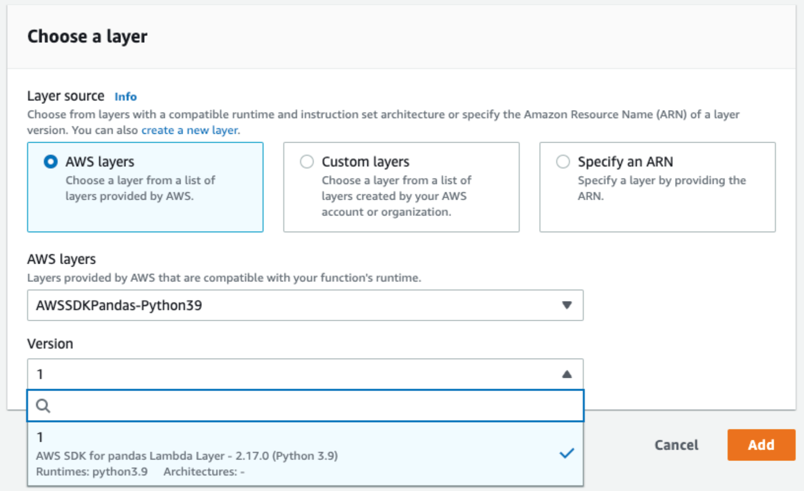

We are excited to announce that AWS Lambda with the latest release of AWS SDK for pandas (2.20) layer now supports the `deltalake` package for read and write access to Delta Lake tables.
The Delta Lake community has been working hard to make this a reality, and we are thrilled to share it with you.
In this blog post we'll highlight the benefits of using Delta Lake from AWS Lambda and step through how to build your own Lambda layer with `deltalake`.

## Reading and Writing Delta Lake tables

The code to read and write from and to Delta Lake tables from an AWS Lambda function is the same as it would be locally and in other environments.
Here's a minimal example of an AWS Lambda-compatible code block that demonstrates reading, transforming, and writing Delta Lake tables:

```
import json
from deltalake import DeltaTable
from deltalake.writer import write_deltalake

def lambda_handler(event, context):
    # Read data from Delta Lake table
    # Assume that `event` has value for the key `path`
    path = event.get('path')
    dt = DeltaTable(path)
    df = dt.to_pandas()

    # Example: Add a new column with the length of the values in column 'A'
    df['B'] = df['A'].apply(len)

    # Write the dataframe to a new Delta table on S3
    new_path = 's3://your-bucket/new-delta-table'
    write_deltalake(new_path, df, mode='append')

    return {
        'statusCode': 200,
        'body': json.dumps(f"Data successfully written to: {new_path}")
    }
```

This Lambda function reads data from a Delta Lake table, adds a new column using Pandas, and writes the modified data to a new Delta table on S3.

## Benefits of Delta Lake Tables from AWS Lambda

With the new support for the Python `deltalake` package in AWS Lambda, users can now enjoy the following benefits:

- **Scalability**: AWS Lambda allows you to run code without provisioning or managing servers, enabling you to build applications that can easily scale with the number of requests. With Delta Lake table support, you can now build and scale data processing applications effortlessly.

- **Cost-effectiveness**: AWS Lambda automatically scales your application in response to the number of requests, and you only pay for the compute time you consume. By leveraging the deltalake package in AWS Lambda, you can reduce spend on over provisioning large clusters for smaller use cases.

- **Ease of use**: The integration of Delta Lake tables with AWS Lambda simplifies data processing workflows, allowing you to focus on your application logic rather than managing infrastructure.

- **Increased** compatibility: By expanding the PyArrow build in the AWS pandas SDK, we have paved the way for other packages to benefit from this dependency, fostering a more extensive ecosystem of compatible applications and tools.

## Installation

You can configure deltalake with Lambda function by uploading a zip file archive as a Lambda Layer, or by creating a container image and uploading it to Amazon ECR.
In this post, we'll focus on the easy to use [Lambda Layer](https://docs.aws.amazon.com/lambda/latest/dg/configuration-layers.html) approach.

### Building the deltalake package as an AWS Lambda Layer

First, create a new directory and a `python` subdirectory for the layer and navigate to it.
The subdirectory is required for AWS Lambda to correctly recognize dependencies.

```
mkdir -p deltalake_lambda_layer/python
cd deltalake_lambda_layer
```

Second, install the deltalake package without its dependencies (`--no-deps`) into the python subdirectory.
All the necessary dependencies are included in the AWS SDK for pandas layer, which we'll configure with our Lambda function in a later step.
Note that we also specify `--platform` explicitly to make sure we get the compatible Linux-based build.

```
pip install -t ./python --no-deps --platform manylinux2014_x86_64 deltalake==0.8.0
```

Finally, package the installation up into a zip file and name it accordingly

```
zip -r deltalake_layer.zip .
```

You now have a `deltalake_layer.zip` file that you can upload as a layer to AWS Lambda.

### Uploading the deltalake Lambda layer zip to AWS

#### Using the AWS CLI

Install and configure the [AWS CLI](https://aws.amazon.com/cli/) if you haven’t done so already, and then run the following command to upload the layer we built in the previous step.

```
aws lambda publish-layer-version \
--layer-name deltalake_layer \
--zip-file fileb://deltalake_layer.zip \
--compatible-runtimes python3.7 python3.8 python3.9
```

#### Using the AWS Management Console

To upload the Lambda layer using the AWS Management Console, follow the steps below.
You can read more about configuring AWS Lambda Layers in the AWS documentation.

1. Sign in to the AWS Management Console.
2. Navigate to the Lambda service.
3. Click on "Layers" in the left sidebar.
4. Click the "Create layer" button.
5. Provide a name for the layer, such as "deltalake_layer".
6. Click the "Upload" button and select the deltalake_layer.zip file.
7. Choose the appropriate runtime, and click the "Create" button.

Take note of the LayerVersionArn in the response, as you will need it when configuring your Lambda function.

### Configuring the AWS Lambda function

There are a few more steps we need to configure before we can begin using `deltalake` in our lambda function.

#### Adding layers to lambda function

As we noted before, we're depending on AWS SDK for pandas to provide the dependencies that `deltalake` needs.
This means that we need to add both layers to our function.

First, add the AWS SDK for pandas layer.
As the screenshot below shows, the layer is fully managed, and available directly in the AWS console, so we don't need to package anything like we did the deltalake layer.
You can read more about this in the [official documentation](https://aws-sdk-pandas.readthedocs.io/en/stable/install.html#aws-lambda-layer).



#### IAM Roles

We need to make sure our function is able to read and write to S3.
The recommended approach is to use IAM Roles, so make sure that your execution role has the appropriate permissions.
You can read more about IAM role configuration with AWS Lambda in the [official documentation](https://docs.aws.amazon.com/lambda/latest/dg/lambda-intro-execution-role.html).

#### Environment Variables

If you don't plan to have multiple writers accessing a Delta Lake table at once you must set the following environment variable in the [Lamda function environment variable configuration](https://docs.aws.amazon.com/lambda/latest/dg/configuration-envvars.html).
Otherwise, the function will throw an error to protect your data from unexpected writes.

```
AWS_S3_ALLOW_UNSAFE_RENAME	false
```

If you do plan to have multiple writers, you must add the following environment variables to ensure that `deltalake` writers don’t overwrite each other.

```
AWS_S3_LOCKING_PROVIDER           dynamodb
DYNAMO_LOCK_PARTITION_KEY_VALUE   key
DYNAMO_LOCK_TABLE_NAME            delta_rs_lock_table
```

Note the values for the partition key value and table name above and make sure they are consistent with the DynamoDB table you provision in the next step!

#### DynamoDB Multi Writer Support

If you're planning to support multiple writers at once, you must provision a DynamoDB table and grant access using the IAM role.
This table is necessary to [support concurrent writers in S3](https://delta.io/blog/2022-05-18-multi-cluster-writes-to-delta-lake-storage-in-s3/).

Here is the snippet to quickly create the DynamoDB table using the AWS CLI

```
aws dynamodb create-table --table-name delta_rs_lock_table \
    --attribute-definitions \
        AttributeName=key,AttributeType=S \
    --key-schema \
        AttributeName=key,KeyType=HASH \
    --provisioned-throughput \
        ReadCapacityUnits=10,WriteCapacityUnits=10

```

## Limitations and Future Work

The three leading multi-process writing solutions for Delta Lake, namely Databricks Runtime, Delta Lake Spark Connector with DynamoDB, and Delta Rust with DynamoDB, are continuously evolving to enhance compatibility.
While reading tables concurrently is supported by all three connectors today, writing to the same table on AWS S3 simultaneously from different connectors is yet to be possible.
Users must use one connector at a time to ensure data correctness.
Today's limitation is due to the differing approaches to ensuring mutual exclusion on top of S3: Databricks Runtime uses a managed internal service, Delta Rust with DynamoDB employs a lease-based locking mechanism, and Delta Spark with DynamoDB relies on conditional writes.
The Delta community is actively working to develop a unified, compatible solution, ensuring that all connectors will support multi-process writes from all Delta connectors concurrently.

## Conclusion

We are delighted to announce the support for the deltalake package in an AWS Lambda with the AWS SDK for pandas layer.
We believe this integration will empower users to build more scalable, cost-effective, and user-friendly data processing applications within the AWS ecosystem.
We would like to extend our gratitude to the AWS SDK for pandas team for their collaboration and willingness to adapt their AWS Lambda layer build, making this support possible!

We encourage you to try out the deltalake package support in your AWS Lambda functions and experience the benefits firsthand.
We look forward to seeing the innovative solutions that our users will develop using this new integration.

Happy coding, and enjoy the power of Delta Lake tables in AWS Lambda!
