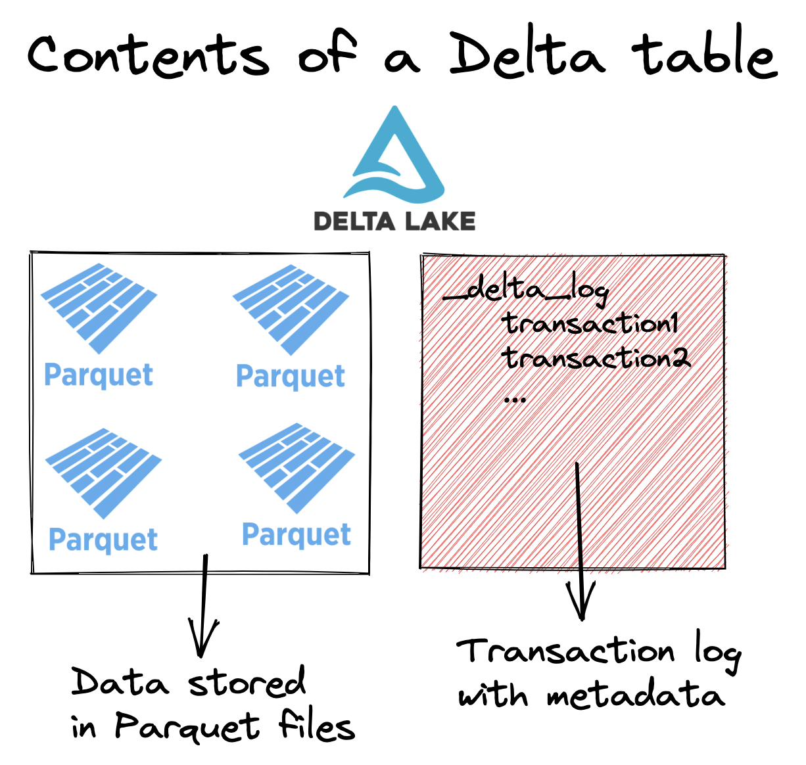

This blog post describes how to create Delta Lake tables with generated columns, which are a great way to automatically populate columns based on other column values.

You will learn about when generated columns are useful in your data workflows.

All the computations in this post are in [this notebook](https://github.com/delta-io/delta-examples/blob/master/notebooks/pyspark/generated-columns.ipynb) in case you’d like to follow along and run the code on your local machine.

## Create Delta Lake table with generated columns

In this section, we’ll create a Delta Lake table with `id`, `first_name`, `last_name`, `age`, and `full_name` columns.

The `id`, `first_name`, `last_name` and `age` columns will be supplied by the user when they’re appending data to the table.

The `full_name` column will be generated by Delta Lake when data is appended to the table. The `full_name` column will simply concatenate the `first_name` and `last_name` columns and separate them with a space.

Here’s how we can create the empty Delta table with Python:

```
from delta import DeltaTable

(
    DeltaTable.create(spark)
    .tableName("default.some_people")
    .addColumn("id", "LONG")
    .addColumn("first_name", "STRING")
    .addColumn("last_name", "STRING")
    .addColumn("age", "LONG")
    .addColumn(
        "full_name", "STRING", generatedAlwaysAs="concat(first_name, ' ', last_name)"
    )
    .execute()
)
```

Let’s show the Delta table and make sure it’s empty:

```
spark.sql("select * from some_people").show()

+---+----------+---------+---+---------+
| id|first_name|last_name|age|full_name|
+---+----------+---------+---+---------+
+---+----------+---------+---+---------+
```

Great, now let’s see how to append data to this table and take advantage of the generated column feature.

## Insert into Delta Lake table with generated columns

Let’s append data to the Delta Lake table. We’ll append a DataFrame that has `id`, `first_name`, `last_name`, and `age` columns. This will let us observe how Delta Lake automatically generates the `full_name` column.

```
df = spark.createDataFrame(
    [(0, "Bob", "Loblaw", 23),(1, "Sue", "Grafton", None), (2, "Jim", "Carrey", 61)]
).toDF("id", "first_name", "last_name", "age")

df.write.mode("append").format("delta").saveAsTable("some_people")
```

Now query the table and verify that the `full_name` column was populated by Delta Lake:

```
DeltaTable.forName(spark, "some_people").toDF().show()

+---+----------+---------+----+-----------+
| id|first_name|last_name| age|  full_name|
+---+----------+---------+----+-----------+
|  2|       Jim|   Carrey|  61| Jim Carrey|
|  0|       Bob|   Loblaw|  23| Bob Loblaw|
|  1|       Sue|  Grafton|null|Sue Grafton|
+---+----------+---------+----+-----------+
```

Let’s look at how Delta Lake stores the `full_name` column in Delta tables and the associated performance/storage implications.

## How Delta Lake stores data for generated columns

Delta Lake persists the generated column data in storage. The column isn’t computed on the fly when the data is read. The data is computed and persisted when DataFrames are appended to storage.

Let’s refresh our memory on the high-level structure of a Delta table:



Delta tables consist of data stored in Parquet files and metadata stored in the transaction log.

The generated column data is persisted in the underlying Parquet files, just like the data for the other columns.

Persisting data in storage adds to storage costs. There is an extra column that’s persisted in your Delta table which you need to pay for.

Persisting data generally saves on compute costs because you don’t need to compute the `full_name` value anymore when reading data. You can just read the value directly.

Compute is generally more expensive than storage, so strategically generating columns and saving on compute should generally save you money overall.

Let’s now turn our attention to how generated columns interact with Delta table schema evolution.

## How Delta Lake generated columns work with schema evolution

When Delta Lake schema evolution is enabled, you can append DataFrames to Delta tables that have missing or extra columns, see [this blog post for more details](https://delta.io/blog/2023-02-08-delta-lake-schema-evolution/).

Once column generation is enabled, certain columns become required and schema evolution doesn’t behave as usual. If you enable schema evolution on a Delta table without any generated columns, then the `first_name` and `last_name` columns would be optional. In this case, the `full_name` column depends on the `first_name` and `last_name` columns, so they’re required, even if schema evolution is enabled.

Let’s see what happens when you try to append a DataFrame without the last_name column to the Delta table.

```
df = spark.createDataFrame(
    [
        (8, "Liam", 66),
        (9, "Colin", 77),
    ]
).toDF("id", "first_name", "age")

df.write.option("mergeSchema", "true").mode("append").format("delta").saveAsTable(
    "some_people"
)
```

Here’s the error message you’ll get:

```
AnalysisException: Column 'last_name' does not exist. Did you mean one of the following? [first_name, age, id]; line 1 pos 24;
'Project [id#2335L AS id#2391L, first_name#2336 AS first_name#2392, age#2337L AS age#2393L, 'concat(first_name#2336,  , 'last_name) AS full_name#2394]
+- Project [_1#2329L AS id#2335L, _2#2330 AS first_name#2336, _3#2331L AS age#2337L]
   +- LogicalRDD [_1#2329L, _2#2330, _3#2331L], false
```

Now let’s see what happens if you try to append a DataFrame with values that should be generated.

## What happens when users supply columns that should be generated?

Delta Lake will reject the transaction if you try to append values that the Delta table should be generating for you. Let’s try to append a DataFrame that contains the `full_name` column to the Delta table.

Start by creating the DataFrame:

```
df = spark.createDataFrame([
    (21, "Curtis", "Jackson", 47, "50 cent"),
    (22, "Eric", "Wright", None, "easy-e"),
]).toDF("id", "first_name", "last_name", "age", "full_name")
```

Now try to append it to the Delta table:

```
df.write.mode("append").format("delta").saveAsTable("some_people")
```

Delta Lake rejects this transaction and provides the following error message:

```
Py4JJavaError: An error occurred while calling o234.saveAsTable.
: org.apache.spark.sql.delta.schema.DeltaInvariantViolationException: CHECK constraint Generated Column (full_name <=> concat(first_name, ' ', last_name)) violated by row with values:
 - first_name : Eric
 - full_name : easy-e
 - last_name : Wright
```

Delta Lake rightfully rejects this transaction.

## What happens when generated columns depend on columns will null values?

Let’s see what happens when you try to append a DataFrame with `first_name` or `last_name` columns that are `null` to the Delta table.

```
df = spark.createDataFrame(
    [
        (44, None, "Perkins", 20),
        (55, "Li", None, 30),
    ]
).toDF("id", "first_name", "last_name", "age")

df.write.mode("append").format("delta").saveAsTable(
    "some_people"
)
```

View the contents of the DataFrame:

```
spark.sql("select * from some_people").show()

+---+----------+---------+----+-----------+
| id|first_name|last_name| age|  full_name|
+---+----------+---------+----+-----------+
|  2|       Jim|   Carrey|  61| Jim Carrey|
|  0|       Bob|   Loblaw|  23| Bob Loblaw|
|  1|       Sue|  Grafton|null|Sue Grafton|
| 44|      null|  Perkins|  20|       null|
| 55|        Li|     null|  30|       null|
+---+----------+---------+----+-----------+
```

In this case, the `full_name` is `null` whenever `first_name` or `last_name` is `null`. This behavior is consistent with the normal behavior of the PySpark concat function.

## Delta Lake generated columns: Conclusion

Delta Lake allows you to create Delta tables with generated columns that are automatically computed based on other column values and are persisted in storage.

Generated columns are a great way to automatically and consistently populate columns in your Delta table. You don’t need to manually append columns to your DataFrames before appending if generated columns are set up.

Generated columns can only be added to Delta tables that are newly created or replaced. You can’t add a generated column to an existing Delta table.

Persisting generated columns in storage can be a great way to save on compute and make your queries run faster. You don’t need to compute values when reading data if the computations have already been run beforehand and are persisted in storage.

Take a look at [the documentation on generated columns](https://docs.delta.io/latest/delta-batch.html#-deltausegeneratedcolumns) to learn more about the types of expressions that are supported by generated columns.
