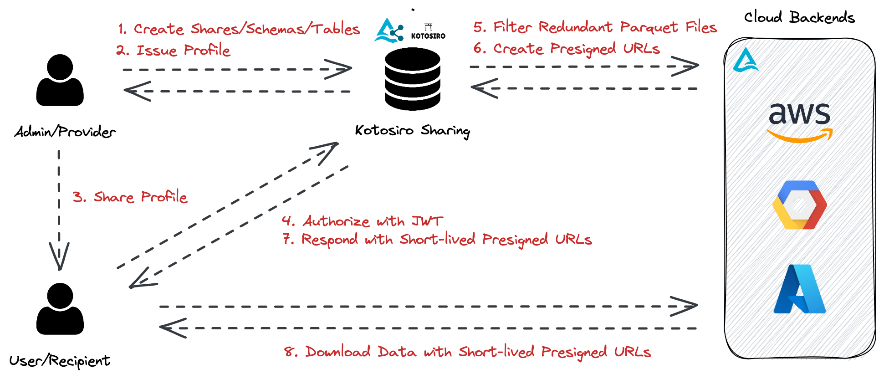

My name is Shingo, creator of [Kotosiro Sharing](https://github.com/kotosiro/sharing). I am excited to announce the release of [Kotosiro Sharing](https://github.com/kotosiro/sharing), a minimalistic Rust implementation of the Delta Sharing server aimed at helping engineers easily host their own Delta Sharing service.
In this article, I will provide instructions on how to share your data with your colleagues who may have varying technical backgrounds, ranging from data engineers to business intelligence analysts, using self-hosted [Kotosiro Sharing](https://github.com/kotosiro/sharing) server. The instructions are fairly easy and straightforward, and you can easily share your data with colleagues who have different levels of technical expertise. The implementation is currently in the beta phase, and hence, it does not provide a GUI yet. However, this feature will be added in the near future.
The following image depicts the system workflow. Let's walk through how [Kotosiro Sharing](https://github.com/kotosiro/sharing) works when you want to share precious data with your colleagues.

