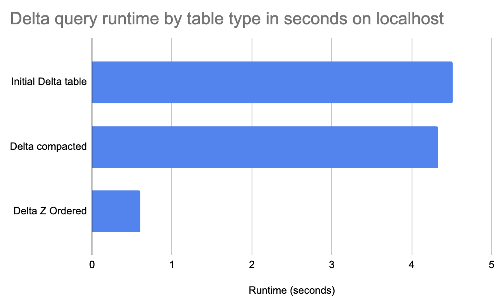
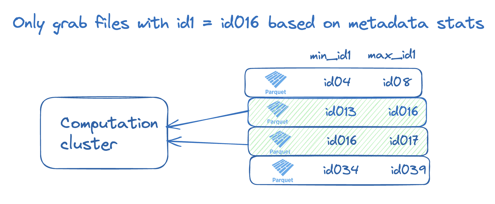
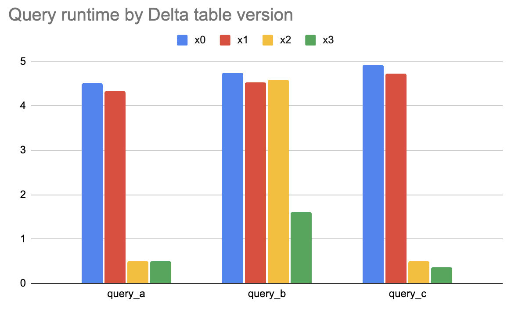

This blog post explains how to Z ORDER Delta tables and how this design pattern can significantly speed up your queries.

Z Ordering your data reorganizes the data in storage and allows certain queries to read less data, so they run faster. When your data is appropriately ordered, more files can be skipped.

Z Order is particularly important for the ordering of multiple columns. If you only need to order by a single column, then simple sorting suffices. If there are multiple columns, but we always/only query a common prefix of those columns, then hierarchical sorting suffices. Z Ordering is good when querying on one or multiple columns. You’ll see a concrete example later to further illustrate when Z Ordering fits well.

Let’s start with a simple example and then explore how to develop an optimal Z ORDER strategy for your data. See [this notebook](https://github.com/delta-io/delta-examples/blob/master/notebooks/pyspark/delta-z-order.ipynb) if you would like to follow along with the computations.

## Delta Lake Z Order Example

Let’s use a data set from the h2o benchmarks and demonstrate how Z Ordering the data can make a query faster.

Suppose you have a one billion-row data set with nine columns as follows:

```
+-----+-----+------------+---+---+------+---+---+---------+
|  id1|  id2|         id3|id4|id5|   id6| v1| v2|       v3|
+-----+-----+------------+---+---+------+---+---+---------+
|id016|id046|id0000109363| 88| 13|146094|  4|  6|18.837686|
|id039|id087|id0000466766| 14| 30|111330|  4| 14|46.797328|
|id095|id078|id0000584803| 56| 92|213320|  1|  9|63.464315|
+-----+-----+------------+---+---+------+---+---+---------+
```

You’d like to run the following query: `select id1, sum(v1) as v1 from the_table where id1 = 'id016' group by id1`.

The Delta table is initially stored in 395 files, and the rows with `id1 = 'id016'` are dispersed throughout all the files, so none of the files can be skipped when the query is run.

It takes 4.51 seconds to run the query on the Delta table when it’s initially created:

```
(
    spark.read.format("delta")
    .option("versionAsOf", "0")
    .load(delta_path)
    .createOrReplaceTempView("x0")
)

spark.sql(
    "select id1, sum(v1) as v1 from x0 where id1 = 'id016' group by id1"
).collect()
```

Now let’s compact the Delta table so it does not contain unnecessarily small files.

```
delta_table = DeltaTable.forPath(spark, delta_path)
delta_table.optimize().executeCompaction()
```

The compacted Delta table contains 27 files. The query now only takes 4.33 seconds to run.

```
(
    spark.read.format("delta")
    .option("versionAsOf", "1")
    .load(delta_path)
    .createOrReplaceTempView("x1")
)

spark.sql(
    "select id1, sum(v1) as v1 from x1 where id1 = 'id016' group by id1"
).collect()
```

On such a small dataset, compacting the 395 small files into 27 larger files doesn’t help the query runtime much. On a larger dataset with more small files, the compaction can materially speed up the query runtime.

Let’s now Z Order the data by `id1`, so the rows with `id1 = 'id016'` are grouped together and not spread across all the files.

```
(
    delta.DeltaTable.forPath(spark, table_path)
    .optimize()
    .executeZOrderBy("id1")
)
```

Now we only have rows with `id1 = 'id016'` in 1 of the 25 files. The query now takes 0.6 seconds to execute.

```
(
    spark.read.format("delta")
    .option("versionAsOf", "2")
    .load(delta_path)
    .createOrReplaceTempView("x2")
)

spark.sql(
    "select id1, sum(v1) as v1 from x2 where id1 = 'id016' group by id1"
).collect()
```

Z Ordering data can significantly improve query performance. This graph shows the query time by Delta table version:



## Why file skipping improves query performance

Transferring data from storage to memory is expensive, so minimizing the data sent over the wire speeds up your queries.

Delta tables store per-file metadata in the transaction log that engines can consult when running queries, and that they can use to skip over files that do not contain data that is needed for the query.

To make this possible, Delta tables store min/max values for columns in each file. Let’s visualize how the min/max statistics stored for the `id1` column can be used to perform file skipping.



When reading data with `id1=id016`, we only need to grab files that contain rows `'id016'` between the `min_id1` and `max_id1` values. We know that a file with a `min_id1=id034` value has no rows of data relevant to our query.

Z Ordering helps your queries run faster because it makes it more likely that data can be skipped.

## Delta Lake Z ORDER by multiple columns

You can also Z Order a Delta table on multiple columns. Let’s look at a collection of query patterns and the tradeoffs associated with Z Ordering on various columns.

Suppose you’re running the following types of queries frequently:

- query_a: `select id1, sum(v1) as v1 from x1 where id1 = 'id016' group by id1`
- query_b: `select id2, sum(v1) as v1 from x1 where id2 = 'id047' group by id2`
- query_c: `select id1, id2, sum(v1) where id1 = 'id016' and id2 = 'id047' group by id1, id2`

With this query pattern, Z Ordering on `id1` and `id2` could be good. Here’s how to run the Z Order command:

```
(
    delta.DeltaTable.forPath(spark, table_path)
    .optimize()
    .executeZOrderBy("id1", "id2")
)
```

Let’s observe the query runtime on the four versions of our Delta table.

- x0: Delta table that was initially created
- x1: Delta table that has been compacted
- x2: Delta table Z Ordered by `id1`
- x3: Delta table Z Ordered by `id1` and `id2`



As previously mentioned, small file compaction doesn’t help much in this example because the dataset is relatively small. Compaction can materially speed up queries when there are a lot of small files.

Z Ordering the Delta table by `id1` improves queries that filter based on `id1`, but not for query_b, which only filters on `id2`. Z Ordering the table by `id1` and `id2` helps queries that filter on `id1`, `id2`, and both `id1` and `id2`.

For this query pattern, Z Ordering by `id1` and `id2` provides a nice performance boost for all the queries. Z Ordering by `id1` only doesn’t help speed up `query_b`.

It’s important to note that for a larger dataset, `query_a` will run faster for the Delta table that’s only Z Ordered by `id1` and slower for the Delta table that’s Z Ordered by `id1` and `id2`. Z Ordering by multiple columns limits the ability for the `id1` data to be colocated. Z Ordering has tradeoffs, so it’s important to analyze query patterns and select the right columns when Z Ordering your data.

## Delta Lake Z Ordering vs. Hive-style partitioning

Delta Lake Z Ordering and Hive-style partitioning are techniques for grouping similar data in the same files, so only a subset of files are read when executing specific queries.

Hive-style partitioning groups similar data in the same directory in storage. Z Ordering groups similar data in the same files without creating directories.

Suppose you’d like to rearrange a Delta table so the following query executes better: `select id2, sum(v1) as v1 from x1 where id2 = 'id047' group by id2`.

You can either Z Order by `id2` or partition by `id2`.

Partitioning by `id2` guarantees complete data separation. There will be a separate directory for each value in `id2`, so the `id2=id07` directory will only contain rows with that exact data.

Complete data separation can sometimes be great, but it can also be a liability. When you partition by a column with too many distinct values (aka a high cardinality column), lots of small files may be created depending on the size of the dataset and the skew.

Updating a data set partitioned on a high cardinality column can rapidly exacerbate the small file problem.

Deciding on the optimal data layout depends on the query pattern, data volume, column cardinality, and data skew. You should not be partitioning tables under one terabyte in general. You also shouldn’t partition by a column that will have partitions with less than 1 GB of data. If you’re partitioning a table that’s updated frequently, measure the number of new files created to assess the potential impact of the small file problem.

Hive-style partitioning doesn’t necessarily cause a proliferation of small files. Suppose you write data into a table partitioned by the `ingestion_date` column every 8 hours. This write won’t necessarily cause more small files than writing to an unpartitioned lake. If you’re writing data to a table partitioned by a `medical_code` column with 10,000 distinct values, then every write operation can create up to 10,000 files, and the small file problem can snowball.

You can always Z ORDER and incrementally append to avoid some small file issues created by Hive-style partitioning.

Hive-style partitioning and Z Ordering aren’t mutually exclusive because you can also do both.

## Delta Lake Z Ordering with Hive-style partitioning

You can partition a Delta table in storage and Z Order the data within a given partition.

For example, you can partition by `ingestion_date` and Z Order by `user_id`. This design would be a great way to run queries on user activity over time.

This post does not cover the intricacies of Z Ordering vs. partitioning data. We will discuss this topic in detail in a future post.

## When Z Ordering does not improve query performance

Z Ordering only helps improve query performance if it can help you skip files.

Let’s take a look at the following query that won’t benefit from our Delta table that’s Z Ordered by `id1`: `select id3, sum(v1) as v1 from x1 group by id3`

Z Ordering on `id1` would not improve the runtime for this particular query.

It’s crucial to Z Order on the right columns to get performance gains for your most common query patterns.

## Conclusion

Z Ordering is a powerful way to sort data that’s persisted in storage so that the engine can skip more files when running queries, so they execute faster.

Z Ordering is an amazing Delta Lake feature unavailable in data lakes.

This blog post showed you how to Z Order data by one or multiple columns. You learned about the best columns to use when Z Ordering data and the tradeoffs when you Z Order on multiple columns.

You also learned how to use Z Ordering with or instead of Hive-style partitioning. The tradeoffs between Z Ordering and Hive-style partitioning are complex and will be covered in detail in a future post. Delta tables' architecture fundamentally differs from data lakes, changing the cost/benefit equation of partitioning for practitioners.
