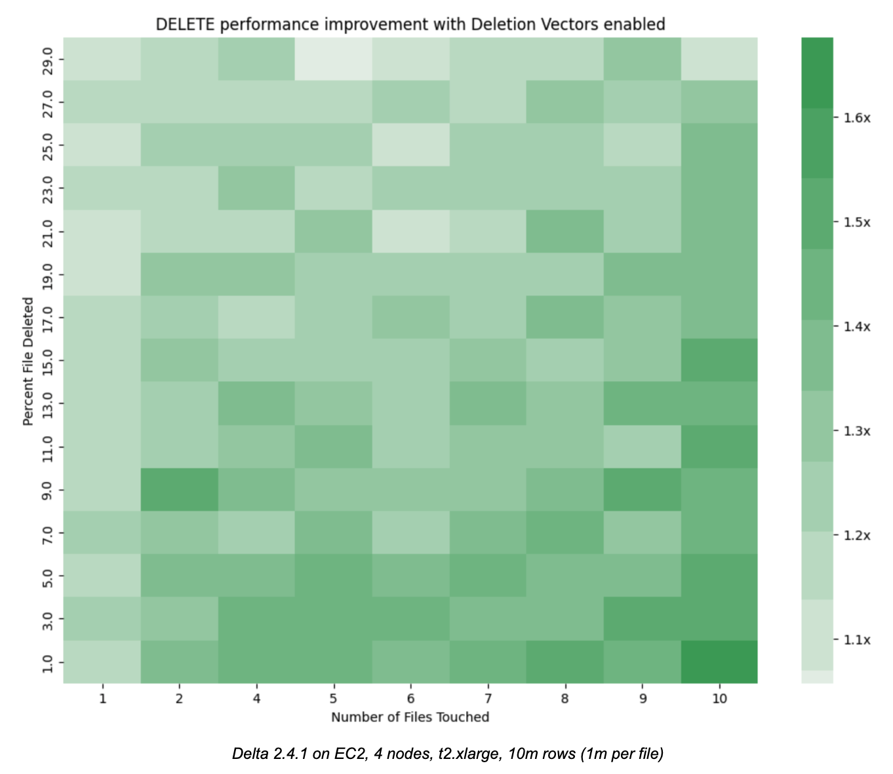
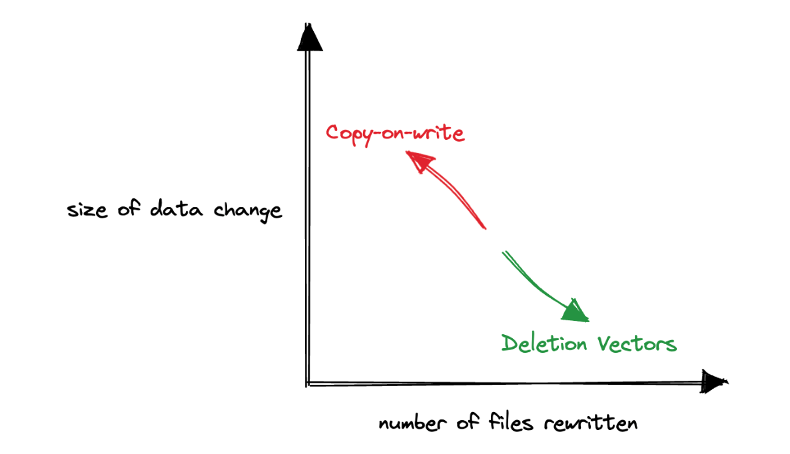

This blog introduces the new Deletion Vectors table feature for Delta Lake tables, and explains how Deletion Vectors speed up operations that modify existing data in your lakehouse.

To get started, all you need to do is set the following table property on your Delta Lake table:

```
ALTER TABLE tblName SET TBLPROPERTIES ('delta.enableDeletionVectors' = true);
```

Deletion Vectors bring a new paradigm to the Delta Lake protocol, Merge-on-Read (MoR), in which the existing data files remain untouched during change operations, like DELETE, UPDATE, and MERGE. Changes are instead written separately for readers to merge when the data is actually read. Hence, “merge on read”.

Traditionally, the Delta Lake protocol has only supported the Copy-on-Write (CoW) paradigm, in which the underlying data files are rewritten any time a change is made.

Neither paradigm offers a silver bullet for all use cases, but, in general, copy-on-write works best for data that is infrequently updated and often read, while merge-on-read works best for data that is frequently updated and broadly scattered among the underlying files of a table.

In the rest of this post we’ll show the main benefits and tradeoffs to consider when enabling the Deletion Vectors table feature for your Delta Lake table. We’ll also explore how Deletion Vectors work under the hood using DELETE, which is the first Deletion Vector supported change operation in the recently released Delta Lake 2.4 & 3.0.

## Deletion Vectors make deletes faster

Deletion Vectors vastly improve the performance of DELETE operations on Delta Lake Tables. They accomplish this by specifying that writers mark the position of deleted rows separately from the data files themselves. This is also known as a “soft delete”. The position of the deleted rows are encoded in a highly compressed bitmap format, RoaringBitmap, that can be compacted into the data files separately later.

The heatmap below illustrates the performance improvement of the DELETE command as both the number of files touched and the number of rows deleted in each file increase. We see that the performance of DELETE with Deletion Vectors enabled vastly improves over the traditional Copy-on-Write mode in nearly all cases, and especially as the number of files touched increases (bottom right). This relationship makes intuitive sense, because the traditional Copy-on-Write mode has to rewrite more and more files, while the Merge-on-Read mode with Deletion Vectors defers the rewrite penalty.



The code and data used to generate these results is available in the accompanying [notebook](https://github.com/delta-io/delta-examples/blob/master/notebooks/pyspark/deletion-vectors.ipynb). You can easily run it on your local machine to confirm the results. The benefits only improve at scale where the data size is likely to be much bigger, the number of files much higher, and the penalty of cloud storage more expensive.

## When should I enable Deletion Vectors?



The design and implementation of Deletion Vectors in Delta Lake aims to make Deletion Vectors the obvious choice for most workloads. Still, there are always important trade offs to understand and consider.

Whatever time the DELETE operation saves by avoiding eagerly rewriting files, the reader and compaction commands pay for later. When you enable the Deletion Vector table feature on your Delta Lake table, you amortize, or spread out, the cost of making changes to your data.

To get the most out of this table feature you should consider the following:

1. **Write Frequency & Latency SLA:** Use Deletion Vectors when the write frequency is high, or when low write latency is required, particularly for small data changes that cause large write amplification in the traditional Copy-on-Write mode. In low write frequency scenarios with flexible latency requirements, Deletion Vectors might not be as advantageous.

2. **Read Frequency & Latency SLA:** Exercise caution with Deletion Vectors in high-read scenarios, as the cumulative cost of additional execution time to process the additional Deletion Vector files can add up.

3. **Data Layout & Change Distribution:** Deletion Vectors excel when data changes are spread across many files, making the write amplification that comes with the traditional copy-on-write method extraordinarily expensive. Pay particular attention to the matching predicates for data changes. The [Levi](https://github.com/MrPowers/levi) library provides helper methods for easy access to the underlying file statistics.

It’s also important to consider how these dimensions change over time. High usage tables with consistent changes will have evolving data layouts, and so you may need to adjust your strategy accordingly.

To address this dynamic of evolving layouts of high usage tables, Databricks has introduced Predictive I/O for Updates, which leverages machine learning to optimize data reading and writing intelligently without user intervention. See the [official announcement](https://www.databricks.com/blog/announcing-public-preview-predictive-io-updates) and [documentation](https://docs.databricks.com/optimizations/predictive-io.html#use-predictive-io-to-accelerate-updates) to learn more about Predictive I/O for Updates on Databricks.

## How Deletion Vectors in Delta Lake work

Let’s explore how this table feature works with the Spark Delta Lake connector.

Consider a base Delta Lake table, `daily_user_actions`, which represents the possible actions our users can take every day. Each user performs only one action per day, for a total of 10 days. The table is partitioned by day, and therefore has 10 partitions, each with a single file:

```
SELECT * FROM daily_user_actions WHERE day = 9

+---+-------+-------------+
|day|user_id|       action|
+---+-------+-------------+
|  9|      0|profileUpdate|
|  9|      1|         post|
|  9|      2|        reply|
	    ...

├── _delta_log
│   └── 00000000000000000000.json
├── day=0
│   └── part-00000-805a80ba-1086-4ecd-97eb-d7ff92359f13.c000.snappy.parquet
├── day=1
│   └── part-00000-0e02935c-f84d-4b8a-ae09-db76f74a44ff.c000.snappy.parquet
├── day=2, day=3, etc...
```

Suppose that we need to delete all actions by the user with the user_id of 3.

```
DELETE FROM daily_user_actions WHERE user_id = 3
```

Because the table is partitioned by day, the traditional copy-on-write mode produces new Parquet data files in each partition. In other words, to delete a single user, we need to rewrite the entire table!

```
├── _delta_log
│   ├── 00000000000000000000.json	# CREATE TABLE ...
│   └── 00000000000000000001.json	# DELETE FROM .. WHERE user_id = 3
├── day=0
│   ├── part-00000-805a80ba-1086-4ecd-97eb-d7ff92359f13.c000.snappy.parquet
│   └── part-00001-6750aa5c-ff6f-4579-aa55-7b4c2ad0907e.c000.snappy.parquet
├── day=1
│   ├── part-00000-0e02935c-f84d-4b8a-ae09-db76f74a44ff.c000.snappy.parquet
│   └── part-00000-7e750ace-9b85-431d-bc20-896e0a856347.c000.snappy.parquet
├── day=2, day=3, etc. ...
```

So, while time partitioned tables are very useful for analytics that can exploit the time locality of data, they are also notoriously expensive to update along non-time dimensions, like user IDs, as we can see in the file listing above.

With the Deletion Vectors table feature enabled, our data and log directory listing would look instead like this:

```
├── _delta_log
│   ├── 00000000000000000000.json	# CREATE TABLE ...
│   ├── 00000000000000000001.json	# ALTER TABLE enableDeletionVectors ...
│   └── 00000000000000000002.json 	# DELETE FROM .. WHERE user_id = 3
├── day=0
│   └── part-00000-54b2c529-1314-42d7-b5e3-10b43e1892ea.c000.snappy.parquet
├── day=1
│
│   ...
│
├── day=9
│   └── part-00000-973fb3cf-4d0b-4bc9-adf4-5c3bed552ecb.c000.snappy.parquet
└── deletion_vector_856b2bfe-81b7-4d86-ac9a-25d6a9bb272a.bin
```

This time only a single new file, the Deletion Vector, is written to represent the deletes across all of our partitions! Marking row level deletes from multiple data files in a single Deletion Vector is an important optimization to avoid writing many small deletion vector files.

A closer look at the latest JSON commit entry in the log directory reveals that every data file that has a row where user_id = 3 now has a `remove` action associated with it.

```
{
  "remove": {
    "path": "day=0/part-00000-54b2c529-...parquet",
    "deletionTimestamp": 1684789501794,
    "dataChange": true,
    "extendedFileMetadata": true,
    "partitionValues": {
      "day": "0"
    },
    "size": 802
  }
}

```

This is because, while the affected data files are still valid, their previous metadata entries do not have reference to the newly written Deletion Vector file, and therefore those entries must be marked invalid. In their place, an updated metadata entry in the form of an add action is added for every affected file like below:

```
{
 "add": {
    "path": "day=0/part-00000-54b2c529-...parquet",
    ...
    "deletionVector": {
      "storageType": "u",
      "pathOrInlineDv": "G>&jrFWXvdTEpD^SK<Jc",
      "offset": 85,
      "sizeInBytes": 34,
      "cardinality": 1
    }
  }
}
```

The add action now has a nested descriptor object with the key `deletionVector`, that has metadata to help the reader correctly process the Deletion Vector.

- **storageType** indicates how the Deletion Vector is stored: relative, absolute, or inline. The Delta Transaction Log Protocol supports serializing Deletion Vectors directly into the metadata instead of as separate files.
- **pathOrInlineDV** either has the location of the Deletion Vector file, or the serialized deletion vector itself when using the ‘inline’ storage option
- **offset** is where the row indices for deleted rows begin for this particular file. This is how a single Deletion Vector can support deleted row indices from multiple data files.
- **cardinality** is the number of rows marked by this Deletion Vector

The full Deletion Vector specification is beyond the scope of this post. More details can be found in the official [Delta Transaction Log Protocol](https://github.com/delta-io/delta/blob/master/PROTOCOL.md#deletion-vector-descriptor-schema), and the [Deletion Vectors High Level Design doc](https://docs.google.com/document/d/1lv35ZPfioopBbzQ7zT82LOev7qV7x4YNLkMr2-L5E_M).

## How do I apply or compact Deletion Vectors?

Deletion Vectors must eventually be applied to the underlying Parquet files. This is the step that writers defer that allow Deletion Vector writes to be so much faster than the traditional copy-on-write mode.

To rewrite the files that have associated Deletion Vectors we introduce the new `REORG TABLE` command:

```
REORG TABLE daily_user_actions APPLY (PURGE);

REORG TABLE daily_user_actions
  WHERE day >= current_timestamp() - INTERVAL '1' DAY
  APPLY (PURGE);
```

Applying a Deletion Vector to its underlying data file will make the data file smaller and so `REORG TABLE` is also smart enough to coalesce small files into fewer larger files, similar to `OPTIMIZE`. In fact, if we inspect the JSON commit produced by `REORG TABLE`, we see that it leverages the `OPTIMIZE` command under the hood.

```
{
  "commitInfo": {
    "operation": "OPTIMIZE",
    ...
}
```

Note: REORG TABLE does not remove the Deletion Vectors nor the data file themselves. Run VACUUM to physically remove the files.

## Feature status, limitations, and Roadmap

In the previous Delta Lake 2.3 release, we introduced full read support for tables with Deletion Vectors enabled. The latest Delta Lake 2.4 and 3.0 releases built on this read support, and added write support for the DELETE command.

Enabling the Deletion Vectors table features on your Delta Lake table is not reversible and the table will only be readable by Delta Lake clients that support reading (2.3 for Delta Spark)

The UPDATE and MERGE commands on Deletion Vector enabled tables are still supported in 2.4, but default to traditional copy-on-write mode. Support for these commands is being [actively developed](https://github.com/delta-io/delta/issues/1367#issuecomment-1485345562) by the community and we’re excited to include them with future releases!

## Conclusion

In this post we introduced and explored the new Deletion Vectors table feature for Delta Lake tables.

Deletion Vectors are a significant advancement in Delta Lake, introducing the Merge-on-Read (MoR) paradigm for more efficient writes. Unlike the traditional Copy-on-Write approach, MoR leaves existing data files untouched during modifications, merging changes only during reading.

Deletion Vectors are particularly effective for applying changes to data that lack a natural ordering that can be exploited with partitioning, or when the needed changes are far smaller than the actual table.

Ultimately, each paradigm has its own strengths, and the decision to enable Deletion Vectors depends on your unique data needs and use case.

You can learn more about Deletion Vectors by looking at the official [documentation](https://docs.delta.io/latest/delta-deletion-vectors.html), the Deletion Vector sections in the [Delta Transaction Log Protocol](https://github.com/delta-io/delta/blob/master/PROTOCOL.md#deletion-vector-descriptor-schema), and the original [Deletion Vectors High Level Design doc](https://docs.google.com/document/d/1lv35ZPfioopBbzQ7zT82LOev7qV7x4YNLkMr2-L5E_M).
