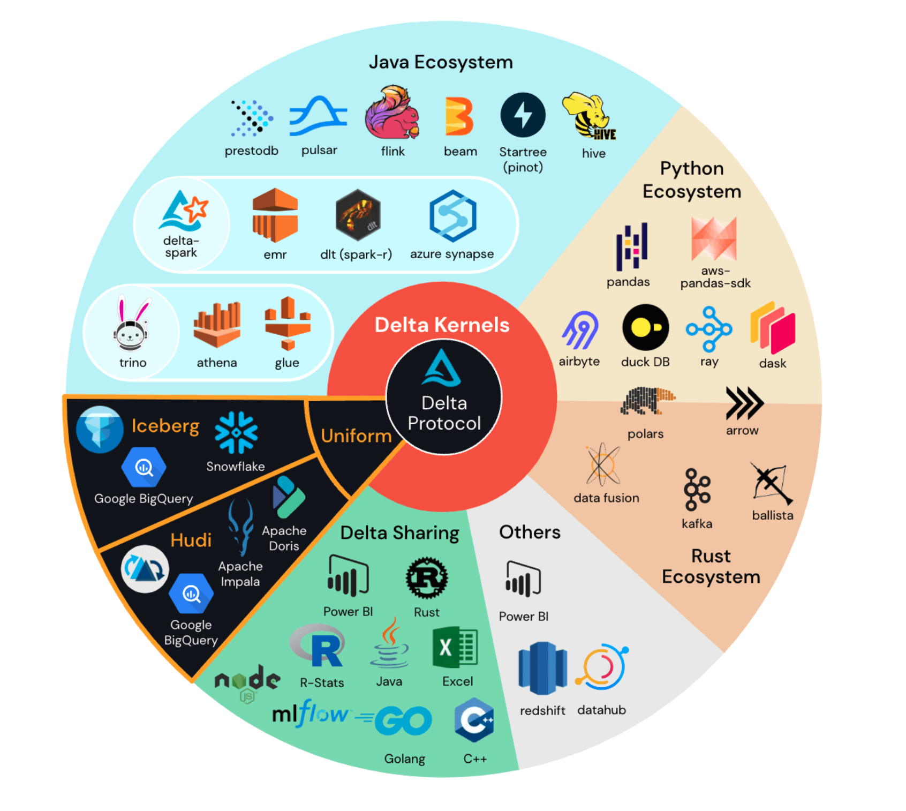
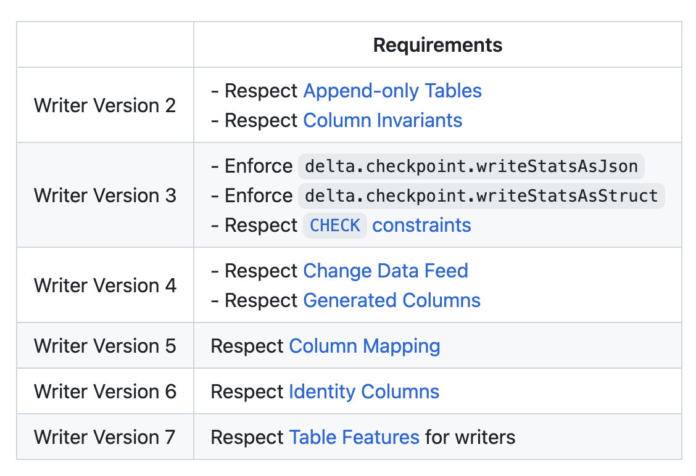

This post explains the [Delta Lake transaction log protocol](https://github.com/delta-io/delta/blob/master/PROTOCOL.md), the [delta-io/delta](https://github.com/delta-io/delta/) reference implementation of the Delta Lake transaction log protocol, and the other known Delta Lake implementations.

Delta Lake follows a common software design pattern that contains three parts:

1. a “spec”
2. a [reference implementation](https://en.wikipedia.org/wiki/Reference_implementation)
3. acceptance tests

The Delta Lake spec is the [Delta Transaction Log Protocol](https://github.com/delta-io/delta/blob/master/PROTOCOL.md), the reference implementation is [delta-io/delta](https://github.com/delta-io/delta), and the acceptance tests are in [Delta Acceptance Testing](https://github.com/delta-incubator/dat/).

This design pattern is also followed by HTTP, which has [a spec](https://www.rfc-editor.org/rfc/rfc9110.html), several reference implementations, and acceptance tests.

“Delta Lake” refers to several codebases that implement the Delta Lake transaction log protocol. Some of the known implementations of Delta Lake are fully open source and others are proprietary with closed features.

- The [delta-io/delta-rs](https://github.com/delta-io/delta-rs) implementation is open source and maintained by developers from various organizations.
- The [dask-contrib/dask-deltatable](https://github.com/dask-contrib/dask-deltatable) implementation is open source and maintained by the Dask community.
- Some implementations are closed-source, like the Microsoft Fabric implementation of Delta Lake (this is just one example of many closed-source implementations).

[The Lakehouse architecture](https://www.cidrdb.org/cidr2021/papers/cidr2021_paper17.pdf) allows for both closed and open source implementation of the Delta Lake transaction log protocol to be interoperable. This article will discuss some of the closed features like [V Ordering in the Microsoft Fabric implementation](https://learn.microsoft.com/en-us/fabric/data-engineering/delta-optimization-and-v-order?tabs=sparksql) and explain how Microsoft’s implementation of Delta Lake is still interoperable because it complies with the Delta Lake transaction log protocol.

The Delta Lake transaction log protocol is at the center of the universe of Delta Lake implementations as shown in the following diagram:

Let’s look into some Delta Lake transaction log protocol details with more rigor.

## Delta Lake Transaction Log Protocol

The Delta Lake transaction log protocol specifies how files should be stored in a Delta table, how transactions should be recorded, and the required protocol versions/table features for different implementations.

All Delta Lake implementations must follow the Delta Lake transaction log protocol strictly.

Some common Delta Lake features are not in the Delta Lake transaction log protocol. For example, there is no spec on how query engines should sort data in Delta tables to allow for more file skipping when the Delta table is queried. The Delta Lake transaction log protocol does not specify that writers should support hierarchical sorting, Z Ordering, V Ordering, or any other specific type of sorting. That’s up to the individual Delta Lake implementation.

What is required is that all Delta Lake implementation features are entirely compliant with the supported protocol version/table features as specified in the Delta Lake transaction log protocol.

## Known implementations of Delta Lake

There are several known open source implementations of Delta Lake:

- [delta-io/delta](https://github.com/delta-io/delta/)
- [delta-io/delta-rs](https://github.com/delta-io/delta-rs)
- [dask-contrib/dask-deltatable](https://github.com/dask-contrib/dask-deltatable)
- [delta-incubator/deltaray](https://github.com/delta-incubator/deltaray)
- [delta-incubator/deltatorch](https://github.com/delta-incubator/deltatorch)

There are also several closed-source implementations of Delta Lake:

- [Amazon Delta Lake](https://docs.aws.amazon.com/athena/latest/ug/delta-lake-tables.html)
- [Microsoft Fabric Delta Lake](https://learn.microsoft.com/en-us/fabric/data-engineering/lakehouse-and-delta-tables)
- [GCP Delta Lake](https://cloud.google.com/blog/topics/developers-practitioners/how-build-open-cloud-datalake-delta-lake-presto-dataproc-metastore)
- [Databricks Delta Lake](https://docs.databricks.com/delta/index.html)

Different implementations of Delta Lake support different protocol versions/table features.

delta-io/delta-rs supports lower protocol versions than delta-io/delta for example.

Different implementations of Delta Lake support different features that are outside the scope of the Delta Lake transaction log protocol, here are some examples:

- delta-io/delta supports Z Ordering, which isn’t supported by some open source Delta Lake implementations yet
- delta-io/delta-rs has a `get_add_actions()` method that is possible in Delta Standalone, but isn’t in any of the other Delta Lake implementations (see [this blog post](https://delta.io/blog/2023-02-27-deltalake-0.7.0-release/) for more details)
- As previously mentioned, Microsoft Fabric Delta Lake has V Ordering, which isn’t supported by any of the other Delta Lake implementations

Some of the Delta Lake implementations aren’t even complete enough to fully support the earlier protocol version yet.

## Partial implementations of the Delta Lake transaction log protocol

Some of the Delta Lake implementations are works-in-progress and don’t even support the earliest reader protocol version completely.

Partial implementations are OK - we all need to start somewhere.

The Dask implementation for example currently has a minimal viable reader, but more work is needed to satisfy the reader protocol v1 requirements. Let’s look more into the Delta Lake writer protocol versions to learn more.

## Delta Lake protocol version basics

Here are the requirements for the different Delta Lake writer protocol versions:

The requirements are cumulative, so Writer Version 3 requires all the Version 3 requirements and all the Version 2 requirements.

Specifying protocol versions in this cumulative manner was a bit too strict, so Delta Lake has transitioned to Table Features.

Let’s suppose an implementation supported all the Version 2 & 3 requirements, Generated Columns, and Column Mapping. At first glance, you might think this Delta Lake implementation was on Writer Version 5, but it’s really still stuck on Writer Version 3 because it doesn’t support Change Data Feed yet.

This was unnecessarily strict because some implementations may choose to never support a feature for example. That’d leave them stuck on a certain protocol version forever.

Delta Lake transitioned to [Table Features as specified here](https://github.com/delta-io/delta/blob/master/PROTOCOL.md#table-features), to overcome this limitation. Implementations can now jump to supporting Writer Version 7, which does not require support for any of the previous table features. The implementation can then cherry-pick what table features they will support.

## Delta Lake project governance

Delta Lake is governed by the [Linux Foundation](https://www.linuxfoundation.org/).

The [delta-io/delta](https://github.com/delta-io/delta) code repository has the Apache v2.0 License.

## Conclusion

delta-io/delta is a reference implementation of the Delta Lake transaction log protocol. delta-io/delta does not and cannot support all vendor features like Microsoft Fabric V Ordering. Supporting all vendor features is also outside of the Delta Lake transaction log protocol mandate. The same goes for the proprietary Databricks Runtime Delta Lake implementation for that matter. delta-io/delta is a reference implementation of the Delta Lake transaction log protocol, but that doesn’t mean it has all the features of proprietary implementations.

All Delta Lake implementations must follow the Delta Lake transaction log protocol strictly, but vendors and open source implementations also have the option to add additional features that do not break compatibility with the protocol.

Microsoft Fabric V Ordering is a great example of a feature that benefits from the Delta Lake [Lakehouse storage system](https://www.cidrdb.org/cidr2023/papers/p92-jain.pdf). The vendor-specific implementation allows Microsoft users to access special performance optimizations. But because they strictly abide by the Delta Lake transaction log protocol spec, any Delta tables created or modified by Microsoft Delta Lake are also interoperable with other implementations of the Delta Lake transaction log protocol.
