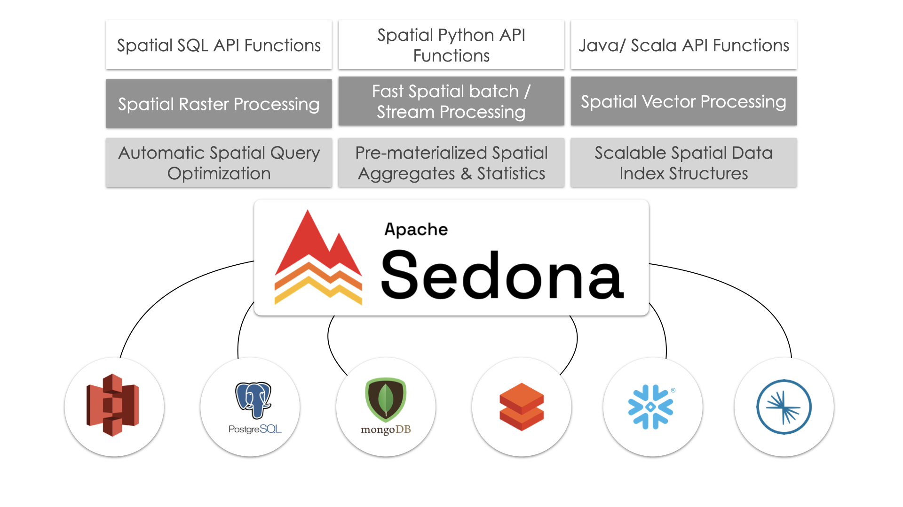

This article shows you how to work with Apache Sedona™.

Apache Sedona™ is an open-source extension of Apache Spark™ for working with geospatial data. You can use Sedona to process geospatial data using familiar Spark dataframes. You can then use Delta Lake to store your geospatial data. Delta Lake gives you great data skipping, reliable ACID transactions and more efficient clustered storage. These features will make your geospatial queries run faster with Delta Lake.

Let’s take a closer look at what Apache Sedona is and then dive into a practical example of working with Apache Sedona and Delta Lake.

## What is Apache Sedona?

[Apache Sedona](https://sedona.apache.org/latest/) is an open-source, distributed computing system that extends Apache Spark to handle large-scale geospatial data. It adds spatial data types (like points, polygons, and lines), spatial functions like range queries and spatial joins, and spatial indexing to Spark. This makes it easy to efficiently process spatial data at scale.



Apache Sedona was originally known as _GeoSpark_ until it became an official Apache project in 2020. Under the hood, Sedona retains all the core functionality that GeoSpark was known for: distributed spatial data processing on Spark, spatial indexing, and support for spatial data types and functions. Sedona now also extends its spatial functionalities to engines other than Spark, like Apache Flink and Snowflake.

Apache Sedona offers APIs in Java, Scala, Python and R. This article will use the Python implementation.

## Working with Apache Sedona and Delta Lake

Let’s build an example workflow to show how you can work with Apache Sedona and Delta Lake. We will use data from [Overture Maps](https://overturemaps.org/), a large open-source geospatial dataset.

### Installation and Setup

To install Apache Sedona, simply run:

```
pip install apache-sedona
```

You will also need to add two JAR files to your Spark session for Sedona to work properly:

- `org.apache.sedona:sedona-spark-shaded-3.5_2.13:1.6.1`
- `org.datasyslab:geotools-wrapper:1.6.0-28.2`

You can install these JARs manually or add them to your Spark session as we will do in the next section.

Here are some important notes to be aware of:

- If you are using Spark versions >= 3.4, use the corresponding major.minor version of Spark, such as `sedona-spark-shaded-3.4_2.12:1.6.1`. For Spark &lt;3.4, you can use `sedona-spark-shaded-3.0…`
- If you are working in an IDE or Jupyter notebook, use the `unshaded` version of the `sedona-spark` JAR: `'org.apache.sedona:sedona-spark-3.5_2.12:1.6.1`.
- If you’re going to be working with files stored in Amazon S3 then you will also need to install some more JARs and set some additional config. You can follow precise instructions to do so in [the Delta Lake on S3 article](https://delta.io/blog/delta-lake-s3).

### Create a Sedona Session

Creating a Sedona session is much like creating a Spark session. To work with Delta Lake we will have to do this in two steps:

1. Create a regular Spark session with all the necessary Delta Lake dependencies
2. Create a Sedona session from this Spark session

Begin with importing Spark, Sedona and Delta Lake:

```
import pyspark
from delta import *
from sedona.spark import *
```

Then create a Spark session with the required configurations and extra JARs for Delta Lake, Sedona and S3 access:

```
conf = (
    pyspark.conf.SparkConf()
    .set(
        "spark.sql.catalog.spark_catalog",
        "org.apache.spark.sql.delta.catalog.DeltaCatalog",
    )
    .set("spark.sql.extensions", "io.delta.sql.DeltaSparkSessionExtension")
    .set("spark.sql.shuffle.partitions", "4")
    .set("spark.hadoop.fs.s3a.aws.credentials.provider", "org.apache.hadoop.fs.s3a.AnonymousAWSCredentialsProvider")
    .set("fs.s3a.aws.credentials.provider", "org.apache.hadoop.fs.s3a.AnonymousAWSCredentialsProvider")
    .setMaster("local[*]")  # replace the * with your desired number of cores. * for use all.
)

extra_packages = [
#    'org.apache.sedona:sedona-spark-shaded-3.5_2.13:1.6.1', # use this if you're not working in an IDE or Jupyter notebook
    'org.apache.sedona:sedona-spark-3.5_2.12:1.6.1',
    'org.datasyslab:geotools-wrapper:1.6.0-28.2',
    "org.apache.hadoop:hadoop-aws:3.3.4",
    "org.apache.hadoop:hadoop-common:3.3.4",
    "com.amazonaws:aws-java-sdk-bundle:1.12.262",
]

builder = pyspark.sql.SparkSession.builder.appName("GEO_APP").config(conf=conf)
spark = configure_spark_with_delta_pip(
    builder, extra_packages=extra_packages
).getOrCreate()
```

Next, pass this Spark session to Sedona to create a Sedona session. This will give you access to spatial DataFrames and functions.

```
sedona = SedonaContext.create(spark)
```

Excellent. You’re now all set to start processing geospatial data at scale.

### Access Geospatial Data

We’ll use the Wherobots version of the Overture dataset in this tutorial. This version of the dataset is stored as GeoParquet and is clustered by spatial proximity for efficient filter pushdown performance.

Let’s point to the Wherobots S3 bucket:

```
data =  (
    "s3a://wherobots-examples/data/overturemaps-us-west-2/release/2023-07-26-alpha.0/"
)
```

And then create a Sedona spatial dataframe with this data. Find more information about the dataset and themes in [the Overture documentation](https://docs.overturemaps.org/).

```
> df = sedona.read.format("geoparquet").load(data + "theme=places/type=place")
> df.count()

59175720
```

The data has been successfully loaded. There are more than 59 million places in this dataset.

You can use the `printSchema` method to inspect the metadata:

```
> df.printSchema()

root
 |-- id: string (nullable = true)
 |-- updatetime: string (nullable = true)
 |-- version: integer (nullable = true)
 |-- names: map (nullable = true)
 |    |-- key: string
 |    |-- value: array (valueContainsNull = true)
 |    |    |-- element: map (containsNull = true)
 |    |    |    |-- key: string
 |    |    |    |-- value: string (valueContainsNull = true)
 |-- categories: struct (nullable = true)
 |    |-- main: string (nullable = true)
 |    |-- alternate: array (nullable = true)
 |    |    |-- element: string (containsNull = true)
 |-- confidence: double (nullable = true)
 |-- websites: array (nullable = true)
 |    |-- element: string (containsNull = true)
 |-- socials: array (nullable = true)
 |    |-- element: string (containsNull = true)
 |-- emails: array (nullable = true)
 |    |-- element: string (containsNull = true)
 |-- phones: array (nullable = true)
 |    |-- element: string (containsNull = true)
 |-- brand: struct (nullable = true)
 |    |-- names: map (nullable = true)
 |    |    |-- key: string
 |    |    |-- value: array (valueContainsNull = true)
 |    |    |    |-- element: map (containsNull = true)
 |    |    |    |    |-- key: string
 |    |    |    |    |-- value: string (valueContainsNull = true)
 |    |-- wikidata: string (nullable = true)
 |-- addresses: array (nullable = true)
 |    |-- element: map (containsNull = true)
 |    |    |-- key: string
 |    |    |-- value: string (valueContainsNull = true)
 |-- sources: array (nullable = true)
 |    |-- element: map (containsNull = true)
 |    |    |-- key: string
 |    |    |-- value: string (valueContainsNull = true)
 |-- bbox: struct (nullable = true)
 |    |-- minx: double (nullable = true)
 |    |-- maxx: double (nullable = true)
 |    |-- miny: double (nullable = true)
 |    |-- maxy: double (nullable = true)
 |-- geometry: geometry (nullable = true)
 |-- geohash: string (nullable = true)
```

As you can see, Sedona recognizes the `geometry` data type in the Geometry column. This means we can run spatial queries.

Let's try one out.

### Run Spatial Queries

Let’s run a spatial query to find all the registered places in the state of California.

We’ll define a bounding box polygon that describes the geospatial coordinates of California and then run a spatial filter to find the places that are contained within it. You can find boundaries of other U.S. states [in this Github gist](https://gist.github.com/JoshuaCarroll/49630cbeeb254a49986e939a26672e9c).

First, define the California state boundary polygon:

```
spatial_filter = "POLYGON((-124.4009 41.9983,-123.6237 42.0024,-123.1526 42.0126,-122.0073 42.0075,-121.2369 41.9962,-119.9982 41.9983,-120.0037 39.0021,-117.9575 37.5555,-116.3699 36.3594,-114.6368 35.0075,-114.6382 34.9659,-114.6286 34.9107,-114.6382 34.8758,-114.5970 34.8454,-114.5682 34.7890,-114.4968 34.7269,-114.4501 34.6648,-114.4597 34.6581,-114.4322 34.5869,-114.3787 34.5235,-114.3869 34.4601,-114.3361 34.4500,-114.3031 34.4375,-114.2674 34.4024,-114.1864 34.3559,-114.1383 34.3049,-114.1315 34.2561,-114.1651 34.2595,-114.2249 34.2044,-114.2221 34.1914,-114.2908 34.1720,-114.3237 34.1368,-114.3622 34.1186,-114.4089 34.1118,-114.4363 34.0856,-114.4336 34.0276,-114.4652 34.0117,-114.5119 33.9582,-114.5366 33.9308,-114.5091 33.9058,-114.5256 33.8613,-114.5215 33.8248,-114.5050 33.7597,-114.4940 33.7083,-114.5284 33.6832,-114.5242 33.6363,-114.5393 33.5895,-114.5242 33.5528,-114.5586 33.5311,-114.5778 33.5070,-114.6245 33.4418,-114.6506 33.4142,-114.7055 33.4039,-114.6973 33.3546,-114.7302 33.3041,-114.7206 33.2858,-114.6808 33.2754,-114.6698 33.2582,-114.6904 33.2467,-114.6794 33.1720,-114.7083 33.0904,-114.6918 33.0858,-114.6629 33.0328,-114.6451 33.0501,-114.6286 33.0305,-114.5888 33.0282,-114.5750 33.0351,-114.5174 33.0328,-114.4913 32.9718,-114.4775 32.9764,-114.4844 32.9372,-114.4679 32.8427,-114.5091 32.8161,-114.5311 32.7850,-114.5284 32.7573,-114.5641 32.7503,-114.6162 32.7353,-114.6986 32.7480,-114.7220 32.7191,-115.1944 32.6868,-117.3395 32.5121,-117.4823 32.7838,-117.5977 33.0501,-117.6814 33.2341,-118.0591 33.4578,-118.6290 33.5403,-118.7073 33.7928,-119.3706 33.9582,-120.0050 34.1925,-120.7164 34.2561,-120.9128 34.5360,-120.8427 34.9749,-121.1325 35.2131,-121.3220 35.5255,-121.8013 35.9691,-122.1446 36.2808,-122.1721 36.7268,-122.6871 37.2227,-122.8903 37.7783,-123.2378 37.8965,-123.3202 38.3449,-123.8338 38.7423,-123.9793 38.9946,-124.0329 39.3088,-124.0823 39.7642,-124.5314 40.1663,-124.6509 40.4658,-124.3144 41.0110,-124.3419 41.2386,-124.4545 41.7170,-124.4009 41.9983,-124.4009 41.9983))"
```

Now run the spatial query:

```
df_filter = df.filter(
    "ST_Contains(ST_GeomFromWKT('" + spatial_filter + "'), geometry) = true"
)
```

Finally let’s count the number of places in California:

```
> %%time
> df_filter.count()

CPU times: user 27.1 ms, sys: 14.2 ms, total: 41.3 ms
Wall time: 2min 37s

1168645
```

Great work! Sedona has efficiently crunched the entire 59-million row dataset and performed the spatial query. This example was run on all 8 clusters of a Macbook Pro M1 machine. Performance will vary depending on cluster size/specs, network connection, etc.

### Visualize your Data

### Store Geospatial Data in Delta Lake

Now you can write out the filtered data to a Delta Lake table:

```
df_filter.write.format("delta").save("tmp/places_california")
```

You can read in the filtered data downstream using Sedona:

```
df = sedona.read.format("delta").load("data/places_california")
```

## Benefits of Working with Delta Lake

Delta Lake gives you advanced data skipping and clustering features compared to common geospatial formats like GeoParquet. [Liquid clustering](https://docs.delta.io/latest/delta-clustering.html) is especially useful for geospatial indexing as it stores spatially related data close together. This will greatly speed up your spatial queries and avoids the need for complex and time-consuming manual partitioning strategies.

Here are some of the great Delta Lake features that will make your geospatial workflows better:

- ACID transactions for production-grade reliability
- More efficient DML transactions
- Faster query optimizations
- Change data feed
- More efficient metadata handling
- Possible to make small data changes (e.g. renaming or dropping a column) without rewriting the whole table

Read the GeoParquet post for a more detailed comparison.

## Working with Delta Lake and Apache Sedona

This article has explained how to use Apache Sedona and Delta Lake to work with large-scale geospatial data. Sedona gives you distributed cluster computing with spatial functions so you can analyze spatial data at scale using familiar Spark dataframes. Delta Lake gives you fast data skipping, reliable ACID transactions, and better storage efficiency for your spatial data. Use these tools together to make handling geospatial data at scale easier and faster.
