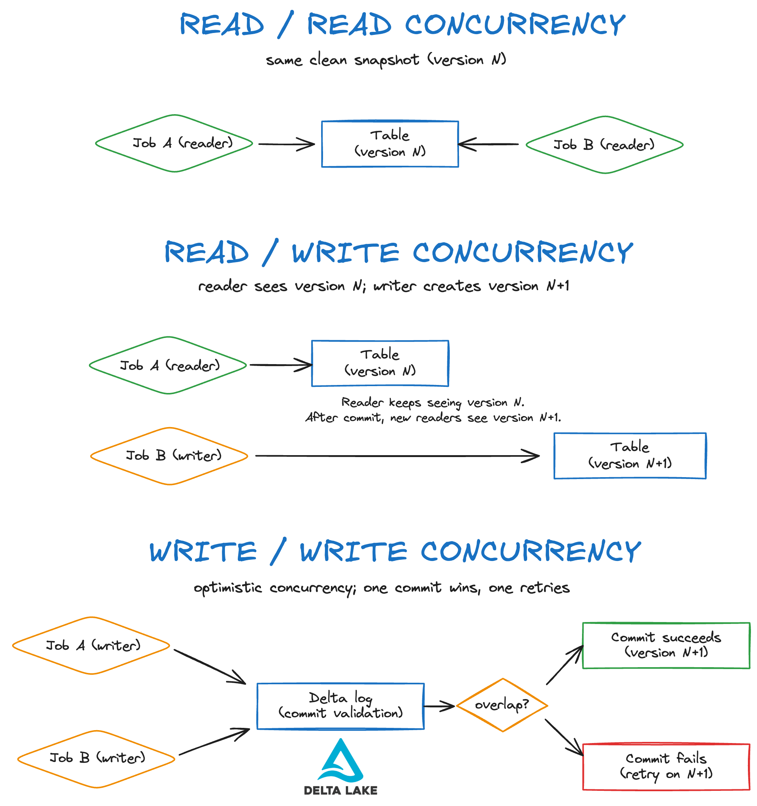

This guide explains data concurrency. You'll learn what it is, why it matters, and how Delta Lake handles it with optimistic concurrency control.

Delta Lake's transaction log validates every commit and rejects conflicts instead of corrupting files. This is much safer and faster than trying to implement concurrency support using raw Parquet writes. This guide will show you why Delta Lake is a great choice for data concurrency. You will see the most common conflict patterns, what errors look like, and how to fix them. We'll also cover practical design tips like partitioning and designing write conditions so that writers don't conflict.

We'll show you how to implement all of this in PySpark with Delta Lake 3.2.0. By the end, you'll know how to run many writers in parallel and still get clean, reliable tables.

Let's jump in.

## What is Data Concurrency?

Data concurrency is the ability of a data system to handle multiple users or processes accessing and modifying the same data simultaneously without conflicts or bottlenecks. This is important when running large-scale data pipelines in production. You want many reads and writes to be able to execute in parallel. You don't want corrupted files, lost updates, or flaky results.

Let's look at three common data concurrency patterns:

1. **Read-read:** many readers at once. This is fairly easy. Multiple readers can read the same dataset without changing it.
2. **Read-write:** readers query while a writer commits. Readers should see a clean, consistent snapshot that is not affected by the simultaneous write.
3. **Write-write:** multiple writers update the same table. This is where it gets complex. You need clear rules in place to avoid conflicts.



Concurrency is not just about going faster. It's about going faster by allowing simultaneous data change operations **without breaking correctness**.

This means:

- No partial writes.
- No two jobs clobbering the same rows.
- Deterministic outcomes on retries.
- Clear errors when there's a conflict.

## How does Delta Lake support Data Concurrency?

Delta Lake handles safe and efficient data concurrency with optimistic concurrency control and ACID commits. Writers are able to work in parallel on stable snapshots. At commit time, Delta checks if the writers touched the same files. If they did, one commit wins and the other retries or fails cleanly. This way, Delta Lake delivers both high throughput and reliable correctness.

Here's how it works:

- **Snapshot reads:** Every query reads a consistent snapshot (a table version). Readers never see half-written data. You always get a clean view.

- **Atomic commits:** Writers add new Parquet files and record the change in the transaction log. The commit is all-or-nothing.

- **No locks:** Jobs don't block each other. Readers don't block writers. Writers don't block other writers until the final commit check.

- **Optimistic concurrency control:** Each writer plans a change based on the snapshot it read. At commit time, Delta checks whether another writer touched the same files. If yes, the later commit fails cleanly. You can then retry or narrow your target.

- **File-level validation:** Delta tracks which files you read and plan to replace. If those files have changed since you read them, that's a conflict and the write fails. If not, your commit succeeds.

Let's walk through a code example to show data concurrency with Delta Lake in action.

## Data Concurrency with Delta Lake example

This section provides a code example to show how Delta Lake supports data concurrency. We'll use PySpark with SQL syntax and a toy customer orders dataset.

Let's start by creating an empty table that will contain our customer orders. Partition this table on the `order_date` column:

```python
spark.sql("""
CREATE TABLE orders_cc (
  order_id    STRING,
  customer_id STRING,
  order_date  DATE,
  amount      DECIMAL(12,2),
  status      STRING,
  last_update TIMESTAMP
) USING DELTA
PARTITIONED BY (order_date)
""")
```

Then stage rows to append to this table for two different days:

```python
spark.sql("""
CREATE OR REPLACE TEMP VIEW staging_orders AS
SELECT * FROM VALUES
  ('o101','c1', DATE'2025-08-19', 29.99, 'pending', TIMESTAMP'2025-08-19 09:00:00'),
  ('o102','c2', DATE'2025-08-19', 49.00, 'paid',    TIMESTAMP'2025-08-19 10:00:00'),
  ('o201','c3', DATE'2025-08-20', 15.00, 'pending', TIMESTAMP'2025-08-20 08:30:00'),
  ('o202','c4', DATE'2025-08-20', 85.00, 'paid',    TIMESTAMP'2025-08-20 09:15:00')
AS staging(order_id, customer_id, order_date, amount, status, last_update)
""")
```

Define an `INSERT` function that will insert the staged rows into our main `orders_cc` table per `order_date`:

```python
def insert_for(day_str):
    return spark.sql(f"""
        INSERT INTO orders_cc
        SELECT * FROM staging_orders WHERE order_date = DATE'{day_str}'
    """)
```

Use the core Python `concurrent` library to run multiple `INSERT` on our `orders_cc` table in parallel. These operations will complete without a problem because they touch different sets of files, since our table is partitioned by the `order_date`:

```python
​​from concurrent.futures import ThreadPoolExecutor

with ThreadPoolExecutor(max_workers=2) as ex:
    fut_a = ex.submit(insert_for, "2025-08-19")
    fut_b = ex.submit(insert_for, "2025-08-20")
    _ = fut_a.result(); _ = fut_b.result()
```

Inspect the table contents to confirm that the rows have been appended:

```python
spark.sql("""
SELECT order_date, count(*) AS rows
FROM orders_cc GROUP BY order_date ORDER BY order_date
""").show()
```

```
+----------+----+
|order_date|rows|
+----------+----+
|2025-08-19|   2|
|2025-08-20|   2|
+----------+----+
```

This is looking great.

Now let's try running two parallel operations that will try to modify the _same set of files_ to demonstrate what happens when concurrent jobs conflict.

Create two competing update sets with timestamps on the same days:

```python
spark.sql("""
CREATE OR REPLACE TEMP VIEW updates_a AS
SELECT * FROM VALUES
  ('o101','c1', DATE'2025-08-19', 31.99, 'paid',   TIMESTAMP'2025-08-19 11:00:00'),
  ('o150','c5', DATE'2025-08-19', 20.00, 'pending',TIMESTAMP'2025-08-19 11:05:00')
AS updates(order_id, customer_id, order_date, amount, status, event_time)
""")

spark.sql("""
CREATE OR REPLACE TEMP VIEW updates_b AS
SELECT * FROM VALUES
  ('o101','c1', DATE'2025-08-19', 33.99, 'paid',   TIMESTAMP'2025-08-19 11:01:00'),
  ('o160','c6', DATE'2025-08-19', 18.00, 'pending',TIMESTAMP'2025-08-19 11:06:00')
AS updates(order_id, customer_id, order_date, amount, status, event_time)
""")
```

Now define a `MERGE` operation that will merge these two sets of updates to our existing `orders_cc` table:

```python
merge_sql = """
MERGE INTO orders_cc AS t
USING {src}       AS s
ON t.order_id = s.order_id AND t.order_date = s.order_date
WHEN MATCHED AND s.event_time > t.last_update THEN
  UPDATE SET
    t.customer_id = s.customer_id,
    t.amount      = s.amount,
    t.status      = s.status,
    t.last_update = s.event_time
WHEN NOT MATCHED THEN
  INSERT (order_id, customer_id, order_date, amount, status, last_update)
  VALUES (s.order_id, s.customer_id, s.order_date, s.amount, s.status, s.event_time)
"""

def merge_from(view_name):
    try:
        spark.sql(merge_sql.format(src=view_name))
        return f"{view_name}: SUCCESS"
    except Exception as e:
        return f"{view_name}: FAILED ({e.__class__.__name__})"
```

Then run the two `MERGE` operations in parallel:

```python
from concurrent.futures import ThreadPoolExecutor

with ThreadPoolExecutor(max_workers=2) as ex:
    f1 = ex.submit(merge_from, "updates_a")
    f2 = ex.submit(merge_from, "updates_b")
    print(f1.result())
    print(f2.result())
```

The same set of files cannot be modified by two writers at the same time. One of these two concurrent jobs will fail because they are both trying to write to the same `order_date` partition. We can confirm this by checking the output:

```python
updates_a: SUCCESS
updates_b: FAILED (ConcurrentAppendException)
```

Let's take a look at our dataset:

```python
spark.sql("SELECT * FROM orders_cc WHERE order_date = DATE'2025-08-19' ORDER BY order_id").show()
```

As you can see, only the updated rows from our staged `updates_a` table have been merged. The rows from `updates_b` were blocked:

```
+--------+-----------+----------+------+-------+-------------------+
|order_id|customer_id|order_date|amount|status |last_update        |
+--------+-----------+----------+------+-------+-------------------+
|o101    |c1         |2025-08-19|31.99 |paid   |2025-08-19 11:00:00|
|o102    |c2         |2025-08-19|49.00 |paid   |2025-08-19 10:00:00|
|o150    |c5         |2025-08-19|20.00 |pending|2025-08-19 11:05:00|
+--------+-----------+----------+------+-------+-------------------+
```

To still add the rows, you can retry the `MERGE` from `updates_b` or repartition your table on a different key that will avoid the conflict (e.g. customer ID hash).

## What is Optimistic Concurrency Control?

Delta Lake uses Optimistic Concurrency Control (OCC) to let many jobs write in parallel without locks.

This method of implementing data concurrency assumes that conflicts are rare (that's where the “optimistic” comes from). The system is optimized for allowing many writers to write quickly. If a conflict does happen, Delta stops the bad commit and you can retry that specific commit. This ensures that there will be no data corruption and no partial writes.

Here's the flow:

1. **Read a snapshot:** Your job plans changes based on table version N.
2. **Prepare new files:** You write new Parquet files and a list of actions (adds/removes).
3. **Try to commit:** Delta compares your plan to the latest version.
4. **Validate:** If another job changed any files you read or planned to replace, Delta rejects your commit.
5. **Retry:** You reload the latest snapshot and try again (often with a narrower predicate).

Delta Lake doesn't lock the table while you work. Readers can keep reading and other writers can keep writing. Only at the final commit stage does Delta Lake run the conflict check against the transaction log. This strategy optimizes performance at the small risk of occasional conflicts that will have to be retried.

## When can data concurrency conflicts still occur?

Delta Lake lets many writers work at once, but conflicts can still happen. This is because Delta Lake implements _optimistic_ concurrency control and assumes that conflicts are rare.

Watch for these cases:

- **Overlapping writes:** Two jobs touch the same files because their `WHERE` clauses overlap or are too broad. Example: two `MERGE` jobs target the same date range.

- **Unpartitioned or poorly partitioned tables:** If you don't partition (or pick the wrong column), filter queries can accidentally access and modify the same file set. Make sure to partition your table by the fields you filter on to avoid this.

- **Wide updates or table-wide overwrites:** Commands without tight predicates (e.g., UPDATE … WHERE amount > 0, or a full overwrite) may collide with other writers. To avoid this, use targeted overwrites with `replaceWhere` or narrow `WHERE` clauses.

- **Compaction vs. writers:** [File compaction](https://delta.io/blog/delta-lake-optimize/) can clash with concurrent `UPDATE/DELETE/MERGE` operations because both want to replace some of the same files. To avoid this, schedule compaction outside heavy write windows.

- **Concurrent metadata changes:** Metadata operations like `ALTER TABLE` or schema changes can conflict with ongoing writes to the same table. Plan metadata operations during periods with little or no writes.

The core idea is simple: conflicts happen when **two commits try to read or replace the same files between read time and commit time**. Keep your query filters separate between concurrency write operations and align your partitioning with your predicates to avoid this kind of overlap.

```
|                                | INSERT          | UPDATE, DELETE, MERGE INTO  | COMPACTION     |
|--------------------------------|-----------------|-----------------------------|----------------|
| **INSERT**                     | Cannot conflict | Can conflict                |                |
| **UPDATE, DELETE, MERGE INTO** | Can conflict    | Can conflict                | Can conflict   |
| **COMPACTION**                 | Cannot conflict | Can conflict                | Can conflict   |
```

Take a look at the official Delta Lake documentation for a detailed overview of [all concurrency conflict exceptions](https://docs.delta.io/latest/concurrency-control.html):

- [ConcurrentAppendException](https://docs.delta.io/latest/concurrency-control.html#concurrentappendexception)
- [ConcurrentDeleteReadException](https://docs.delta.io/latest/concurrency-control.html#concurrentdeletereadexception)
- [ConcurrentDeleteDeleteException](https://docs.delta.io/latest/concurrency-control.html#concurrentdeletedeleteexception)
- [MetadataChangedException](https://docs.delta.io/latest/concurrency-control.html#metadatachangedexception)
- [ConcurrentTransactionException](https://docs.delta.io/latest/concurrency-control.html#concurrenttransactionexception)
- [ProtocolChangedException](https://docs.delta.io/latest/concurrency-control.html#protocolchangedexception)

## Partition to avoid data concurrency conflicts

You can avoid data concurrency conflicts by picking the right partitioning strategy. You can make sure to avoid conflicts by partitioning the table by the same columns as those used in the conditions of the operations.

For example, these two commands will attempt to modify the same set of files and will conflict if the table is not partitioned by `date`:

```SQL
UPDATE table WHERE date > '2010-01-01'
DELETE table WHERE date < '2010-01-01'
```

Partitioning the table by date will avoid the conflict. Just note that partitioning a table by a column that has high cardinality can lead to other performance issues due to the large number of subdirectories.

## Data concurrency and Liquid Clustering

While hive-style partitioning is no longer recommended for query performance, a small number of natural partitions can still be effective for concurrency because it gives you clean, predictable file slices for parallel writers. Other data layout optimization techniques like Liquid Clustering or Z-ordering boost read speed and overall performance. These techniques do not replace the need for disjoint write predicates.

Whatever data layout strategy you choose, the conflict test stays the same: if your commit replaces files another job has changed since your read, it will fail. To avoid this, keep your writes tightly scoped, avoid table-wide overwrites, and schedule layout maintenance (compaction, clustering, Z-order) outside your busiest write windows.

Read more in the dedicated [Liquid Clustering](https://delta.io/blog/liquid-clustering/) and [Z-Order](https://delta.io/blog/2023-06-03-delta-lake-z-order/) guides.

## Data concurrency: Delta Lake vs Parquet

Parquet is a file format. It does not manage concurrent writers. If two jobs write at the same time, you can get partial files, duplicate rows, or missing data. Readers may see a mix of old and new files. This will get messy quickly.

Delta Lake is a table format built on Parquet with a transaction log. Writers add files and then commit atomically. Readers always see a consistent snapshot. Delta uses optimistic concurrency control to detect overlapping writes and fail cleanly. You retry or narrow your predicate, and your table stays correct.

Read more in the dedicated [Delta Lake vs Parquet comparison](https://delta.io/blog/delta-lake-vs-parquet-comparison/) guide.

## Conclusion: Data concurrency with Delta Lake

Data concurrency is about balancing speed, user friendliness and correctness. Delta Lake gives you snapshot reads, atomic commits, and clean errors for the rare cases when writers do collide. Use disjoint predicates, partitioning or sharding, and targeted overwrites to keep writers on different files. You can schedule metadata and layout jobs outside of peak write windows to avoid conflicts there.

This is how you can use Delta Lake to run many writers in parallel and still trust every result.
