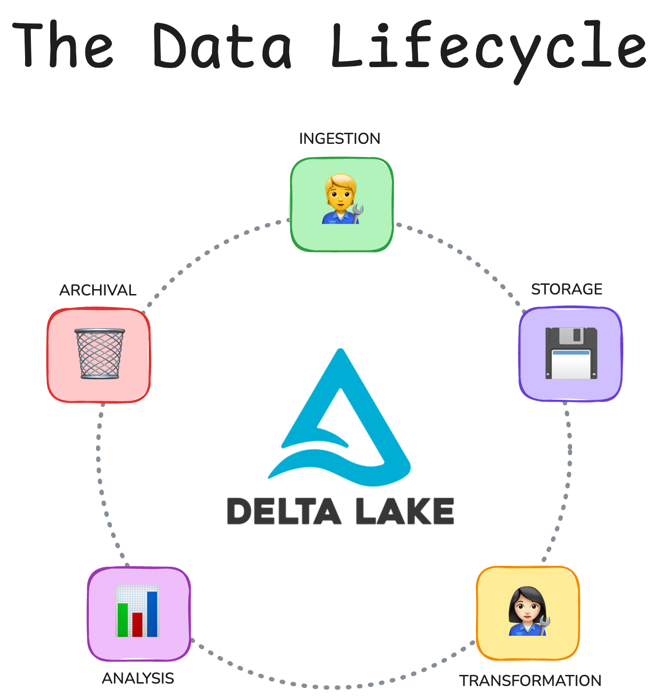

Data lifecycle management is the backbone of all modern data work. If you want fast, trustworthy pipelines, you will need to manage your data efficiently and securely from ingestion on day one until archival at the end of a project.

This guide will help you make sense of the data lifecycle. You'll see the stages, why they matter, and how Delta Lake can support you in managing your data lifecycle reliably and while keeping performance high.

Let's jump in.

## What is the data lifecycle?

The data lifecycle is the path your data takes from discovery and ingestion until final retirement.

Data lifecycle management covers every step of the data pipeline:

- **Ingestion:** raw data is collected from sources.
- **Storage:** data is stored in a durable place, like a lake or warehouse.
- **Transformation:** data is cleaned, validated and enriched into useful tables.
- **Analysis:** data is made available to downstream users, jobs, dashboards, and reports for analysis.
- **Archival:** cold data is moved to cheaper storage or deleted when needed.



It's more efficient to think of your data pipelines in terms of a lifecycle. This helps you and your time prioritize long-term performance and implement practices that are efficient, sustainable, and easy to operate. This will help you avoid quick fixes that create hidden debt and downstream bottlenecks. This discipline lowers cost, reduces risk, and makes your work easier to maintain.

## Why is data lifecycle management important?

You need proper data lifecycle management to build trust, consistency, and efficiency into your data work. Without it, you risk running into performance bottlenecks and frustrated users because of data silos, duplication, and costly mistakes.

Here's what you gain with good lifecycle management:

- **Faster delivery:** Pipelines are organized. Data assets are easy to find.
- **Lower costs:** Storage is optimized and stale data is retired. Compute jobs don't waste cycles on bad inputs.
- **More trust and better performance:** Data is accurate, versioned, and complete, so downstream users can rely on it.
- **Simpler compliance and audits:** You archive or delete on schedule and can access prior versions when needed.

Here's what you risk to lose without it:

- **Duplication and silos:** Teams rebuild the same pipelines or duplicate datasets. There's no single source of truth which can lead to expensive mistakes.
- **High storage bills:** Data eats up storage, even when it's stale or irrelevant.
- **Broken dashboards and jobs:** Upstream changes silently break downstream systems.
- **Risk of privacy breaches:** Sensitive data isn't retired or is accessible when it shouldn't be.

Investing in getting data lifecycle management right, will make everything else downstream easier and more effective. Your pipelines will be cheaper to run, simpler to scale, and far more reliable.

## Data Lifecycle Management with Delta Lake

Delta Lake has many great features that support reliable and effective data lifecycle management, including:

- **Reliable data ingestion** with ACID transactions, schema enforcement and constraints.
- **Safe dataset transformation** with idempotent upserts and schema evolution.
- **Incremental updates** with Change Data Feed (CDF).
- **Detailed debugging and auditing** with time travel and row tracking.
- **Optimized storage** with VACUUM, optimized writes and auto-compaction.

Let's take a look at how Delta Lake supports you at each step of the data lifecycle in more detail. We'll work through an end-to-end code example in PySpark to demonstrate the features.

### Data Lifecycle Management: Reliable Data Ingestion

Imagine you run analytics for a retail company. Orders arrive all day from e-commerce platforms and stores. Some of these orders arrive late or contain mistakes.

You can use Delta Lake's [schema enforcement](https://delta.io/blog/2022-11-16-delta-lake-schema-enforcement/) and [column constraints](https://delta.io/blog/2022-11-21-delta-lake-contraints-check/) features to catch many incorrect updates before they get written to your table.

For example, let's create a new `sales_orders` table and define its schema, including important information like data types per column and if null values are allowed:

```python
    spark.sql("""
    CREATE TABLE IF NOT EXISTS sales_orders (
      order_id    STRING  NOT NULL,
      customer_id STRING  NOT NULL,
      order_date  DATE    NOT NULL,
      amount      DECIMAL(12,2) NOT NULL,
      status      STRING  NOT NULL,
      last_update TIMESTAMP NOT NULL
    ) USING DELTA
    """)
```

Then add constraints to specific columns, for example only allowing positive values for certain numerical columns or only specific values from a set list for string columns:

```python
    spark.sql("ALTER TABLE sales_orders ADD CONSTRAINT amount_pos CHECK (amount > 0)")
    spark.sql("ALTER TABLE sales_orders ADD CONSTRAINT valid_status CHECK (status IN ('pending','paid','refunded'))")
```

Now let's try to write some new rows to this table. First, let's write some valid rows:

```python
    spark.sql("""
    INSERT INTO sales_orders VALUES
    ('o1','c1', DATE'2025-08-01', 39.99, 'paid',    TIMESTAMP'2025-08-01 10:00:00'),
    ('o2','c2', DATE'2025-08-01', 12.50, 'pending', TIMESTAMP'2025-08-01 09:00:00')
    """)
```

And confirm whether they are added to the table:

```python
    > spark.sql("SELECT * FROM sales_orders ORDER BY order_id").show(truncate=False)

    +--------+-----------+----------+------+-------+-------------------+
    |order_id|customer_id|order_date|amount|status |last_update        |
    +--------+-----------+----------+------+-------+-------------------+
    |o1      |c1         |2025-08-01|39.99 |paid   |2025-08-01 10:00:00|
    |o2      |c2         |2025-08-01|12.50 |pending|2025-08-01 09:00:00|
    +--------+-----------+----------+------+-------+-------------------+
```

This is looking good. Now let's see what happens when you try to write another row that doesn't meet the predefined conditions:

```python
    spark.sql("""
    INSERT INTO sales_orders VALUES
    ('o3','c3', DATE'2025-08-01', -5.00, 'unknown', TIMESTAMP'2025-08-01 11:00:00')
    """)
```

This will throw an error: `DELTA_VIOLATE_CONSTRAINT_WITH_VALUES] CHECK constraint amount_pos (amount > 0) violated by row with values - amount : -5.00`

### Data Lifecycle Management: Safe Dataset Transformation

Schema enforcement and column constraints give you the peace of mind that faulty data won't accidentally make its way into your table. But reality is messy and unpredictable and chances are high that you're going to need flexibility to add late arrivals or expand the schema definition at some point. You need rigid safety checks with the flexibility to adjust them when needed. Delta Lake makes this possible through schema evolution, type widening, and idempotent upserts.

Let's start by showcasing how you could create a temporary table containing late arrival rows and upsert them safely into your main `sales_orders` table.

```python
    # create temporary updates table
    spark.sql("""
    CREATE OR REPLACE TEMP VIEW updates AS
    SELECT * FROM VALUES
      ('o1','c1', DATE'2025-08-01', 41.25, 'paid',    TIMESTAMP'2025-08-01 11:00:00'),
      ('o4','c4', DATE'2025-08-01', 20.00, 'pending', TIMESTAMP'2025-08-01 11:05:00')
    AS updates(order_id, customer_id, order_date, amount, status, event_time)
    """)

    # Idempotent upsert merge operation
    spark.sql("""
    MERGE INTO sales_orders AS t
    USING updates AS s
    ON t.order_id = s.order_id
    WHEN MATCHED AND s.event_time > t.last_update THEN
      UPDATE SET
        t.customer_id = s.customer_id,
        t.order_date  = s.order_date,
        t.amount      = s.amount,
        t.status      = s.status,
        t.last_update = s.event_time
    WHEN NOT MATCHED THEN
      INSERT (order_id, customer_id, order_date, amount, status, last_update)
      VALUES (s.order_id, s.customer_id, s.order_date, s.amount, s.status, s.event_time)
    """)
```

Let's see what our main `sales_orders` table looks like now:

```python
    > print("\nAfter MERGE (idempotent upsert):")
    > spark.sql("SELECT * FROM sales_orders ORDER BY order_id").show(truncate=False)

    After MERGE (idempotent upsert):
    +--------+-----------+----------+------+-------+-------------------+
    |order_id|customer_id|order_date|amount|status |last_update        |
    +--------+-----------+----------+------+-------+-------------------+
    |o1      |c1         |2025-08-01|41.25 |paid   |2025-08-01 11:00:00|
    |o2      |c2         |2025-08-01|12.50 |pending|2025-08-01 09:00:00|
    |o4      |c4         |2025-08-01|20.00 |pending|2025-08-01 11:05:00|
    +--------+-----------+----------+------+-------+-------------------+
```

The values for `o1` have been updated and `o4` has been added to the table.

Now let's say a new data point has become available for your orders and you need to expand your schema with a new row `channel` which indicates how the order was made.

You can update the table schema using:

```python
    spark.sql("ALTER TABLE sales_orders ADD COLUMNS (channel STRING)")
```

And then add a new order, including data for the `channel` column:

```python
    spark.sql("""
    INSERT INTO sales_orders (order_id, customer_id, order_date, amount, status, last_update, channel) VALUES
    ('o5','c5', DATE'2025-08-02', 10.00, 'pending', TIMESTAMP'2025-08-02 09:00:00', 'mobile')
    """)
```

Previously existing rows will show a `null` value for the new column:

```python
    > spark.sql("SELECT * FROM sales_orders ORDER BY order_id").show(truncate=False)
    +--------+-----------+----------+------+-------+-------------------+-------+
    |order_id|customer_id|order_date|amount|status |last_update        |channel|
    +--------+-----------+----------+------+-------+-------------------+-------+
    |o1      |c1         |2025-08-01|41.25 |paid   |2025-08-01 11:00:00|NULL   |
    |o2      |c2         |2025-08-01|12.50 |pending|2025-08-01 09:00:00|NULL   |
    |o4      |c4         |2025-08-01|20.00 |pending|2025-08-01 11:05:00|NULL   |
    |o5      |c5         |2025-08-02|10.00 |pending|2025-08-02 09:00:00|mobile |
    +--------+-----------+----------+------+-------+-------------------+-------+
```

You can read more in the [Delta Lake schema evolution](https://delta.io/blog/2023-02-08-delta-lake-schema-evolution/) and [Delta Lake upsert](https://delta.io/blog/delta-lake-upsert/) articles.

### Data Lifecycle Management: Incremental Updates

The Delta Lake Change Data Feed feature gives you the possibility to track row-level changes between table versions. When enabled, you can inspect how each row has changed since a specific version of your table.

For example, here's how you can collect all changes since version 3 of the table (i.e. after the 4th commit):

```python
    changes = (
        spark.read.format("delta")
        .option("readChangeData", "true")
        .option("startingVersion", 3)
        .table("sales_orders")
    )
    changes.select("order_id", "_change_type", "_commit_version", "_commit_timestamp").show(truncate=False)
```

This will return all the changes since version 3:

```python
    +--------+----------------+---------------+-----------------------+
    |order_id|_change_type    |_commit_version|_commit_timestamp      |
    +--------+----------------+---------------+-----------------------+
    |o1      |update_preimage |5              |2025-09-19 16:41:32.953|
    |o1      |update_postimage|5              |2025-09-19 16:41:32.953|
    |o4      |insert          |5              |2025-09-19 16:41:32.953|
    |o5      |insert          |7              |2025-09-19 16:44:12.788|
    |o2      |insert          |4              |2025-09-19 16:22:42.633|
    |o1      |insert          |4              |2025-09-19 16:22:42.633|
    +--------+----------------+---------------+-----------------------+
```

Read more in the [Delta Lake Change Data Feed](https://delta.io/blog/2023-07-14-delta-lake-change-data-feed-cdf/) tutorial.

### Data Lifecycle Management: Debugging and auditing

Delta Lake makes it easy to revisit older versions of your table. Since all changes are stored in the transaction log, you can easily rollback your table to a previous state. This can be very helpful when debugging, correcting mistakes or for auditing purposes.

You can inspect the entire table history using:

```python
spark.sql("DESCRIBE HISTORY sales_orders").show(truncate=False)
```

To inspect a specific version of your table, use:

```python
    spark.sql("""
    SELECT order_id, amount, status
    FROM sales_orders VERSION AS OF 0
    """).show(truncate=False)
```

This will return an empty table since the first commit was to create the table without any data in it.

Read more in the [Delta Lake Time Travel](https://delta.io/blog/2023-02-01-delta-lake-time-travel/) and [Delta Lake row tracking](#add-when-live) articles.

### Data Lifecycle Management: Optimized Storage

Delta Lake supports safe and responsible data lifecycle management by enabling automatic retention policies. This means that you can choose to have data automatically deleted if it's older than a certain time threshold.

For example, here's how to set the log retention duration to 30 days and the deleted file retention duration to 7 days:

```python
    spark.sql("""
    ALTER TABLE sales_orders SET TBLPROPERTIES (
      'delta.logRetentionDuration'='30 days',
      'delta.deletedFileRetentionDuration'='7 days'
    )
    """)
```

Delta Lake also supports further maintenance operations to help you optimize storage and meet compliance requirements around storing specific kinds of data.

You can use the `VACUUM` command to remove stale files that have been marked for deletion. This is necessary because by default Delta Lake never physically deletes data, it only excludes it from your query plan. Read the [Delta Lake Vacuum](https://delta.io/blog/remove-files-delta-lake-vacuum-command/) article for detailed guidelines on how to use this function.

Here's how to vacuum (remove) all stale files that are older than 7 days:

```python
spark.sql("VACUUM sales_orders RETAIN 168 HOURS")
```

You can use Delta Lake's storage optimization features (like auto compaction and optimized write) to streamline your storage and reduce unnecessary clutter. These features reduce the number of small files on disk which will improve your query speeds.

For example you can set the Optimized Write feature by default for your table:

```python
    spark.sql("ALTER TABLE sales_orders SET TBLPROPERTIES ('delta.autoOptimize.optimizeWrite'='true')")
```

Or on a per-use basis, for example to rebuild the data stream for a single day with fewer, larger files:

```python
    df_day.write.format("delta") \
      .mode("overwrite") \
      .option("replaceWhere", "order_date = DATE'2025-08-01'") \
      .option("optimizeWrite", "true") \
      .saveAsTable("sales_orders")
```

Read more in the [Delta Lake Optimize](https://delta.io/blog/delta-lake-optimize/) article. Note that Optimized Write adds a shuffle to rebalance data, so the write may take a bit longer. But in return you get a more efficient file layout which will speed up future reads.

## Data Lifecycle Management with Delta Lake vs Parquet

Parquet is a great file format. It's fast and compact. But it's just files, and offers no transactions, no history or time travel and no schema enforcement or evolution. If you're working only with Parquet, chances are you'll end up writing a lot of glue code to stitch the data lifecycle together.

Delta Lake is a table format on top of Parquet. You get atomic commits, schema checks, versioned history, and incremental change logs. That means less custom plumbing and fewer late-night fixes. For a detailed comparison, check out the [Delta Lake vs Data Lake article](https://delta.io/blog/delta-lake-vs-data-lake/).

Here's a quick overview of what you get (and don't)

| **Lifecycle need**               | **Parquet files**              | **Delta Lake tables**                   |
| -------------------------------- | ------------------------------ | --------------------------------------- |
| Atomic multi-file writes         | No                             | Yes (ACID commits)                      |
| Consistent snapshots for readers | No                             | Yes (snapshot isolation)                |
| Schema enforcement + constraints | No                             | Yes (NOT NULL, CHECK)                   |
| Idempotent upserts               | Manual, error-prone            | Yes (MERGE INTO)                        |
| Version history / rollbacks      | No                             | Yes (time travel)                       |
| Incremental changes (CDC)        | No                             | Yes (Change Data Feed)                  |
| Table audit/history              | No                             | Yes (DESCRIBE HISTORY)                  |
| Retention + cleanup              | Manual scripts                 | Table properties + VACUUM               |
| Concurrency control              | None; races at directory level | Optimistic concurrency (clean failures) |

Why it matters in practice:

- **Ingestion:** With Parquet, a failed write can leave partial files. With Delta Lake, a write commits as one unit or not at all.
- **Transformation:** Parquet upserts require custom coding that is error-prone. Delta Lake gives you an out-of-the-box MERGE command that is key-based and idempotent.
- **Serving and analysis:** Parquet consumers waste compute time and resources on expensive file listing. Delta readers can make use of advanced data skipping and/or read only changes via CDF.
- **Debugging:** Parquet has no history. Delta Lake lets you time travel to earlier versions to reproduce a bug.
- **Archival and retention:** Parquet cleanup is ad hoc. Delta gives you retention policies and VACUUM.

Consider using Parquet for static exports or one-off files. Use Delta Lake instead for production-grade datasets that you ingest, transform, serve, audit, and retire over time. Your lifecycle will get cheaper, safer, and a lot easier to operate.

## Limitations of Data Lifecycle Management with Delta Lake

Delta Lake is an [open table format](https://delta.io/blog/open-table-formats/) designed to store and transform tabular data. This means that by definition it does not manage users, roles, or grants. By itself, Delta Lake does not give you centralized discovery for all your tabular _and non-tabular_ data assets, cross-table lineage, tags, or policy-based access controls.

If you need these kinds of features, then consider pairing Delta Lake with an open-source data catalog tool like [Unity Catalog](https://www.unitycatalog.io/) to handle identities, permissions, namespaces, lineage, and metadata. Read the [Unity Catalog and Delta Lake guide](https://www.unitycatalog.io/blogs/unity-catalog-spark-delta-lake) to get started.
